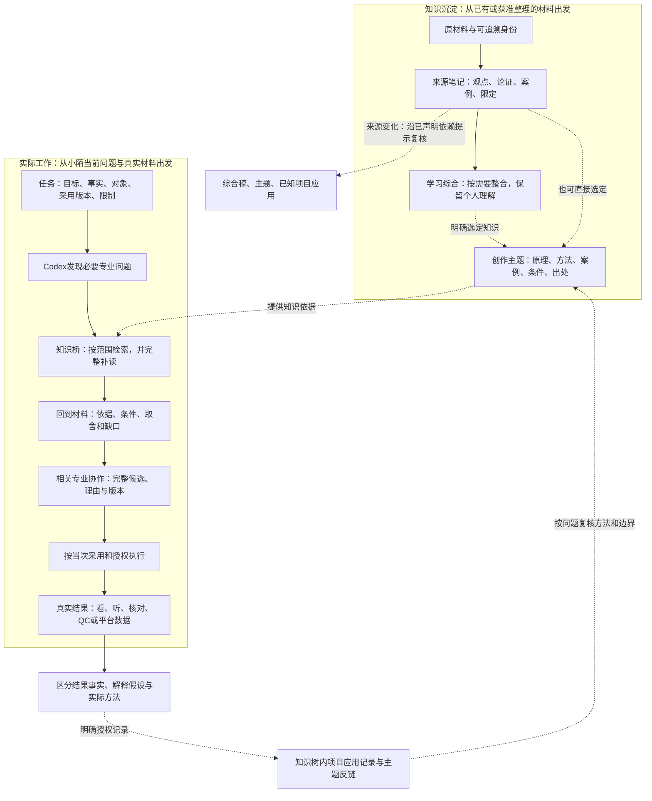

# 知识树与影视工作流：为什么修改、整个过程和当前问题

日期：2026-10-04。用途：让小陌审阅全链路问题及修改理由。此次只读核对当前入口、契约、知识正文和已有验收证据，新增解释文档；没有执行下一批正文、改项目、生成媒体或登记真实实践。

## 先定位这次正在改什么

总目标是让“材料整理 → 知识沉淀 → 解决实际问题 → 反馈修订”成为可靠的循环。文件、地图、岗位入口已经提供了较广的覆盖，但这不能保证方法完整、实际读到、适合当前材料，以及执行后有效。

目前已完成机制层修正及B/C/D三组、六篇局部正文试点。正在讨论的下一批是第3课来源、学习综合稿与创作主题之间的内容对照，尚未实施。因此，下一批确实属于**正文与来源对应的局部优化**；此前机制阶段则已超出普通索引调整，涉及筛选、续读、依赖传播和安全反馈。两者均不能代替整条影视工作流的实际使用检验。

“正文”也有不同职责：来源笔记忠实保存原材料；学习综合稿连接已有理解与多份知识；创作主题把选定知识转成解决问题的方法；项目文档保存这个项目采用的事实、方案与结果。它们不应混成一份。

| 层级 | 要解决的核心问题 | 当前可确认状态 | 还不能推出的结论 |
|---|---|---|---|
| 知识表达 | 观点、论证、案例、条件、出处是否完整，方法能否操作 | 六篇局部改稿已采用，三向文本复核与保全通过 | 所有课程和主题都已专业充分 |
| 调用机制 | 能否找到适用正文、补查并读完，有不足时是否说清 | 机制经限定技术与文字验收；桥接机制题入口验证，材料为空，未验证真实项目上下文 | 每次首包都充分，所有自然问法都准确 |
| 材料判断 | 所读方法是否支持对当前材料的判断和取舍 | 三道试点问题有实际条件判断；部分其他题仍Partial/Gap | 六岗位全部问题都能形成合格判断 |
| 工作流交接 | 已采用事实、理由、版本和待决限制能否传下去 | 当前契约规定了这些要求，桥支持上下文传递 | 每个真实项目的专业协作与交接均已有效 |
| 实际效果 | 真实素材、组接、听感、QC、发布与结果是否改善 | 本轮未做真实制作效果验证 | 文本、安装、哈希或技术测试证明作品更好 |
| 反馈与修订 | 实际方法和结果能否安全回写，并提示下游复核 | 真实接口预览和隔离故障测试通过；正式实践写入0次 | 闭环已经在真实项目中完成，或个人已掌握 |

## 总图：两条入口汇合，再经过真实结果返回

以下表示当前契约要求的过程，并用后面的表标明已经观察到的范围。图中的制作环节需要当次授权与实际工具能力；箭头本身不授予执行权限。

A/B/C1/C2/D/E是按问题参与的专业部门，**不要求A→B→C1→C2→D→E机械串行**。当前工作室由A管理制作，C2整合创作，各专业可从前期按需要联合咨询。知识树提供判断依据，不能替代项目目标，也不能替用户自动采用。

## 每一步怎样发生，哪里可能卡住

| 步骤 | 实际输入 | 做什么、交出什么 | 这一环的关键检查 | 与下游的关系 |
|---|---|---|---|---|
| 1．确定材料用途与范围 | 本次需求、已有来源、授权分区 | 判断是学习来源保存、已有知识研究，还是选定知识进入创作；确认原材料可用性 | 不因入库自动融合创作，不把历史建议当当前任务 | 决定哪些内容能处理、进入哪个用途区 |
| 2．保存原材料身份与证据 | 原文、字幕、已有ASR、页码／时间点 | 保留来源身份、版本、定位、缺失与不确定性；原始文件留Vault外 | 识别文本不是原声或连续画面的完整证据 | 以后能解释笔记依据哪一版材料 |
| 3．形成忠实来源正文 | 获准读取的原材料 | 保存观点、理由、独特案例、条件、分歧、练习及已有个人内容 | 不用短摘要或目录替代专业内容；待核不写成确认 | 为学习综合和创作方法提供可追溯依据 |
| 4．按需要形成学习综合 | 来源正文、既有综合与理解 | 比较和整合相关知识，区分作者观点、系统综合和个人理解 | 不是所有材料必须先经过综合稿，也不自动覆盖个人内容 | 可成为选定创作知识的派生来源 |
| 5．形成可调用创作主题 | 明确选定的知识、具体创作问题 | 说明怎么做、为什么适用、案例、失效条件、出处及停止条件 | 不是统一模板，也不是把整门课程搬进创作区 | 给岗位提供独立可读的方法，而非标题索引 |
| 6．定位当前任务 | 当前对象、版本、目标、素材、约束 | 区分已确认事实、真实反馈、解释假设、可改项和不可改项 | 必要材料从现有文件按需读取，不让小陌反复填整套表 | 防止知识被用来补写故事、空间、声音或制作事实 |
| 7．发现专业检查项 | 当前问题及实际材料 | Codex把复合任务拆成必要问题，保留原问法及参照约束 | 主问题、跨专业对照和参考用途不能混淆 | 决定应该检索什么，缺什么实际证据 |
| 8．通过当前知识桥检索 | 岗位、阶段、问题、必要材料摘录与上下文 | 进入本机配置指定的知识调用Skill，输出候选片段、范围和身份 | C1/C2使用C枚举，以阶段与问题区分；对象和权限说明不混入语义查询 | 把工作流问题送到正确的正式知识库与代码入口 |
| 9．筛选实际方法 | 本岗／共用，必要时其他创作岗位 | 区分概念、原理、诊断、步骤、案例和边界；不足时保留method_gap | 地图、泛表、文件记录不能替代方法；学习正文只凭本次准确点名读取 | 输出的是阅读候选，不是已经合格的专业结论 |
| 10．补查和完整续读 | 首包、专业分项、证据ID、表格上下文、continuation | Codex沿原配置、范围、快照补读实际影响判断的步骤和限定 | 首包截断不算已读完；范围或原件变化时重开受影响检索 | 判断拥有的依据应当是实际已读内容 |
| 11．形成材料判断 | 完整方法、条件、来源与真实观察 | 判断适用性，比较合理取舍；原方案合理可以保留；不足就给条件结论 | 工具gap=false、引用齐全和方法很长均不能代替专业充分度 | 说明哪个选择受到什么依据支持，未知在哪里 |
| 12．相关专业整合 | 各专业候选与限制、上版完整稿 | 对齐故事、空间、资产状态、动作、镜头、声音、资源和传播承诺 | 不简单拼接意见；创作理由、代价、版本与待决项随稿保存 | 给小陌和下游的是一致候选及清楚理由 |
| 13．采用与交接 | 审阅后的具体候选、本次已有授权 | 相应专业维护正式采用内容与有效指针 | 已采用事实、候选和假设分别传递；知识新版本不自动改项目决定 | 后续执行依据精确版本，不依据零散历史聊天 |
| 14．真实制作或发布 | 已获准执行的精确对象、实际工具和素材 | 生成、剪辑、调色、输出或发布各按自身契约办理 | 通过知识检索不授权新媒体动作；工具可用也不代表制作合格 | 得到真实可检查的产物及执行记录 |
| 15．验证实际结果 | 真实图像／视频／音频、工程、输出或平台记录 | 根据结论核图、连续观看、听审、QC、回读或分析真实数据 | 生成成功、素材可用、组接成立、QC和效果分别判断 | 允许结果反证之前的方案，而非把完成操作当效果 |
| 16．保存实践反馈 | 精确应用对象、实际用过的方法、结果与限制 | 获得记录授权后预览逐文件差异，以已审候选身份写入知识树应用正文及主题反链，并非直接改影视项目主文件 | 保护个人内容、并发、重复记录、失败回滚；模拟题不登记成真实实践 | 给下一次使用留下可定位、可解释的经验 |
| 17．复核知识及下游 | 新来源版本、反馈、已声明依赖 | 提示受影响综合稿、主题和应用，按实际内容复核 | 不用刷新哈希清空待核，不自动改写知识／项目，不自动建立正式关系 | 只重开受影响判断，完整闭环仍需实际使用证明 |
| 独立学习分支 | 小陌主动选择的知识和困惑 | 对话解释、讨论；要求时检验理解，明确保存才写回 | 内容整理和项目结果不等于小陌个人掌握 | 支持个人学习，不为每次入库增加必做任务 |

## 问题台账：已修、仍有缺口与尚未检验分开

状态用语：**已修·限定验证**表示已有问题得到相应层级验证；**局部正文改善**仅指选定方法；**已知未解决**表示已有失败或明确缺口；**待真实检验**表示未验证收益，不等于已发现缺陷；**保留待核／条件**表示应继续诚实限制结论，不是靠改长正文解决。

| ID／环节 | 具体问题或风险，为什么影响用途 | 目前事实与状态 | 应该怎样解决、用什么证据验收 |
|---|---|---|---|
| S01 来源保存 | 摘要可能保留结论却漏论证、独特案例和限定，后续方法失去理由 | 六篇保留69项既有覆盖；其他历史材料不因此全覆盖。局部正文改善 | 来源→正文、正文→来源、旧→新三向检查；不能用结构字段代替语义检查 |
| S02 原材料限制 | 机器识别专名、断尾或缺连续声画，可能被写成确定事实 | 现有未核保留；拟议第3课仍有P7专名和P8尾句未核。保留待核 | 需要相关原文／原声／连续媒体；证据不可用时保留原稿及待核，不升级认证 |
| S03 来源计数 | 多篇笔记可能共享同一原始来源，容易误当独立互证 | 当前补查契约区分共享来源与重复正文；本轮未全库重判互证。保留条件 | 对具体主张核独立来源、依据与差异，不能按链接数决定可靠性 |
| S04 方法沉淀 | 已有原理和案例，但操作入口、先后次序或失效条件不明确 | B/C/D三组各增强一个方法；不是旧稿完全没知识。局部正文改善 | 用固定实际问题检验新增步骤改变哪个判断，不以更长文本当收益 |
| S05 派生正文 | 来源有变化，综合／创作正文不一定已经读过增量 | 第3课→综合稿→主题是拟议自然批次；日期不同不能证明遗漏。待对照 | 范围确认后才读原文与三篇，判断是否存在实质缺口；没有缺口不改 |
| R01 语义误选 | 平台“曝光”误选调色曝光；摄影参照误变声音主依据 | 严重错参照已修并保留失败记录。已修·限定验证 | 保留原问题、分项和参考约束，冻结负例；不让相关词替代主要用途 |
| R02 首段回退 | 没找到方法时返回第一段，造成“有结果就能解决”的错觉 | 快查与综合规则统一，首段回退取消。已修·限定验证 | 无实际方法就显示method_gap；不要为测试通过补空泛方法 |
| R03 片段用途 | 概念、导航、泛表、记录与步骤混用，读到相关材料却无法行动 | section_role_hint及方法筛选已加入。已修·限定验证 | 提示只指导阅读；仍须核完整步骤、条件和实际用途，不能当专业充分度认证 |
| R04 表格上下文 | 单独一行失去表头、单位或共同限制，判断含义改变 | 表头／context_ids／parent_id及定位保留。已修·限定验证 | 实际读表格上下文和限制；行命中不等于独立完整的方法 |
| R05 首包截断 | 正确命中但步骤或边界仍在未返回部分，容易过早下结论 | 三组新主题首包均有截断，合法续读取得完整方法。已知首包不足 | Codex按continuation完整补读；首包、补查、续读分开记录，不回填首包成绩 |
| R06 复合任务 | 一个主题只能支持部分问题，不能代表空间、压迫、动作、声音等全项 | 原题与分项保留；综合入口承担必要补查。机制改善，仍需逐项判断 | 每个实际结论对照实际已读依据，证据不足的子项单独保留Partial |
| R07 分项精度 | X05把真实色彩症状过度排除成参考内容，影响主证据筛选 | 已知未解决；原题正确色彩依据及合法读可恢复有条件判断 | 针对原题／分项继承继续修精度与回归；不能以换说法隐藏原失败 |
| R08 读取范围 | 来源链接、导航和反链可能被误当跨区授权 | 学习正文只按本次准确include-path；身份盘点不评分学习正文。已修·限定验证 | 明确区分identity_scope与body_scope；补读不扩大本轮范围 |
| R09 磁盘与入口 | 文件在磁盘存在不代表当前Obsidian／实际入口可读 | 最近验收磁盘与原生列表333条匹配，六篇实际回读；不是每个方法全检。限定验证 | 文件身份、索引可见、正文回读、自然问题调用分别核对 |
| R10 正式桥接 | 若桥指向旧副本或错误配置，工作区修好了而岗位仍用旧代码 | 两模块52文件同期一致，桥5个代表问题／6次续读；历史运行材料为空，不是真实项目审查。限定验证 | 核配置、实际加载入口及代表调用；仍不能推全部岗位功能合格 |
| J01 方法与判断 | 引用齐全、ID有效、gap=false可能被误当专业上足够 | 契约明确技术完整与语义支持分开；三道试点有条件判断。限定验证 | 看方法是否支持具体选择、适用条件、反证和缺口；合理原方案可以保留 |
| J02 实际事实 | 缺真实声音／时间线／色彩输入身份，却想从知识确定原因 | 部分冻结题只能条件判断。保留材料不足 | 先读必要实际材料；仍缺就列需区分原因，不能以理论填造事实 |
| J03 C2压迫感 | 轴线／空间清楚不等于四镜压迫感逐步递进 | F2压迫感仍Partial。已知未解决 | 核已有节奏、信息、表演与声音依据，并用对应镜头组实际观察；本轮未完成 |
| J04 D声音 | 通用声音原则不能直接给出具体radio bridge、突断归属／时间与处理 | F3／Y04仍Partial。已知未解决 | 完整方法补证与实际声画分别进行；听感和精确剪点需真实证据 |
| J05 E专业沉淀 | 传播承诺、封面、资格、发布与反馈指标缺少独立专业主题 | E当前入口明确不足；X03／Y01传播归因Gap。已知正文缺口 | 结合实际用途与当时官方资料补证，通用复盘不能确定平台原因 |
| J06 新旧比较 | 命中新增方法不等于新答案整体更好，不能量化改善胜率 | 三组入口／步骤改善有证据；未生成成对改前后最终答案，未盲评 | 真要声称判断改善，应比较同材料的实际答案、条件、错误与往返；不能补写历史成绩 |
| W01 专业协作 | 部门串行或拼接意见可能让故事、空间、动作、镜头和声音冲突 | 当前契约要求联合候选、A制作管理／C2创作整合；本轮没测真实协作收益 | 选真实对象观察跨专业矛盾是否解决；这是待真实检验，不是已确认当前项目失败 |
| W02 理由与版本 | 下游有新稿但不知道为何修改、什么采用、哪些仍待定 | 契约要求理由随稿、采用指针与版本；本轮未全项目审计 | 对真实交接抽查事实／理由／条件／版本能否被消费，不凭保存或Inspect成功判通过 |
| W03 项目兼容 | 本机新版Skill不代表旧项目已迁移，强套新流程会改坏状态 | V1沿用studio-v0.9，旧项目按自身入口；本轮无迁移 | 每次以实际项目标识和能力为准；不能拿安装版本推项目版本 |
| W04 实际效果 | 文字、接口、安装和文件生成成功，被误报成素材／影片／学习有效 | 本轮没有真实媒体效果、声音听审、软件实践或个人掌握证明 | 用真实资产、连续声画、工程输出、QC、用户反馈或掌握表现分别验证 |
| F01 方法遗漏 | 应用正文与主题回链记录不同，后续不知道到底用了什么 | 同一方法数据进入两处，按准确主题提供method／reason。已修·限定验证 | 真实接口预览保留三份方法；实际项目仍待明确授权后的首次真实写入检验。目标是知识树内应用笔记，并非直接改影视项目主文件 |
| F02 写入可靠性 | 覆盖个人说明、写旧候选、重复登记、并发或失败产生半写 | plan_id、差异、前后哈希、保护块、并发和回滚已修；隔离测试通过 | 本轮正式项目写入0次；不能把测试双替身当真实失败恢复经历；外部变化须保留并报告 |
| U01 间接更新 | 来源→综合→主题→应用的变化如果只查直接引用，漏下游 | 按已声明依赖传播，区分导航，checkpoint保留未完成项。已修·限定验证 | 报具体影响链，循环去重；变化只触发复核，不自动改项目决定 |
| U02 精确方法归属 | 当前依赖能确定主题受影响，但未必知道具体哪一步来自变化来源 | whole_topic_pending／source_binding unresolved是保守提示。已知精度边界 | 实际读变化与方法再定位；不能把整篇待核提示冒充全库精确方法溯源 |
| U03 失效与待核 | 哈希刷新、改名、删除、撤回或原文缺失可能把未核清掉或误重绑 | v2兼容v1、保留待核；歧义／失效不自动重绑。已修·限定验证 | 历史可读与本次重新核验分开；一个主题复核不能清其他应用待核 |
| L01 个人理解 | 整理完成和项目做成可能被算成个人学会，自动增加学习负担 | 主动学习与按需保存是独立分支；本轮没有掌握检验 | 仅在小陌要求时讲解／检验，凭真实表现记录，入库不自动启动任务 |

## 六部门分别怎样使用知识，哪里需要继续看

| 部门 | 主要用途 | 判断时按需要读取的实际材料 | 向协作者交什么 | 当前范围与缺口 |
|---|---|---|---|---|
| A 制片统筹 | 制作目标、资源取舍、风险试样、依赖与完成条件 | 目标、截止条件、资源、采用版本、真实进度／阻塞；未有工时／成本就保持未知 | 约束、优先级、有效版本指针、风险与里程碑状态 | 入口与契约存在；本轮未证明成本／往返下降，属待真实检验 |
| B 编剧开发 | 点子到人物行动、因果、结构、场景和对白 | 当前骨架／剧本、采用事实、不可改项、目标体验与反馈 | 故事事实、人物动机、候选修改与理由 | 前提试点局部改善；不能代表所有编剧方法。第3课批次尚未开始 |
| C1 美术与资产 | 身份、空间拓扑、尺度、材质／本色、资产状态与引用职责 | 故事需求、C2动作／观看目标、采用视觉基准、真实参考、前后状态 | 可用空间、资产规格／状态、引用职责、素材与限制 | 本轮未测生成稳定性和动作可用空间，属待真实检验 |
| C2 导演与视听制作 | 全片意图、表演、调度、轴线、摄影布光、节奏及专业整合 | 故事、上版整案、空间状态、动作／反应、镜头时间线与声音 | 一致整案、资产用途、镜头／生成方案、给D的剪辑功能与真实差异 | 衔接试点局部改善；压迫感递进仍Partial；真实观看效果未验证 |
| D 剪辑与声音后期 | 前期接口咨询、真实素材选择／组接、声音、最终影像与交付 | 前期是点名候选／接口；实际后期需take、区间、CUT／时间线、声音、色彩输入与输出条件 | 最小修正／补镜理由，或实际CUT、组件、精确Master／QC | 状态冲突试点局部改善；部分声音判断Partial；真实剪辑／听感未验证 |
| E 发行与复盘 | 观看承诺、包装／资格、真实发布和结果观察 | 前期候选／目标；正式阶段精确QC Master／权利条件；复盘PUB回执、数据口径、时间窗和反馈 | 包装候选／最终包／回执，结果事实、解释假设及下一次单一调整 | 专业主题缺口明确，传播归因Gap；不能拿通用复盘补确定结论 |

这些部门表说明用途和接口，不是增加每次必填资料，也不是每次必须经过六部门。当前问题需要哪个专业，就读取足够的相关材料和知识。

## 到底应当改机制、改正文，还是补实际材料

| 看到的现象 | 先核什么 | 应对措施 | 不应混做的事 |
|---|---|---|---|
| 好方法已经在正文，但检索选错／续读失效 | 同范围快查、分项、候选角色、快照与实际入口 | 修筛选／范围／续读／分项机制，回归原失败题 | 为绕开检索问题重复新建主题或重写正确知识 |
| 正文只有结论，缺关键步骤、理由、案例或限定 | 获准来源及旧稿内容，实际问题需要什么 | 小范围补有依据的方法，三向语义复核 | 统一模板、填空式扩写、把系统转译归给老师 |
| 方法完整，但不知道是否适合这份材料 | 当前观察、条件、反例、原因分支 | 核适用性，比较取舍；允许保留合理原案 | 把找到方法当成必须返修原作品 |
| 缺实际声音、连续镜头、素材状态或平台数据 | 结论到底需要什么实际证据 | 按当前范围读取可用材料，缺就条件判断 | 用更多文字或相似案例填造当前事实 |
| 已有候选但没有真实效果 | 精确采用版本、执行范围、真实结果 | 用相应媒体／工程／数据验证，记录代价与未知 | 把文字、安装、技术测试直接升级成效果证明 |
| 来源变了，但影响哪条方法不确定 | 已声明依赖与实际变化 | 保留整篇待复核，读后再定位 | 自动重绑、清空未核、自动改项目采用 |

## 三组正文为什么改：以已有内容为基线

| 组 | 原稿已有价值 | 具体增强 | 希望解决的实际困惑 | 还没有证明什么 |
|---|---|---|---|---|
| B 前提 | 八要素、前提可行性和中段因果检查 | 开放分支→暂选一致条件→两轮行动后果→继续／返回探索；课程依据与系统转译分开 | 点子很多，何时先试一个前提，怎样看它能否生长而不提前锁死 | 真实剧本吸引力、所有故事开发问题、个人掌握 |
| C 衔接 | 轴线、匹配和完整课堂案例 | 每个切口重认关系轴／观察者／目标，核空间证据，再比视角、反应和情绪代价 | 新机位是否真的越轴；能接上是否意味着观看选择更好 | 四镜压迫递进、连续声画实际效果；课堂4号指第四机位／敖江反应设置，不是第四个人 |
| D 组接 | 状态／肘部连续、宽景和表演取舍原则及完整教材案例 | 分清时间偏移与真实状态冲突，比较剪点／take／有条件接受，再核上下文声画 | 是否能靠移动剪点解决，是否换take，何时可披露风险提交唯一锁画候选 | 真实媒体可剪性、真实听感、正式锁画或母版QC；提交候选不要求已完成正式批准 |

三组主题首包分别有610/1224、587/1129、643/1412字符的截断；完整方法通过合法续读取得。C/D本题点名的来源方法片段首包完整。改前已有支持也保留在对照中，不能概括成“旧稿没方法，新稿全部解决”。没有成对的改前／改后最终答案和量化胜率。

## 后续怎样执行，当前停在哪里

当前先让小陌看清总图和问题分布，不启动新批次。正文下一批建议仍是：第3课（P7–P8）来源 → 《从灵感到完整故事》学习综合 → 《故事前提怎样从灵感发展为可持续因果》创作主题，最多三篇，围绕“八要素齐全却不够吸引，怎样增强并保住动机与因果”。实际核对没有缺口的篇目保持不改。

确认精确范围后，再冻结旧稿与问题，形成有来源依据的局部候选，三向语义复核，比较首包／补查／完整阅读／判断，逐篇校验并回读，交付差异与恢复稿。批内复用已确认范围，不反复确认；重要错误修当前批再扩展。

整条工作流的实际使用验证另以真实任务为单位：选一个小陌本来就要解决的对象，记录当前材料与版本；检验问题发现、方法实际读取、材料判断、专业对齐、理由交接及真实结果；只有明确授权记录后才写实践反馈。它不是这次图表解释所新增的媒体执行或发布授权。

具体优先顺序仍按实际用途选择：已知的X05机制限制、正文／方法支持缺口、缺真实材料、未执行效果检验分别处理。C2压迫、D声音、E传播是当前已知问题；A/C1的收益是待检验，不因没有测过就安排重写。

## 当前证据与阅读入口

以下链接支持状态与过程；不是用引用数量证明专业充分度。

2026-10-04核到的本机事实：工作流桥启用，指向当前知识树配置和已安装的apply-film-knowledge；工作流wrapper与工作流源码相同，调用侧5个关键文件与知识树canonical相同。本次不是24个工作流Skill的全量同步审计，也没有今天重放历史五题。

已有五题／六读的桥运行，阶段均为“机制验收”，task-type／object／constraints／expected-output为null，material为空，include-path为空。它证明相应桥入口能接通、读取及保留缺口；**没有证明真实项目材料、丰富上下文和点名学习来源的端到端使用效果**。当前代码与契约支持转发这些字段，这是另一层事实。wrapper本身不会自动读取项目正文、生成媒体或调用反馈记录器。

- [本轮执行与验收](D:/obsidian/影视知识树/docs/知识树核心链路优化-执行与验收-2026-10-03.md)：技术测试、模块同期、桥接范围、依赖与反馈边界。
- [六篇正文对照](D:/obsidian/影视知识树/docs/知识树六篇试点-改稿对照-2026-10-03.md)：原稿已有内容、实际增补、截断／续读与当前保全。
- [2026-10-04只读复核](D:/obsidian/影视知识树/.runtime/raw-cache/core-chain-optimization/20261003-125230/reports/recheck-20261004.json)：正式版本、来源绑定与原生回读。
- [下一批建议，未执行](D:/obsidian/影视知识树/docs/知识树正文分批优化-执行方案-2026-10-04.md)：三篇精确范围、待核及采用门槛。
- [工作流当前入口](D:/图片/小陌的工作流/00_开始这里.md)：V1产品、studio-v0.9协议、六部门用途与项目兼容。
- [工作流知识桥契约](D:/图片/小陌的工作流/skills/orchestrate-ai-film-project/references/knowledge-bridge-contract.md)：材料到问题到判断、上下文、续读与权限。
- [六部门协作与理由交接契约](D:/图片/小陌的工作流/skills/orchestrate-ai-film-project/references/studio-v09-contract.md)：联合候选、版本、理由、采用与实际执行。
- [知识应用契约](D:/obsidian/影视知识树/skills/apply-film-knowledge/references/application-contract.md)：专业充分、事实与适用性。
- [更新与依赖复核契约](D:/obsidian/影视知识树/skills/apply-film-knowledge/references/incremental-followup.md)：身份／正文范围、已声明图、待核及方法归属边界。
- [E当前入口及明确缺口](D:/obsidian/影视知识树/个人影视知识树/知识库/创作区/岗位共用/00-E发行与复盘知识入口.md)：专业沉淀缺口与通用复盘的用途限制。

图表采用可直接阅读的Mermaid与表格。尝试生成交互总图时，自动排版仍有供给／反馈线交叉，未通过验收，已停止该修复；没有交付或宣称通过的交互HTML。诊断保存在[失败记录](D:/obsidian/影视知识树/docs/knowledge-workflow-overview-20261004/validation-failure.json)。
