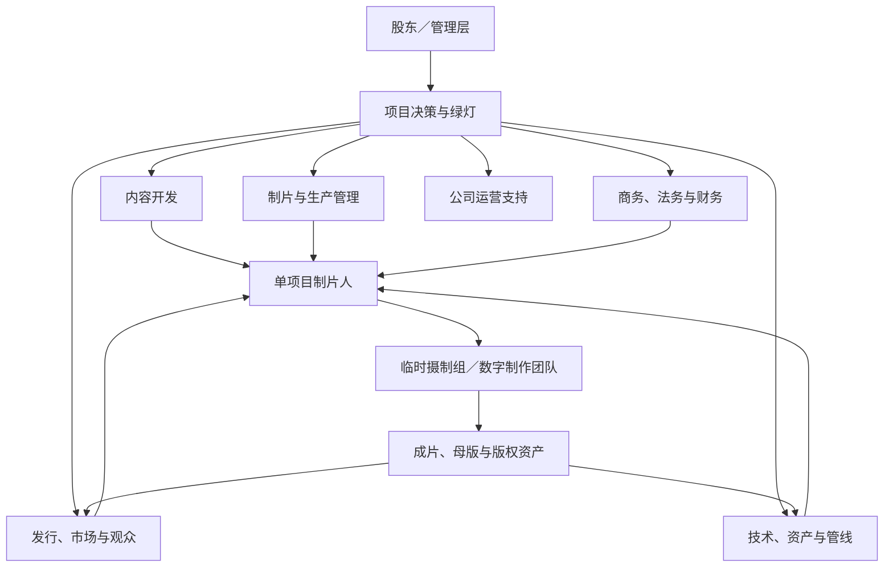

# 从影视公司架构到 AI 影视数字制片责任中心

> 本主题研究现实影视公司、单项目摄制组与动画/VFX 数字管线的组织差异，解决升级 AI 影视工作流时“该借鉴什么、不能照搬什么”的问题。核心用途不是增加岗位数量，而是识别项目决策权、跨阶段创作责任、交付物所有权、数字资产治理与返修路径。

## 快速认识

- 核心问题：四个 AI 聊天框应该模仿真人剧组部门，还是模仿影视公司的责任中心？
- 主要结论：管理结构借鉴项目制片公司，生产结构借鉴动画/VFX 管线；聊天框按责任和事实源划分，具体工种转化为内部能力或 Skill。
- 学习价值：避免把公司、剧组、供应商和生产阶段混成一张岗位表，也避免故事、镜头、剪辑各自正确却不属于同一部作品。
- 适用环节：新版本工作流诊断、岗位边界设计、Skill 归属、交接契约、数字资产与版本制度设计。

## 核心命题

> [!important] Codex 综合
> 现代影视生产是“常设公司 + 临时项目组织 + 外部供应商”的矩阵。AI 影视工作流不应复制摄影组、灯光组、美术组等真人剧组工种，而应保留它们代表的专业判断；在上层复制制片、绿灯、创意统筹和交付责任，在执行层采用动画/VFX 式的资产—镜头—版本—评审—返修管线。

以下四框映射是2026-07-21针对旧工作流提出的历史候选，不是当前岗位配置，也不规定所有项目必须四个聊天框。它用来说明责任中心与现实部门不同：

1. A：项目制片、状态、绿灯与跨部门调度；
2. B：内容开发、故事和剧本事实源；
3. C：导演执行与数字制作工作室；
4. D：后期完成、交付、发行与数据复盘。

## 适用边界

- 适合：个人或小型 AI 影视团队，需要用少量聊天框模拟完整公司的判断与交接。
- 不适合直接照搬：大型院线、电视台、平台、纯发行公司、纯器材公司或数百人真人摄制组的组织图。
- 不能误解为：所有影视公司都有相同部门；岗位名称等于实际权力；AI 生成等于替代某一个传统工种。
- 地域差异：中国、美国和英国的职称与工会边界不同，`制片人`、`执行制片人`、`制片主任`、`Producer`、`Line Producer`、`UPM` 不能机械一一翻译。
- 规模差异：小公司可能把法务、财务、发行、后期全部外包，大型集团则可能纵向整合制片、发行、平台、技术和版权运营。

## 学习材料

### 当前 Codex 对话：影视公司架构、摄制组与 AI 工作流对照

简介：围绕“当前影视公司的部门及其在制作环节中的位置”展开研究，并在第二轮纠正了把公司部门与剧组工种混淆的问题。  
来源：当前 Codex 对话，2026-07-21  
类型：对话研究与多来源综合  
信息来源：用户问题、Codex 综合、下列公开资料  
完整程度：覆盖本轮全部讨论；未包含单家公司内部未公开的真实汇报线  
核验情况：关键行业判断由官方年报、行业组织和职业体系资料交叉核验  

### 主要外部资料

| 材料 | 主要证据 | 类型与可靠性 |
|---|---|---|
| [迪士尼 2025 年年度报告](https://investors.thewaltdisneycompany.com/files/doc_financials/2025/ar/2025-Annual-Report.pdf) | 大型娱乐集团同时覆盖内容生产、院线与版权发行、流媒体、音乐和后期服务 | 公司正式披露，可靠性高 |
| [BBC Studios Global Content](https://globalcontent.bbcstudios.com/about-us) | 内容类型制作单元、全球制作业务和内容销售可以并存在同一公司架构中 | 公司官方资料，可靠性高 |
| [中国电影产业集团 2025 年年度报告摘要](https://pdf.dfcfw.com/pdf/H2_AN202604171821303356_1.pdf) | 中国大型电影企业覆盖创作、发行、放映、科技、制作服务和版权运营 | 公司正式披露，可靠性高 |
| [电视剧网络剧摄制组生产运行规范](https://xcoss.henan.gov.cn/typtfile/20250715/e9da211c662f42c384b8fe367846898f.pdf) | 中国项目摄制组的参考部门、制片人中心制和财务管理 | 行业组织规范，可靠性高 |
| [PGA 长片制片职能与署名规范](https://producersguild.org/code-of-credits-feature-films/) | 主制片人、Line Producer、Production Manager、后期制片与 VFX 制片的职责边界 | 专业行业组织，可靠性高 |
| [ScreenSkills 电影与电视剧岗位地图](https://www.screenskills.com/job-profiles/browse/film-and-tv-drama/) | 开发、生产管理、工艺、技术、后期、销售发行的完整岗位范围 | 行业技能机构，可靠性高 |
| [ScreenSkills 动画部门与管线](https://www.screenskills.com/job-profiles/browse/animation/) | 动画按开发、前期、制作、后期和发行组织，生产阶段包含 Layout、动画、灯光、合成 | 行业技能机构，可靠性高 |
| [ScreenSkills VFX 部门图](https://www.screenskills.com/media/oa3csza0/2756-vfx-industry-career-map-interactive-feb25.pdf) | VFX 的制作管理、资产、Layout、灯光、技术管线和合成关系 | 行业技能机构，可靠性高 |
| [Pixar Technology](https://www.pixar.com/technology-at-pixar) | 数字制作需要贯穿资产创建与镜头制作的技术应用和协作管线 | 工作室官方资料，可靠性高 |

## 内容导览

### 整体脉络

- `问题纠偏`｜先区分影视集团、制作公司、单项目摄制组和专业供应商；否则会把企业长期职能误写成片场工种表。
- `常设公司`｜公司长期保留的是项目池、绿灯、内容开发、制片、商务法务财务、发行市场、技术资产和运营支持。
- `临时项目`｜项目获批后，由制片人、导演/Showrunner、Line Producer/UPM 和各部门负责人形成多条相互制约的责任线。
- `阶段接力`｜开发、融资、筹备、拍摄、后期、发行和版权运营彼此重叠，不是简单的单向流水线。
- `AI 转译`｜真人拍摄以组织一次真实采集为核心，AI 数字制片以可复用资产、镜头版本、评审、生成与返修为核心。
- `四框映射`｜A/B/C/D 应保留四个责任中心，同时用内部 Skill 承接传统部门的专业判断，而不是继续增加平级聊天框。
- `升级缺口`｜未来升级应重点检查跨阶段导演责任、数字管线、公司级与项目级边界，以及声音和发行是否被过度后置。

### 详细导览

#### 1｜先修正研究对象

主要讲什么：为什么“影视公司主要负责真实拍摄”并不是普遍事实。

关键内容：

- 大型集团可能同时拥有内容、制片、发行、平台、技术和版权业务。
- 独立制作公司更常负责开发和组织项目，不一定长期雇佣摄影、美术、灯光等完整剧组。
- 摄制组是单项目临时组织，专业后期、VFX、器材和棚拍能力又可能属于外部公司。

#### 2｜公司的常设架构

主要讲什么：哪些责任需要跨多个项目长期存在。



| 常设中心 | 长期责任 | 主要输出 |
|---|---|---|
| 项目决策与绿灯 | 项目池、预算上限、继续/停止、核心主创和商业目标 | 立项与阶段审批 |
| 内容开发 | IP、策划、故事、剧本、早期选角和开发判断 | 可融资、可估价的项目包 |
| 制片与生产管理 | 预算、排期、组队、供应商、风险和最终交付 | 可执行生产计划与项目闭环 |
| 商务、法务与财务 | 权利链、合同、保险、现金流、税务和审计 | 合法可制作、可发行的权利与资金条件 |
| 发行、市场与观众 | 渠道、档期、宣传、销售、数据与版权运营 | 发行版本、营销包和观众反馈 |
| 技术、资产与管线 | 文件、元数据、版本、色彩、软件、资产复用和归档 | 稳定可追溯的数字生产环境 |
| 运营支持 | 人力、行政、采购、信息安全、合规与职业安全 | 多项目持续运行能力 |

#### 3｜项目获批后的三条责任线

| 责任线 | 对什么负责 | 不能取代什么 |
|---|---|---|
| 制片人 | 项目目标、核心资源、公司/投资方沟通和最终交付 | 不直接代替各专业部门完成创作 |
| 导演或 Showrunner | 跨剧本、表演、镜头、剪辑和声音的统一创作意图 | 不单独决定所有预算、合同和安全事项 |
| Line Producer、UPM、制片主任、第一副导演 | 预算、排期、现场组织、人员和安全执行 | 不替代导演做最终艺术判断 |

> [!note] 关键区别
> 第一副导演主要掌握片场运行权；导演掌握创作解释；制片系统掌握项目资源与交付边界。真实剧组不是一个人沿单一命令链控制所有工作。

#### 4｜项目摄制组的部门群

| 部门群 | 典型部门 | 功能 |
|---|---|---|
| 内容与创作 | 编剧、导演、场记 | 故事、表演、场面、镜头意图与连续性 |
| 制片与运行 | 制片、财务、剧务、场地、交通 | 预算、计划、人员、后勤和现场运行 |
| 角色呈现 | 选角、演员、服装、化妆、发型 | 角色选择、表演和外在状态 |
| 视觉世界 | 美术、制景、置景、道具、图形 | 建立故事世界、场景和物件 |
| 图像采集 | 摄影、灯光、Grip、DIT | 机位、镜头、光线、运动和摄影数据 |
| 声音与特殊拍摄 | 现场录音、动作、烟火、特技、特殊安全 | 声音采集和高风险/特殊场面执行 |
| 后期完成 | 剪辑、VFX、声音、音乐、调色、母版 | 把素材完成为可交付作品 |

#### 5｜七个阶段怎样交接

| 阶段 | 主导力量 | 关键问题 | 阶段成果 |
|---|---|---|---|
| 项目开发 | 内容开发、编剧、制片人 | 值不值得继续？ | 项目定位、剧本、权利初查 |
| 包装与绿灯 | 管理层、制片、财务法务、发行 | 是否值得投入、怎样回收？ | 主创、预算、融资、绿灯 |
| 前期筹备 | 导演、制片、各部门负责人 | 怎样把剧本变成可执行计划？ | 分镜、资产、场景、排期、技术方案 |
| 拍摄/制作 | 导演、副导演、制片管理、现场部门 | 今天怎样安全完成合格素材？ | 画面、声音、场记、元数据和成本记录 |
| 后期完成 | 后期制片、导演、剪辑、视效、声音 | 怎样把素材变成统一作品？ | 锁画、视效、混音、调色、母版 |
| 发行上线 | 发行、市场、平台、商务 | 怎样让目标观众看到？ | 档期、营销物料、发行版本 |
| 数据与版权运营 | 发行、财务、版权、管理层 | 作品产生了什么价值，下一步是什么？ | 数据复盘、结算、授权和续作判断 |

阶段不是绝对串行：剪辑会在拍摄期间检查素材，VFX 应在筹备期介入，发行也可能在绿灯前参与融资和定位。

#### 6｜真人拍摄与 AI 数字制片的根本差异

| 真人拍摄 | AI 数字制片 |
|---|---|
| 核心是把演员、场景、摄影机、灯光和声音组织到同一时空完成采集 | 核心是建立可复用的故事事实、资产、镜头规格和生成约束 |
| 资源瓶颈主要是人员、场地、器材、天气和拍摄日 | 资源瓶颈主要是模型能力、资产一致性、版本、算力/额度、返修和选择成本 |
| 场记、DIT 和后期保证素材可用与连续 | 资产索引、生成记录和镜头状态保证结果可追溯与可复现 |
| 杀青后大规模进入后期 | 生成、合成、剪辑和返修从早期就循环发生 |

因此，AI 影视执行层更接近以下循环：

```text
故事事实
-> 角色／场景／道具资产
-> 分镜与 Layout
-> 表演、镜头、光线与声音规格
-> 生成批次
-> 结果评审与选片
-> 合成与剪辑
-> 发现问题并返回准确上游
-> 成片、发布与复盘
```

#### 7｜历史四框候选的功能类比

| 聊天框 | 现实公司原型 | 数字制片原型 | 核心事实源 |
|---|---|---|---|
| A｜总控流程 | 制片人办公室、绿灯和项目管理 | Production Management | 状态、唯一任务、完成标准、里程碑和路由 |
| B｜故事剧本 | 内容开发、编剧和剧本编辑 | Story Department | 人物、主题、情节、场景、对白和可制作段落 |
| C｜视觉生成 | 导演执行、美术、摄影、表演和视效部门群 | 数字资产、Storyboard、Layout、Animation、Lighting、Generation、VFX | 资产、表演、镜头、提示词、生成批次与素材 |
| D｜后期发行复盘 | 后期制片、发行、市场和数据部门群 | Editorial、Sound、Finishing、Delivery、Publishing | 剪辑版本、声音、母版、发布包和结果复盘 |

> [!warning] 尚未采纳的诊断
> 上表是升级时的分析框架，不代表已经确认修改当前 v0.6。是否调整岗位名称、增加职责或重分 Skill，必须继续核对四岗位完整提示词、真实运行案例和现有失败模式。

#### 8｜当前结构最值得复核的遗漏

1. **跨阶段创意责任是否明确**：B 决定故事、C 决定表演和镜头、D 又通过剪辑改变叙事，谁负责保证三者始终属于同一部作品？
2. **数字管线责任是否明确**：谁管理模型/工具、提示词和参数、资产版本、镜头状态、生成批次、来源权利、失败记录与可复现性？
3. **公司级和项目级是否分开**：比赛投稿、通用适配器、知识树、平台规则和版权治理不应被误当成单项目创作事实。
4. **声音是否进入得太晚**：声音可以在剧本、表演和镜头阶段承担信息与节奏，不应只在 D 才首次思考。
5. **发行是否只被当作末端包装**：受众、平台和交付规范有时需要在开发和绿灯阶段前置，但不能反过来吞噬创作目标。

## 知识单元

### 本轮专业增补：决策权、执行、文件维护与验收分开

[PGA长片制片职能说明](https://producersguild.org/code-of-credits-feature-films/)区分主制片、Line Producer、后期统筹和VFX制片等功能，职责可能跨阶段并有交叠。它是特定行业署名与职能资源，不自动给某个中国项目、AI角色或文件持有人授权。

本库建议对一项具体决定分别问：谁提出方案，谁投入资源，谁执行，谁维护事实，谁批准采用，谁验收交付。一个人可以兼任多项，但“我写这份文件”不等于“我能批准全部创作／预算／发布”。发生争议时回到项目约定和真实授权，不从英文职称或聊天框数量推定。

### 数字协作的关键是组合与变更影响，不是堆岗位

[OpenUSD官方介绍](https://openusd.org/release/intro.html)说明多位创作者可在独立Layer上工作，再按明确规则组合；同时指出底层几何变化不会自动使更高层的其他数据都正确适配。它提供的是技术组合机制，不是审美批准制度。

本库对AI影视的转译：资产基线、镜头专用修改、当前采用版和派生记录要可区分；共享角色一处改动可能影响多个镜头，需要识别使用者与回归范围。复制一套USD设施或增加一个“资产管理员”聊天框，并不会自动解决这种依赖；先找到真实复用对象与错误传播路径。

### 小团队的瓶颈可能在选择、沟通与返修

生成时间变短，不代表整片周期按相同比例下降。若候选更多而审看标准不清，挑选和返修会增加；若多个责任中心各自维护“当前版本”，同步成本会增加。应比较从输入到可采用交付的总耗时、返工位置和未决队列，不只统计模型出图秒数。

本库最小试行是用一个真实交接检查输入是否清楚、输出是否可验、错误能否返回准确上游。只有新增职责确实能减少一个可观察瓶颈，才考虑调整组织或工具；本轮不创建任务、不修改Skill或工作流。

### 工作流模型的有效期与适用边界

旧文中的v0.6、四框、D兼发行及“未来升级”保留历史讨论身份。当前项目应读现行权威文件，不能由本文恢复旧派工；也不在知识正文里硬写另一套新岗位映射替代它。公司年报能证明公开业务范围，不证明内部每条汇报线或项目批准权。

本轮来源见[[知识库/创作区/A-制片与协作/行业观察专业优化/01-制片责任、数字协作与作品反馈]]。下文原个人记录、练习与四框表不代表新增采用。

### 概念

- **常设公司**：跨多个项目长期存在，管理项目池、资源、权利、发行和基础设施。
- **单项目组织**：为一部作品临时建立的制片人、导演、生产管理和专业部门组合。
- **责任中心**：对一组结果、事实源和决策承担最终责任，不等于一个具体工种。
- **绿灯（greenlight）**：公司允许项目进入下一资金和生产阶段的正式决策。
- **数字制作管线**：让资产和镜头按稳定状态、版本与交接规则在多个工序间流动的系统。
- **跨阶段角色**：制片人、导演/Showrunner 等不会随单一阶段结束而退出的责任人。

### 原则

1. 先区分公司、项目、供应商和阶段，再谈部门映射。
2. 先画决策权和交付权，再画岗位名称。
3. 聊天框按事实源和最终责任划分，Skill 按专业能力划分。
4. 真人工种转译为 AI 判断职责，不机械转译为新聊天框。
5. 创作统一性、项目可行性和技术可追溯性必须分别有人负责。
6. 返修应返回问题真正所属的上游，而不是默认重写故事或重新生成一切。
7. 公司级规则与项目级事实分开保存，避免一个项目污染全局制度，或公司工具替项目做创作决定。

### 方法：升级工作流前的七步检查

1. **确定分析单位**：现在讨论的是公司、项目、部门、岗位、Skill、文件还是生产阶段？
2. **画权力图**：谁能立项、采用、停用、返修、发布和关闭里程碑？
3. **画事实源图**：每类长期事实由哪个岗位、哪个文件独占维护？
4. **画交付链**：每个岗位接收什么输入，交付什么可验证结果？
5. **画数字资产链**：资产、镜头、提示词、生成批次、剪辑和发布版本怎样追溯？
6. **画返修路由**：故事、资产、表演、镜头、模型、素材、剪辑、发行问题分别回到哪里？
7. **最后决定聊天框数量**：只有新增职责无法由现有责任中心容纳时，才考虑增加新聊天框。

### 案例：为什么不能直接复制真人剧组

如果把摄影、美术、灯光、服装、化妆、表演、VFX 分成七个聊天框，每个聊天框都会生成自己的版本和意见，但个人创作者必须额外承担大量同步成本。更合理的做法是让 C 作为数字制作责任中心，再以资产、色彩、表演、镜头、提示词和生成等单职责 Skill 提供专业检查。

反过来，如果把 C 只理解成“出图和出视频”，又会丢失传统导演、美术、摄影、表演和现场连续性部门的判断价值。因此要压缩组织数量，而不能压缩专业标准。

### 反例、边界与开放问题

- 不能因为大型集团拥有发行和平台，就要求个人工作流也建立完整商业部门。
- 不能因为动画管线重资产，就默认所有 AI 短片都需要复杂资产管理；复杂度应随复用次数和连续性风险增长。
- 不能仅凭岗位名称判断当前 v0.6 是否缺少导演或技术管线，必须读完整岗位提示词和实际交接记录。
- 待核验：A 是否应拥有跨阶段创意否决权，还是只维持制片边界并由另一个明确机制保持导演意图？
- 待核验：声音设计应该前置到 B、C 的哪些交付物，同时仍由 D 独占最终声音产物？

## 外部补充与分歧

- 检索日期：2026-07-21。
- 可靠性：公司年报和公司官方页面属于一手经营披露；行业协会和职业机构用于核对岗位及流程；具体公司的内部汇报线通常不公开。
- 地域分歧：中国摄制组更常使用制片组、导演组、美术组等集合称谓；欧美成熟制片体系常把 Camera、Lighting、Grip、Production Sound、Post Sound 等进一步拆开。
- 类型分歧：电影导演通常贯穿筹备、拍摄与剪辑；剧集可能由 Showrunner、总编剧或执行制片人保持整季创作权。
- 不确定性：本文提供可复用的功能模型，不声称存在唯一、全球统一的影视公司组织图。

## 相关知识

- 当前没有建立正式主题关系；未来若与导演统筹、资产版本或项目复盘主题形成会改变创作判断的明确关系，应交由关系编织流程预览后确认。

## 我的默认做法

> [!tip] 当前做法
> 以后评估 AI 影视工作流升级时，先用“公司常设责任—项目权力—数字管线—交付事实源”四层模型诊断，再讨论岗位名称或增加聊天框。该做法尚待真实项目验证。

## 项目应用与验证

| 项目 | 阶段与问题 | 本次调用 | 结果 | 回写 |
|---|---|---|---|---|
| 小陌 AI 影视工作流 v0.6 | 未来升级前的组织结构复核 | 以公司、项目、动画/VFX 三种结构重新审视 A/B/C/D | 待验证 | 不在本轮修改工作流 |

## 对我的创作有什么启发

- 真正需要复制的是影视工业的专业判断与责任交接，而不是人数和工种名称。
- AI 降低了某些执行门槛，却提高了资产一致性、版本选择、来源权利和返修治理的重要性。
- 少量责任中心可以容纳大量专业能力，前提是每个 Skill 的输入、输出、确认门、ID 和停止条件足够清楚。

## 我的理解、疑问与联想

> [!note] 我的理解
> 当前知识来自本轮对话与外部资料综合，尚未记录用户对最终四中心解释的正式采纳意见。

> [!question] 我的疑问
> 如果未来只能优先补一个结构能力，应该先明确跨 B/C/D 的导演意图，还是先建立完整的数字资产与镜头管线？

> [!idea] 创作联想
> 可在下一次升级前，把每个聊天框画成一张“现实部门功能—现有 Skill—事实源—交接物—失败返回点”矩阵，再用真实项目验证，而不是直接改岗位名称。

### 内化检验记录

<!-- 首次实际检验后再追加：日期、问题、核心回答、诊断、下一步。 -->

## 复习区

### 一分钟核心摘要

影视公司不是永久养着全部摄制组的单一部门树，而是常设公司的开发、制片、法务财务、发行市场和技术资产能力，在项目获批后连接临时剧组与外部供应商。AI 影视应借鉴这套权责结构，并在执行层采用动画/VFX 的资产和镜头管线。四个聊天框适合做责任中心，传统工种应转译成内部专业能力或 Skill。升级时先检查跨阶段创意责任、数字管线、公司/项目边界与返修路由。

### 关键概念

- 常设公司与临时项目组织
- 制片人中心制
- 跨阶段导演责任
- 责任中心
- 数字制作管线
- 资产与镜头版本
- 公司级治理与项目级事实

### 自测问题

1. 为什么影视公司的常设部门不能直接等同于摄制组部门？
2. 制片人、导演、Line Producer/UPM 和第一副导演分别对什么负责？
3. 为什么 AI 影视生产更接近动画/VFX 管线，而不是缩小版真人拍摄？
4. A/B/C/D 四个聊天框分别对应什么责任中心？
5. 升级工作流前，为什么应该先画决策权和事实源，而不是先增加岗位？

### 创作练习

- [ ] #复习 用一分钟解释“常设公司 + 临时项目 + 外部供应商”的矩阵。
- [ ] #复习 从一部电影片尾表中区分公司职能、项目制片岗位、剧组部门和外部供应商。
- [ ] #创作练习 为当前 A/B/C/D 各列出一项最终决定权、一份事实源、一个交付物和一个明确停止条件；只做对照，不立即改工作流。
