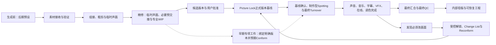

# 影视后期如何通过前置规划、阶段门、版本基线与专业交接保持可控

> 本主题研究后期怎样成为一套可控的创作与生产系统，而不是若干软件工序的拼接。它用于建立剪辑、声音、音乐、字幕、VFX、调色与在线完成的共同版本基线，并让每次批准、交接、修改、QC和恢复都有证据。

## 快速认识

- 核心问题：怎样避免每个专业单独做得很好，最后却不属于同一个画面版本。
- 主要结论：专业后期依靠创作控制、流程控制和技术控制同时运行；角色可以合并，被当前项目触发并影响下游的版本、批准、交接、变更传播与QC功能不能无记录地消失。
- 学习价值：先学会判断当前处于哪个状态、能否进入下一步、谁有权批准、交什么、改动会影响谁。
- 适用环节：素材生成前的后期预设、素材接收、剪辑审看、Picture Lock、声音音乐与调色交接、锁画后返修、内部母版和工程归档。

## 核心命题

专业后期的核心不是“剪辑—配音—配乐—调色”四项任务依次完成，而是让所有专业始终知道：

1. 当前依据哪一个画面版本；
2. 这个版本处于什么创作状态；
3. 谁批准它进入下一阶段；
4. 下游收到的参考、结构、素材和元数据是什么；
5. 画面变化后哪些产物失效，怎样重新对齐；
6. 用什么证据证明阶段已完成并可恢复。

后期同时运行三种控制：

| 控制层 | 解决的问题 | 主要承担者 |
|---|---|---|
| 创作控制 | 故事、表演、节奏、声音和画面意图是否成立 | 用户、导演、剪辑师、制片等创作决定者 |
| 流程控制 | 当前阶段、依赖、意见、批准和交接是否清楚 | 后期制片、后期总监、协调；OPC中可压缩为控制功能 |
| 技术控制 | 素材、工程、时码、版本、同步、QC和恢复是否正确 | 第一助理剪辑、后期技术与各专项操作人 |

一人可以兼任三层，但不能用“都是我做”代替三种不同判断。

## 适用边界

- 本主题建立跨软件通用控制原理，不指定剪辑、声音或调色软件。
- 阶段名称会随国家、项目类型、预算和公司变化；这里的阶段门是个人工作流综合，不是全球统一标准。
- Picture Lock、Locked Cut与Final Cut不能机械视为完全同义。共同原则是为下游建立获批、可识别的时间结构基线。
- 当前证据不足以把Sound Lock写成所有项目都必须使用的通用正式阶段门。
- Final Cut在部分制作语境中表示最终版本，在合同与创作权语境中也可能指最终剪辑决定权；本体系不用它作为固定阶段门。
- Netflix、Avid、Adobe、Blackmagic和ACES资料用于提炼原理；其中平台参数、菜单和文件规格不直接成为个人短片标准。
- AI素材适配是基于传统后期控制原理的综合推导，必须通过真实项目继续验证。
- 本主题提及VFX与在线只为说明锁画、Turnover和版本变更接口，不在本轮决定其未来岗位归属，也不扩大当前D或修改C。
- 本主题只到内部母版和可恢复工程，不包含发行、发布或发布后复盘。

## 学习材料

### 《D后期知识建设｜01 后期控制系统专业资料汇编》

简介：通过两轮专业来源收集与两轮审核，汇总后期岗位、前置规划、阶段门、Picture Lock、Spotting、Turnover、Conform、阶段QC、工程恢复和AI适配边界。  
来源：[[知识库/创作区/D-声音与后期/D后期知识建设/01-后期控制系统|专业资料汇编]]  
类型：同主题多来源专业研究  
信息来源：专业院校、行业岗位体系、平台技术规范和软件官方文档  
完整程度：阶段1控制框架基本完整；真实项目验证及后续专项细节待建设  
核验情况：关键原则由AFI、NFTS、ScreenSkills、Netflix、Avid、ACES及软件官方资料交叉核对；行业事实、平台要求和OPC推导已分开标注。  

### 关键外部材料

| 材料 | 本主题采用的证据 |
|---|---|
| [ScreenSkills：Post-production supervisor](https://www.screenskills.com/skills-checklists/scripted-film-and-tv/post-production-department-freelance-scripted/post-production-supervisor-skills/) | 后期规划在制作前开始，包含剧本拆解、工作流、排期、测试、跨部门协调与QC |
| [ScreenSkills：First assistant editor](https://www.screenskills.com/skills-checklists/scripted-film-and-tv/editorial-department/first-assistant-editor/) | 素材、版本、审看、Turnover、Change List和归档是专业剪辑系统的一部分 |
| [Netflix：Dailies Best Practices](https://partnerhelp.netflixstudios.com/hc/en-us/articles/4415931246995-Dailies-Best-Practices) | 前期工作流memo、管线测试、素材验证、代理、元数据和阶段QC |
| [Netflix：Dialogue List Scope of Work](https://partnerhelp.netflixstudios.com/hc/en-us/articles/360000427707-Dialogue-List-Scope-of-Work) | Locked Cut可作为先行基线，最终画面变化后需要Conform |
| [Avid：Audio-Video Editing Workflows](https://resources.avid.com/supportfiles/attach/AudioVideo_Editing_Workflows.pdf) | 声音交接与画面修改后的Audio Conform |
| [ACES：AMF Implementation Guide](https://docs.acescentral.com/amf/guides/implementation/) | 色彩状态和变换信息需要跨剪辑、VFX、调色、母版与归档传递 |

## 内容导览

### 整体脉络

- 前置规划：在素材生成前确定D的接收条件和技术基线。
- 素材与工作媒体：保证身份、完整性、同步、显示和重连正确。
- 创作剪辑：用组接、粗剪、临时声音音乐和精修逐步建立获批版本。
- 精修并行准备：用临时声画、必要预交接和专业WIP提前暴露问题。
- Picture Lock：把用户批准的画面顺序、时长和时间结构变成下游共同依赖的正式版本基线。
- 制作型Spotting与Turnover：基于明确版本把创作意图转成时间码任务，并交出可重建、可核对的材料。
- 并行完成：声音、音乐、字幕、VFX、在线和调色基于同一画面工作。
- 受控变更：锁画后修改时比较版本、传播影响并重新Conform。
- QC与恢复：逐阶段验证，最后形成内部母版和可恢复工程。

### 流程关系

这是OPC主控制线，不表示所有专项必须等Picture Lock后才首次介入；早期声音、音乐、VFX、Look或在线测试必须绑定明确画面版本，并预期在正式锁画后核对或Conform。每个阶段门均包含对应的阶段QC。

## 知识单元

### 一、可控的后期规划应早于依赖其技术基线的素材产生

D的实际剪辑可以从素材进入后开始，但后期控制不应从那时才思考。专业化制作通常会提前确定：

- 目标画幅、主帧率、时间码或项目时间基准；
- 预期时长、镜头可剪辑余量和必要覆盖；
- 文件命名、版本、存储、备份与素材身份；
- 声音录制或生成的采样率、声道与同步基础；
- 代理、审看文件、字幕和色彩管理的基础；
- 画面、声音、VFX、调色之间的Turnover方式；
- 一次最小端到端管线测试。

对当前AI工作流而言，未来v0.8需要保留D后期预设与A/C之间的前置接口；具体由D提出、A记录或转交、C读取到什么程度，留待后续方案决定。本轮不修改现有工作流。

### 二、由助理剪辑等岗位承担的系统管理功能，是D的系统记忆

以下以ScreenSkills英国scripted体系中的第一助理剪辑为主要观察样本；其他地区和制作规模可能由助理剪辑、后期协调、在线助理、设施方或数据岗位分担。OPC需要保留的是功能，不是固定岗位归属。

这些岗位并不是“帮忙点几下导出”。它们把创作剪辑放在一个可信系统里：

- 接收、核对、命名、组织、同步和备份素材；
- 维护原始媒体、代理、派生文件和时间线之间的关系；
- 维护工程、序列、版本、审看导出和批准记录；
- 准备临时声音、音乐、字幕、VFX和审看材料；
- 创建并验证画面、声音、音乐、ADR、VFX与调色Turnover；
- 维护Change List、Conform状态和返回资产；
- 归档工程、媒体、说明和恢复路径。

OPC不需要额外雇一个岗位，但D必须保留这些功能，否则大模型对话会替代系统记忆，版本很快失真。

### 三、阶段门要记录状态、权限、基线与证据

| 阶段门 | 进入下一阶段前必须确认 | 决策性质 | 最小输出 |
|---|---|---|---|
| 工作流就绪 | 规格、命名、存储、接口和测试已确定 | 技术与流程 | 后期预设、测试记录、例外 |
| 素材就绪 | 素材齐全、可读、可追溯、已核对 | 技术 | 素材清单、问题单、备份状态 |
| 组接可审 | 故事已完整出现，缺口和覆盖问题可见 | 创作准备 | 可完整观看版本、缺口清单 |
| 精修候选 | 节奏、信息、表演和临时声画足够稳定 | 创作准备 | 候选版本、未决意见 |
| Picture Lock | 用户批准当前画面作为共同时间基线 | 创作批准 | 唯一版本、参考画面、批准与例外 |
| Turnover就绪 | 下游能识别、重建并核对当前版本 | 技术与流程 | 完整Turnover包与接收确认 |
| 专项签核 | 声音、音乐、调色等分别符合创作目标 | 创作批准 | 各专项采用版本与意见闭环 |
| 内部QC通过 | 技术缺陷已修复，或残余技术风险已由用户明确接受 | 技术 | QC表、修复复核、内部母版 |
| 可恢复 | 工程能重开、重连并再次输出 | 技术 | 恢复索引与测试结果 |

用户负责创作采用、审美批准和残余风险接受。Agent只有在真实读取对应媒体、具备适用检查工具并留下可复核证据时，才能报告已检查或通过；无法访问、工具不足或未实际检查时必须标记“未检查”，不得推断通过，更不能把“没有技术错误”写成“创作已通过”。

### 四、Picture Lock必须是可证明的共同基线

本体系先区分两级参考状态：

- 先行锁定基线：允许已声明的画面例外；基于它开展的声音、音乐、VFX、字幕等属于先行工作，预计在正式锁画或最终画面到达后Conform。
- Picture Lock：画面顺序、时长和时间结构已获批准；VFX、字幕、声音和颜色可以未完成，但再次改变画面必须受控解锁。

一个剪辑版本成为Picture Lock，不只是因为剪辑师说“差不多了”。本体系建议检查：

1. 技术上可被下游使用：版本唯一、参考文件可读、时长与时间基准明确。
2. 创作上被有权决定的人批准：当前个人工作流中就是用户明确批准。
3. 证据上可复核：精确文件、批准时间、批准范围、已知未完成项和下游依赖被记录。

本体系建议的Picture Lock参考包：

- CUT编号与版本ID；
- 稳定素材ID、精确文件名和项目内相对路径；绝对路径只作当前机器定位信息，重要基线可选配校验和确认文件身份；
- 时长、帧率、分辨率、画幅和时间码起点；
- 带版本标识与时间码信息的参考画面；
- 与参考画面严格对应的临时混音或声音参考；
- 用户批准日期、批准范围与当前状态；
- 已声明的下游未完成项；若仍存在会改变画面顺序、时长或时间结构的例外，应标记为先行锁定基线；
- 各Turnover和下游产物的版本索引。

### 五、声音与音乐不应等到锁画后才思考

粗剪和精修已经需要声音与音乐参与叙事验证：

- 对白是否清楚，表演节奏是否成立；
- 环境声与持续声能否连接空间和镜头；
- 动作声、反应声和声音桥能否替代多余画面；
- 音乐是否支持段落结构，还是在替剧本硬推情绪；
- 静默何时比声音更有力量；
- 当前剪辑是否给正式声音与音乐留下可工作的结构。

针对OPC，把临时规划与制作型Spotting分为两层更实用：

| 层次 | 时机 | 目的 | 输出 |
|---|---|---|---|
| 临时声画规划／探索性Cue规划 | 粗剪与精修 | 用临时声音音乐检验剪辑和叙事 | 声音音乐意图、临时Cue、问题与备选 |
| 制作型Spotting | 通常在精剪后期、接近锁画或基于明确先行版本 | 把意图转成可制作的时间码任务；画面变化后重新核对或Conform | Cue位置、功能、进入退出、衔接、素材需求与责任 |

两层模型是本知识体系的OPC适配，不是声称所有公司都固定使用相同名称、时机或会议次数。

### 六、Turnover必须让对方重建并验证

本知识体系把跨专业Turnover归纳为六类检查项：

| 要素 | 最小内容 |
|---|---|
| 参考 | 唯一画面版本、参考视频、导向混音 |
| 结构 | 时间线交换文件、镜头表、Cue表或等效结构 |
| 素材 | 原片、代理、声音、Plate、Handles、干净源与处理版 |
| 元数据 | 素材ID、文件名、时码、帧率、画幅、声道与轨道解释、色彩变换状态、帧范围 |
| 说明 | 临时项、不可迁移效果、已知问题、处理意图和接收要求 |
| 验证 | 目标端导入、重连、与参考对比及异常清单 |

六类是跨软件检查维度，不代表所有Turnover都必须交出表中全部媒体；实际字段服从接收方契约、项目规模和所用管线。不同专业侧重点不同：

- 声音：参考画面、导向混音、采样率、位深、声道／轨道布局、嵌入或外链、Handles、临时效果／已渲染效果／干净源和同步参考。
- 在线与调色：参考画面、剪辑结构、原始或高质量媒体、时码画幅、源／工作／输出色彩空间，Input／Look／Output Transform是否应用或烘焙，以及缩放、裁切、重构图和变速状态。
- VFX：镜头ID、源媒体定位、源帧与交付帧范围、Plate与Handles、分辨率、构图、参考外观、颜色元数据和版本状态。
- 字幕与对白资料：准确参考画面、时间码、对白和版本状态；画面变化后需要Conform。

交换文件不是事实源的全部。导入成功也不等于转换正确，必须与参考画面核对。

### 七、锁画后变更要进入受控解锁

Picture Lock之后仍可能发现必须改画面的原因。专业控制不靠“绝不修改”，而靠显式变更：

1. 提交修改原因、范围与决策人。
2. 判断收益是否大于所有下游返工。
3. 保留旧基线，创建新画面版本。
4. 比较新旧时间线与素材身份，记录增、删、移、换、修剪、变速、时长变化及“仅内容变化、时间结构未变”。
5. 标出受影响的对白、配音、音乐、音效、VFX、调色和字幕。
6. 各分支重新Conform或明确无需修改。
7. 复核声画同步、Cue、镜头状态和返回资产。
8. 用户批准新基线，旧基线改为历史状态。

OPC建议保留的Change List字段：

- 新旧版本ID；
- 旧／新素材ID、媒体文件或资产版本；
- 旧时码与新时码；
- 变化类型、时长差和受影响区段；
- “仅内容变化、时间结构未变”标记；
- 受影响专业；
- 每个专业的Reconform状态；
- 新产物版本、异常和复核结果；
- 旧产物状态：失效、待复核或仍有效。

本体系用Conform表示首次依据编辑结构重建、重连或完成时间线，用Reconform表示既有专业时间线因新画面版本而更新；实际行业与软件用词可能重叠，这一区分只用于保持当前知识操作清晰。

### 八、QC应在错误产生处附近发生

只在导出成片后检查，会让小问题变成跨部门返工。QC应分布在：

- 素材接收：可读、数量、身份、异常、复制完整性；校验和只证明复制或传输中位级未变化，不证明拿到的是正确素材，也不证明内容、同步或色彩正确；
- 工作媒体：代理对应、时码、同步、显示与重连；
- 剪辑版本：正确版本、无意外离线、可完整播放；
- Turnover：结构可导入、媒体可连接、目标端与参考一致；
- 专项返回：基于正确基线、时间位置和版本；
- 最终汇合：源版本、时长、帧率、分辨率、输出色彩状态、声道布局、声画同步、字幕、离线／临时素材和完整播放；
- 修复回归：修复点通过且未引入新问题；
- 归档恢复：工程、素材、依赖和元数据齐全并完成恢复测试。

### 九、三个最终产物不能混同

| 产物 | 判断标准 |
|---|---|
| 内部观看版 | 便于审看和批注，版本可识别，但不要求保留最高质量和完整可编辑性 |
| 内部母版 | 采用的最终声画已经汇合并通过内部技术QC，可作为后续转码起点 |
| 可恢复工程 | 按声明的恢复级别重新打开、定位素材、理解版本、恢复依赖并再次输出 |

可恢复工程必须先声明目标：

| 恢复级别 | 目标 |
|---|---|
| 母版复现 | 能重新生成与当前内部母版一致的结果 |
| 有限修改 | 保留足够Handles与依赖，可做已约定范围内的调整 |
| 完整再剪／再制版 | 保留完整原始素材、完整工程和全部关键依赖 |

恢复测试至少完成“重开—重连—重新输出—与参考版本核对”。插件、字体、模型或授权无法直接归档时，保留版本和替代方案说明。“能播放”不能证明“能恢复”，“软件归档成功”也不能证明全部依赖已保存。具体恢复内容由阶段2素材技术、阶段6成片完成专题及项目约束继续研究；未来v0.8只转译已经确认的知识。

### 十、AI短片要主动补建素材身份

传统摄影素材通常有卷名、文件名、源时码与摄影机元数据，AI素材往往没有。D至少应补建：

- 稳定内部素材ID；
- 项目主帧率和时间基准；
- 镜头ID—采用生成批次—媒体文件—时间线事件映射；
- 原始生成、采用版与派生处理版的层级；
- 重生成替换原因和旧版保留；
- 补帧、变速、延长、裁切、转码等处理记录；
- 色彩状态未知时明确标记未知；
- 提示词、模型、种子和生成批次的来源索引。

生成记录说明素材从哪里来，后期工程说明它怎样被使用；两者不能互相替代。

### 十一、OPC第一圈先保留什么

完整功能不等于第一次实践就照搬所有大剧组文件：

| OPC第一圈保留 | 有真实需求时增加 |
|---|---|
| 唯一CUT与版本ID | AAF、XML、EDL、OTIO等交换结构 |
| 用户锁画批准 | Handles与复杂Turnover |
| 对应参考画面与时间基准 | 完整校验和责任链 |
| 锁画后变更及受影响项 | VFX、插件与跨软件依赖清单 |
| 已实际执行的阶段QC证据 | 高级母版与多规格交付 |
| 声明恢复级别的最小工程路径 | 国际化M&E等专项资产 |

## 方法与案例

### 一次锁画后替换镜头的最小处理

假设声音、音乐和字幕已经基于CUT07工作，用户发现中段一个镜头必须替换，且新镜头比旧镜头长12帧。

错误做法：直接覆盖媒体文件，继续导出。这样音乐入点、对白同步、后续字幕和调色镜头都可能漂移，但系统没有证据说明哪些已失效。

受控做法：

1. 保留CUT07和旧媒体。
2. 创建CUT08，记录替换镜头与增加12帧。
3. 标记受影响区段和全部下游专业。
4. 声音与音乐重新Conform，字幕重对时间，调色替换对应镜头。
5. 各分支返回新版本及对齐结果。
6. 用户审看并批准CUT08成为新基线。

这个例子说明：锁画的价值不是禁止创作，而是让修改成本、影响和完成状态可见。

## 从版本编号深入到时间、内容与依赖

以下为本知识体系综合，时间范围概念参照[OpenTimelineIO Time Ranges](https://opentimelineio.readthedocs.io/en/latest/tutorials/time-ranges.html)，交换限制参照[Adobe XML导出说明](https://helpx.adobe.com/premiere/desktop/render-and-export/export-files/export-a-project-as-a-final-cut-pro-xml-file.html)。这是跨软件判断方法，不要求项目安装OTIO或采用某个交换格式。

### 源区间、节目区间和余量不能混写

**Source Range（源区间）**回答“使用原素材哪一段”；**Record/Timeline Range（节目/时间线区间）**回答“它位于成片哪里”；**Handles（前后余量）**是所选区间之外实际存在、可供修剪或处理的素材，不是一个请求字段。

教学算例使用从0开始的帧号、右端不包含的区间。在24fps、原速无变速条件下，源[100,196)为96帧、4秒；放在时间线[240,336)即第10至14秒。若原素材可用范围为[76,220)，前后各有24帧余量。软件若用包含末帧的Out标法，必须换算，不能因都写“196”便判定相同。

余量需求由接收方用途决定：转场、稳定、降噪、声音编辑或后续修剪可能需要不同长度与内容。黑帧、重复冻结或生成延长可以增加文件帧数，却不自动提供真实运动余量。含变速/速度曲线时，节目帧与源帧不再简单一对一；要保留映射或说明烘焙方式，不能把1秒时间线余量直接换成1秒源片。

### 同长替换也可能改变整场意义

教学构造：旧镜和新镜都为96帧，但人物把物件放上桌的接触点晚了8帧。后续镜头起点没有移动，碰撞音效却可能提前；口型、跟踪、遮罩和反应时机也可能改变。

| 下游对象 | 应比较什么 | 可能结论 |
|---|---|---|
| 对白/音效 | 发声、接触、空间和动作阶段是否变化 | 时间线位置相同仍需重对局部事件 |
| 音乐 | 原同步重音是否仍落在需要的动作/理解点 | 可能保留，也可能改Cue或局部结构 |
| VFX/调色 | Plate、运动、构图、遮挡和色彩状态 | 可能重跟踪、替换Plate或重新匹配 |
| 字幕/图文 | 对白内容、口型时序、遮挡与版面条件 | 文本或时间可不变，但须有核对依据 |

因此变更记录要同时包含“节目时间变化”和“镜内内容/处理变化”。不是所有分支自动失效，也不是总长不变就全部豁免。标出受影响范围，由相应专业确认保留、更新或待查，避免无必要地重做全片。

### 交接至少有三个不同的成功

1. **文件到达**：目录、清单和副本完整性得到核对。
2. **结构重建**：目标端找到正确源版本，范围、轨道与时间位置成立。
3. **结果等效**：在约定参考条件下，声画、变速、裁切、效果和未完成项符合交接意图。

XML/AAF可携带剪辑结构，却不保证插件、复合片段、转场、声像或增益跨软件完全相同。Adobe明确提醒XML转换可能有不准确项；应读转换日志，再在目标端与参考逐项比较。参考片验证观看结果，结构文件支持继续工作，二者不能互相取代。

可先用包含真实复杂项的一小段做端到端测试：例如变速、叠化、多声道和裁切；普通硬切一镜成功不能代表这些情况通过。需要烘焙效果时，写清哪些已不可编辑、保留哪些干净源；烘焙是有代价的交接选择，而非掩盖丢失效果。

### 版本冻结不是认知冻结

Picture Lock保护明确批准的时间结构，不代表声音、VFX与颜色必须先全部完成，也不代表批准者此后不能发现错误。先行任务可以基于明确参考并行，只是必须承认重新对齐的成本。

原文“未来v0.8”是早期建设语境，不构成当前项目状态或本次修改工作流的授权。本文的跨专业依赖表用于知识学习；实际项目采用、锁画、解锁与执行仍回到该项目当前事实和权限。

## 外部补充与分歧

- 初次检索日期：2026-08-09；本轮补充核验：2026-09-09，见新增声音与后期专业优化汇编。
- 专业共识：前置规划、素材可追溯、明确参考版本、专业交接、变更传播、阶段QC和恢复能力得到多类来源支持。
- 地域差异：ScreenSkills主要代表英国影视岗位体系；美国工会、平台与软件资料在岗位称谓和权力链上可能不同。
- 项目差异：电影、剧集、非虚构、动画和AI短片对assembly、rough cut、fine cut、locked cut与final cut的叫法和边界不同。
- 平台边界：Netflix资料能证明成熟管线怎样管理版本、QC和Conform，不能把Netflix上传参数写成个人短片标准。
- 软件边界：AAF、XML、EDL、OTIO、AMF等解决不同交换问题，没有一种格式无损保存所有软件效果与参数。
- 证据缺口：传统资料没有直接规定AI镜头生成批次、种子和模型版本怎样进入后期，因此AI映射方案仍是待实践验证的推导。
- 未采用结论：本主题不设固定粗剪天数、审看片次、Turnover格式、Sound Lock硬门或内部母版编码。

## 相关知识

- 当前先作为声音与后期分支的总控制入口。
- 剪辑方法、声音、配音、音乐、调色、字幕和素材技术将在各自资料充分后形成后续主题。
- 本轮不创建正式同类或跨域语义关系；待实际调用证明连接会改变判断后，再按知识关系流程预览确认。

## 我的默认做法

> [!tip] 当前做法
> 待验证：任何正式审看、锁画、Turnover和下游返回都必须带唯一版本；任何锁画后修改都必须先说明影响，再创建新基线；用户批准创作与残余风险，Agent只在真实检查并保留证据后报告准备度、风险和技术结果。

## 项目应用与验证

| 项目 | 阶段与问题 | 本次调用 | 结果 | 回写 |
|---|---|---|---|---|
|  |  |  | 待验证 |  |

## 对我的创作有什么启发

- 真正需要从影视公司移植到个人电脑上的，不是岗位数量，而是版本、批准、交接、变更和QC这些控制功能。
- Agent最适合承担素材盘点、版本记录、交接检查、影响分析和技术QC；审美采用、锁画批准和是否值得解锁仍由用户决定。
- D知识建设必须给C保留前置接口，但知识结论不自动授权修改A、C或现有v0.7工作流。
- v0.8设计时，应把完整专业功能压缩成最小可维护记录，而不是照搬大剧组表格。

## 我的理解、疑问与联想

> [!note] 我的理解
> 当前先完成知识库建设，尚未进行个人理解记录或掌握检验。

> [!question] 我的疑问
> 在个人AI短片中，哪几项锁画、交接和变更记录是绝不能省的，哪几项只有在真实返工出现后才值得增加？

> [!idea] 创作联想
>

### 内化检验记录

<!-- 首次实际学习并检验后再追加。 -->

## 复习区

### 一分钟核心摘要

专业后期通过前置规划、阶段门、版本基线、Turnover、Conform、阶段QC和恢复工程，让剪辑、声音、音乐、字幕、VFX与调色围绕同一部片协同。先行锁定基线允许声明画面例外并预期Conform；Picture Lock则是用户批准的正式时间基线，修改必须受控解锁、传播影响并建立新基线。OPC可以合并岗位；被项目触发并影响下游的功能不能无记录地消失。

### 关键概念

- 创作控制、流程控制与技术控制
- 后期预设与接收契约
- 阶段门与批准权限
- Picture Lock版本基线
- 临时声画规划与制作型Spotting
- Turnover六要素
- Change List、Conform与Reconform
- 阶段QC
- 内部母版与可恢复工程

### 自测问题

1. 为什么D的剪辑可以从素材接收开始，而D的规划必须更早？
2. “采用一个CUT”和“批准Picture Lock”差在哪里？
3. Turnover为什么不能等同于导出一个AAF、XML或EDL？
4. 锁画后替换镜头时，哪些下游产物可能失效？
5. 创作批准、阶段就绪和技术QC分别由谁判断、回答什么问题？

### 创作练习

- [ ] #复习 用一分钟复述“角色可以合并；已触发的功能不能无记录地消失”。
- [ ] #复习 为一个虚构CUT写出最小锁画参考包。
- [ ] #创作练习 在下一支真实短片中只测试“唯一版本＋用户锁画批准＋受控解锁”，记录是否减少返工。
