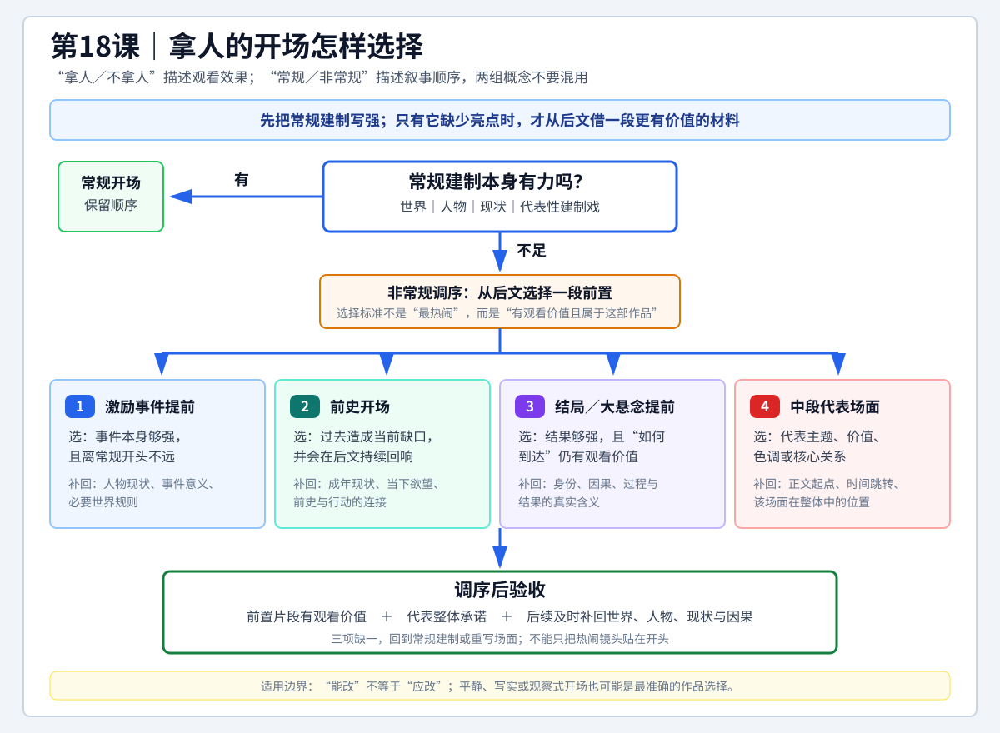

# 查理老师的编剧课 - 第十八课原有学习记录

来源：[[知识库/学习区/课程/查理老师的编剧课/18 - 第十八课 拿人的开场（P40-P41）]]。保存旧整理及学习辅助，不推定为用户亲写、已经理解或完成练习。本页另存原有记录，不激活历史学习任务；独立声画待核与课程图文知识的保存范围分别说明。

## 原状态和归属

原整理日期2026-07-23；复习“待复习”、理解“待理解”、关键问题“不适用”、沉淀“已沉淀”。未见勾选完成的任务或独立个人作答。原稿五项练习、方法框架、图示、主题关联和复习定位均保存；任务存入文本代码块，不激活待办。

原课有选看影视片段的建议，老师口头示范《我不是药神》四种假改并作取舍，但没有逐项布置下文五项练习。“各写三百字”“前史至少三次回响”“开场后五分钟补回”是旧整理规格；短剧、平台首屏、IP吸引力等比较也是整理延伸。原图的三项统一验收、仅在常规不足时才允许调序，以及结局前置必须产生新未知等，是整理者对课程的推广，不冒充逐字原授。原课具体说明提前激励后仍补建制，也比较隐藏死者与直接公开死亡两种方案，应按其各自条件理解。

旧稿中的人物全名、亲属身份、某些片名以及场景补足保留为历史整理；它们不能代替这次原字幕或影片示范的核对。老师清楚的案例照存，待核专名不牵连删除案例。

## 原速览（历史整理）

- 核心问题：开场怎样快速吸引观众，同时仍然完成世界、人物和现状的必要建制。
- 主要结论：“不拿人”不等于不好，“拿人”也不等于必须打乱顺序。若世界、人物、现状或一场建制戏本身足够有力，常规开场同样能抓人；若常规建制缺少亮点，再考虑从后文调来更强的材料。
- 四种非常规方式：把激励事件提前；用有价值的前史开场；把结局或全片大悬念提前；从中段提取一场能代表主题、价值、色调或核心关系的戏。
- 关键要求：调来的片段必须既有观看价值，又能在后续补回被延迟的建制；不能只把热闹镜头贴在开头。
- 适用环节：开场设计、剧集首集、大纲调序、试播集修改、短片前段压缩和成稿开场诊断。

## 原图与读法（历史整理）



> [!tip] 怎么读
> 先问常规建制中的世界、人物、现状或代表性场面是否已经有力；只有答案为“不足”时，才进入四种调序。选定后必须通过底部三项验收，补回被延迟的建制与因果。

> [!note] 适用边界
> “拿人”是效果，不等于必须打乱顺序；非常规开场是调序，不等于自动更好。选择应服从题材、媒介和整部作品的气质，“能改”不等于“应改”。

## 原P40详细导览（历史整理）

P40 最重要的逻辑不是“强开场优于慢开场”，而是把两组概念拆开。拿人／不拿人描述观看效果，常规／非常规描述叙事顺序。一个开场可以常规但很拿人，也可以常规而平静；非常规只是当常规建制缺少亮点时的另一条路。

常规开场仍然围绕世界、人物、现状工作。科幻、动画、历史灾难等作品可能只要把世界呈现清楚就足够吸引；特殊人物可通过一场代表性行动立住；现实题材则能用贫困、职业、家庭和冲突中的具体细节让现状本身产生力量。好的常规开场不是“照章交代”，而是把建制压进有动作、有冲突、有辨识度的场面。

## 原P41详细导览（历史整理）

第一种方法调动幅度最小。激励事件本来就紧接建制，只是把它放到第一场。关键不在“提前”两个字，而在事件本身必须有看头，并且后续要尽快补回人物为什么身处此地、事件为何对他重要。《金氏漂流记》先让中年男人跳江失败，再通过求救电话和回忆交代欠债、分手与家庭失望，激励与建制并没有互相取消。

前史开场适合当前人格、关系或问题确实由过去的一次关键事件造成的故事。它必须是现状的原因、伏笔或价值种子，而不是人物小传影像化。若前史只负责解释“他小时候很惨”，删掉后对当前行动没有影响，就不值得占据开头。

把结局或大悬念提前，是最直接、风险也最大的方式。它把观看问题从“会发生什么”改成“怎样走到这里、画面中的人是谁、这个结果意味着什么”。前置结果必须保留新的未知，否则只是提前剧透。身份遮蔽、因果缺口、过程谜团和价值反差都能重新制造观看动力。

中段代表场面则不一定承担因果谜题。它更像一份作品承诺：提前让观众看见这部戏最终会提供怎样的关系、气质、主题和体验。选择时要问“它是否代表整部作品”，而不是只问“它是否最刺激”。

## 原核心观点（历史整理）

- 不拿人的开场不等于坏开场；强度必须服从题材、媒介、人物和整体气质。
- 拿人／不拿人描述效果，常规／非常规描述顺序，两组概念不能混为一谈。
- 常规建制只要世界、人物、现状或具体场面足够有力，也能抓住观众。
- 非常规开场的本质是调序：从后文借一段更强的材料建立观看承诺。
- 四种调序是激励事件、前史、结局／大悬念和中段代表场面。
- 调序不免除建制；被延后的世界、人物、现状和因果仍要及时补回。
- 开场越非常规，越要确保前置片段与后文有结构关系，而不是独立噱头。

## 原方法与案例（历史整理）

### 一、先判断是否需要“拿人”

1. 当前媒介允许观众多长耐心：影院、长剧、短剧和平台首屏条件不同。
2. 项目是否已有明星、IP、类型或世界观提供初始吸引力。
3. 作品是否主动追求平静、写实、观察式的进入方式。
4. 常规建制里是否已有一场足够有力量的戏。

### 二、常规开场的四个抓手

1. **世界**：奇异规则、历史危机、灾难环境或鲜明社会空间。
2. **人物**：用最有辨识度的行动展示职业、能力、缺陷和气质。
3. **现状**：把人物当前困境写成正在发生的事件，而不是背景说明。
4. **代表性建制戏**：一场同时完成世界、人物、关系、冲突和现状，例如《风骚律师》的法庭败诉。

### 三、四种非常规调序

| 方法 | 选择标准 | 后续必须补回 |
| --- | --- | --- |
| 激励事件提前 | 事件本身强、离常规开头不远 | 人物现状、事件意义、必要世界规则 |
| 前史开场 | 过去事件造成当前缺口并在后文回响 | 成年现状、当下欲望、前史与行动的连接 |
| 结局／大悬念提前 | 结果够强，且“如何到达”仍有观看价值 | 身份、因果、过程和结果的真实含义 |
| 中段代表场面提前 | 能代表主题、价值、色调或核心关系 | 正文起点、时间跳转和场面在整体中的位置 |

### 四、《我不是药神》四路改写练习

- **结局开场**：提前法庭审判或程勇陈述，观看问题变成“他为什么被判、为何认为自己不是为钱”。
- **中段开场**：提前程勇与黄毛被追、驾车冲关的场面，先承诺非法卖药的风险与人物关系。
- **激励事件开场**：把吕受益上门委托代购重写得更有试探、争执、身体危机和人物碰撞。
- **前史开场**：设计童年因药费失去亲人的经历，让“药”成为早期价值种子，并与成年卖保健品形成反差。
- **最终判断**：这些版本技术上可行，但原片的平静建制更符合现实主义气质，因此“能改”不等于“应改”。

## 原适用边界（历史整理）

- 不能因为平台竞争激烈，就默认所有作品都要用死亡、暴力或灾难开场。
- 激励事件提前后仍要交代为什么这件事会改变主角，否则只是无背景刺激。
- 前史只保留能影响当前欲望、关系、选择或主题的部分，避免人物小传式开头。
- 结局提前必须生成新的过程问题；若主要兴趣只在结果本身，提前揭示会耗尽观看动力。
- 中段场面要代表整部作品，不能用与后文气质无关的“假预告”欺骗观众。
- 常规开场有意平静时，不应仅因“还能更猛”就改写。
- 讲者的电影／电视剧和明星判断带有当时媒介环境，应在具体平台、时长和受众条件下重新验证。

## 原可实践练习（历史整理）

1. 给当前故事写一个常规建制版开场，只用一场戏同时交代世界、人物、现状和一个冲突。
2. 分别把激励事件、结局／大悬念和中段代表场面提到开头，各写三百字，比较观看问题发生了什么变化。
3. 若考虑前史开场，列出它在后文至少三次回响；少于三次时，尝试改为一句信息或当前行动。
4. 为每个非常规版本写“开场后五分钟补回什么”，检查调序是否造成理解断裂。
5. 最后把四个版本与原常规版并排，不选最刺激的，选择最符合题材气质和整体承诺的。

## 原主题沉淀（历史整理）

### 已沉淀

- [[知识库/学习区/综合整理/01-故事与剧本/从灵感到完整故事]]：本课相关方法已进入统一主题笔记。

### 待沉淀

- 暂无新增候选；相关内容已并入现有主题。

## 原任务（仅存档，不激活）

```text
- [ ] #复习 不看正文，画出“拿人／不拿人”和“常规／非常规”的二维关系。
- [ ] #创作练习 为当前故事各写一个常规开场和一个非常规开场。
- [ ] #创作练习 检查非常规版本在后续是否补回世界、人物、现状和因果。
```

## 原二刷提示（历史整理）

- `P40 03:54-10:44`：《隐秘的角落》案例及“拿人不等于更好”。
- `P40 10:44-21:21`：媒介、明星条件与《我不是药神》的平静建制。
- `P40 21:29-40:19`：世界、人物、现状和“救猫咪”场面的常规抓手。
- `P40 40:19-50:57`：《风骚律师》怎样用常规顺序同时完成多项建制。
- `P41 00:00-18:19`：激励事件提前及后续补建制。
- `P41 18:19-42:09`：前史开场的用途与新手边界。
- `P41 42:09-52:47`：结局／大悬念提前的机制。
- `P41 52:47-01:17:35`：中段代表场面、四种方式总括。
- `P41 01:17:35-01:26:49`：《我不是药神》四路改写与“能改不等于应改”。

完整原稿与时间线保存在库外原始备份；原课实际内容以复核正文和来源边界为准。
