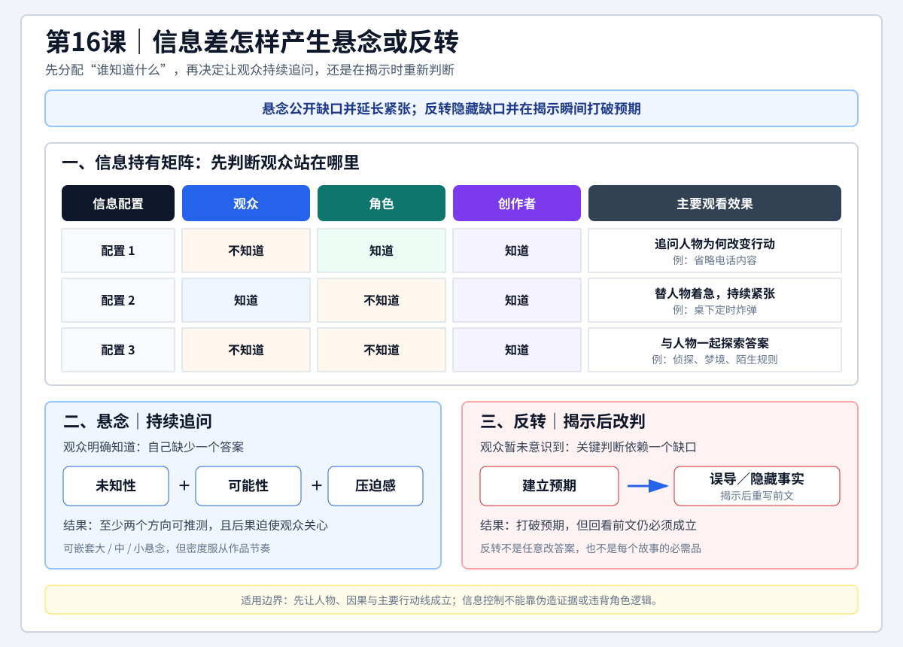

# 查理老师的编剧课 - 第十六课原有学习记录

来源：[[知识库/学习区/课程/查理老师的编剧课/16 - 第十六课 悬念与反转（P38）]]。保存原有整理与学习辅助，不推定为用户亲写或已经实践，也不把旧任务重新加入待办。

## 原状态和归属

原整理日期2026-07-23；复习“待复习”、理解“待理解”、关键问题“不适用”、沉淀“已沉淀”。未见勾选完成的任务或独立的个人作答。原稿的四项实践练习、复习任务、检查方法及延伸边界仍保留。

本次完整读取原课转写，老师只在结尾请大家体会悬念和反转，没有布置下列四项练习或提供标准答案。原稿中的“概率调整”“关系破裂”“伪造镜头/强行遮挡常识”“反转非每个故事必需”“删除反转后检查因果”等属于旧整理延伸；不以合理性代替原授依据。原图也含整理者的因果与证据检查要求，保存为历史教学辅助图。

## 原速览（历史整理）

- 核心问题：怎样在写作前主动制造悬念与反转，而不是写完后再背分类、套类型。
- 主要结论：完整悬念要同时具备未知性、可能性和压迫感；制造悬念的实用入口是安排观众、角色与创作者之间的信息不对称。反转则是先形成预期，再用误导或扣留关键事实打破预期。
- 关键区别：悬念公开地让观众意识到自己“不知道”并持续紧张；反转通常把信息差藏起来，让观众先按既有认识前进，到揭示时才发现预期被打破。
- 使用原则：悬念和反转都在调动、控制观众。创作者必须先让人物、因果和主要剧情成立，再决定何时收紧、放松或改变观众掌握的信息。
- 适用环节：点子扩展、梗概检查、大纲设计、单场戏增压、喜剧预期管理和悬疑结构复核。

## 原图与读法（历史整理）



> [!tip] 怎么读
> 先在上方矩阵中标出观众、角色和创作者各自知道什么，再走下方两条路径：公开缺口并持续施压形成悬念，隐藏缺口并在揭示时打破既有判断形成反转。

> [!note] 适用边界
> 信息差只是一种生成与检查入口。人物、行动和因果尚未成立时，增加误导或扣留信息只会制造混乱，也不能靠伪造证据或角色突然失去逻辑来换取意外。

## 原详细导览（历史整理）

本课不是从“悬疑片有哪些悬念类型”开始，而是先问创作者写到当下能做什么。事后分类可以帮助检查成稿，却不等于生成过程。创作时更直接的入口是：观众现在知道什么，角色知道什么，创作者还扣着什么；这三者一旦重新分配，就会产生未知、焦虑或意外。

悬念不是单纯“不告诉观众”。只给未知而不给可能性，观众会从好奇转为迷茫；只有可能性却没有后果，观众又可以不在乎。未知性负责打开问题，可能性让观众参与推测，压迫感则让这个问题无法被轻易放下。时间倒计时、封闭空间、迫近危险和不祥预示都可承担压迫功能。

反转也不是任意改答案。误导法先让可见证据持续支持一个判断，例如把保护行为包装成冷酷；隐藏法则不主动给错误结论，而是暂不呈现一个能改写人物或事件性质的关键事实。后者通常更柔和，但无论哪种方法，揭示后都应能回看前文并成立。

## 原核心观点（历史整理）

- 编剧能力可以训练；方法、练习和稳定执行比先证明“有天赋”更重要。
- 事后分类适合研究和检查，事前方法要能直接推动当前创作。
- 悬念的三项构成是未知性、可能性、压迫感，缺一项都可能削弱观看动力。
- 悬念的实用底层是信息分配：谁知道、谁不知道、谁以为自己知道。
- 大、中、小悬念可以嵌套，但层级和密度要服务作品节奏。
- 反转是制造并打破预期，常用方法是误导和隐藏关键事实。
- 悬念强调“持续紧张”，反转强调“揭示瞬间改判”；二者都不能牺牲人物和因果可信度。

## 原方法与案例（历史整理）

### 一、悬念三项检查

1. **未知性**：写出观众当前无法回答的具体问题，而不是笼统地“让人看不懂”。
2. **可能性**：至少给出两个有证据支持的方向，并通过新人物、线索或事件持续调整概率。
3. **压迫感**：规定不回答问题会付出的代价，可来自倒计时、封闭空间、生命危险、关系破裂或迫近后果。

### 二、三种信息差

1. **角色知道，观众不知道**：省略电话内容或从结果倒叙，让观众追问人物为什么改变行动。
2. **观众知道，角色不知道**：桌下炸弹、潜伏的背叛者等，让观众比人物多知道一步并替人物着急。
3. **观众和角色都不知道**：侦探、梦境或陌生规则中，双方一起探索，创作者暂时掌握答案。

### 三、反转两种做法

1. **误导**：可见信息被组织成一个看似合理的错误判断，揭示后改变人物善恶、动机或事件性质。
2. **隐藏关键事实**：不伪造证据，只暂扣一个足以改变判断的信息。公交车老太太的真实目的就是本课完整示范。

### 四、层级设计

- 大悬念回答全片核心问题。
- 中悬念维持一个段落、序列或约十五分钟左右的推进。
- 小悬念解决眼前动作，例如“援手能否及时打开车门”。
- 数字是讲者的商业片经验，不应机械变成固定计时表。

## 原适用边界（历史整理）

- 只有未知、没有可推测路径，会把悬念写成信息混乱。
- 只有危险、没有人物欲望和后果，压迫感会变成外加噱头。
- 误导不能依靠伪造镜头、强行遮挡常识或人物突然违背既定逻辑。
- 隐藏的信息必须在揭示后能解释前文，最好还留下可回看的细节。
- 反转不是每个故事的必需品；平稳但可信的推进优于为了意外而破坏因果。
- 先确保故事、人物和主要行动线成立，再使用高强度的信息控制。

## 原可实践练习（历史整理）

1. 从当前故事写出一个大悬念、一个序列悬念和一个单场小悬念，分别标明答案、揭示时点和观看代价。
2. 为同一场戏各做三版：角色多知道、观众多知道、双方都不知道，比较哪版最贴合视角与类型。
3. 选一个反转，把可见事实与隐藏事实分栏；检查揭示前是否会形成预期，揭示后是否仍能解释全部行为。
4. 删除反转再读一次故事：如果人物和因果随即垮掉，说明反转承担了本应由基础剧情承担的工作。

## 原主题沉淀（历史整理）

### 已沉淀

- [[知识库/学习区/综合整理/01-故事与剧本/从灵感到完整故事]]：本课相关方法已进入统一主题笔记。

### 待沉淀

- 暂无新增候选；相关内容已并入现有主题。

## 原任务（仅存档，不激活）

```text
- [ ] #复习 不看正文，默写悬念的三项构成和三种信息差。
- [ ] #创作练习 为当前故事补一条不靠隐瞒常识成立的悬念链。
- [ ] #创作练习 把一个“硬拧答案”的反转改成有前文依据的关键事实揭示。
```

## 原二刷提示（历史整理）

- `18:13-24:52`：事前生成与事后分类的区别。
- `26:35-32:24`：未知性、可能性、压迫感三项构成。
- `35:54-41:45`：三种信息不对称的完整解释。
- `43:39-47:06`：反转定义及误导、隐藏两种做法。
- `47:06-52:09`：公交车老太太案例怎样靠隐藏动机完成改判。
- `56:33-01:00:49`：悬念、反转与观众信任的使用边界。

完整原稿与时间线保存在库外原始备份；本课原授以重新复核的课程正文及其来源限制为准。
