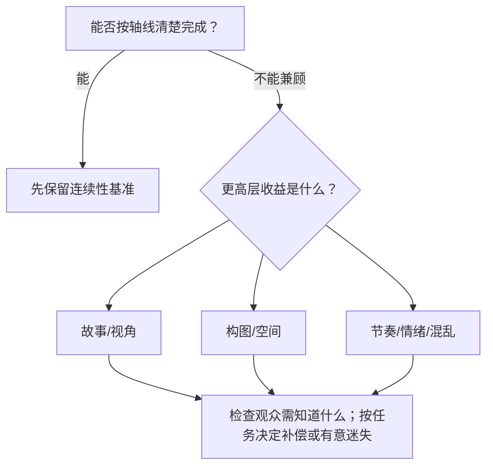

# 老白分镜课第14课历史个人与整理记录

来源：[[知识库/学习区/课程/老白的分镜课/14 - 第十四课 什么时候能跳轴（P15）]]。

原有第一人称的实际作者及是否为小陌作答未由本次确认，不当作本次回答或掌握。原练习/任务封装为代码块，不激活。旧稿已准确将下列流程标为整理者延伸，本次保护这一身份，不将其转成老师的普遍规则；原课实际对脸等知识另保留在正式来源候选。

## 原有学习属性

```yaml
复习状态: 待复习
理解状态: 待理解
关键问题状态: 不适用
```

## 原有个人及学习栏目

```markdown
## 可实践练习

1. 为一个越轴切点写“收益—代价—补偿”三栏。
2. 同一节点设计对脸缓冲、全景重建和直接跳越三版。

## 复习区

### 一分钟核心摘要

讲者主张先掌握不越轴，再在故事视角、构图、节奏或情绪的具体取舍中考虑越轴。首例保留了删去过渡反应的理由和“对脸”演示；《无名》的氛围与分段说法仍是讲者提出的两种可能。整理者的收益、代价和恢复检查表可用于练习，但不替代连续观片，也不把每次越轴都规定为必须立即恢复。

### 自测问题

1. 为什么“加一个过渡反应”有时反而是更差的方案？
2. 如何证明一次越轴在制造混乱，而不是创作者没管理方向？

### 任务

- [ ] #复习 复述三类越轴动机。
- [ ] #创作练习 为现有越轴镜头补写收益、代价与重建点。

## 我的学习提醒

> [!note] 我的理解
> 规则不是枷锁，但没有写清代价和收益的“破规则”也不是表达。

## 二刷时可以重点听

- `00:00-04:22`：为了人物、视角和节奏越轴。
- `06:18-06:59`：听清讲者怎样提出两种“可能”，再区分画面事实与解释。
```

## 原有整理者延伸、示意与使用提醒

````markdown


### 方法

以下是整理者用于练习的五步框架。它把本课实例重组为可比较的决策；不是讲者在本课中列出的检查表。

1. 先画不越轴版本，确认最小过渡成本。
2. 写出越轴带来的具体收益与观众定位损失。
3. 比较收益是否高于代价。
4. 区分本课直接示范与延伸方法：本课展示了转头“对脸”；同向动势、轴上/全景重建、声音桥和段落边界属于整理者保留的延伸候选，需要另查使用条件。声音桥可以联系时间或段落，本身不证明画面左右关系已经重建。
5. 根据后续任务决定何时重建方向；如果本来要保留迷失，记录观众仍需知道的内容，不机械要求每次越轴后立即恢复。

整理者延伸的对应主题：[[知识库/学习区/综合整理/02-导演与视听语言/连续性剪辑与镜头衔接]]。该主题汇合多来源，不能反向当作本集原话。

### 图解：越轴前后观众会失去什么


> [!info] 怎么读
> 这是整理者绘制的教学示意，不是原课截图。可用它比较同侧、直接翻转与带空间线索的三种处理。图中“越轴必须写清”和“没有补偿与恢复点……仍是不完整设计”属于整理者练习要求，不能作为本课讲者已证明的普遍结论；有意保留迷失的段落也不能只凭缺少恢复点判错。真正要检查的是此处需要观众理解什么，以及实际片段是否达到了目标。

- 讲者把追逐方向的混乱、亲密关系的短暂强调列为主动利用越轴的例子，课尾没有宣称列举穷尽。整理者据此建议检查观众还需辨认哪些关系；这不是“任何混乱都必须马上恢复”的定律。来源：`06:59–08:30`。

整理者提醒：如果把这种方法迁移到自己的片段，需要实际检查哪些追逃信息必须可辨；这一使用建议不等于讲者在本例规定了固定的“几镜后恢复”规则。
````
