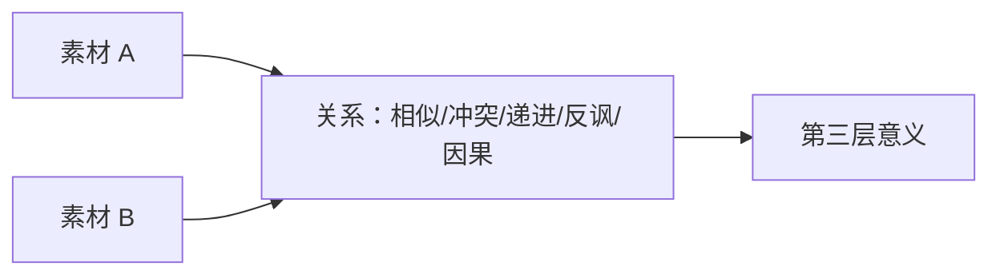

# 老白分镜课第16课历史个人与整理记录

来源：[[知识库/学习区/课程/老白的分镜课/16 - 第十六课 蒙太奇（P17）]]。

这些文字此前存在，作者身份及是否为小陌本人的真实作答未由本次确认；保留不是本次作答、掌握或采用新任务。任务封在代码块，历史复选框不激活。原“相似/冲突/递进/因果”等关系菜单、五步流程及观众有效性标准属于旧整理者归纳，不继续冒充老师本课列出的标准；原课观点已在候选完整保存。

## 原有学习属性

```yaml
复习状态: 待复习
理解状态: 待理解
关键问题状态: 不适用
```

## 原有个人与学习栏目

```markdown
## 可实践练习

1. 用同一中性人物镜头分别接三个对象，写出三种解释。
2. 设计一段不直接展示接触点、却能让观众理解动作结果的 5 镜组。
3. 给同一画面配正配、反配、对位三种声音，说明它们不是情绪标签替换。

## 复习区

### 一分钟核心摘要

蒙太奇的核心不是剪得快，而是让 A 与 B 的关系产生第三层意义。A/B 可以是镜头、画内元素、叙事线、画面与声音或两个声音；先说清关系与要表达的命题，再决定组接。

### 自测问题

1. 为什么带明显“坏笑”的脸不适合充当中性库里肖夫素材？
2. 反配和对位有什么区别？
3. 怎样判断第三层意义是观众可获得的，而不是整理者强行解释？

### 任务

- [ ] #复习 用一句话解释“并置产生第三层意义”。
- [ ] #创作练习 为同一镜头做三种声画关系测试。

## 我的学习提醒

> [!note] 我的理解
> 蒙太奇真正设计的是素材之间的关系，而不是素材数量。

## 二刷时可以重点听

- `04:20-14:57`：从镜头并置扩展到叙事线、声画和声音并置。
```

## 原有整理者框架、方法与图示说明

````markdown
## 核心观点



- 蒙太奇不是快剪同义词；关键是并置关系是否改变解释。
- 库里肖夫式实验要求镜头本身相对中性，否则原有表情已强烈限定意义。
- 镜内前后景、两条叙事线和声画关系都能产生并置，不局限于两个连续画面。
- 正配强化同向情绪，反配制造反差；对位是相对独立的表达线共同作用，不能简化成“悲画面配快乐歌”。
- 手法不替主题说话；先明确要说什么，再选择并置关系。

## 方法与案例

### 方法

1. 分别写出素材 A、素材 B 各自含义。
2. 指定两者关系：相似、冲突、递进、因果、反讽或对位。
3. 写出观众应得到的第三层意义。
4. 检查第三层意义是否依赖必要语境，还是只是整理者过度解读。
5. 用顺序、时长、声音和反应调节含义强度。

### 图解：A 与 B 怎样产生第三层意义


> [!info] 怎么读
> 上半部用同一中性人物与不同对象组接，说明解释来自材料之间的关系；下半部把并置扩展到镜头、叙事线、画面与声音、声音与声音。若第三层意义只能靠创作者额外解释，它还没有真正成立。

### 案例

- 中性脸＋食物/死亡/人物：相邻对象改变对表情的解释。
- 暴力省略：动作、武器、身体局部和声音让观众补全未见事件。
- 仪式与杀戮平行：两条线相互评论，产生道德反讽。
- 画面与音乐：同向、反向与独立对位形成不同情绪层次。
````
