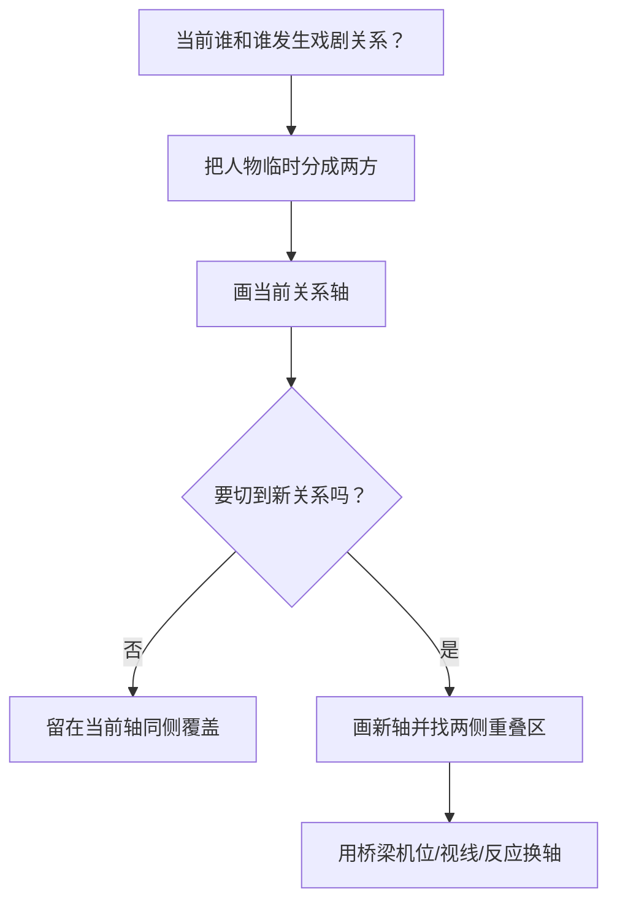

# 老白分镜课第2课历史个人与学习记录

来源：[[知识库/学习区/课程/老白的分镜课/02 - 第二课 轴向（P2-P3）]]。

以下是此前课文中的文字；作者及是否由小陌实际作答未从来源确认，不表示本次作答或新任务。原复选框放代码块内，不激活历史任务；本课原讲的教官场景练习仍保留在课程正文。

## 原有属性

```yaml
复习状态: 待复习
理解状态: 待理解
关键问题状态: 不适用
```

## 旧稿扩展归纳存档

这些通用流程超出本课原讲范围或是整理者概括，保留历史但不作为讲师原话。

````markdown
## 核心观点



- 场景里可能有很多几何连线，但只有当前参与叙事呼应的关系才是切点判断依据。
- “某机位在另一条轴正确侧”并不能自动证明这个切点安全；那条轴必须与上下镜的主体关系有关。
- 字母图形是记忆工具：I 型是双人，L 型是主要对抗加局部互动，A 型是三方独立对峙。
- 更复杂的群像通常不是一次解决全部轴，而是让当前关系逐步接管观众注意。

### 方法

1. 每个镜头旁写“谁与谁/谁与物正在发生关系”。
2. 只为当前关系画轴并标相机侧。
3. 新关系出现时，找同时满足旧轴和新轴的重叠区。
4. 若无理想重叠机位，用看向、反应、人物移动或全景重新建立空间。
5. 检查角色左右、脸向和背景是否让观众错误推断联盟。


````

## 原有学习栏目

````markdown
## 可实践练习

1. 画三人争执的 L 型方位图，设计从“甲对乙丙”切到“乙对丙”的桥梁镜头。
2. 为四人会议标出三次发言转移时真正有效的轴，忽略无关连线。

## 复习区

### 一分钟核心摘要

多人轴线不是几何连线越多越专业，而是随当前戏剧关系切换。先把场上人物临时分成两方，换关系时找同时兼容两条轴的桥梁，让观众知道“现在谁在回应谁”。

### 自测问题

1. 2 号机位与 6 号机位都在某条轴同侧，为什么仍可能接不上？
2. 什么情况下三人应视作“一对二”，什么情况下必须保持三方独立？

### 任务

- [ ] #复习 用自己的话解释“有效轴取决于当前呼应关系”。
- [ ] #创作练习 为三人场景画两条轴和一个桥梁机位。

## 我的学习提醒

> [!note] 我的理解
> 先追踪关系，再追踪轴；不要反过来用轴线图替人物关系做决定。

## 二刷时可以重点听

- P3 `02:38-06:51`：重叠区域与换轴桥梁。

````
