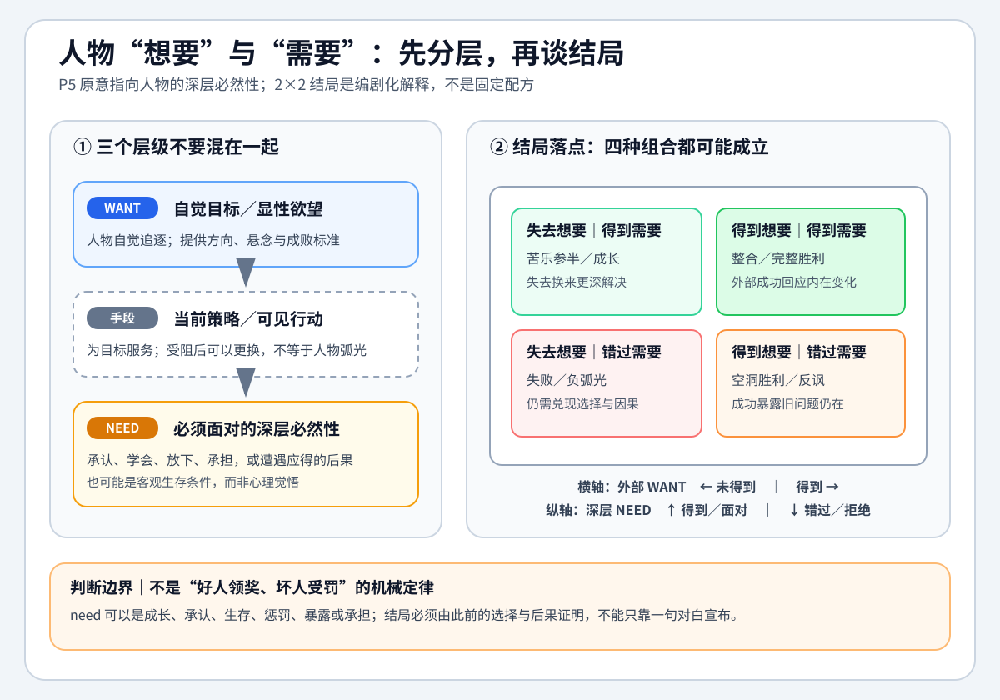

# 讲故事的艺术 - 第五课原有学习记录

来源：[[知识库/学习区/课程/讲故事的艺术/05 - 第五课 故事情节的展开（P5）]]。以下保留原有文字，不判断原作者，也不表示本次测试了理解或掌握。

## 原有“我的学习提醒”

当故事软掉时，先别急着加设定。问角色到底想要什么，谁挡住了他，他愿意为此付出什么。情节不是把事件排队，而是让欲望在压力下发生变化。

把这一课当成写作检查表使用：看视频时记观点，写作时用问题反查自己的草稿。

## 原有状态

- 原稿整理日期：2026-08-06。
- 复习状态：待复习。
- 理解状态：已理解。
- 关键问题状态：不适用。
- 原稿三个任务均未勾选；本次未安排新任务。

## 原有整理扩展：欲望、策略、需要及结局

以下为旧稿原文，保留其历史解释与图示，**不将它们认定为第五课讲师所教的正式模型**。其中对P6、P10、P16的引用是旧稿已有跨课解释，本次第五课复核没有替其他课完成来源验收。旧稿对“for good or for evil”的释义也按历史保留，不据此替本课补造完整结局理论。

> [!quote] P5 `18:00-18:14`，本地英文 ASR
> “Characters always, for good or for evil, get what they need; they do not get what they want.”

中文可理解为：**无论人物为善还是作恶，故事最终让他遭遇的是其深层处境所要求的结果，而不只是照单满足他表面追逐的目标。**

这句话不是要求所有故事都机械地“夺走愿望、赠送成长”，而是在提醒写作者：结局不能只结算任务清单，还要结算人物、选择和主题积累出的必然后果。

### 专业化拆分：先分清三个层级

> [!info] 提炼说明
> “目标—手段／策略—需要”是本笔记为影视编剧调用而做的分层，不是盖曼在 P5 中提出的三个正式术语。盖曼举出的 want 也可以是“学习、长大、救朋友”，并不只指外在或物质目标。

| 层级 | 编剧问题 | 作用 | 例子 |
|---|---|---|---|
| 目标（want） | 人物眼下要达成什么？ | 产生方向、悬念与成败标准 | 救回妻子 |
| 手段／策略 | 他准备用什么办法达成？ | 产生场景动作，可在受阻后更换 | 找药、筹钱、威胁医生 |
| 需要（need） | 为使人物与故事得到真正解决，他必须承认、学会、放下、承担或遭遇什么？ | 连接人物变化、主题与结局 | 学会倾听妻子的意愿；承认爱不是控制；承担自己选择的代价 |

因此，“想救妻子”和“想得到钱”不能简单放在同一层：前者更像总目标，后者通常只是实现目标的策略。只有先分层，才能避免把策略失败误写成人物弧光。

### “需要”不只是一堂温柔的人生课

- P6 的婴儿并不知道自己“需要被照料”，这里的需要首先是客观生存条件，不是心理觉悟。
- P10 的精灵想通过替别人实现愿望维持身份，却需要经历一个拒绝许愿的人，才可能重新认识自己的位置；变化由关系和行动证明。
- P16 谈《Anansi Boys》时再次说，每个人物在结尾得到其需要之物，“甚至那些糟糕的人”；有时他们需要的结果本身也很可怕。这说明 need 也可以是惩罚、崩塌、暴露或被迫面对真相。

### 专业拓展：用四种结局反查自己的故事

下表超出了盖曼字面上的绝对句，用来比较不同叙事可能性，不应被当成他在本课中亲自给出的四象限模型。

| 想要 | 需要 | 常见效果 | 判断关键 |
|---|---|---|---|
| 得到 | 得到 | 完整胜利或整合 | 外部胜利是否由内在改变赢得 |
| 未得到 | 得到 | 苦乐参半、成长型结局 | 失去目标是否换来更深解决，而非作者硬讲道理 |
| 得到 | 未得到 | 空洞胜利、反讽或悲剧 | 成功是否暴露人物仍被旧问题支配 |
| 未得到 | 未得到 | 失败、负弧光或虚无结局 | 失败是否仍兑现了选择的因果，而非随意惩罚 |

### 放到影视编剧里，必须“事件化”

内在需要不能只靠结尾对白宣布。它至少要经过：

1. 人物用旧方法追逐目标。
2. 阻力证明旧方法会伤害关系、自己或目标本身。
3. 人物在压力下作出不可兼得的选择。
4. 结局用行动和后果回答：他仍选择旧方法，还是获得了新的能力或认识。

如果人物没有为新的理解付出选择和代价，“灵魂和解”就只是作者替故事升华。

## 原有扩展方法

以下是旧整理者的应用建议，含本课未逐项规定的做法；仅保存历史，不新增课程要求。

- 给主要角色分别写下“总目标、当前策略、深层需要”，不要把目标和手段混为一谈。
- 为每个场景设置小问题：这一场谁想得到什么？谁阻止他？结果改变了什么？
- 写不下去时，不要只加事件，先检查冲突是否真实存在。
- 用“然后发生了什么”推进表层情节，用“这其实关于什么”检查深层主题。
- 给对手也写 need：结局怎样让他面对自己的本性和选择，而不是只让主角获得成长。

- 开写前写一页“我知道什么”，让大脑发现连接。
- 把主角和对手的欲望写成互斥关系。
- 检查每个转场是否能让读者问“然后呢”。

## 原有扩展练习

本课没有逐项布置以下题目；原文另存，以免正文复核抹去已有整理。

1. 为一个故事写十个连续的“然后呢”，看每一步是否都由前一步的选择和后果引起。
2. 设计两个角色，让他们的目标天然互斥，但两人都不是坏人。
3. 用“总目标—当前策略—深层需要”重写一个人物；至少设计一次策略改变和一次不可兼得的选择。
4. 分别写出同一人物“得到想要却错过需要”和“失去想要却得到需要”的两个结局，比较哪一个更符合前文因果。

[旧稿独特内容去向及完整原文](../../../../.runtime/raw-cache/course-full-review-20260924/batches/story-05/old-unique-and-learning.md)。原附件仍在原课程目录，未移动或改写。
