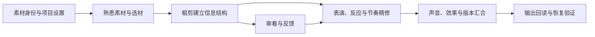

# DaVinci Resolve 20剪辑师指南｜全书总览

## 材料简介

本套是 Blackmagic Design 官方《The Editor’s Guide to DaVinci Resolve 20》的中文知识笔记，作者 Chris Roberts，原书 ©2025。以“从素材到完整交付”组织九章实操：宣传片、剧情场景、多机位、素材管理、AI 辅助、剪辑页特效、声音与输出。

- [官方下载原书 PDF](https://documents.blackmagicdesign.com/UserManuals/DaVinci-Resolve-20-Editors-Guide.pdf) · [官方培训页面](https://www.blackmagicdesign.com/cn/products/davinciresolve/training) · [本书全套练习素材入口](https://www.blackmagicdesign.com/dvres/editors-guide-resolve20)。
- 全书共 **659 个 PDF 页面**；九章正文为印刷 p1–618，对应 PDF 第 24–641 页；书前说明和书末索引另计。
- 已建立 **9/9 章、102/102 个原书二级书签小节的导航**，形成九篇章节笔记、全书总览和一篇跨章知识索引。这是章节与入口覆盖，不代表每个观点、例子和条件都已进入笔记并通过内容复核。
- 所有页面都有可提取文字层，无缺失页面；关键透明度、剪辑关系、功能限制和勘误页面另做视觉核对。没有完整观看或核听配套视频，不以文字提炼代替实操效果。
- 整理方式是按章节组织的中文知识提炼，以保留原理、方法、案例条件、边界、练习与页码为目标；原书大段文字、逐步操作图版不复制进笔记。本轮已补充下列局部案例与方法关系，未对全书内容作逐项完整性结论。

**本次内容复核**：第 3 章印刷 p174–182、185–191 的 12 个诊断内容项，以及第 7 章 p397–403 的 3 个诊断内容项，共 15 项。所用 23 个 PDF 页面正文与配图已核对；复核内容是补镜／连续性取舍、Take Selector、声画反应比较，以及遮罩容器、Alpha/Luma 选择和 Foreground 对应。范围外的章节内容及上述页面未列为诊断项的操作细节，均未在本轮逐项验收。材料能够读取、笔记内容已经复核、配套声画实际有效，是不同的事实。

## 整体结构

前两章先让读者在已组织好的项目中剪出一支宣传片，再学习精修工具。第三、四章分别处理不同 take 的剧情组合与共同时间轴上的多机位剪辑。第五章回头展开项目前期组织，第六章使用代理与文本提高效率。最后三章分别处理画面效果、声音和交付恢复。

这套适合作为剪辑知识的第一套系统资料：既有软件逻辑，又有真实表演、素材和工作流的判断。它不是完整调色、Fusion 或 Fairlight 专著；这些章节外的专业深度留待以后另选整套资料。

## 分章节／分集导览

| 章节 | 印刷页／PDF页序 | 学习结果 |
|---|---|---|
| [[知识库/学习区/书籍/DaVinci Resolve 20剪辑师指南/01 - 粗剪与三点剪辑]] | p1–74／24–97 | 建立可整体审看的信息结构，理解三点剪辑及倒推剪辑。 |
| [[知识库/学习区/书籍/DaVinci Resolve 20剪辑师指南/02 - 精修、替换与版本审看]] | p75–148／98–171 | 根据不变量选择修剪工具，保护版本并组织审看。 |
| [[知识库/学习区/书籍/DaVinci Resolve 20剪辑师指南/03 - 剧情场景、表演选择与声画剪辑]] | p149–196／172–219 | 用真实表演、反应和连续性关系决定剧情场景切法。 |
| [[知识库/学习区/书籍/DaVinci Resolve 20剪辑师指南/04 - 多机位同步与剪辑]] | p197–244／220–267 | 先证明机位同步，再分开决定画面切换和声音来源。 |
| [[知识库/学习区/书籍/DaVinci Resolve 20剪辑师指南/05 - 工程组织、元数据与素材管理]] | p245–322／268–345 | 让工程设置、声道、元数据及媒体组织服务可追溯选材。 |
| [[知识库/学习区/书籍/DaVinci Resolve 20剪辑师指南/06 - 代理、文本剪辑与AI辅助]] | p323–388／346–411 | 用代理和文本工具提高粗剪效率，保留原片与人工判断。 |
| [[知识库/学习区/书籍/DaVinci Resolve 20剪辑师指南/07 - 剪辑页合成、变速与特效]] | p389–474／412–497 | 理解合成、变速和效果顺序，并检查动态结果及可恢复性。 |
| [[知识库/学习区/书籍/DaVinci Resolve 20剪辑师指南/08 - 声音剪辑、同步与混音基础]] | p475–544／498–567 | 组织、同步、平衡声音，避免把参数与归一化当成混音完成。 |
| [[知识库/学习区/书籍/DaVinci Resolve 20剪辑师指南/09 - 多版本交付、字幕与归档]] | p545–618／568–641 | 建立明确交付对象，并用回读和恢复验证实际产物。 |

逐小节的原书名称、印刷页码和可点击 PDF 定位见 [[知识库/学习区/书籍/DaVinci Resolve 20剪辑师指南/10 - 全书知识索引与练习路线]]。章节内部各有中等详细度的整体脉络、全章导览、知识单元、案例与练习、边界和复习区。

## 跨章方法主线

这张图是整理者的跨章归纳；原书章节顺序保持不变。软件按钮服务创作判断，不自动决定好表演、好节奏或正式采用。

## 版本、语言与 Studio 能力

资料基线是 **Resolve 20 官方英文教材**，本套由 Codex 整理为中文，必要英文菜单名保留以便检索。Windows 按实际菜单和默认键位对照；后续小版本界面、轨道控制和快捷键若变化，须查当前界面，不把本书视为所有版本的说明。

| 范围 | 本书中的能力边界 |
|---|---|
| 核心剪辑、素材管理、常用合成、声音与导出 | 可学习一般工作方法；具体编码和硬件能力依本机环境。 |
| 人物分析、SmartSwitch、转录、IntelliScript、AI Music Editor、AI Smart Reframe、AI Speed Warp 等 | 按章节标为 Studio 功能或说明水印、运行限制。 |
| AI Dialogue Leveler、Ducker | 教材明确可用于免费版；不能把所有 AI 功能一概当作付费专属。 |
| 平台响度与编码预设 | 保存书中版本和示例用途，不代表本次核验过的最新平台硬性规范。 |

## 阅读前的准备与练习材料

书前说明见 [PDF 第 11–23 页](https://documents.blackmagicdesign.com/UserManuals/DaVinci-Resolve-20-Editors-Guide.pdf#page=11)，包括作者、适用读者、启动与键位、项目媒体位置及练习文件。原书说明练习素材约 **16 GB**；本次保留官方入口，未下载这套大体积媒体。原始 PDF、文字提取与 QA 缓存保存在知识树的 Vault 外缓存。

实际跟练时，先核对所需 Lesson 工程和媒体，导入 DRP 后重新链接；Catchup 时间线可用于恢复练习进度。导入时间线不等于已经做过这一章，也不提升个人掌握状态。

书末 [Index](https://documents.blackmagicdesign.com/UserManuals/DaVinci-Resolve-20-Editors-Guide.pdf#page=642) 用于查询原书术语与位置；没有把索引条目伪装成新的教学章节。官方考试信息保留在培训页，本次没有参加考试或取得认证。

## 勘误、补充与可靠性

- 第五章印刷 p259 的 `23.076 fps` 与同页截图和相邻正文不符；采用可核对的 `23.976 fps`，原处保留勘误说明。
- 第九章印刷 p601 的 `4–1024` 不照搬为 10-bit 通用范围；基础码值概念、格式保留值与实际编码解释分开，外部核对来源在该章注明。
- 声音电平、EQ、handles、速度及动画长度是案例设置；Foley 分类、声道映射、字幕呈现和跨软件回读边界作单独说明。
- 本套九章与旧主题已有的同一原书链接属于**同源证据**。增加章节笔记、截图核对或多个回链，不构成多个独立来源，也不升级真实制作或用户掌握状态。

## 已融合到知识库

- [[知识库/学习区/综合整理/04-声音与后期/画面剪辑怎样从真实素材选择推进到可锁画候选]]：补充本书具体软件方法和使用条件，保留原主题的跨软件主结构。
- [[知识库/学习区/综合整理/04-声音与后期/AI生成素材怎样建立可追溯身份并通过时间与技术可用性检查]]：补充本书具体软件方法和使用条件，保留原主题的跨软件主结构。
- [[知识库/学习区/综合整理/04-声音与后期/影视成片怎样把画面、声音、字幕与图文汇合为版本冻结、QC通过且可恢复的母版]]：补充本书具体软件方法和使用条件，保留原主题的跨软件主结构。

## 完成范围与未验证项

初次入库已完成九章来源笔记、导航和原书小节入口检查，并对三个既有主题作过普通增补及来源双向链接；这些记录保留。本轮只补充第 3、7 章的上述 15 个诊断内容项，并校正本总览与知识索引的范围说明，没有新增或改写主题。来源层承载材料语境、例子和方法解释，主题层承载已提炼的可复用知识；此前有些案例与条件被压缩，因此不能把小节入口齐全表述成“全书内容已完整保留”。

尚未验证：用户当前软件小版本的逐步复现、配套素材的真实声画效果、个人理解与操作掌握、实际影片应用、目标平台和接收软件的当前要求。它们不影响本套知识归档，但不能被宣称已经完成。

## 复习区

### 一分钟核心摘要

剪辑从可信素材和可回溯工程开始，用完整选材建立结构，再通过表演、反应和节奏精修；代理、AI、效果和声音都服务可判断的作品，最后以实际输出回读与恢复证明交付。

### 关键概念

三点剪辑、四点编辑、Trim、Take、Multicam、Metadata、Proxy、Transcription、Retime、Clip/Track/Bus、M&E、交付回读。

- [ ] #复习 沿九章目录复述从素材到交付的完整链路，指出其中一处最容易把“工具完成”误作“作品完成”的地方。
- [ ] #创作练习 从第3章选择一段正反打练习，以两种反应时机制作候选并记录差异；开始前再取所需官方媒体。

## 关键问题

如果一句对白内容完整、音画也同步，但场景仍显得生硬，你会怎样区分“take 本身不合适”和“反应镜头或声画切点不合适”，并用一个可回退的小改动验证？

此为全书唯一当前内化问题，保持待回答；不要求在本次归档时作答。各章练习是可选自测，不同时向用户发起九轮提问。

## 我的理解、疑问与联想

用户尚未对本书进行本次理解反馈。学习记录保持待理解，不用整理字数和文件数量替代掌握。

## 长期复核入口

[第3章已复核范围](<../../../evidence/sources/resolve20-editors-ch03/review.md>) · [第7章已复核范围](<../../../evidence/sources/resolve20-editors-ch07/review.md>)。这些记录对应本轮15个诊断内容项，保留未核范围；不表示全书已经逐条验收。
