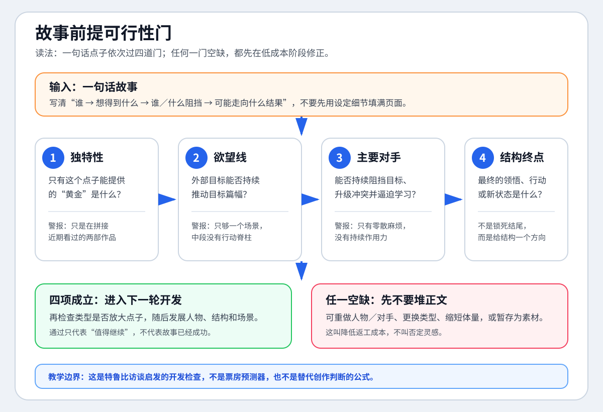
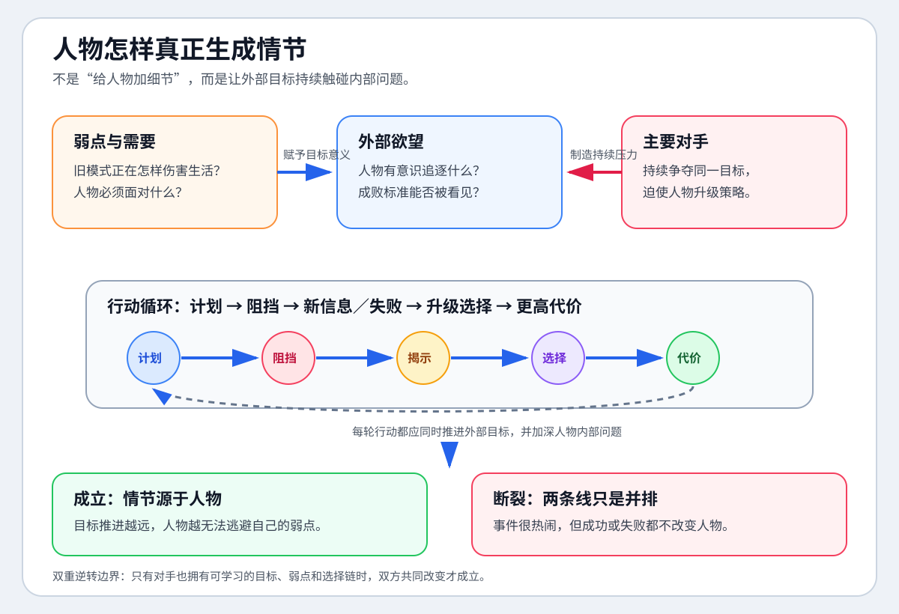
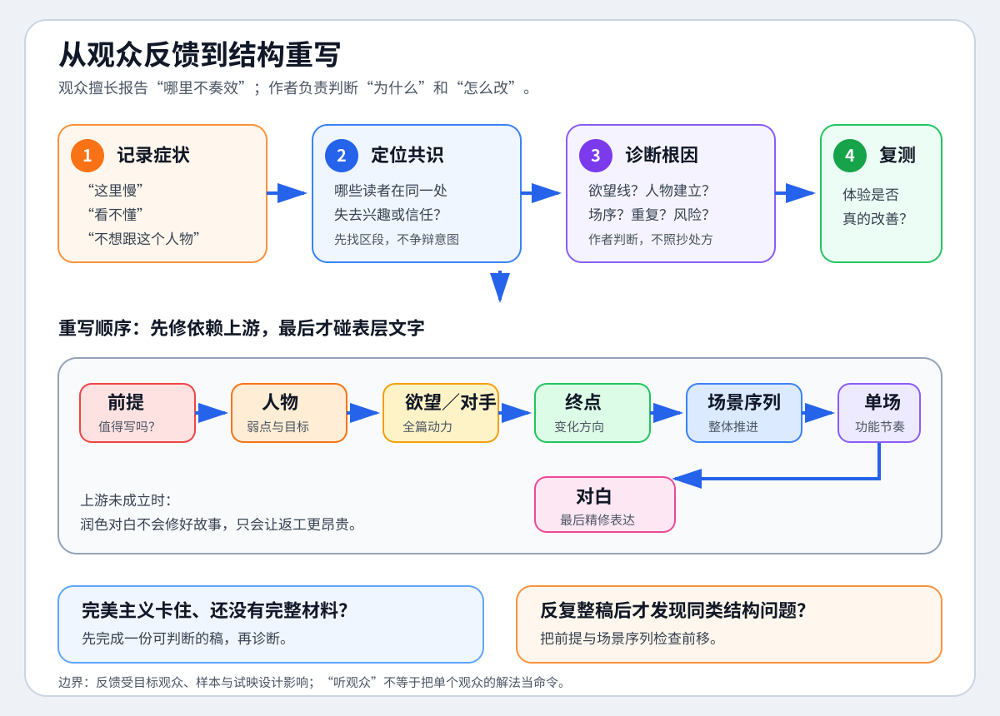

# 约翰·特鲁比《故事解剖》完整专访

视频：[打开 B 站转载视频](https://www.bilibili.com/video/BV14E411W7sf/?p=1)｜[打开 Film Courage 原始访谈](https://www.youtube.com/watch?v=8Q07y1JFeEE)

说明：B 站页面没有中文或英文软字幕。本笔记以完整英文音轨的本地自动语音识别为底稿，逐段翻译、校正并整理为中文；它是学习笔记，不是官方逐字稿，也不保留英文逐字稿副本。关键术语以特鲁比官方资料和出版社资料校正，访谈观点与外部补充已分开标注。

## 速览

- **核心问题**：一个职业编剧怎样从点子、人物和类型出发，建立可持续的故事结构，并通过反馈与重写把它落实到页面上？
- **主要结论**：最昂贵的错误常在前提阶段发生；人物的深层弱点、内在需要与外部目标共同生成情节；类型既提供观众承诺，也要求独特变奏；反馈要从体验症状翻译成结构根因；重写必须先修故事骨架，最后才修对白。
- **学习价值**：把“有点子却写不下去”“人物不吸引人”“收到意见不知道怎么改”拆成可检查的结构问题。
- **适用环节**：一句话故事筛选、故事骨架、人物弧光、场景表检查、试读反馈和结构重写。

## 来源可靠性

- **来源身份**：B 站视频标题、单集时长和内容与 Film Courage 官方上传的完整访谈一致，可高置信认定为同源转载。
- **字幕情况**：B 站字幕轨为零；完整英文音轨经本地自动语音识别，语言识别为英语，内容覆盖到 `01:25:31`。
- **完整程度**：全片共识别 689 个时间段，开头、主题转换和结尾语义完整；两处 3—4 秒空档更像停顿或剪接，没有发现整章缺失。
- **使用边界**：自动识别适合提炼论点和定位时间，不适合制作精确逐字引文；容易误听的人名、书名与术语已用外部资料校正或明确标为待核验。
- **时代边界**：访谈发布于 2013 年，其好莱坞市场、开发资金、电视剧和提案节判断属于约 2012—2013 年的行业语境，不能直接当作 2026 年现状。

## 访谈人物与语境

- 约翰·特鲁比以剧本顾问、编剧教师和《故事解剖》作者的身份回答问题，习惯从大量成片与剧本中归纳可反复训练的技艺。
- 采访者以职业编剧常见困惑推进：看片还是读剧本、怎样理解类型、如何让观众关心人物、怎样听取批评、如何重写、怎样入行。
- 特鲁比的表达带有强烈教学立场。他反对机械公式，却同时坚持存在深层“戏剧语法”；二者并不矛盾，但他的绝对化措辞需要保留为个人主张。

## 一分钟总结

特鲁比把专业故事写作看成“先低成本验证，再逐层落实”的过程：先在故事前提句中确认独特性、欲望线、主要对手和结构终点，再让人物追逐外部目标的过程逼迫他面对深层弱点；选择合适类型，先兑现观众期待，再让每个关键节拍以本故事独有的方式发生。写成场景后，普通观众提供“哪里慢、哪里不信、哪个人物不想跟”的体验症状，作者用结构工具寻找根因。重写从前提、人物、欲望线、对手和场景序列开始，对白与表面润色最后处理。课程只能提供技艺，不能代替长期写作、反馈、心理韧性和页面质量。

## 整体脉络

- `00:00—19:36`｜从看片、读剧本和行业读者进入类型、类型组合与“戏剧语法”，建立故事训练与市场承诺的共同背景。
- `19:36—37:18`｜从人物的弱点、需要和目标解释观众共情，再把批评与试映反馈转译成结构诊断。
- `37:18—53:27`｜讨论前期开发、重写顺序、职业技艺与心理韧性，反对用速成公式代替长期训练。
- `53:27—01:08:41`｜从市场与作者性回到写作障碍、点子筛选、故事前提句、欲望线、主要对手和结构终点。
- `01:08:41—01:19:13`｜用似友实敌、似敌实友和双重逆转说明揭示与主题，再区分可教的技艺和不可速成的艺术。
- `01:19:13—01:25:31`｜回到行业入口：提案只能争取阅读机会，真正能证明编剧能力的是完整剧本和页面质量。

## 时间线笔记

### 00:00—02:56｜看片研究模式，读剧本研究页面节奏

- 特鲁比回忆自己曾连续约三年每天观看两部高水平经典电影，在黑暗中记笔记，寻找伟大故事反复出现的模式。
- 他由此发展出“七个关键步骤”和更细的“二十二步”，并主张它们可以跨篇幅、媒介与类型使用。
- 看片帮助理解“什么样的剧本能成为好电影”；大量读剧本则培养对专业剧本节奏、建制速度和前十页任务的直觉。
- **复看提示**：把“研究成片的故事结构”和“研究剧本的页面推进”分成两种训练，不要只统计看片数量。

### 02:56—07:09｜全球商业片怎样组合古老母型与现代类型

- 他以《饥饿游戏》和《复仇者联盟》说明，大众商业成功不能只归因于明星和特效，剧本必须提供跨文化可理解的故事元素。
- 《复仇者联盟》把神话基础与“全明星梦之队”结合；他把可反复组合、已有全球认知的角色资源称为“人物银行”。
- 《饥饿游戏》把女弓箭手、古老英雄母型等元素装入现代科幻世界；案例重点是“古老故事骨架 + 现代类型外壳”。
- **证据边界**：这些是特鲁比对商业成功的剧作解释，不等于单一因素足以预测票房。

### 07:09—10:28｜类型既是市场语言，也是前提开发工具

- 特鲁比认为类型是长期演化出的故事系统，已内含典型角色、欲望、对手、主题和情节节拍。
- 当代商业片常混合两到四种类型；简单叠加会让不同类型的主人公、对手、欲望线与主题彼此争夺。
- 前提开发早期必须问“这个点子应该由什么类型来发展”；他声称大量剧本不是点子太差，而是选错了发展点子的类型。
- **复看提示**：列出每种类型分别贡献了什么角色功能、冲突和节拍，再判断它们是否服务同一故事脊柱。

### 10:28—14:09｜主流电影、独立电影和电视剧是三套写作生态

- 在当时语境中，他把主流好莱坞电影概括为品牌、系列化、全球市场与类型组合驱动。
- 独立电影更依赖原创前提、独特人物、喜剧感和机智对白；他则把当时电视剧视为娱乐行业中写作质量最高的领域。
- 核心不是给三类媒介排永久高下，而是提醒编剧先识别作品要进入哪一种生产、传播和观众环境。
- **时代边界**：这一段只能作为 2013 年前后的行业观点，当前使用前必须重新研究市场。

### 14:09—19:36｜先完成类型承诺，再逐项超越类型

- 类型的基本节拍让作品进入观众可识别的游戏，但只按惯例写完会得到和别人相似的剧本。
- “超越类型”不是取消类型，而是让每个必需节拍都以观众未见过的方式发生，使期待兑现与惊喜同时成立。
- 他区分深层“戏剧语法”和表面戒律：主人公必须讨喜等说法属于可疑惯例；真正要维护的是故事从头到尾不断累积影响力的深层关系。
- **边界**：看似打破规则不等于没有结构，也不等于所有实验叙事都必须接受同一商业标准。

### 19:36—24:37｜观众关心人物，靠的是弱点与目标

- 堆积习惯、爱好和性格标签只会制造表面细节，不能自动建立人物吸引力。
- 特鲁比把人物连接的核心归纳为两项：深层弱点与需要，以及故事中明确追逐的外部目标。
- 欲望线必须让人物为了目标采取行动，并最终迫使他面对内部缺陷；这就是“情节源于人物”的可操作含义。
- 一个从头到尾都正确、强大且没有内部问题的人，通常没有可供观众体验的变化。

### 24:37—29:26｜有效反馈必须落到故事骨架

- 愿意听取批评是职业成长的必要条件，但亲友、制片人或经纪人的意见不因身份而自动有效。
- 真正可执行的是“结构性反馈”：它能指出故事骨架在哪里失效，以及这个问题如何影响整体推进。
- 特鲁比建议和有经验、能使用相同结构语言的编剧组成写作小组。
- **待核验专名**：采访者提到《写出我心》时，自动识别将作者名误听；本笔记不采用该处精确引文。

### 29:26—37:18｜观众报告症状，作者诊断根因

- 未完成阶段的试映才有修改价值；首映后再指出结构问题通常已经失去返修窗口。
- 普通观众未必会说“人物弱点未建立”，却能可靠报告“这里慢了”“不喜欢这个人物”“这一场不起作用”。
- 作者应记录体验，不争辩意图，再把反应翻译成欲望线、人物建立、场序、重复信息或节奏等可能根因。
- 特鲁比以一部未具名影片为例：团队删除后段约五六场原以为必需的戏，反而恢复了冲向结尾的动力。

### 37:18—43:09｜重写之前，先防止第一稿凝固

- “写作就是重写”容易被误解成第一稿可以毫无准备；他认为第一稿写下后会在作者脑中像混凝土一样凝固，使根本改动更困难。
- 正文前应充分检验故事前提句、人物、结构终点和场景序列；场景序列是进入完整剧本前最后一次低成本看清建筑的问题层。
- 重写按依赖顺序推进：先欲望线和整体结构，再修局部场景，对白往往到第三、第四稿才值得精修。
- **边界**：准备不是要求完美第一稿，而是把最昂贵的结构错误尽量前置发现。

### 43:09—48:34｜编剧失败常败在低估技艺和心理成本

- 他把叙事写作描述为需要长期投入的复杂技艺，反对几步成功的“魔法子弹”。
- 他非常尖锐地否定简化三幕结构，认为它不足以支撑专业写作；同时强调情节技术远比多数初学者想象得复杂。
- 另一类门槛是心理承受力：长期独处、面对空白页面、持续被拒绝并在多年内看不到确定回报。
- **证据边界**：“世界上最难的技艺”等说法属于价值判断；对三幕式的批评也不能代表所有三幕理论只有机械页码公式。

### 48:34—53:27｜真正的抗拒绝能力来自持续学习

- 在固执和麻木之间，他更看重保持开放、持续扩充技艺工具箱。
- 建立在结构判断上的信心，使作者可以面对主观拒绝，而不必把所有否定都解释为自己毫无能力。
- 很多作者把失败归因于缺少人脉，却在机会出现时拿不出成熟剧本；连接只能打开门，页面质量决定能否继续。
- 越进步，作者设定的标准越高，因此专业成长不会让故事开发自动变轻松。

### 53:27—57:09｜不要追逐热点，要在市场框架内保持作者性

- 从写作、开发到生产的周期很长，预测短期热门题材几乎不可控。
- 类型元素可以帮助作品抵达大众，但市场意识不等于写成机械、通用、没有个人意义的剧本。
- 值得投入的故事应同时满足两个条件：作者真正关心，并且有可能和更广泛的观众连接。
- **区分**：理解稳定的观众承诺，与猜测短期潮流不是同一件事。

### 57:09—01:00:03｜写作障碍可能提示故事尚未被理解

- 特鲁比常把写作障碍解释为作者尚未找到这个故事独有的结构，而不只是情绪或灵感不足。
- 重新进入故事的入口是主人公：他有什么独特之处，作者为什么对他着迷，为什么非讲这个人的故事不可。
- 当人物的变化过程重新具体，新的场面和写作动力往往随之出现。
- **边界**：健康、照护压力、经济困境、创伤和职业倦怠也会造成写作障碍，不能把所有卡点都归为结构问题。

### 01:00:03—01:04:47｜先决定哪个故事值得写，再决定怎么写

- 先确认点子具备基本受众潜力，再寻找只有这个点子才能提供的“黄金”，即它不可替代的独特价值。
- 把两部近期电影拼在一起不等于原创；若前提本身没有独特性，后续技巧很难完全补救。
- 成熟开发的成果之一，是尽早淘汰结构上不可持续的点子，用低成本前提测试代替数月无效写作。
- 他把“我究竟写哪个故事”置于“我怎样写”之前。

### 01:04:47—01:08:41｜前提可行性的三项快速测试

- **欲望线**：是否有一个外部目标，足以让人物的行动贯穿完整篇幅？
- **主要对手**：是否有一个能够持续阻挡目标、升级冲突并逼迫人物学习的对手？
- **结构终点**：是否知道故事最终走向什么人物领悟、行动结果或新状态，从而给其他步骤一个方向？
- 预先知道终点不等于不能改变；结构脚手架的价值是让创意变化有支撑，而不是锁死答案。

### 01:08:41—01:13:04｜中间人物制造揭示，双重逆转生成主题

- 似友实敌与似敌实友位于明确盟友和明确对手之间，身份信息的变化可以持续制造揭示。
- 他以斯内普为例：角色在盟友与对手的表象之间摆动，为《哈利·波特》系列长期提供悬念。
- 双重逆转是主人公与主要对手都在结尾学习并改变；爱情故事尤其常用，因为关系双方都需要重新理解自己和对方。
- 当双方各自吸收对方更好的部分，最终综合出的生活立场可以承载作者主题；前提是对手不只是不会学习的扁平反派。

### 01:13:04—01:19:13｜技艺可以教，艺术不能速成

- 采访者引用弗兰克·德拉邦特对速成编剧产业的批评；特鲁比基本赞同，尤其反对凭公式承诺短期卖出剧本。
- 他的自我定位是：不能教授“艺术”，但可以教授面对具体页面问题时可操作的技艺。
- 他也反对把所有课程一概判为无用；很多成功作者掌握真实技巧，只是可能通过天赋与长期实践默会地获得。
- **待核验**：德拉邦特引语和原网站出处不用于精确引用，只保留访谈中的论证作用。

### 01:19:13—01:25:31｜入行最终仍靠完整剧本，而不是点子推销

- 在当时行业语境下，他认为 2008 年经济衰退后开发资金减少，使剧本期权和受雇开发路径更困难。
- 提案节最多可能换来一次阅读剧本的机会，不应被理解为现场出售点子；参加前必须已有能证明能力的完整剧本。
- 被拒也可能来自题材或商业方向不匹配；作者真正能控制的是页面上的写作质量。
- “不用担心点子被偷”表达的是执行远比点子昂贵，不等于作者无需保存创作记录、理解合同或维护版权证据。

## 核心观点总览

| 观点 | 访谈中的论证 | 可调用的判断 |
|---|---|---|
| 结构不是外加模板 | 人物弱点、目标、对手、揭示与改变形成因果组织 | 先检查关系是否互相逼动，再检查形式是否整齐 |
| 情节源于人物 | 外部目标迫使人物面对深层弱点 | 每条主行动都应同时推进目标并触碰人物问题 |
| 类型是承诺，不是答案 | 类型提供必需节拍，超越类型要求独特实现 | 先列不可缺的体验，再为每个节拍寻找本故事的做法 |
| 最昂贵的错误在前提阶段 | 欲望线、对手或终点不足会让长篇中途失去动力 | 一句话故事未通过可行性测试时，不急着写正文 |
| 反馈先是体验症状 | 观众能感到慢、困惑或人物失效，但未必知道根因 | 记录症状，寻找共识，再由作者诊断和选择修法 |
| 重写必须先上游后下游 | 第一稿会凝固；对白润色无法修复欲望线和结构 | 前提、人物、欲望线、对手、终点、场序、单场、对白依次检查 |
| 职业凭证是页面质量 | 推介与人脉只能争取阅读机会 | 先完成一部足以代表能力的剧本，再谈入口与曝光 |

## 关键概念

- **故事前提句（premise line）**：把主人公、核心行动和故事基本结果压缩为一句可检验的前提，不等同于只负责营销的宣传语。
- **欲望线（desire line）**：主人公有意识追逐的外部目标及其连续行动，是故事从头到尾的外在脊柱。
- **弱点与需要（weakness and need）**：正在破坏主人公生活的内部问题，以及故事要求他面对或改变的部分；不能与外部欲望合并。
- **对手（opponent）**：阻挡同一目标、迫使主人公改变策略并学习的人物或力量，不等同于道德上邪恶的反派。
- **戏剧语法（grammar of drama）**：让人物、行动、冲突、揭示与改变持续累积影响力的深层关系，不是按页码填空的公式。
- **类型节拍（genre beats）**：某类故事向观众承诺的关键体验节点；“超越类型”是在兑现这些节点的同时做独特变奏。
- **结构性反馈（structural criticism）**：把体验问题定位到故事骨架及其连锁影响，而不是只评价喜恶或直接代写解决方案。
- **似友实敌／似敌实友**：处于盟友与对手之间的中间人物，通过身份信息变化制造揭示。
- **双重逆转（double reversal）**：主人公与主要对手都在结尾学习并改变，使主题由双方关系共同生成。

## 方法与案例

### 三张核心教学图

#### 1. 一个点子何时值得进入正文

**怎么读**：从一句话点子开始，依次检查独特性、欲望线、主要对手和结构终点。四项成立才进入下一轮；空缺时先调整人物、类型或体量，不用正文数量掩盖前提问题。

**边界**：这是一道开发门，不是票房预测器，也不替代创作者对题材价值的判断。

#### 2. 人物怎样真正生成情节

**怎么读**：弱点与需要赋予目标意义，外部欲望提供行动方向，主要对手持续施压；每轮计划、阻挡、揭示、选择和代价都应同时推进目标并触碰内部问题。

**边界**：稳定人物、负弧光和实验叙事可以选择不同变化模式；关键是作品自己的因果承诺一致。

#### 3. 观众反馈怎样变成重写动作

**怎么读**：先记录观众体验症状，再寻找共识区段、诊断结构根因；重写按前提、人物、欲望与对手、终点、场景序列、单场、对白推进。

**边界**：反馈会受目标观众、样本和试映设计影响；相信症状不等于照抄处方。

### 方法一：故事前提可行性门

1. 用一句话写出主人公、外部目标、主要阻力和可能结果。
2. 圈出真正独特的部分；如果只是在复述近期作品，先继续探索或淘汰。
3. 检查欲望线能否持续推动完整篇幅，而不是只够一个场景或短桥段。
4. 检查主要对手是否有能力、理由和持续行动与主人公争夺同一目标。
5. 写出暂定结构终点：人物最终学到什么、作出什么决定、世界进入什么新状态。
6. 选择能放大点子而不是把它压扁的主类型；混合类型时分别列出其角色、欲望和节拍贡献。
7. 三项结构条件仍空缺时，不用场景数量和对白热闹掩盖前提问题。

### 方法二：人物—情节因果检查

1. 主人公当前生活被什么深层弱点破坏？
2. 他有意识追逐的外部目标是什么？
3. 为什么追逐目标的每一步都会逼近这个弱点，而不是与之平行？
4. 对手怎样同时阻挡目标、迫使主人公升级行动并挑战其价值判断？
5. 结尾的改变是否由此前行动、失败、揭示和代价逐步累积？

### 方法三：类型创新检查

1. 识别作品的主类型与辅助类型。
2. 为每种类型列出观众必须得到的核心体验，而不是机械收集所有惯例。
3. 检查不同类型的主人公、对手、欲望线和主题能否汇入同一故事脊柱。
4. 对每个必需节点追问：只有这个人物、这个世界、这个关系才能怎样实现它？
5. 删除表面设定后再看，创新是否仍来自因果、选择和代价。

### 方法四：把反馈从症状翻译成结构根因

1. 原样记录“慢、无聊、看不懂、不喜欢人物”等体验，不辩解创作意图。
2. 标出多个反馈共同指向的时间段、场景或人物关系。
3. 分开“症状位置”“推测根因”“别人给的处方”，三者不自动相同。
4. 依次检查欲望线、人物建立、场序、重复信息、风险升级和场面任务。
5. 由作者基于作品目标选择最小修法，再让读者复测体验是否改善。

### 方法五：结构重写顺序

1. 故事前提与是否值得继续开发。
2. 主人公的弱点、需要与外部目标。
3. 欲望线与主要对手。
4. 结构终点及主人公改变。
5. 场景序列与整体推进。
6. 单场功能、信息和节奏。
7. 对白与表层表达。

### 案例索引

- **《复仇者联盟》**：神话基础、梦之队结构与可组合的“人物银行”。
- **《饥饿游戏》**：古老英雄元素与现代科幻类型的组合。
- **《哈利·波特》中的斯内普**：中间人物如何长期提供似友实敌／似敌实友的揭示动力。
- **爱情故事**：双方都能学习时，双重逆转让主题从关系中生成。
- **未具名试映影片**：删除后段五六场戏后，结构信息没有损失，结尾推进反而增强。

## 官方术语补充

> [!info] 外部术语校正
> 以下内容用于校正访谈中提到但未逐项展开的术语，不应倒推为访谈逐字讲解。

特鲁比官方资料把七个关键结构步骤列为：**弱点与需要 → 欲望 → 对手 → 计划 → 对决 → 自我领悟 → 新平衡**。其中“需要”是人物必须面对的内部问题，“欲望”是人物有意识追逐的外部目标；二者分开，才能检查外部行动是否真正逼出内部变化。

## 关键主张与证据边界

| 主张 | 当前证据状态 | 不应误解为 |
|---|---|---|
| 七步／二十二步存在于每个伟大故事 | 特鲁比的强结构主义教学主张 | 已被普遍证明的客观定律 |
| 大量剧本败在前提，场景序列能发现大部分问题 | 访谈中的经验性强调，未提供统计研究 | 可精确外推的失败率或诊断率 |
| 简化三幕结构在专业层面无效 | 针对机械套点的强烈批评 | 所有三幕理论都只有页码公式 |
| 观众不喜欢就是作者的问题 | 反对解释和推责的职业警句 | 目标观众错配、样本偏差和试映设计永远不存在 |
| 写作障碍多来自结构未理解 | 特鲁比常用的诊断起点 | 健康、经济、照护、创伤和倦怠不影响写作 |
| 提前确定终点提高创造力 | 适合规划型写作和多数商业叙事 | 实验作品或探索型作者只能先锁死结尾 |
| 不必过度担心点子被偷 | 强调执行成本高于点子本身 | 无需保存创作记录、理解合同或维护版权 |
| 好莱坞市场、电视剧和提案节判断 | 2013 年前后的行业观点 | 2026 年仍确认有效的市场规则 |

## 外部补充与分歧

- `[外部补充，检索于 2026-08-13，原始来源]` [Film Courage 官方完整访谈](https://www.youtube.com/watch?v=8Q07y1JFeEE)用于核验标题、发布方与总时长。
- `[外部补充，检索于 2026-08-13，作者官方]` [特鲁比《故事解剖》课程页](https://truby.com/anatomy-of-story-audio-class/)用于校正七个关键阶段、二十二个结构模块和类型术语；页面中的课程效果与学员规模属于官方自述。
- `[外部补充，检索于 2026-08-13，出版社资料]` [麦克米伦《故事解剖》书页与节选](https://us.macmillan.com/books/9781429923705/theanatomyofstory/)用于校正故事前提、人物关系网、道德论证、故事世界、象征网络和场景织体等术语；这些书中概念不等于访谈全部详细讲过。
- `[外部补充，检索于 2026-08-13，作者官方]` [特鲁比写作软件手册](https://truby.com/software/bb6_manual.pdf)把二十二步称为“戏剧语法”而非公式，可用于理解他为什么同时反对机械模板、又坚持深层结构。
- 一份非官方英文自动稿可辅助校对内容顺序，但无时间码且误识别较多，本笔记不把它当作官方字幕或独立证据。

## 主题沉淀

### 已沉淀

- [[知识库/学习区/综合整理/01-故事与剧本/从灵感到完整故事]]：补入故事前提可行性门、欲望线—主要对手—结构终点三项检查，以及类型作为点子发展工具的边界。
- [[知识库/学习区/综合整理/01-故事与剧本/从人物共情到人物弧光]]：补入弱点与需要—外部目标的因果关系、对手的结构职责，以及双重逆转对关系弧光的要求。
- [[知识库/学习区/综合整理/01-故事与剧本/从写作困境到编辑完成]]：补入反馈症状与结构根因分离、场景序列的前置价值和由上游到对白的重写顺序。

### 待沉淀

- **类型组合与超越类型**：当第二个独立来源或真实项目能够验证类型节拍怎样被独特实现时，再判断是否融入现有类型主题。
- **中间人物与双重逆转**：当前先保留在来源笔记，避免仅凭一个访谈过早拆成空主题。

## 复习区

### 一分钟核心摘要

先在故事前提句中验证独特性、欲望线、主要对手和结构终点，再让人物追逐外部目标的过程逼迫他面对深层弱点。类型负责承诺观众要得到什么，创意负责让这些节点只属于当前故事。反馈先记录体验症状，再由作者寻找结构根因；重写从前提、人物和欲望线开始，场景与对白后置。课程只能提供技艺，真正的职业凭证仍是长期训练后落在页面上的完整剧本。

### 关键概念

- 故事前提句与前提可行性门
- 弱点与需要、欲望线、主要对手
- 戏剧语法与机械公式的区别
- 类型节拍与超越类型
- 结构性反馈与症状—根因分离
- 场景序列与结构重写顺序
- 中间人物、揭示与双重逆转

### 自测问题

1. 为什么“有一个有趣点子”还不足以开始写长篇剧本？
2. 弱点与需要、外部欲望、主要对手分别怎样共同生成情节？
3. “兑现类型承诺”与“超越类型”为什么不是互相排斥？
4. 普通观众的反馈为什么既值得听，又不能直接当作修改处方？
5. 为什么对白应该在结构重写的后段处理？
6. 特鲁比反对机械三幕式，却坚持戏剧语法，这两个立场怎样同时成立？

### 任务

- [ ] #复习 不看笔记，用一分钟复述“前提可行性门”的三项核心检查。
- [ ] #复习 选择一条观众反馈，把体验症状、可能根因和修改处方分成三栏。
- [ ] #创作练习 为当前一个故事写出弱点与需要、外部欲望、主要对手和结构终点，检查四者是否互相逼动。

## 我的学习提醒

> [!note] 我的理解
> 先不把“结构”理解成格式；优先检查人物为什么非行动不可、谁能持续阻挡他、追逐目标为什么会逼出内部变化，以及结尾怎样回收这条因果链。

## 关键问题

> [!question] 本材料当前只保留一个最值得回答的问题
>
> 如果只能在写正文前检查一遍，你会怎样用“欲望线—主要对手—结构终点”判断一个点子值得继续开发，而不是只凭自己对设定的兴奋？

## 二刷时可以重点听

- `19:36—24:37`：弱点、需要与目标怎样建立人物连接，并让情节从人物中生长。
- `29:26—34:21`：普通观众反馈怎样被翻译成场序与节奏问题。
- `37:18—43:09`：第一稿凝固、场景序列和结构优先的重写顺序。
- `01:04:47—01:08:41`：欲望线、主要对手与结构终点的前提测试。
- `01:08:41—01:13:04`：似友实敌、斯内普案例和双重逆转。
