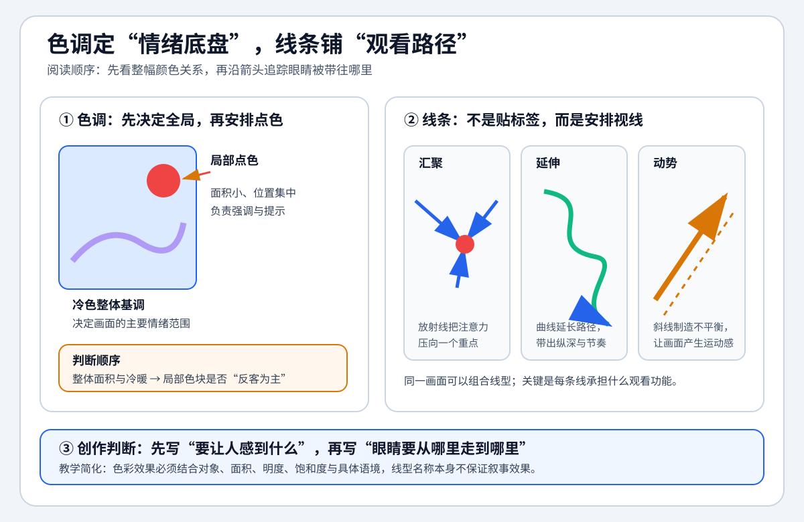

# 中国传媒大学《视听语言》 - 第七章 色调与线条

> 导航：[[知识库/学习区/课程/中国传媒大学《视听语言》/00 - 课程总览]]｜[[中国传媒大学《视听语言》]]

视频：[P24 7.1影像语言的画面构成——色调](https://www.bilibili.com/video/BV1dE4118731?p=24)｜[P25 7.2影像语言的画面构成——线条](https://www.bilibili.com/video/BV1dE4118731?p=25)  
说明：本笔记按第七章“色调与线条”语义单元聚合 P24-P25，根据本地 ASR 整理，不是官方逐字稿；案例专名与少数构图名称以原视频画面为准。

## 本课速览

- 核心问题：如何用整体色调和画面线条，在观众尚未进行理性判断前就建立情绪、空间与观看方向？
- 主要结论：色调负责全画面的色彩基调和潜在情绪，局部色块负责点醒重点；线条则把现实对象抽象为方向、汇聚、稳定、动感和纵深等形式力量。
- 学习价值：从“挑好看的颜色与构图”转向“根据叙事功能选择冷暖、饱和度、点面关系和线条结构”。
- 适用环节：色彩脚本、美术与服装配色、场景设计、镜头构图、调色和 AI 静帧提示词设计。

## 直观教学图与趣味理解

> [!tip] 怎么读
> 先看左侧整体色调与局部点色的分工，再沿右侧箭头观察线条如何汇聚、延伸或制造动势。图中颜色与线型是教学简化，实际效果仍取决于具体对象、面积、明度、饱和度和语境。

> [!example] 教学延伸（Codex 综合，不是课程原话）
> - **反直觉点**：画面里最亮、最艳的颜色不一定决定色调；它可能只是面积很小的点色，真正的情绪底盘仍由全画面的色彩关系决定。
> - **一分钟实验**：随手找一张静帧，先眯眼只判断最大的冷暖色面，再用手指沿主导线移动一次；分别说出“情绪底盘”和“视线终点”。
> - **创作口诀**：先定面，再落点；先找线，再走眼。

## 来源可靠性

- 信息来源：Bilibili 视频本地 ASR（faster-whisper base，按语境校正）。
- 完整程度：P24-P25 均覆盖至课程总结，定义、案例和功能归纳完整。
- 待核验：P24 最后一张寺庙照片的标题；P25 “V 字形／一字形”构图与末例照片标题的 ASR 听辨。
- 外部补充：无；色彩象征均按课程语境记录，不扩展为普遍心理定律。

## 分集脉络

- **P24｜色调**：从整体基调、局部色块、冷暖、饱和度和时空区分五个层面说明色调如何影响主题与情绪。
- **P25｜线条**：把线条作为形式要素，比较放射、曲线、斜线、S 形、三角、圆形和纵深型构图的造型功能。

## 时间线笔记

### P24｜7.1影像语言的画面构成——色调

- `00:11-01:24`｜色调不是某个色块，而是全画面的整体色彩基调；它以隐性的直觉刺激影响主题、情绪和形式感。
- `01:29-04:03`｜《祖国山河一片红》与幼儿休息室蓝色环境的对比说明：颜色必须与具体景物和语境结合，色调先作用于视觉感知，再引导观众理解。
- `04:05-06:09`｜黑白灰“消色”画面中的红玫瑰、沉睡儿童红衣，说明整体色调与局部色块分工不同：前者规定氛围，后者成为点睛和生命力提示。
- `06:11-07:35`｜亚马孙雨林的冷色环境因暖色斜阳获得清爽与生机；纯冷色雪山则更寒冷。冷暖搭配建立点与面之间的对比。
- `07:37-08:23`｜非洲草原的低刺激暖黄与高刺激红色对比表明：同为暖调，饱和度和明度差异也会把情绪导向温暖或躁动。
- `08:23-09:40`｜山上寺庙暖光与山下城市冷光形成空间区分；课程最终把色调功能归纳为情绪引导和时空调度。照片标题的 ASR 专名待核验。

### P25｜7.2影像语言的画面构成——线条

- `00:12-01:42`｜线条是画面构成中形式属性最强的要素；分类不是目的，重要的是从现实中抽离线条，并在拍摄前形成“线条谋略”。
- `01:46-03:18`｜仰拍树林形成从四周向中心汇聚的放射线，也可反向发散；放射结构能集中视线或制造爆发感。
- `03:19-04:44`｜沙漠、月牙湾和弯曲道路的曲线带来柔和、活泼和温暖，打破直线的机械与僵硬。
- `04:47-06:27`｜斜线／对角线构图既利用矩形中最长的线容纳主体，也以不平衡制造运动和灵动感。
- `06:30-08:27`｜S 形长城通过弯曲延长视觉路径、拓展纵深；建筑工人与楼体构成三角形，在倾斜张力和三角稳定之间重新取得平衡。
- `08:29-11:56`｜圆形／O 形可汇聚或发散；悉尼大桥用直曲结合与斜线产生质感和动感；纵深型构图若过于板正，可移动汇聚点并结合斜线。课程末例把多种线型与色调组织在同一画面，具体照片名与“V 字形”术语待对照画面。

## 核心观点

- 色调是全局关系，不等于画面里最醒目的颜色；判断时要看色彩在全画面的面积、明度、饱和度和冷暖分布。
- 色彩没有脱离语境的固定意义；同一红色可因对象、面积和饱和度产生喜庆、生命力或躁动等不同效果。
- 局部色块必须服从整体基调，并以点对面的关系承担重点、反差或叙事提示。
- 线条不是给对象贴上“S 形”“三角形”标签，而是决定视线如何移动、空间怎样展开、画面稳定还是不稳定。
- 好构图往往组合不同线型：直线提供秩序和纵深，曲线提供柔和与生动，斜线提供动感，闭合或放射结构提供汇聚。

## 方法与案例

### 方法

1. 先写出场景要传递的核心情绪和空间关系，再决定整体冷暖与饱和度，不从“喜欢什么颜色”出发。
2. 将画面转成灰度与色块图，确认哪个是整体基调、哪个是局部点色，避免点色面积过大反客为主。
3. 对冷色主调加入一处暖色或反之，检查这处对比是在强调主体、划分空间，还是无目的制造艳丽。
4. 在取景器中把对象简化成线：先识别主导方向，再判断需要汇聚、发散、纵深、稳定或动感中的哪一种功能。
5. 通过改变机位而非只移动主体，寻找同一场景的放射、斜线、曲线或三角关系。

### 案例

- 红调历史照片、蓝色休息环境、消色画面加红色点缀：整体基调与局部色块的差异。
- 雨林暖光与纯冷雪山：冷暖搭配对“清爽／寒冷”的影响。
- 放射树林、沙漠曲线、斜线队伍、S 形长城、三角建筑：不同线条结构的功能对照。
- 悉尼大桥与末例复合构图：直线、曲线、斜线、纵深和色调可以协同，而非互相排斥。

## 可实践练习

1. 给同一静帧制作三版色彩脚本：低饱和暖调、高饱和暖调、冷调加暖色点缀；只描述情绪差异，不先评“好看”。
2. 从一部影片截取五帧，分别画出主导线条和观众视线运动箭头，判断线条承担的叙事功能。
3. 在同一场景内仅改变机位，拍出放射、斜线、S 形／曲线三种构图，比较空间与节奏感。

## 主题沉淀

### 已沉淀

- [[知识库/学习区/综合整理/03-摄影美术与现场制作/影视色彩怎样区分资产本色、光源影响与最终Look并保持连续性]]：吸收整体色调与局部色块的层级、冷暖与饱和度的叙事作用，以及点面关系怎样建立画面重点。

### 待沉淀

- 线条构图的功能选择：用于把放射、曲线、斜线、S 形、三角和圆形从形式标签转成创作决策。

## 复习区

### 一分钟核心摘要

色调决定整幅画面的情绪底盘，点色负责局部强调；线条决定观看路径和空间组织。两者都不是独立装饰，而是主题、情绪、时空和节奏的形式化表达。

### 自测问题

1. 色调与色块的判断标准分别是什么？
2. 为什么同样的暖调会产生温暖或躁动两种感受？
3. 放射线、斜线、S 形和三角构图分别怎样控制视线与稳定性？
4. 什么时候应该组合直线与曲线，而不是追求单一线型？

### 任务

- [ ] #复习 为 P24 的五组案例分别写出“整体基调—局部点色—情绪结果”。
- [ ] #复习 不看笔记画出六种线条构图，并写出各自的核心功能。
- [ ] #创作练习 为当前项目的一场戏制作一张色调板和一张线条动势草图。

## 我的学习提醒

> [!note] 我的理解
> 先写情绪和观看方向，再选色调与线型；若只写“电影感蓝橙”“S 形构图”，仍然没有说明为什么这样设计。

## 二刷时可以重点听

- P24 `03:39-04:03`：色调为什么通过直觉刺激而非概念解释起作用。
- P24 `06:11-08:23`：冷暖搭配与饱和度如何共同改变情绪。
- P25 `01:46-03:18`：放射线的汇聚与发散两种方向。
- P25 `09:06-11:56`：复合线条构图与纵深型构图的调整方法。
