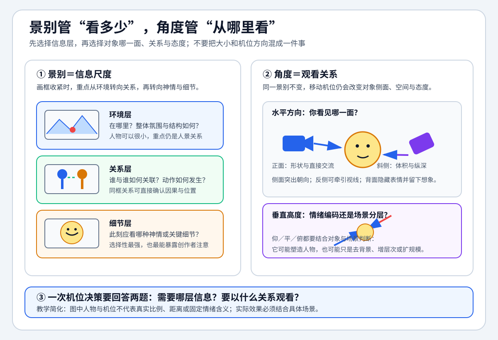

# 中国传媒大学《视听语言》 - 第七章 拍摄角度与景别

> 导航：[[知识库/学习区/课程/中国传媒大学《视听语言》/00 - 课程总览]]｜[[中国传媒大学《视听语言》]]

视频：[P26 7.3影像的角度选择——大远景和远景](https://www.bilibili.com/video/BV1dE4118731?p=26)｜[P27 7.4影像的角度选择——大全景、全景和中景](https://www.bilibili.com/video/BV1dE4118731?p=27)｜[P28 7.5影像的角度选择——近景和特写](https://www.bilibili.com/video/BV1dE4118731?p=28)｜[P29 7.6影像的角度选择——正面角度与斜侧角度](https://www.bilibili.com/video/BV1dE4118731?p=29)｜[P30 7.7影像的角度选择——侧面角度和背面角度](https://www.bilibili.com/video/BV1dE4118731?p=30)｜[P31 7.8影像的角度选择——高度关系](https://www.bilibili.com/video/BV1dE4118731?p=31)｜[P32 7.9影像的角度选择——角度的基本功能](https://www.bilibili.com/video/BV1dE4118731?p=32)  
说明：本笔记按“角度与景别”教学单元聚合 P26-P32，根据本地 ASR 整理，不是官方逐字稿；ASR 无法可靠确认的比例数字、片名和人物专名已保留待核验说明。

## 本课速览

- 核心问题：机位与对象的距离、方向和高度怎样改变镜头容量、人物关系、情绪立场与视觉风格？
- 主要结论：景别不是大小标签，而是环境、关系、细节三层内容系统；方向决定看见对象的哪一面及其与他者的联系，高度决定情绪、层次和冲击力。
- 学习价值：让“换角度”从现场试错变成有目的的内容选择，并能预测每种机位会增加或损失什么信息。
- 适用环节：导演分镜、摄影机位、采访构图、动作关系、纪录片覆盖和后期镜头组织。

## 直观教学图与趣味理解

> [!tip] 怎么读
> 先用左侧三层确定镜头要保留环境、关系还是细节，再用右侧方向与高度决定从何处观看。图中人物和机位不代表真实比例、距离或固定情绪编码。

> [!example] 教学延伸（Codex 综合，不是课程原话）
> - **反直觉点**：镜头更近不等于“信息更多”，而是用环境和关系信息换取神情与细节；同样，俯拍也不必然表示贬低，还可能只是为了组织场景层次。
> - **一分钟实验**：用双手给眼前场景做一个大画框和一个小画框，再左右、上下移动视点；每次只说“新增了什么、隐藏了什么”。
> - **创作口诀**：景别选信息，方向选侧面，高度看语境。

## 来源可靠性

- 信息来源：Bilibili 视频本地 ASR（faster-whisper base，按语境校正）。
- 完整程度：P26-P32 均覆盖至片尾总结，课程的景别系统、方向分类、高度功能与综合归纳完整。
- 待核验：P26 大远景人物高度的具体百分比；P28 近景黄金比例的数字；P29-P32 部分照片、影片专名。
- 外部补充：无；涉及导演风格的说法按课程观点记录，不扩展为绝对判断。

## 分集脉络

- **P26｜大远景和远景**：建立环境氛围镜头与承上启下的结构镜头。
- **P27｜大全景、全景和中景**：从人景关系进入形体关系和镜头内部的关系叙事。
- **P28｜近景和特写**：用神情与细节建立人物形象、主题方向和信息密度。
- **P29｜正面与斜侧角度**：比较平面形状、立体纵深、方向感和采访中的七分脸。
- **P30｜侧面、反侧与背面角度**：由视线方向、运动速度、牵引和留白构建悬念。
- **P31｜高度关系**：区分针对人物的情绪塑造与针对场景的层次组织。
- **P32｜角度的基本功能**：把前述内容归纳为透视、关系、人物、主观态度和视觉风格五项功能。

## 时间线笔记

### P26｜7.3影像的角度选择——大远景和远景

- `00:11-01:17`｜景别由外部画框约束内容容量；传统远、全、中、近、特只是粗分，创作中须按内容功能继续细化。
- `01:17-03:01`｜大远景中人物占画面极小，重点不是人物细节，而是人物与湖水、远山、日落共同形成的安宁氛围；ASR 对具体比例听辨不稳，数字需看课件核验。
- `03:06-07:21`｜BBC《黄石公园》开头以大环境—小环境—狼的点睛细节—大环境回环构成氛围镜头组；长片可用一组，短片通常只需少量，氛围段落本身不负责主要叙事。
- `07:23-09:24`｜远景保持人和环境的相对平衡，给观众自由观看，并承担由人物细节转向环境细节的承上启下。
- `09:28-12:22`｜《美丽中国》收割段落以联合收割机—机器与农民同框—农民的 A→AB→B 结构，演示远景如何连接两个信息单元。
- `12:22-13:35`｜大远景和远景偏结构与氛围，视觉感染力强但直接信息有限；宣传片若过量依赖，往往需要解说补足内容。

### P27｜7.4影像的角度选择——大全景、全景和中景

- `00:12-02:22`｜大全景让人物占约四分之三画高、环境仍有明显地位；它以人物—环境关系交代时间、地点、人物和事件的大背景，属于描述性、关系性镜头。
- `02:23-04:02`｜《人类星球》中孩子驱赶狒狒：其他镜头把人和动物分开，大全景让二者同框，确认“谁在追谁”的因果和空间关系。
- `04:05-06:31`｜全景接近人眼常态，擅长交代形体关系，却不能代替人眼主动选择细节；两个孩子拥抱的全景像亲密，裁成近景后才看到双方神情并不一致。
- `06:38-09:00`｜洪水救援新闻持续使用全景，导致核心老人的身份细节难以辨认，说明全景不是“万能保险镜头”。
- `09:03-12:19`｜中景拍膝部或腰部以上，适合在单镜头内部同时容纳多人，以关系对比完成叙事；《失恋33天》案例中说话者与旁边人物的不同反应共同提供信息。
- `11:38-12:39`｜中景关系叙事比正反打更经济、也更接近客观观察；纪录片中可用人物同框关系代替过度剪辑。

### P28｜7.5影像的角度选择——近景和特写

- `00:12-01:45`｜课程不机械以“胸部以上”定义近景，而强调接近黄金分割的人像比例和审美目的；具体比例数字受 ASR 影响，需对照课件。
- `01:45-03:03`｜近景用来交代人物神情，常用于单人采访；被摄者若面对镜头僵硬，可放宽到中近景或中景，避免放大神情缺陷。
- `03:03-09:15`｜《身边的感动》以一系列近景捕捉女孩在重压下仍保持微笑，因而把主题导向乐观与感动；若只拍哭泣，主题会滑向怜悯与求助。
- `09:18-11:49`｜特写是目的性最强的细节镜头，代表创作者的注意和态度；《黄石公园》以幼兽和雪中细节让“自然严苛、适应生存”具体化。
- `11:49-13:44`｜大景别雪景有审美但信息少，细节镜头的积累提高单位时间信息量；课程引用“特写约占半数”的训练性经验，应作为拍摄检查而非普遍硬比例。
- `13:46-14:54`｜景别最终归为环境层（大远景、远景）、关系层（大全景、全景、中景）和细节层（近景、特写、大特写）；景别变化应改变内容层次，而非同机位机械拍全套。

### P29｜7.6影像的角度选择——正面角度与斜侧角度

- `00:11-01:16`｜方向关系是水平方向的机位变化，分正面、侧面、斜侧、反侧和背面，用来选择对象侧面及其与陪体、背景的关系。
- `01:16-05:36`｜正面角度强化形状、平面和直接交流，削弱立体与纵深；树冠、建筑倒影和儿童蓬松头发的例子说明，选择正面是为了突出内容特征，不只是追求形式。
- `05:36-07:46`｜斜侧角度打开立体和纵深；约 30° 更保留正面特征，约 60° 更强调方向与空间，角度越偏，方向越强而正面信息越少。
- `07:50-10:54`｜建筑用较大斜侧角显示柱列纵深；人物采访常用约 30°“七分脸”，兼顾面部轮廓、立体感和与采访者的交流方向。
- `10:54-11:30`｜45° 对角线构图利用矩形最长路径拓展空间，说明机位方向和构图线条可以共同工作。

### P30｜7.7影像的角度选择——侧面角度和背面角度

- `00:12-01:42`｜侧面角度强调朝向、脸部轮廓和剪影；两人纯侧面对话容易平分画面、缺乏主次，因此实拍常以斜侧替代。
- `01:45-04:22`｜孩子看橱窗用侧面建立视线对象；赛马侧面运动穿过画框，速度感最强，正面迎来更偏姿态，斜侧可兼顾速度与形体。
- `04:24-06:11`｜猫透过栅栏凝视的方向制造“它在看什么”的悬念，并牵引下一个镜头；侧面更关注对象与视线投射物，斜侧更关注对象本身。
- `06:11-10:23`｜反侧角度从背后保留部分侧面，适合跟随和牵引到对象所看的环境；海鸟、老人喂鱼和突然回眸说明，它可把重点从对象转向目的地，再以“出其不意”逆转回来。
- `10:25-14:12`｜背面角度隐藏表情，以肩部、动作和声音让观众补全人物内心；母子进喷泉、孩子看糕点、哭泣背影和老年伴侣都以含蓄、写意和留白形成悬念。

### P31｜7.8影像的角度选择——高度关系

- `00:11-01:48`｜高度关系是机位与对象在垂直方向的变化；略仰拍父亲使形象高大、凝重，表达敬意或威严。
- `01:50-03:20`｜平视更接近日常和客观；略俯拍造假者可传达不满或批判。针对单一人物时，高度变化往往直接改变情感关系。
- `03:20-05:49`｜针对场景时，俯拍未必表示轻视：会议乒乓球和老人滑冰例子用略俯角把主体、前景和围观者分层，增加信息量。
- `05:49-07:13`｜仰拍也可主动取消杂乱地面，把人物置于蓝天背景；高度选择既塑造人物，也调整人物与环境的关系。
- `07:13-10:10`｜无人机让顶视和大俯角进入新闻与抢险现场，扩展场面规模和视觉冲击；课程归纳高度的三项功能：情绪、层次、冲击力。

### P32｜7.9影像的角度选择——角度的基本功能

- `00:11-01:24`｜总结五项功能：夸大或强化透视；建立位置和叙事关系；塑造人物；表达主观视觉与态度；形成视觉风格。
- `01:24-02:45`｜长城近距离前景配斜侧方向，把垛口夸大并拉出纵深；非常规角度的价值在于强化真实空间，而不是单纯猎奇。
- `02:45-04:06`｜倾覆船只与后方巨浪同框，直接建立台风造成险情的因果；若换角度只见船，叙事关系会被误读。
- `04:07-05:25`｜人物正面白须与自拍斜俯角说明：角度应选择能突出人物特征并适度美化的方向；照片人物专名据 ASR 不稳定，未采用。
- `05:28-07:12`｜手术场景把先进仪器置于前景，表明角度就是创作者的关注和态度；“胸有成竹”类比强调镜头拍的不是中性现实，而是作者理解后的现实。
- `07:12-09:14`｜固定使用逆光、偏好大景别或小景别会逐渐形成视觉风格；课程以张艺谋的大场面与李安的细节倾向作对比，作为风格观察方法而非绝对标签。

## 核心观点

- 距离决定容量：大景别主要给环境和结构，中间景别主要给关系，小景别主要给神情与细节。
- 环境—关系—细节是拍摄覆盖的三层逻辑；不是在同一机位把远全中近特机械拍齐。
- 方向角度决定对象“哪一面”以及对象指向谁；正面强调形状，斜侧强调体积，侧面强调朝向，反侧强调牵引，背面强调留白。
- 高度不是自动编码：针对人物常含情绪，针对场景也可能只是为了分层、去背景或扩大规模。
- 角度永远有取舍；每次移动机位都应能说出新增的信息、删去的信息和被强化的态度。

## 方法与案例

### 方法

1. 先按环境、关系、细节列拍摄清单，再为每个内容层选择匹配景别。
2. 用 A→AB→B 设计远景／大全景的结构镜头，保证两个细节单元有空间或逻辑连接。
3. 选择方向时写一句动词：展示、连接、牵引、隐藏或评价；再从正面、斜侧、侧面、反侧、背面中选。
4. 对高度角做“双重检查”：它是否无意中贬低／神化人物？它是否只是为了更好地组织场景层次？
5. 检查同一场景是否同时有环境层、关系层、细节层；缺失哪一层，后期就可能需要旁白或补拍。

### 案例

- 《黄石公园》氛围镜头组、《美丽中国》收割段落：大景别如何承担情绪与结构。
- 孩子拥抱、洪水救援、《失恋33天》：全景、中景、近景对关系信息的不同选择。
- 《身边的感动》与雪中幼兽：近景／特写怎样把主题落实到神情与细节。
- 赛马、猫的视线、老人喂鱼、背影哭泣：不同方向角度的速度、悬念、牵引和留白。
- 长城、倾船与巨浪、手术仪器：角度同时改变透视、因果与创作者态度。

## 可实践练习

1. 为一个两人场景拍环境、关系、细节三层各两镜，并说明每镜不可替代的信息。
2. 用同一动作分别从正面、侧面、斜侧拍摄，比较姿态、速度和纵深。
3. 为同一人物拍平视、略仰、略俯三版，记录观众对人物态度的变化，同时检查背景层次是否改变。
4. 设计一组 A→AB→B 的三镜头，让 AB 镜头在没有旁白时也能明确因果。

## 主题沉淀

### 已沉淀

- 暂无；本课尚未写入主题知识库。

### 待沉淀

- 环境—关系—细节三层景别系统：用于拍摄覆盖、分镜和补拍检查。
- 方向角度的叙事动词：用于选择正面、斜侧、侧面、反侧和背面。
- 高度关系的情绪与层次双重检查：用于避免机位无意表达错误立场。
- 角度的五项功能：用于从视觉效果反推内容目的。

## 复习区

### 一分钟核心摘要

景别控制容量，方向控制侧面和关系，高度控制情绪与层次。拍摄时先分环境、关系、细节三层，再按展示、连接、牵引、隐藏、评价等目的选择机位，而不是先追求“特别角度”。

### 自测问题

1. 大远景、远景和大全景分别更偏情绪、结构还是关系？
2. 为什么全景不能替代近景与特写？
3. 侧面、反侧和背面在制造悬念时有什么差别？
4. 略俯拍为什么不一定表示贬低？
5. 角度的五项基本功能如何对应一次实际机位选择？

### 任务

- [ ] #复习 画出环境—关系—细节三层景别树，并给每层配一个课程案例。
- [ ] #复习 用一句话分别概括五种水平方向角度和三种高度角度的核心作用。
- [ ] #创作练习 为当前项目的一场戏制作机位表，每个机位写明新增、隐藏和强调的信息。

## 我的学习提醒

> [!note] 我的理解
> 不要把景别变化等同于画面大小变化；真正有效的变化必须让内容从环境转到关系，或从关系转到细节。

## 二刷时可以重点听

- P26 `05:13-07:15`：大环境—小环境—点睛细节—大环境的氛围镜头组模板。
- P27 `09:35-12:19`：中景关系叙事与正反打的区别。
- P28 `13:46-14:54`：景别三层系统的课程总结。
- P30 `04:24-06:11`：侧面方向怎样牵引下一镜头。
- P31 `03:20-07:13`：高度从情绪编码转为场景层次组织的边界。
- P32 `00:44-01:15`：角度五项基本功能的原始归纳。
