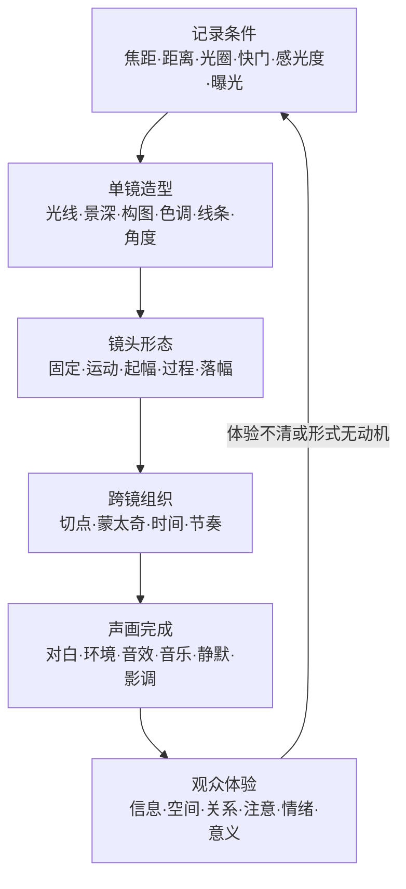

# 中国传媒大学《视听语言》

> 导航：[[知识库/学习区/课程/中国传媒大学《视听语言》/00 - 课程总览|先看19个语义单元与74个P讲什么]]。本页只整合跨课可复用知识，不重复逐集时间线和课堂案例全文。

> [!info] 本轮更新范围
> 2026-09-30已保存全部19课图文整理稿。本页保留既有跨课归纳、个人学习与沉淀记录，本次同步来源状态和案例入口；具体知识、案例与限定以新版课级笔记为准。原声与连续声画未完成复核，历史练习和问题没有重新布置。接续见[[99 - 整理交接与待核事项]]。

## 材料简介

来源：[打开 Bilibili 课程](https://www.bilibili.com/video/BV1dE4118731)  
发布账号：中国传媒大学  
讲者：于然、桂笑冬、孙振虎（据合集标题）  
当前范围：P1-P74，共约 913 分钟  
读取情况：74个P的可用ASR与原帧图文已用于课级整理；不代表已听全部原声或连续看完视频  
可靠性：技术解释、方法与课堂案例归于课程讲者；跨课模型、工作流和术语校正是 Codex 结构化整理。P2 的外语片段、画面中的人名、作品名与图示细节以原视频为准。  

## 速览

- 课程主要解决的问题：怎样把镜头、曝光、光线、构图等技术条件，逐层转成单镜头造型、空间关系、剪辑结构、时间、节奏、声音和影调，最终形成观众可感知的视听表达。
- 最重要的跨课结论：任何技术参数和形式选择都不是独立效果；它只有在改变信息、空间、关系、注意、情绪、时间或节奏时，才真正进入视听语言。
- 适用创作阶段：场景视觉设计、镜头与资产规划、AI 静帧／视频生成、动态预演、粗剪、声音设计和成片质检。

## 分章节／分集导览

- [[01 - 第一章 影像语言与技术史（P1-P2）|第一章 影像语言与技术史]]：建立技术、记录、艺术和传播之间的专业边界。
- [[02 - 第二章 镜头原理、类型与光学控制（P3-P8）|第二章 镜头原理、类型与光学控制]]：把焦距、距离、光圈、景深和超焦距放进同一空间控制系统。
- [[03 - 第三章 摄影机结构、快门与机型（P9-P12）|第三章 摄影机结构、快门与机型]]：理解机身与快门怎样切分光和时间，并据任务选择设备形态。
- [[04 - 第四章 曝光控制（P13-P15）|第四章 曝光控制]]：在技术基准、动态范围、噪点和表达性明暗之间做取舍。
- [[05 - 第五章 光线方向与造型（P16-P19）|第五章 光线方向与造型]]：用光位塑造体积、轮廓、材质、空间和情绪。
- [[06 - 第六章 影像画面构成（P20-P23）|第六章 影像画面构成]]：以主体、背景、陪体和前景的功能关系组织画面信息。
- [[07 - 第七章 色调与线条（P24-P25）|第七章 色调与线条]]：让色调建立情绪和时空底盘，让线条建立观看路径。
- [[08 - 第七章 拍摄角度与景别（P26-P32）|第七章 拍摄角度与景别]]：用景别、方向和高度选择信息尺度、关系与立场。
- [[09 - 第八章 固定镜头（P33-P42）|第八章 固定镜头]]：以稳定画框放大构图、光线、景深、表演和画内调度。
- [[10 - 第八章 运动镜头（P43-P47）|第八章 运动镜头]]：以摄影机轨迹重新组织空间、关系、揭示和情绪。
- [[11 - 第九章 后期剪辑与蒙太奇层次（P48-P51）|第九章 后期剪辑与蒙太奇层次]]：从相邻镜头、段落到全片结构分层组织意义。
- [[12 - 第十章 场景的有限与无限（P52）|第十章 场景的有限与无限]]：把场景理解为时间、空间、人物、光线、构图与生产条件的系统。
- [[13 - 第十章 空镜头的叙事作用（P53-P54）|第十章 空镜头的叙事作用]]：用环境与物件承担交代、转场、节奏、象征和余韵。
- [[14 - 第十章 影视时间组织（P55-P57）|第十章 影视时间组织]]：压缩、延展、重组现实时间与观众感知时间。
- [[15 - 第十章 布光实践（P58-P59）|第十章 布光实践]]：从光源动机和叙事目标建立可执行的光线层次。
- [[16 - 第十章 动作片视听设计（P60-P63）|第十章 动作片视听设计]]：先保证目标、方向、空间和结果可读，再放大动作冲击。
- [[17 - 第十章 视听节奏（P64-P68）|第十章 视听节奏]]：把动作、画面、镜头时长、剪辑与声音组织成变化曲线。
- [[18 - 第十章 声音设计（P69-P72）|第十章 声音设计]]：用声音建立画外世界、空间、信息、情绪、连续性与节奏。
- [[19 - 第十章 影调层次（P73-P74）|第十章 影调层次]]：用明暗秩序统一主体可读、空间层次和情绪风格。

## 核心模型与概念

### 1. 从物理记录到观众体验的五层链

这条链的关键不是从左到右堆满技术，而是允许从观众体验反推：如果一个选择不能说明它改变了什么，就返回上游重新判断，而不是继续加器材、运镜、剪辑或声音。

### 2. 技术变量必须经过“可见结果”才能进入叙事

| 技术或形式变量 | 直接可见／可听结果 | 可服务的表达问题 |
|---|---|---|
| 焦距 + 拍摄距离 | 背景范围、空间压缩／扩张、透视关系 | 人与环境亲疏、空间压力、主体突出 |
| 光圈 + 焦距 + 物距 | 景深与清晰范围 | 注意力分配、信息隐瞒、前后层调度 |
| 快门 | 冻结、拖影、运动模糊 | 时间质感、速度、力量、混乱或梦幻 |
| 曝光 + 感光度 | 明暗细节、噪点、宽容度 | 可读性、真实感、压抑或明快基调 |
| 光位 + 光质 | 体积、纹理、轮廓、阴影方向 | 人物状态、空间层次、动机与情绪 |
| 景别 + 角度 | 信息尺度、关系、观看距离与立场 | 环境、行动、表情、细节、权力和隐瞒 |
| 固定／运动镜头 | 稳定基准或空间持续变化 | 观察、凝视、揭示、跟随、疏离、关系重构 |
| 镜头时长 + 切点 | 注意停留、信息密度、段落重音 | 节奏、心理时间、动作清晰与冲击 |
| 声音位置与声画关系 | 画内／画外、同步／异步、提前／延后 | 空间扩展、连续性、预示、反讽和情绪 |

课程在多个章节反复证明：焦距不是“压缩感”标签、低机位不是“强大”标签、运动镜头也不是“高级感”标签。意义必须由场景、人物、画面关系、上下镜和声音共同成立。

### 3. 单镜画面的四个语义角色

- **主体**：本镜头内容与注意的中心，不必位于几何中心，但必须能被识别和强调。
- **背景**：说明主体处境、身份、空间、时代和情绪；既可以增加信息，也可以通过虚化、简化和留白减少干扰。
- **陪体**：与主体有因果或关系联系，帮助单镜头内部完成解释、对照或生活气息。
- **前景**：规定观看入口；可以制造尺度、重构框架、引导心理、提示内容，也可以遮挡无效信息。

判断元素是否有价值时做一次删除测试：删掉以后，信息、关系、情绪、空间和观看路径是否有实质损失？没有损失，就不应仅以“丰富画面”为由保留。

### 4. 固定镜头与运动镜头不是风格二选一

| 判断 | 更适合固定镜头 | 更适合运动镜头 |
|---|---|---|
| 观众任务 | 观察、比较、等待、凝视 | 发现、跟随、穿越、重新理解空间 |
| 主要变化 | 发生在表演、光线、景深或画内调度 | 发生在摄影机与人物／空间的关系 |
| 空间基准 | 需要稳定画框提供秩序或压力 | 需要持续揭示、连接或改写空间 |
| 剪辑接口 | 依靠镜头时长、画内动作与切点 | 必须设计起幅、运动过程、落幅及与上下镜的接口 |
| 常见误区 | “架住不动”而没有内部变化 | 为运动而运动，起落无依据、主体关系未改变 |

### 5. 蒙太奇的三个组织层次

- **微观**：相邻镜头为什么可以接；动作、方向、景别、视线、声音和心理关系是否构成有效切点。
- **中观**：多个镜头怎样形成一个场景、段落或视听句子；有没有建立、变化、兑现和交接。
- **宏观**：段落怎样进入全片结构和主题；局部镜头组是否推动了时间、因果、人物与整体节奏。

剪辑不能在后期凭空补出前期没有提供的空间、动作、反应或声音接口。拍摄时就要以“这段怎样被组织”为问题，而不是把素材数量当作可剪辑性。

### 6. 时间、节奏和声音是同一观看过程

- **时间**决定观众经历多久、哪些过程被省略、哪些瞬间被延展或重复。
- **节奏**决定变化怎样出现；快慢只是变量之一，重音、停顿、重复、对比、升级和转折同样重要。
- **声音**既能固定空间和动作，也能跨越切点、提前建立下一场、延后保留上一场，甚至与画面分离产生新的解释。
- **静默**不是没有声音，而是有意撤去声音信息，让等待、隔绝或心理压力成为可感知变化。

## 方法与工作流

1. 写清场景任务：人物或空间从什么状态变到什么状态，观众最终需要知道、感受或期待什么。
2. 建立场景条件：时间、地点、内外景、真实／搭建／合成方式、主体与关键道具、生产限制。
3. 先定直接结果，再定技术参数：需要怎样的空间、运动模糊、清晰范围和明暗细节，才选择焦距、距离、光圈、快门、感光度与曝光。
4. 组织单镜造型：确定主体；让背景、陪体、前景、色调、线条、光位和角度各承担一个可说明的任务。
5. 选择镜头形态：变化主要来自画内，就优先比较固定镜头；变化来自摄影机与空间关系，就设计有起幅、过程和落幅的运动镜头。
6. 为剪辑拍摄：标出动作、视线、屏幕方向、景别差异、反应、环境声和上下镜接口，不用“多拍几个角度”代替判断。
7. 从微观到宏观检查蒙太奇：切点是否成立，镜头组是否推进，段落是否服务全片结构。
8. 设计时间与节奏曲线：明确哪里压缩、延展、停顿、重复、升级或突变，避免全程同一速度和同一信息密度。
9. 设计声画关系：区分对白、环境、音效、音乐、画外声和静默；说明声音是同步、连接、预示、反讽还是心理化。
10. 用影调完成统一：检查主体—背景分离、明暗层次、空间和情绪是否跨镜稳定，最后回到观众实际接收复核。

## 案例索引

| 案例或方法 | 用来说明什么 | 详细出处 |
|---|---|---|
| 希区柯克变焦 | 同时改变焦距与机位距离，主体尺度可相对稳定而背景范围和透视发生变化 | [[02 - 第二章 镜头原理、类型与光学控制（P3-P8）#P4：主体等大时的背景范围与推拉变焦]] |
| 电视辩论中的服装与背景关系 | 主体色彩若与背景接近会降低屏幕分离度；历史细节据课程，需另核 | [[06 - 第六章 影像画面构成（P20-P23）#电视辩论照片：把服装放回背景中判断（07:34–09:18）]] |
| 冬泳者、钢厂工人与江南小镇照片 | 背景分别承担环境证明、身份识别、情绪与时空对照 | [[06 - 第六章 影像画面构成（P20-P23）#P21：背景怎样提供和控制信息]] |
| 《花样年华》片段 | 同一有限场景可通过服装、机位、镜头游走与时空省略形成关系变化 | [[12 - 第十章 场景的有限与无限（P52）#方法与案例]] |
| 空镜头案例组 | 环境和物件可建立空间、过渡时间、承接情绪或形成象征与余韵 | [[13 - 第十章 空镜头的叙事作用（P53-P54）#方法与案例]] |
| 动作片案例组 | 先保护目标、方向、空间和结果，再用景别、切点、运动和声音制造冲击 | [[16 - 第十章 动作片视听设计（P60-P63）#原理、方法与案例的对应]] |
| 声画提前与延后 | 声音可以跨过画面切点，在空间和时间上连接段落或改变观众预期 | [[18 - 第十章 声音设计（P69-P72）#使用这些知识时需要分开的判断]] |

## 跨课关系

- 镜头与机身章节决定“能记录出什么”，曝光与光线决定“什么能被看清以及以什么明暗关系被看清”，构图与角度决定“观众先看什么、站在哪里看”。
- 固定／运动镜头决定信息在单镜内部怎样展开；剪辑与蒙太奇决定镜头之间怎样形成句子、段落和全片结构。
- 空镜、时间、动作与节奏不是四种独立技巧：它们都在控制信息何时出现、停留多久、以多大强度进入观众经验。
- 声音和影调不是后期装饰，而是贯穿拍摄、剪辑和最终感知的连续层；没有为它们预留接口，成片很难靠后期“补高级”。

## 适用边界与常见错误

- 本课程发布于 2019 年，适合学习稳定的视听原理与创作方法，不作为当前相机型号、编码、软件和设备购买指南。
- 课程中的景别、角度、线条、色彩和光位功能是分析与练习入口，不是固定符号词典；脱离剧情、人物、文化和上下镜时不能机械套用。
- ASR 对“影像、景别、起幅／落幅、蒙太奇”等词存在近音误识别；笔记已按语境校正，无法确认的人名、片名和图示留在各课“待核验”。
- 课程大量使用画面、照片和影片片段。音频转写能覆盖论点与案例用途，却不能替代对构图、光线和运动画面的二刷观察。
- 不把长镜头等同于运动镜头，不把固定镜头等同于客观，不把快剪等同于节奏，不把画外声等同于背景音。
- 不把技术复杂度当表达价值。器材、布光、运镜、剪辑和声音都必须回到观众得到的变化。

## 外部补充与分歧

- 本页保留既有跨课整理；本轮课级笔记已对部分术语、片名、历史或制作说法补充外部校核，并就近区分课程讲述与外部结论。未核项作为来源复核待办保留，不自动转成小陌的学习任务。

## 可实践练习

1. 选同一场 30 秒对话，做“固定镜头版”和“运动镜头版”；每版只能保留能说明人物关系或空间变化的镜头选择。
2. 为同一主体设计三组记录条件：广角近拍、长焦远拍、相同主体尺度下的变焦＋移机；比较背景范围、透视与心理距离。
3. 用主体、背景、陪体和功能性前景拍一个无需文字说明也能读懂因果的单镜头。
4. 用 6—8 个镜头剪一个动作段落：先做空间清楚版，再只改变镜头时长、切点和声音做冲击版，比较哪些改动真正有效。
5. 为一组无声画面设计两套声音：一套建立连续空间，一套制造画外威胁或反讽；记录观众解释怎样变化。

## 主题沉淀

### 已沉淀

- [[知识库/学习区/综合整理/02-导演与视听语言/镜头语言专业总表]]：新增“技术变量—直接结果—表达问题”转译表，把焦距、距离、光圈、快门、曝光、光线和角度接回场景任务。
- [[知识库/学习区/综合整理/02-导演与视听语言/场面调度与镜头覆盖]]：新增固定／运动镜头的变化来源判断、起落幅和动作覆盖接口。
- [[知识库/学习区/综合整理/02-导演与视听语言/镜头组与视听节奏]]：新增蒙太奇微观／中观／宏观三层模型，以及时间、节奏、声音、影调联合检查。
- [[知识库/学习区/综合整理/02-导演与视听语言/场景导演怎样把剧本事件统一成观众体验与部门执行]]：把场景任务、观众接收和跨专业视听变量组织为统一导演判断。
- [[知识库/学习区/综合整理/03-摄影美术与现场制作/摄影选择怎样通过镜头、距离、景深、曝光与运动控制观看]]：把焦距、距离、景深、快门、曝光和摄影系统整理成场景级摄影方法。
- [[知识库/学习区/综合整理/03-摄影美术与现场制作/叙事布光怎样通过光源、方向、光质、反差与影调塑造人物和空间]]：把光位、时空布光、影调和跨镜连续性整理成灯光方法。
- [[知识库/学习区/综合整理/03-摄影美术与现场制作/生产设计怎样让空间、陈设、服化道与材质共同表达人物和世界]]：把场景、空间、材质和摄影灯光接口纳入生产设计。
- [[知识库/学习区/综合整理/03-摄影美术与现场制作/影视色彩怎样区分资产本色、光源影响与最终Look并保持连续性]]：把色调、色块、材质与影调整理成分层色彩系统。

### 待沉淀

- 线条构图仍是课级保留候选；既有镜头主题已有构图入口，等待真实项目调用暴露独立问题后再决定是否扩写，不创建重复主题。

## 复习区

### 一分钟核心摘要

先写场景任务和观众体验，再让焦距、距离、光圈、快门、曝光和光线建立记录条件；用主体、背景、陪体、前景、色调、线条、景别与角度形成单镜造型；根据变化发生在画内还是摄影机—空间关系中选择固定或运动镜头；最后用蒙太奇、时间、节奏、声音和影调把镜头组织成完整经验。每一步都要能回答：它让观众多知道、少知道、换位置、改情绪，还是改变了时间与意义？

### 自测问题

1. 为什么焦距不能脱离拍摄距离讨论空间透视？
2. 背景、陪体和前景怎样分别增加或控制信息？
3. 判断固定镜头还是运动镜头时，最关键的“变化来源”是什么？
4. 蒙太奇的微观、中观和宏观层次分别检查什么？
5. 为什么“快”不等于有节奏，声音又怎样改变镜头之间的时间和空间关系？

### 任务

- [ ] #复习 不看笔记复述“记录条件—单镜造型—镜头形态—跨镜组织—声画完成”五层链。
- [ ] #复习 从 19 篇课级笔记的“二刷时可以重点听”中选 5 个最依赖画面的时间段，回原视频核对术语和案例。
- [ ] #创作练习 用当前项目的一场戏完成一次十步视听设计，并删除所有不能说明观众变化的技术选择。

## 关键问题

> [!question] 本课程当前只保留一个最值得回答的问题
> 面对同一场戏，你怎样证明某个焦距、光位、摄影机运动、剪辑节奏或声音设计是在改变观众获得的信息、空间、关系、情绪、时间或意义，而不只是增加技术感？
