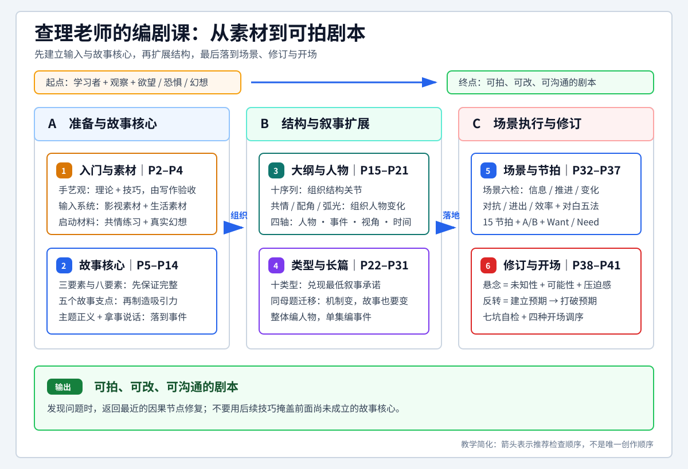

# 查理老师的编剧课 - 课程总览

> 这篇只负责回答“每一课讲什么、每一集讲什么、该从哪里进入”。跨课整合后的方法统一放在 [[查理老师的编剧课|统一知识总结]]。

## 课程入口

- [[查理老师的编剧课|统一知识总结]]：保留第一至第十八课的历史跨课方法、工作流、案例与练习；本次仅纠正七坑顺序的来源归属，详细知识以新版课级正文为准。
- [打开 Bilibili 课程页面](https://www.bilibili.com/video/BV1eE411F73t?p=2)
- 当前清点范围：编号第一课至第三十四课，P2-P60，共59集；同合集未编号视频另列后续。
- 当前正文目录：编号第一至第三十四课共34篇课级笔记、59集，覆盖P2-P60。本次11课图文知识已全部正式保存；原已验收23课未变化者不重做。独立声画待核另记，同合集未编号33P继续延期。图文保存不等于全课原声听审或连续声画完成。

## 课程教学总图



> [!tip] 怎么读
> 先横向看“准备与故事核心 → 结构与叙事扩展 → 场景执行与修订”三大阶段，再在每个阶段内按编号阅读两个模块。箭头表示推荐检查顺序，不是唯一创作顺序。

> [!note] 教学简化
> 本图对应原第一至第十八课，将连续课次合并为六个模块；详细案例、时间线和适用边界以各课笔记为准。新增课次从下方课程矩阵与导览进入。

## 本次图文验收课次导航

沿用教学总图的三个阶段，下列入口只列本次已经正式保存的课；导航是整理次序，不是原课新增知识关系。

- **结构与叙事扩展**：[[08 - 第八课 勾勒画面（P15-P17）|第8课 怎样用十序列、信息与场面把梗概展开成可拍大纲]]；[[20 - 第二十课 编剧拉片（P43）|第20课 怎样从身份设置、对抗、A/B故事和取舍中学习编剧拉片]]；[[22 - 第二十二课 高潮上不去（P46-P47）|第22课 怎样让高潮通过阶段、对抗与变化兑现故事]]。
- **场景执行与修订**：[[14 - 第十四课 场景与对白（P32-P33）|第14课 怎样把大纲落实为有任务的场景，按人物和情境写对白]]；[[17 - 第十七课 新手跳坑（P39）|第17课 怎样用七项新手问题检查和返修剧稿]]；[[18 - 第十八课 拿人的开场（P40-P41）|第18课 怎样设计拿人的开场并补回必要建制]]；[[24 - 第二十四课 剖析烂片（P50）|第24课 怎样按结构、元素看点、情感和情绪诊断并改写]]；[[25 - 第二十五课 观影情绪节拍表（P51）|第25课 怎样沿起承转合安排观众感受与悬念]]；[[26 - 第二十六课 从容应对文艺凡尔赛（P52）|第26课 怎样从提人、提片到具体场景谈片并辨认解读]]；[[29 - 第二十九课 剧情要有攻击性（P55）|第29课 怎样为人物本体、关系和行动目标设置攻击]]；[[34 - 第三十四课 查理小三角创作法（P60）|第34课 怎样用四项单场检查和小三角避免直线写法]]。
## 课程矩阵

| 课次 | 包含视频 | 本课解决的问题 | 详细笔记 |
|---|---|---|---|
| 第1课 | P2-P4 | 怎样把编剧理解为可训练的手艺，并建立能持续写作、记录素材和练习共情的入门方法 | [[01 - 第一课 劝学（P2-P4）|打开本课]] |
| 第2课 | P5-P6 | 怎样把欲望、恐惧和观察组织成一个完整故事 | [[02 - 第二课 故事的要素（P5-P6）|打开本课]] |
| 第3课 | P7-P8 | 怎样让结构完整但平淡的故事产生反差、悬念和人物转变 | [[03 - 第三课 八要素的实战应用（P7-P8）|打开本课]] |
| 第4课 | P9-P10 | 创作没有起点时从哪里下手，并怎样平衡创新与观众预期 | [[04 - 第四课 第一个故事（P9-P10）|打开本课]] |
| 第5课 | P11-P12 | 怎样区分外部输赢与作品价值，并从人物变化判断主题是否成立 | [[05 - 第五课 剧本的正义（P11-P12）|打开本课]] |
| 第6课 | P13 | 怎样用场景标题、描述、行动和对白形成可执行的协作文本 | [[06 - 第六课 剧本的格式（P13）|打开本课]] |
| 第7课 | P14 | 怎样把抽象人物判断翻译成观众能够看见的事件 | [[07 - 第七课 拿事儿说话（P14）|打开本课]] |
| 第8课 | P15-P17 | 怎样用十序列、信息与场面把梗概展开成可拍大纲 | [[08 - 第八课 勾勒画面（P15-P17）|打开本课]] |
| 第9课 | P18-P19 | 怎样让主角带住观众、让配角服务行动线并使人物变化可信 | [[09 - 第九课 谈谈人物（P18-P19）|打开本课]] |
| 第10课 | P20-P21 | 怎样判断多人物、多视角和多线结构是否真的增加了叙事任务 | [[10 - 第十课 复杂叙事（P20-P21）|打开本课]] |
| 第11课 | P22-P24 | 怎样把类型从市场标签转化为故事发动机和最低承诺检查 | [[11 - 第十一课 类型片（P22-P24）|打开本课]] |
| 第12课 | P25-P27 | 怎样用十种类型的核心要素把同一母题改写成不同故事 | [[12 - 第十二课 小蝌蚪找妈妈（P25-P27）|打开本课]] |
| 第13课 | P28-P31 | 怎样把多人物、多事件和多集数编织成连续且有单集看点的剧集 | [[13 - 第十三课 电视剧（P28-P31）|打开本课]] |
| 第14课 | P32-P33 | 怎样把大纲落实为有任务的场景，按人物和情境写对白 | [[14 - 第十四课 场景与对白（P32-P33）|打开本课]] |
| 第15课 | P34-P37 | 怎样用十五节拍和 A/B 故事把结构位置转成具体事件 | [[15 - 第十五课 节拍器（P34-P37）|打开本课]] |
| 第16课 | P38 | 怎样通过信息差主动设计悬念与反转 | [[16 - 第十六课 悬念与反转（P38）|打开本课]] |
| 第17课 | P39 | 怎样用七项新手问题检查和返修剧稿 | [[17 - 第十七课 新手跳坑（P39）|打开本课]] |
| 第18课 | P40-P41 | 怎样设计拿人的开场并补回必要建制 | [[18 - 第十八课 拿人的开场（P40-P41）|打开本课]] |
| 第19课 | P42 | 怎样用六部分提案介绍项目、组织人物小传，并用样场呈现实写能力 | [[19 - 第十九课 怎么撰写项目提案（P42）|打开本课]] |
| 第20课 | P43 | 怎样从身份设置、对抗、A/B故事和取舍中学习编剧拉片 | [[20 - 第二十课 编剧拉片（P43）|打开本课]] |
| 第21课 | P44-P45 | 怎样用中点、观点与行动、选择、伙伴支线、场景和对白返修已有剧稿 | [[21 - 第二十一课 谈几个进阶问题（P44-P45）|打开本课]] |
| 第22课 | P46-P47 | 怎样让高潮通过阶段、对抗与变化兑现故事 | [[22 - 第二十二课 高潮上不去（P46-P47）|打开本课]] |
| 第23课 | P48-P49 | 怎样从人物、事件、主题及场次台词形成喜剧，区分荒唐选择与失去逻辑 | [[23 - 第二十三课 怎么写喜剧（P48-P49）|打开本课]] |
| 第24课 | P50 | 怎样按结构、元素看点、情感和情绪诊断并改写 | [[24 - 第二十四课 剖析烂片（P50）|打开本课]] |
| 第25课 | P51 | 怎样沿起承转合安排观众感受与悬念 | [[25 - 第二十五课 观影情绪节拍表（P51）|打开本课]] |
| 第26课 | P52 | 怎样从提人、提片到具体场景谈片并辨认解读 | [[26 - 第二十六课 从容应对文艺凡尔赛（P52）|打开本课]] |
| 第27课 | P53 | 怎样按故事需要选择视角，再调节全知与限知的信息范围 | [[27 - 第二十七课 剧本的叙事视角（P53）|打开本课]] |
| 第28课 | P54 | 以两部公路故事理解中点、伙伴与内在成长，完成“其实都是我”的命题训练 | [[28 - 第二十八课 编剧课科目三（P54）|打开本课]] |
| 第29课 | P55 | 怎样为人物本体、关系和行动目标设置攻击 | [[29 - 第二十九课 剧情要有攻击性（P55）|打开本课]] |
| 第30课 | P56 | 怎样让观众从短暂注意转向自己的期待，并愿意持续验证 | [[30 - 第三十课 人类为什么需要影视剧（P56）|打开本课]] |
| 第31课 | P57 | 单元喜剧如何靠关系持续出事，任务剧如何用行动目标组织人物 | [[31 - 第三十一课 单元剧的创作理念（P57）|打开本课]] |
| 第32课 | P58 | 怎样让特殊规则形成可理解的期待，兼顾社会比喻、持续展开和类型创新 | [[32 - 第三十二课 跟《鱿鱼游戏》学写强设定（P58）|打开本课]] |
| 第33课 | P59 | 怎样把迟迟不动笔转成实际写作，用奖励、计划、启动办法及搭档持续推进 | [[33 - 第三十三课 怎样克服拖延症（P59）|打开本课]] |
| 第34课 | P60 | 怎样用四项单场检查和小三角避免直线写法 | [[34 - 第三十四课 查理小三角创作法（P60）|打开本课]] |

## 按课与分集导览

### 第一课 劝学｜P2-P4

**本课主线**：先把编剧还原为可以训练的手艺，取学院理论与速成规律之长，再以真实写作为验收，并建立双源素材记录、共情练习和真实幻想作业。

- **P2｜第一课-劝学1.1**：比较学院派与速成派的作用和局限，以能否实际写出、改好剧本作为学习验收，并回应非科班、文学功底、创意和职业辛苦等入门顾虑。
- **P3｜第一课-劝学1.2**：从讲者的行业观察转入电影与电视剧的观看条件和叙事驱动差异，把编剧定位为不受媒介身份高低限制的“讲故事的人”。
- **P4｜第一课-劝学1.3**：用键盘写作、影视／生活双源素材本、换位共情和真实幻想展开表，把学习愿望转成可立即执行的训练。

入口：[[01 - 第一课 劝学（P2-P4）|阅读本课详细笔记]]

### 第二课 故事的要素｜P5-P6

**本课主线**：先把灵感从神秘天赋变成可收集的素材，再用人物、事件、主题三要素和八要素建立完整因果。

- **P5｜第二课-故事的要素2.1**：从欲望、恐惧与共情寻找灵感，用相反力量让单一愿望开始产生故事。
- **P6｜第二课-故事的要素2.2**：把故事拆成人物、事件、主题三要素及八个小要素，并把它们连成因果链。

入口：[[02 - 第二课 故事的要素（P5-P6）|阅读本课详细笔记]]

### 第三课 八要素的实战应用｜P7-P8

**本课主线**：逐项增强八要素，并用‘想殉职的警察’证明反常设定必须与可信动机、前后欲望转向和主题变化咬合。

- **P7｜第三课-八要素的实战应用3.1**：用负价值身份、原始欲望、具体动作、不断线悬念、三层阻力和绕过动作实现欲望提高烈度。
- **P8｜第三课-八要素的实战应用3.2**：把规则组合进‘想殉职的警察’，形成前半想死死不了、后半想活活不了的结构反转。

入口：[[03 - 第三课 八要素的实战应用（P7-P8）|阅读本课详细笔记]]

### 第四课 第一个故事｜P9-P10

**本课主线**：从身份、激励事件、过激行为、悬念和环境五个支点启动故事，同时保留类型承诺，避免为原创而全面反预期。

- **P9｜第四课-第一个故事4.1**：讲身份和激励事件两个支点，用小人物遇大事、大人物遇小事制造不匹配。
- **P10｜第四课-第一个故事4.2**：补齐过激行为、悬念、环境三个支点，并提出‘一半海水，一半火焰’的创意边界。

入口：[[04 - 第四课 第一个故事（P9-P10）|阅读本课详细笔记]]

### 第五课 剧本的正义｜P11-P12

**本课主线**：把主题正义与结果正义分开，并用《杀人回忆》的双主角位置互换说明，失败结局仍可承载清楚的人物成长与价值判断。

- **P11｜第五课-剧本的正义5.1**：回应对格式的急躁，提出主题正义不等于结果胜利，先用完整故事证明作品立场。
- **P12｜第五课-剧本的正义5.2**：拆解《杀人回忆》的案件失败与双主角变化，并强调编剧要对所有人物保持理解。

入口：[[05 - 第五课 剧本的正义（P11-P12）|阅读本课详细笔记]]

### 第六课 剧本的格式｜P13

**本课主线**：把格式理解为剧组协作接口：场景标题服务制片与拍摄安排，正文区分环境、动作和对白，页数估算不能替代场面判断。

- **P13｜第六课-剧本的格式6**：讲场号、场景、时间、内外景及描述、行动、对白，并比较中英文剧本的页数与时长差异。

入口：[[06 - 第六课 剧本的格式（P13）|阅读本课详细笔记]]

### 第七课 拿事儿说话｜P14

**本课主线**：建立创意、梗概、大纲、剧本的开发顺序，用五个骨架事件做横轴、八要素做纵轴，把人物判断逐步事件化。

- **P14｜第七课-拿事儿说话7**：提出‘拿事说话’，用开场、激励、转折、危机、高潮建立大纲横轴，并逐项检查八要素变化。

入口：[[07 - 第七课 拿事儿说话（P14）|阅读本课详细笔记]]

### 第八课 勾勒画面｜P15-P17

**本课主线**：把十个序列作为横轴、八要素作为纵轴，并用‘想殉职的警察’完整推演开场原罪、错误欲望、虚假胜利、危机与高潮承担。

- **P15｜第八课-勾勒画面8.1**：区分梗概、大纲和剧本，建立十个序列及画面承载信息的基本要求。
- **P16｜第八课-勾勒画面8.2**：从结局反推开场，用夜市、家庭与警局捐款逐步生成错误欲望和中段虚假胜利。
- **P17｜第八课-勾勒画面8.3**：让后半程打击回收开场原罪，并用高潮行动回答主角是否真正承担责任。

入口：[[08 - 第八课 勾勒画面（P15-P17）|阅读本课详细笔记]]

### 第九课 谈谈人物｜P18-P19

**本课主线**：从主角行动力和三面共情出发，继续整理配角功能、人物关系作用力、人物弧光和角色命名。

- **P18｜第九课-谈谈人物9.1**：定义主角的主动力与观众视角，从身份、欲望、动作三面建立共情，并讨论英雄片的极限平衡。
- **P19｜第九课-谈谈人物9.2**：建立配角产生、合并、加强三步法，再讲人物关系图、人物弧光的边界和命名时机。

入口：[[09 - 第九课 谈谈人物（P18-P19）|阅读本课详细笔记]]

### 第十课 复杂叙事｜P20-P21

**本课主线**：从单主角、单事件和线性推进的简单内核出发，检查多人物、多视角与多线结构是否真的增加了独立人物弧线、信息视角或事件力量。

- **P20｜第十课-复杂叙事10.1**：按人物数量、人物弧线和观众视角区分复合型主角、团队主角与真正双主角。
- **P21｜第十课-复杂叙事10.2**：区分倒叙与真正的非线性或多线结构，并用《疯狂的石头》检查阻力扩张、信息分配、巧合连接和上帝视角。

入口：[[10 - 第十课 复杂叙事（P20-P21）|阅读本课详细笔记]]

### 第十一课 类型片｜P22-P24

**本课主线**：区分创作目的、市场标签与故事机制，把十种类型作为创作者侧的故事发动机和最低承诺检查，再放回八要素与十序列中完成。

- **P22｜第十一课-类型片11.1**：区分三种类型分类轴，引入布莱克·斯奈德的十种故事类型，并开始拆解金羊毛。
- **P23｜第十一课-类型片11.2**：展开金羊毛、伙伴之爱、鬼屋、超级英雄、侦探推理、如愿以偿、麻烦家伙和人生变迁的关键要素。
- **P24｜第十一课-类型片11.3**：补齐愚者成功和被制度化，并用正反案例检验类型的最低承诺是否兑现。

入口：[[11 - 第十一课 类型片（P22-P24）|阅读本课详细笔记]]

### 第十二课 小蝌蚪找妈妈｜P25-P27

**本课主线**：用同一母题连续迁移十种故事类型，让每次改写都由该类型的关系、规则、威胁、选择或牺牲重新组织人物与因果。

- **P25｜十二课-小蝌蚪找妈妈12.1**：用金羊毛改写演示外部动作与真正欲望的区别、绕过动作实现欲望及互补伙伴设计。
- **P26｜十二课-小蝌蚪找妈妈12.2**：把母题迁移为爱情、超级英雄、鬼屋、侦探和如愿以偿，逐类锁定不可缺少的核心要素。
- **P27｜十二课-小蝌蚪找妈妈12.3**：完成麻烦家伙、变迁仪式、愚者成功和被制度化的改写，并比较不同类型的主题与结局方向。

入口：[[12 - 第十二课 小蝌蚪找妈妈（P25-P27）|阅读本课详细笔记]]

### 第十三课 电视剧｜P28-P31

**本课主线**：从媒介与观看方式理解剧集形态，再以“整体编人物，单集编事件”统筹主角群、关系曲线、分集任务和连续性。

- **P28｜十三课-电视剧13.1**：从广告模式和固定时段解释早期电视剧的陪伴性、人物驱动与连续生产。
- **P29｜十三课-电视剧13.2**：讨论审查、观看方式与平台技术变化，理解媒介条件如何改变剧集结构机会。
- **P30｜十三课-电视剧13.3**：用全剧人物表、共同目标、主副线和关系曲线落实“整体编人物，单集编事件”。
- **P31｜十三课-电视剧13.4**：补完人物弧线与逐集切分，并比较连续剧、单元剧和情景剧的黏度与单集看点。

入口：[[13 - 第十三课 电视剧（P28-P31）|阅读本课详细笔记]]

### 第十四课 场景与对白｜P32-P33

**本课主线**：把大纲、序列和人物功能落实为可执行场景，用环境、动作与对白推进事件，并让台词贴合人物或强情境。

- **P32｜十四课-场景与对白14.1**：定义场景及其任务，建立动作进出、对抗、变化和删并原则，并用案例逐项验算。
- **P33｜十四课-场景与对白14.2**：区分贴人物与由情境托起的对白，给出分角色写、语言素材、潜台词和角色日记等方法。

入口：[[14 - 第十四课 场景与对白（P32-P33）|阅读本课详细笔记]]

### 第十五课 节拍器｜P34-P37

**本课主线**：以十五节拍细化十序列的结构功能，再用 A/B 故事和 Want/Need 区分外在行动与内在成长，把结构坐标转成具体事件。

- **P34｜十五课-节拍器15.1**：说明十五节拍的适用边界，并讲解开场画面、铺垫、点题、推动和争执。
- **P35｜十五课-节拍器15.2**：补完十五节拍的分钟位置与结构功能，重点解释游戏时间、伪胜利、危机和高潮。
- **P36｜十五课-节拍器15.3**：用 Want 驱动 A 故事、Need 驱动 B 故事，澄清外在经历与内在成长的关系。
- **P37｜十五课-节拍器15.4**：示范 A/B 分线打点，并说明人物关系线、主题线及多线使用的边界。

入口：[[15 - 第十五课 节拍器（P34-P37）|阅读本课详细笔记]]

### 第十六课 悬念与反转｜P38

**本课主线**：把悬念还原为未知性、可能性与压迫感，把反转还原为预期建立与打破，再通过观众、角色和创作者之间的信息差主动设计。

- **P38｜十六课-悬念与反转16**：建立悬念的三项构成、三种信息差和大小层级，并区分反转的误导、信息扣留及观众关系边界。

入口：[[16 - 第十六课 悬念与反转（P38）|阅读本课详细笔记]]

### 第十七课 新手跳坑｜P39

**本课主线**：把选材、主题姿态、主角、对手、铺垫、事件流动与情绪配比七类共性问题改造成可执行的初稿编辑清单。

- **P39｜十七课-新手跳坑17**：按七个层面集中讲评新手作业，并为每类问题给出可直接执行的返修动作。

入口：[[17 - 第十七课 新手跳坑（P39）|阅读本课详细笔记]]

### 第十八课 拿人的开场｜P40-P41

**本课主线**：先判断常规建制本身是否足够有力，再按需要调入激励事件、前史、大悬念或中段代表性场面，并在后续补回延迟的信息。

- **P40｜十八课-拿人的开场18.1**：区分拿人／不拿人和常规／非常规，检查世界、人物、现状与关键场面能否让常规开场成立。
- **P41｜十八课-拿人的开场18.2**：展开四种非常规调序方法，以案例检验前置片段的价值，并说明调序后仍须重写场面和补回建制。

入口：[[18 - 第十八课 拿人的开场（P40-P41）|阅读本课详细笔记]]

### 第十九课 怎么撰写项目提案｜P42

**本课主线**：站在陌生读者立场，以六部分介绍剧本项目；用外在、内在、状态、行动、变化构思人物小传，再写成连贯正文，并以体现人物关系的文戏作为样场。

- **P42｜十九课-怎么撰写项目提案19**：讲解提案的用途、标题、一句话故事、标签墙、人物小传、梗概和样场，以程勇示范小传层次，说明创意、遐想、价值及选场理由。

入口：[[19 - 第十九课 怎么撰写项目提案（P42）|阅读本课详细笔记]]

### 第二十课 编剧拉片｜P43

**本课主线**：先以事件烈度和脏碗旁白两题练习设计，再以《阿凡达》分析人物与世界、两次抉择、中点场群及假设改写的收益与代价。

- **P43**：先以事件烈度和脏碗旁白两题练习设计，再以《阿凡达》分析人物与世界、两次抉择、中点场群及假设改写的收益与代价。

入口：[[20 - 第二十课 编剧拉片（P43）|阅读本课详细笔记]]

### 第二十一课 谈几个进阶问题｜P44-P45

**本课主线**：先区分天赋与职业目标、艺术规范和生活/艺术真实，再用十类常见问题检查已有剧稿；保留具体案例、反事实和适用条件。

- **P44｜二十一课-谈几个进阶问题（上）21.1**：讨论努力、产品/艺术属性、反例与艺术真实；用《菊次郎的夏天》《阿凡达》解释中点，以《肖申克的救赎》说明价值、观点、态度怎样成为行动。
- **P45｜二十一课-谈几个进阶问题（下）21.2**：讨论平凡起步与血统、两次选择、蜕变的多种办法、伙伴私事、反派计划、主题、场景信息和对白势能。

入口：[[21 - 第二十一课 谈几个进阶问题（P44-P45）|阅读本课详细笔记]]

### 第二十二课 高潮上不去｜P46-P47

**本课主线**：以原课的多个高潮片例说明冲突、选择和观众期待的组织；独立声画效果仍按各片段保留待核。

- **P46**：高潮的解决功能、写作路线与七个检查方向；以《定制伴郎》说明抉择和AB合流。
- **P47**：比较《肖申克的救赎》《阳光小美女》《加勒比海盗》的外在/内在旅程、兑现与选择，最后布置写家人的练习。

入口：[[22 - 第二十二课 高潮上不去（P46-P47）|阅读本课详细笔记]]

### 第二十三课 怎么写喜剧｜P48-P49

**本课主线**：从观看立场解释悲喜关系，在原有故事上叠加喜剧；保存人物选择的理由、事件困境、主题例外及局部笑点的条件和案例。

- **P48｜二十三课-怎么写喜剧？(上）23.1**：知识树与设定成本收益；喜剧定义和俯视；人物的身份、欲望、动作，及观众不赞同却能理解的选择。
- **P49｜二十三课-怎么写喜剧？（下）23.2**：接续动作例证，讲事件/主题、反转、排比对比、解构经典、台词两条路径、预期错位、重复与callback、类比及无厘头仿写限制。

入口：[[23 - 第二十三课 怎么写喜剧（P48-P49）|阅读本课详细笔记]]

### 第二十四课 剖析烂片｜P50

**本课主线**：以《战国》练习四层诊断，在爱情、兄弟情与复仇成长三种约束中比较改写；一般锚定、爆发力与控制力另有课堂论证。

- **P50**：以《战国》练习四层诊断，在爱情、兄弟情与复仇成长三种约束中比较改写；一般锚定、爆发力与控制力另有课堂论证。

入口：[[24 - 第二十四课 剖析烂片（P50）|阅读本课详细笔记]]

### 第二十五课 观影情绪节拍表｜P51

**本课主线**：区分角色与观众的情绪，沿故事进程安排注意、关心、预期和兑现，再用并行悬念线与《摇滚校园》课堂分析核对。

- **P51**：区分角色与观众的情绪，沿故事进程安排注意、关心、预期和兑现，再用并行悬念线与《摇滚校园》课堂分析核对。

入口：[[25 - 第二十五课 观影情绪节拍表（P51）|阅读本课详细笔记]]

### 第二十六课 从容应对文艺凡尔赛｜P52

**本课主线**：从提人、提片到提场戏，说明时代背景与多种解释视角；区分课堂解读、作品事实与作者意图。

- **P52**：从提人、提片到提场戏，说明时代背景与多种解释视角；区分课堂解读、作品事实与作者意图。

入口：[[26 - 第二十六课 从容应对文艺凡尔赛（P52）|阅读本课详细笔记]]

### 第二十七课 剧本的叙事视角｜P53

**本课主线**：根据人物、事件和观众所需信息选择全知、内视角或外视角；通过序幕、采访、来信及多版本讲述理解视角的调节和例外。

- **P53｜二十七课-剧本的叙事视角27**：叙事者与人物的信息关系，三种视角的取舍；全知中找限知、限知中找全知；瑞恩、摩登家庭、肖申克、罗生门、少年派的课堂分析，以及时代与观看习惯的解释。

入口：[[27 - 第二十七课 剧本的叙事视角（P53）|阅读本课详细笔记]]

### 第二十八课 编剧课科目三｜P54

**本课主线**：从不敢动笔与过高期待进入实践，比较《绿野仙踪》和《菊次郎的夏天》，用结构约束、不同构思方案及精神合一的限定讲清命题练习。

- **P54｜二十八课-编剧课科目三28**：保留中点提高条件或改变目标、互补伙伴与沿途事件的回收，说明“其实都是我”不强制鬼故事或角色不存在。

入口：[[28 - 第二十八课 编剧课科目三（P54）|阅读本课详细笔记]]

### 第二十九课 剧情要有攻击性｜P55

**本课主线**：把自身、环境/社会、对手三种攻击源连到人物本体、人物关系、行动目标，按阶段组织冲突和对手计划；保留原课的练习与取舍。

- **P55**：把自身、环境/社会、对手三种攻击源连到人物本体、人物关系、行动目标，按阶段组织冲突和对手计划；保留原课的练习与取舍。

入口：[[29 - 第二十九课 剧情要有攻击性（P55）|阅读本课详细笔记]]

### 第三十课 人类为什么需要影视剧｜P56

**本课主线**：从表达、注意力与自我认同理解影视的优缺点，用期待视域、生活模型与钓鱼构思说明持续吸引观众的理由和条件。

- **P56｜三十课-人类为什么需要影视剧30**：艺术与语言表达、影视的综合性和心理空间；追索型注意力、可预期范围内的创新；钓鱼、下棋、脱困、中奖及真实感。

入口：[[30 - 第三十课 人类为什么需要影视剧（P56）|阅读本课详细笔记]]

### 第三十一课 单元剧的创作理念｜P57

**本课主线**：从单集闭合与持续人物出发，认识单元剧的长短处，分别组织喜剧的关系、遭遇和暗线，以及任务剧的团队、私事、技能与缺陷。

- **P57｜三十一课-单元剧的创作理念31**：制作条件与分类；场景和人物数量；关系作为剧情动力；用关系补黏性、换遭遇、强化暗线；任务目标与人物参与。

入口：[[31 - 第三十一课 单元剧的创作理念（P57）|阅读本课详细笔记]]

### 第三十二课 跟《鱿鱼游戏》学写强设定｜P58

**本课主线**：拆解游戏的空间、参与者、规则和奖惩，比较强设定与现实题材，理解共同预期、社会比喻、局部创新及世界设定与故事类型的区别。

- **P58｜三十二课-跟《鱿鱼游戏》学写强设定**：游戏规则与现实联系；人物、对手、时间类设定；概念吸引力与后劲；现实素材浓缩；穿越正反例与游戏故事提案练习。

入口：[[32 - 第三十二课 跟《鱿鱼游戏》学写强设定（P58）|阅读本课详细笔记]]

### 第三十三课 怎样克服拖延症｜P59

**本课主线**：从完整作品与写作纪律谈起，用即时反馈和延迟满足理解拖延，保留七种方法的原因、条件、案例，以及让创作本身带来乐趣的理想。

- **P59｜三十三课-怎样克服拖延症**：完成度与职业信任；行动中的完善；奖励大小、任务拆解、关闭干扰、十分钟法则、最爱的一场戏、为了谁和搭档；原课未另设定量作业。

入口：[[33 - 第三十三课 怎样克服拖延症（P59）|阅读本课详细笔记]]

### 第三十四课 查理小三角创作法｜P60

**本课主线**：先检查核心对抗、转折、线索和人设，再从反义方向绕行并转回原诉求；穷孩子、夫妻关系及两段影片讲授相互对照。

- **P60**：先检查核心对抗、转折、线索和人设，再从反义方向绕行并转回原诉求；穷孩子、夫妻关系及两段影片讲授相互对照。

入口：[[34 - 第三十四课 查理小三角创作法（P60）|阅读本课详细笔记]]

## 课级笔记索引

- [[01 - 第一课 劝学（P2-P4）|第一课 劝学（P2-P4）]]
- [[02 - 第二课 故事的要素（P5-P6）|第二课 故事的要素（P5-P6）]]
- [[03 - 第三课 八要素的实战应用（P7-P8）|第三课 八要素的实战应用（P7-P8）]]
- [[04 - 第四课 第一个故事（P9-P10）|第四课 第一个故事（P9-P10）]]
- [[05 - 第五课 剧本的正义（P11-P12）|第五课 剧本的正义（P11-P12）]]
- [[06 - 第六课 剧本的格式（P13）|第六课 剧本的格式（P13）]]
- [[07 - 第七课 拿事儿说话（P14）|第七课 拿事儿说话（P14）]]
- [[08 - 第八课 勾勒画面（P15-P17）|第八课 勾勒画面（P15-P17）]]
- [[09 - 第九课 谈谈人物（P18-P19）|第九课 谈谈人物（P18-P19）]]
- [[10 - 第十课 复杂叙事（P20-P21）|第十课 复杂叙事（P20-P21）]]
- [[11 - 第十一课 类型片（P22-P24）|第十一课 类型片（P22-P24）]]
- [[12 - 第十二课 小蝌蚪找妈妈（P25-P27）|第十二课 小蝌蚪找妈妈（P25-P27）]]
- [[13 - 第十三课 电视剧（P28-P31）|第十三课 电视剧（P28-P31）]]
- [[14 - 第十四课 场景与对白（P32-P33）|第十四课 场景与对白（P32-P33）]]
- [[15 - 第十五课 节拍器（P34-P37）|第十五课 节拍器（P34-P37）]]
- [[16 - 第十六课 悬念与反转（P38）|第十六课 悬念与反转（P38）]]
- [[17 - 第十七课 新手跳坑（P39）|第十七课 新手跳坑（P39）]]
- [[18 - 第十八课 拿人的开场（P40-P41）|第十八课 拿人的开场（P40-P41）]]
- [[19 - 第十九课 怎么撰写项目提案（P42）|第十九课 怎么撰写项目提案（P42）]]
- [[20 - 第二十课 编剧拉片（P43）|第二十课 编剧拉片（P43）]]
- [[21 - 第二十一课 谈几个进阶问题（P44-P45）|第二十一课 谈几个进阶问题（P44-P45）]]
- [[22 - 第二十二课 高潮上不去（P46-P47）|第二十二课 高潮上不去（P46-P47）]]
- [[23 - 第二十三课 怎么写喜剧（P48-P49）|第二十三课 怎么写喜剧（P48-P49）]]
- [[24 - 第二十四课 剖析烂片（P50）|第二十四课 剖析烂片（P50）]]
- [[25 - 第二十五课 观影情绪节拍表（P51）|第二十五课 观影情绪节拍表（P51）]]
- [[26 - 第二十六课 从容应对文艺凡尔赛（P52）|第二十六课 从容应对文艺凡尔赛（P52）]]
- [[27 - 第二十七课 剧本的叙事视角（P53）|第二十七课 剧本的叙事视角（P53）]]
- [[28 - 第二十八课 编剧课科目三（P54）|第二十八课 编剧课科目三（P54）]]
- [[29 - 第二十九课 剧情要有攻击性（P55）|第二十九课 剧情要有攻击性（P55）]]
- [[30 - 第三十课 人类为什么需要影视剧（P56）|第三十课 人类为什么需要影视剧（P56）]]
- [[31 - 第三十一课 单元剧的创作理念（P57）|第三十一课 单元剧的创作理念（P57）]]
- [[32 - 第三十二课 跟《鱿鱼游戏》学写强设定（P58）|第三十二课 跟《鱿鱼游戏》学写强设定（P58）]]
- [[33 - 第三十三课 怎样克服拖延症（P59）|第三十三课 怎样克服拖延症（P59）]]
- [[34 - 第三十四课 查理小三角创作法（P60）|第三十四课 查理小三角创作法（P60）]]


```dataview
TABLE P AS "起始P", 包含P AS "包含P", 分集 AS "分集", 主题 AS "主题", 状态 AS "状态", 信息来源 AS "信息来源", 完整程度 AS "完整程度", 复习状态 AS "复习状态"
FROM "知识库/学习区/课程/查理老师的编剧课"
WHERE 类型 = "分集笔记" AND 课程 = this.课程
SORT P ASC
```

## 已沉淀知识

以下记录既有融合成果，综合主题未随本轮逐课图文复核全面更新；第十七课的讲授顺序不能作为固定返修优先级，主题中的依赖安排属于整理者工作法。

- **已沉淀并完成课程融合**｜[[知识库/学习区/综合整理/01-故事与剧本/从灵感到完整故事]]：已真实融合第一课的双源素材记录、真实幻想展开与素材转化边界，第二至第五课的灵感、八要素、故事支点与主题判断，以及第十六课的悬念反转和第十八课的开场调序，并保留课程来源卡与课级回链。
- **已沉淀并完成课程融合**｜[[知识库/学习区/综合整理/01-故事与剧本/从梗概到可拍大纲]]：已真实融合第七至第八课的事件化与十序列，并补入第十课的复杂叙事、第十四课的分场和第十五课的节拍与 A/B 故事。
- **已沉淀并完成课程融合**｜[[知识库/学习区/综合整理/01-故事与剧本/从人物共情到人物弧光]]：已真实融合第一课的四步换位共情与“共情不等于认同”，第九课的主角、配角与人物弧光，并补入第十课的多主角判断和第十四课的人物化对白。
- **已沉淀并完成课程融合**｜[[知识库/学习区/综合整理/01-故事与剧本/短篇、类型与媒介的叙事选择]]：已真实融合第十一至第十三课的类型发动机、同母题迁移、电视剧人物编织和媒介形态选择。
- **已沉淀并完成课程融合**｜[[知识库/学习区/综合整理/01-故事与剧本/从写作困境到编辑完成]]：历史已融合第一课的编剧手艺观、理论／技巧／实写验收闭环与入门边界，以及第十七课的七项新手坑、陌生观众检验和整理者按问题依赖安排的返修方法，并建立课程来源回链。该主题未在本次改写，不把整理者的先后安排当作老师规定。

第一课课级笔记当前为“已沉淀”，P2 与 P4 的可复用内容已真实进入上述三篇主题；P3 的电影／电视剧比较由第十三课的更完整来源承接，不另建重复主题。

## 待复习

```tasks
not done
tags include #复习
path includes 知识库/学习区/课程/查理老师的编剧课
sort by path
```
