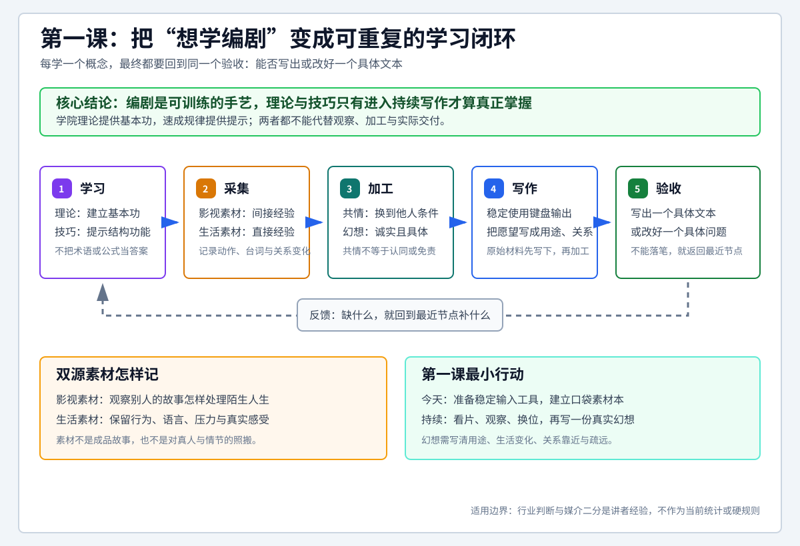

# 查理老师的编剧课 - 第一课 劝学

> 导航：[[知识库/学习区/课程/查理老师的编剧课/00 - 课程总览|课程总览]]｜[[查理老师的编剧课|统一知识总结]]

视频：[P2 第一课-劝学1.1](https://www.bilibili.com/video/BV1eE411F73t?p=2)｜[P3 第一课-劝学1.2](https://www.bilibili.com/video/BV1eE411F73t?p=3)｜[P4 第一课-劝学1.3](https://www.bilibili.com/video/BV1eE411F73t?p=4)。三P合为第一课，时码在各P内重新起算。

本课先说明编剧为什么可以学、理论和技巧应怎样取舍，再谈讲师眼中的行业与电影、电视剧的区别，最后落到素材记录、共情和一份真实幻想作业。贯穿全课的主张是：**编剧是一门能经过学习和训练掌握的手艺，学习最后要落实到能够写剧本。**

来源说明：复用并完整阅读三P的本地ASR，取得完整原视频，对照全片分布的原帧、画内字幕和板书，补核了“沟壑”、《罪夜之奔》及《人类简史》作者等识别疑点。本次未听审原声、未连续审看；讲师模仿哭声、拳脚动作和语气的动态细节未据此写成已核实的演示结论。下文保留其文字明确描述的情境与动作。行业、审美和人类演化部分均按讲师当时的观点或转述保存，没有加入外部研究结论。

<!-- source-evidence: bili-BV1eE411F73t-p2 -->
<!-- source-evidence: bili-BV1eE411F73t-p3 -->
<!-- source-evidence: bili-BV1eE411F73t-p4 -->

## 分集脉络

- P2｜第一课-劝学1.1：教学方法的取舍、入门顾虑与讲师选择编剧的理由。
- P3｜第一课-劝学1.2：行业责任、电影与电视剧的观看条件、讲故事与虚构。
- P4｜第一课-劝学1.3：键盘和素材本、生活记录、共情示范、真实幻想作业。

## 时间线笔记

### P2｜编剧可学，怎样学才落实到写作

#### 00:03–03:13｜学院派、速成派各自的问题

查理先去掉编剧的神秘感：它是一种手艺，和其他技术一样，可以学会，也需要练。他把常见教学概括为两种倾向。学院派重基本功和理论，开口便是“激励事件”“三幕式结构”“沟壑”“灵魂黑夜”等术语，容易让初学者觉得距离很远；速成派则从商业影视作品中归纳出好懂的规律，却容易把这些规律当成普遍真理。

“韩剧第六集接吻”是他举出的速成公式。爱情发展不能太早完成，否则后面的戏不好写，于是常安排一种概念化的吻：空间狭窄时蹭到、摔倒碰到、喝醉后发生，或者一方误闯另一方洗澡的空间。它暗示观众两人会成为一对，又没有立即完成真正的爱情关系。讲师借此解释公式想承担的功能，也讽刺创作者只按集数执行。

另一个公式是“电影约六十五分钟时男二号死亡”。讲师说，在这类双主角结构的解释里，男二常像男一的分身，代表其性格的一部分；这一部分死去，男一才完成蜕变、奋起反击。这是他用来说明速成教学的例子，不能读成他要求所有电影都在同一分钟杀死配角。

速成公式容易让人获得“我也能写”的信心，成品却可能千篇一律、缺乏灵魂。偶尔有一部奏效，也不能证明背熟套路就掌握了编剧。

#### 03:13–07:31｜两种学武比喻与“实战派”取舍

学院派的极端被比作上少林寺学功夫：先挑三年水，再劈三年柴、站三年梅花桩，仍迟迟没有学到自己以为的拳脚。在武侠片里，学徒忍不住找师父理论，两人比划起来，学徒才突然发现自己已经会了，转而为误解师父的良苦用心道歉。查理反问，现实中的基本训练真的会自动完成这种转化吗？师父也可能只是照搬自己当年受训的方式，自己都未必真能打。

速成派则像街边承诺二十天就能上擂台的师父，只教两套固定应对：出拳就蹲下掏裆，踢腿就跳起扫眼。学徒背熟之后便被送上擂台，可能偶然扫中一下，随后却被对手痛打。这是讲师讽刺死背规律的假想情节，和前例共同说明：只做基础训练、只背对招规律，都不等于能实战。

查理把自己的课程定位为“实战派”：最终目的是能够写剧本，到了需要理论和基本功的地方，就认真补足；遇到有用的规律、技巧和捷径，也愿意采用。他自述在一线做编剧十多年，也带过新人；疫情期间工作暂停，才有时间把这些经验系统讲出来。理论、技巧和经验的价值，在这里都由写作所需决定。

#### 07:31–10:31｜职业机会、非科班和文学功底

关于职业机会，讲师认为录课时中国影视市场仍在增长，演员之外的创意、技术岗位需要人才，年轻人可以尝试；即使不把编剧作为主业，也可把它看作另一项谋生技能。这是当时的从业判断，不能直接用作现在的市场或收入保证。

非科班是不是障碍？他的回答是，专业学校提供了基本训练，但没有上过电影学院、戏剧学院，不等于不能入行。他提到的估计是科班约占四成、非科班约占六成，课堂没有给出调查来源；这个数字在其论证中的作用，是降低初学者对出身的恐惧。欠缺的基本功仍要在实际学习中补。

文学功底与剧本写作也不是同一件事。查理把描绘春夜月色、晚风和人物心境的文学文字，与剧本中简洁的“夜、外、冷”作对照：剧本先要让人知道拍什么，不必把每个场景写成优美散文。现代时装戏的对白，大量使用日常说话方式；如果担心自己语言功底不足，可以先不碰对古代语言要求较高的古装题材。这里是在说明入门路径和题材差异，并没有教授“所有剧本都只需三个字”的格式规则。

#### 10:31–14:07｜幻想、创意与天赋

“我没有创意”的顾虑，在查理看来往往是还没有认出自己的素材。人会做白日梦、幻想另一种生活；发现它、把它加工出来，才是需要训练的能力。

他连续举了几类幻想。突然拥有两亿元，会在北京、上海还是老家买房，怎样花这笔钱，可以向《西虹市首富》式的金钱喜剧发展；想起过去喜欢的人，假如当初在一起，现在也许孩子都会打酱油了，可以成为爱情故事的起点；幻想当年继续踢球，今天带领中国队参加世界杯，或者当年选择从艺、如今已经成为明星，又会走向励志故事。若后一个幻想兜了一圈还是为了赚两亿元，讲师就拿它回到喜剧开玩笑。这些例子展示的是幻想可以被辨认为不同方向的素材，并没有在本课完成它们的剧情。

讲故事的天赋也确实存在：同学聚会或饭局上，有的人一开口就把大家吸引住，别人愿意等他的笑点，普通事情也能讲得有意思。查理随口估计这类人约占百分之五到十，没有提供统计依据。但缺少这种突出天赋，不妨碍通过训练成为合格编剧；有天赋的人，同样需要学习和练习。

#### 14:07–16:48｜辛苦与协作价值

写作的辛苦并未被劝学掩盖。讲师承认编剧会熬夜、焦虑，甚至用自己的头发作自嘲。他回顾自己做过演员副导演、现场制片、执行制片人、编剧、导演、制片人、出品人和监制等工作，解释为何最后仍愿意写剧本。

他的个人职业逻辑是：有更多资源、权力和关系的人，常常不愿承担辛苦的写作。如果自己能够提供他们需要、又不愿亲自做的手艺，就有机会与之合作，进入原来接触不到的层级。他用“抱大腿”形容这条道路，也把自己定位为认真干活的手艺人。这是其从业经历形成的选择理由，不是对所有人的职业承诺。

### P3｜行业责任、媒介区别与讲故事的意义

#### 00:03–03:05｜封闭高中食堂：在限制下把作品做好

查理对录课时中国影视作品的总体评价很低，认为烂片多，提到日本、韩国、香港、台湾以及泰国、伊朗、印度作比较。他承认成因复杂，并没有把问题简单归为审查一个因素；下面主要借比喻说明他希望新编剧采取的态度。

他把行业比作一所封闭高中的食堂。学生不能随意到外面吃饭，而承包时考察的又不是厨艺：或者看谁能交更多承包费，或者看是不是校长的小舅子。按他的说法，前一种考量使承包者失去做好饭菜的动力，后一种又未必选来有能力的人。于是，环境不能保证做出好饭菜。

未来的编剧可能就是食堂里的厨师。查理不准备在这堂课里讨论怎样改变整个制度，而是要求学员在已有食材、已有烹饪条件下，用心把自己的菜炒好。限制真实存在，仍应尽力提高自己负责的作品质量。

#### 03:05–06:29｜观众为什么看旧剧、看海外剧

他所谓观众“老龄化”，不是人口年龄统计，而是对一种观看习惯的比喻。年轻人反复看《武林外传》《乡村爱情》《爱情公寓》，明明知道刘能、赵四接下来又要闹什么，仍能笑出来；在他看来，这与老人反复听熟悉的戏有相似之处。

《铡美案》的例子说明观众在看已知的故事：包公会不会铡死陈世美，会不会有人喊“刀下留人”，再冒出一个太监干爹救人？查理故意列出这些荒诞变化，随后说熟悉这出戏的观众并没有这样的悬念。他没有在介绍某个真实改编版本。查理认为，未知本来应对年轻人有吸引力，反复重看旧剧也反映了新作品不够好的问题。

另一种选择是转看美剧、韩剧等海外内容。他进而提出审美“西方化”的判断，用欧式双眼皮、开眼角、鼻子与下巴整形、削脸、染发、美瞳等外貌追求作例，认为它们与西方影视所代表的文化软实力有关。这一因果联系和价值判断来自讲师，没有在课内提供研究证明。

他的落点仍是创作者责任：如果观众找不到好看的本土作品，不能只责怪他们去看外国作品；想谈文化自信、文化影响力，就应先把自己的影视作品做好。

#### 06:29–09:01｜演员是原材料，媒介身份不应成为等级

把行业问题都归给“小鲜肉”，也被查理反对。年轻、漂亮的演员只是一种审美和创作原材料；天天吃同一种面条当然会腻，但把它全部换成所谓“老腊肉”，也不是自动变好。菜不好吃，应先问厨师怎样使用原材料，不能只责怪原材料。他也批评把明星挣钱与科学家无人关注简单并列、缺乏根据便下结论的说法。

接着他谈录课时自己的另一项行业观察：中国电影整体有所进步，电视剧却常被注水拖累，于是形成电影从业者看不起电视剧从业者的风气。他回忆与一位年轻编剧见面，听到对方特别纠正“我是做电影的”；他将这句话理解为一种身份优越感，以此引出电影和电视剧到底区别在哪里。这里保留的是他的理解，而不是对那位编剧内心的确证。

#### 09:01–14:09｜电影偏结构、画面，电视剧偏人物、细节

板书把电影概括为“结构、画面的艺术”，把电视剧概括为“人物、细节的艺术”；口头又用事件驱动与人物驱动作比较。查理用观众留下的记忆检验这种差别：看过《爱情公寓》，容易记住曾小贤、胡一菲、关谷神奇，却未必说得出到底讲了什么事；看过灾难片《2012》，容易记住世界末日、洪水和灾难，却可能说不清主角到底是博士、警察还是特工。后面几个身份是他模拟观众模糊记忆时的说法，不是影片人物介绍。

为什么会形成这种倾向？他的解释是，播放方式会反过来影响艺术方式。他也提到电影通常预算较大、制作相对精致，但认为这种差距正在缩小，更根本的解释仍是观看方式。电影观众买票，进黑暗的放映空间，用大约两个小时接受一场服务，因此特别在意是否值得票价；电视剧观众可以坐在沙发上、用电视或平板持续看，人物会在生活里长期陪伴自己，使自己牵挂、欢喜、忧愁。

查理把看电视剧比作谈恋爱，把看电影比作一次付费服务，并直白地用了“嫖娼”的成人比喻，板书以“PC”简写。比喻的比较点是陪伴关系和单次消费期待，并非说两种媒介只能拍相应题材，也不是由此判定高下。他又把电影化的电视剧比作相亲对象既能长期相处，又带来原本意想不到的丰富体验，延续了这组玩笑。

这一比较还有变化条件。他举《罪夜之奔》《权力的游戏》《西部世界》说明，美剧已经出现完整的电影结构和很高的制作规格，电视剧也能吸收电影的做法。因此，前面的区分是讲师用来解释常见体验的入口，不能当成禁止互相借鉴的边界。

#### 14:09–15:10｜编剧就是讲故事的人

故事适合电影，就写成电影；适合电视剧，就写成电视剧。查理认为编剧没有必要因此分出身份等级。影视创作最早需要剧本文学作为依据，提供它的人首先是“讲故事的人”。随后关于人类的长例子，就是为了说明他为什么看重这个身份。

#### 15:10–22:19｜虚构如何支持共同身份与行动设想

讲师引用尤瓦尔·赫拉利的《人类简史》，转述“认知革命”和虚构能力的意义。以下保存的是他的课堂讲法，其中的人类演化年代、族群能力差异和竞争过程未在本笔记中作学术核验；他模拟的对话、河谷冲突和战术安排都是解释性想象。

能用工具是否足以区别人和动物？查理以《地球脉动》中动物使用工具的情形反问：猩猩用细棍和诱饵弄出蚂蚁，猴子会拿石头砸椰子。讲师是在口述这些例子，本课并未提供供学员分析的完整动物行为片段。他要说明的是，在自己的论证中，工具不是最关键的分界。

人类演化的部分，他先回顾按地区各自追溯祖先的旧式理解，例如中国的北京人、山顶洞人与欧洲的尼安德特人，再转述DNA研究指向共同的非洲智人来源，并说这些智人大约八九万年前走出非洲，在竞争中压倒其他人类。他把尼安德特人描述为体格更强、脑容量更大、已经穿皮衣，与仍然光着身子的智人对照，却说后者因为会虚构而获胜。这里的“讲故事”特指虚构能力，不是靠不断给敌人讲故事把对方说倒。

第一个答案是共同虚构能够把更多人组织起来。假设两群人在一处河谷相遇，一条河只够一支群体捕鱼、吃饭、洗澡和饮水，于是发生争夺；尼安德特人按血缘聚集，只有三十到五十名亲族可来帮忙。智人却可以把不同血缘的人说成同一个村、同一只狮子的儿女，建立共同符号和共同身份，或者说祖上都喝同一条河的水，是“黄河的儿女”。彼此并非亲属的人，便可能因为相信同一个故事而合作。狮子、标志、村落和河谷都是这段课堂设想的具体构件。

第二个答案是假设未来，可以预先协调行动。智人可以先商量，明天敌人来时谁去左边、谁去右边，谁绕到后面，谁正面迎敌，以及中午准备吃什么；大家在事情还未发生时，就能一起组织一个行动方案。在讲师故意夸张的对照里，另一群人一听“明天敌人来了”，便把假设理解为敌人已经来了，立即紧张寻找，难以完成这种预演。

这两个例子分别把“虚构”连到超越血缘的群体组织和未发生情境中的协作。查理据此夸张地说，讲故事的人打开了人类历史，也会带着人类走向未来。它是劝学中对故事意义的强调，不是关于现代编剧职业起源的历史结论。

### P4｜工具、素材、共情与原课作业

#### 00:03–01:40｜准备键盘和口袋素材本

键盘是第一项准备。编剧需要大量写作和练习，查理不希望学员要写东西时还拿手机戳九宫格；已有电脑和键盘，就不必另外购买。机械键盘的敲击感、仪式感是他的个人体验，重点仍是能够持续写。

第二项准备是随身携带的小本和笔，用来记两种素材。一种来自大量看片：看不同风格、不同类型的优秀作品，快速接触自己没经历过的人生和遭遇。例如一部杀手片，让人观察自己很难亲历的“杀人之前是什么感觉”，也能体会作品如何处理这种处境。另一种素材来自生活，这部分的观察和感受更直接、更真切。

#### 01:40–03:44｜同学聚会与裁员谈话：留意具体行为和话术

毕业十年再聚会，人物已经发生变化。有的人把车钥匙往桌上一扔，抢着买单，谈生意时故作熟悉地说自己和阿里巴巴合作、与马云或王健林怎样往来；过去喜欢的人再次见面，又会有怎样的反应？讲师让学员记录这类场景中的动作和说话方式，而不仅记一个“同学聚会”的事件名。

疫情后回到公司，也可能遇到更不愉快的情境：公司快撑不下去，老板拍肩叫“小刘，到我办公室来一趟”，准备开除你。他可能先问你来公司几年了，谈这三年的关系，再把话说成兄弟之间不得已的决定。查理提醒留意这种谈话的铺垫、次序和具体语句，因为一般人不会经常经历，过后又容易忘掉其中的细节。

#### 03:44–06:22｜丧亲经历：真实反应可能不同于预想

查理以父亲去世时的个人经历，说明为什么要留住与想象不同的真实感受。他在外地凌晨接到消息，赶最早的飞机回去；随后忙着殡仪、火化、下葬和招待亲友，一整天都像处于蒙住、忙着办事的状态，没有立即出现自己原先想象的悲痛反应。

直到把所有人送走，他独自留下，才第一次哭。按他的形容，眼泪不像通常设想的啜泣，而像在往外放水，流得极快，仿佛水的力量从嗓子眼推出了一种机械的、原始的哭声；他一度觉得那不像是在哭。这是他对自身感受的描述，不能延伸为普遍的生理解释。

由于反应与预想差别太大，他忍不住把它记下来，认为这种材料很宝贵。他同时明确不希望学员都遇到类似经历，自己的讲述已经可以提供一种经验。这个例子的用意是说明观察会纠正想象，并不是要求为了创作去经历苦难。

#### 06:22–07:00｜普通生活也持续提供素材

素材不限于重大事件。排队时，一对情侣面前走过一个美女，男方既想看，又要顾及女友的目光，那个细微反应也值得记录；有特点的人物、好的场景和日常细节，都可以进入本子。讲师希望记录成为日常习惯，把看片得到的多样经验与生活中的真切经验一起积累下来。

#### 07:00–08:13｜共情：进入角色的立场

共情也叫同理心。查理把它解释为进入角色内心，去体会这个人为什么这样做、究竟怎样想；这对写作很重要。

回到被开除的例子，自己当然会生气，但还可以站到老板的位置重新看：公司面临什么情况，手下五名员工，究竟该裁掉谁？换位后，也可能发现老板的处境难办，甚至自己处于那个位置时，对原来的自己也不满意。练习要改变的是观察和理解的位置，课堂并没有由此作出“裁员一定正确”的裁决。

#### 08:13–10:08｜空调夫妻：从物件处境展开共情

共情还可以练到非人对象上。查理把空调室内机想成妻子、室外机想成丈夫：三年前它们一起被带来，安装后便分开，一个在屋内，一个在屋外，共同工作，却一直见不到彼此。牛郎织女至少每年还能见一次，它们连这样的机会都没有。

丈夫在外面风吹日晒，已经生锈，仿佛得了癌症，可能快不行了；丈夫不能再工作，室内的妻子也失去使用价值，两台机器就要一起被拆走。这样想很悲惨，但换个方向，它们是不是终于能相见了？讲师从同一组处境中看出了悲与喜的两面，没有替学员固定一个唯一结局。

这个例子具体展示了他怎样把真实物件的分离、协作、损坏和更换，想成人物关系与命运，再试着体会它们的感受。原课并没有进一步给出完整剧本。

#### 10:35–12:02｜老师布置的作业：写一个真实幻想

结尾在简短的账号宣传之后，老师在板书写下“作业1：幻想”。要求是写一个自己真正有过的幻想，不管它关乎金钱、权力、爱情、职业成就，还是为国争光；不要因为愿望不够体面，或者比别人的愿望大，就不肯诚实写出来。

幻想还要继续写具体。假如想有两亿元，不应只停在这个数额，要写得到钱以后怎样花、生活怎样与现在不同，自己会和谁更亲近、和谁更疏远。讲师说后面的课会说明这些材料怎样使用。本课没有给出标准答案、字数要求、评分表，也没有要求当场写成完整故事。

## 原有图示、链接与学习记录

这张图是旧稿整理者把学习、采集、加工、写作和验收连成的辅助图，保留原附件与链接。图中的五步闭环、“共情不等于认同或免责”和返回节点等文字属于整理者归纳，不是原课板书或老师布置的固定流程。

原有主题链接继续保留：[[知识库/学习区/综合整理/01-故事与剧本/从灵感到完整故事]]、[[知识库/学习区/综合整理/01-故事与剧本/从人物共情到人物弧光]]、[[知识库/学习区/综合整理/01-故事与剧本/从写作困境到编辑完成]]。这些是既有整理的关联，本次未重新推导或修改。

[[知识库/学习区/个人思考/查理老师的编剧课 - 第一课原有学习记录|原有状态、学习栏目与旧稿记录]]已另存；其中固定字数、七天素材本、四步共情等扩写，不作为本课新增学习任务。
