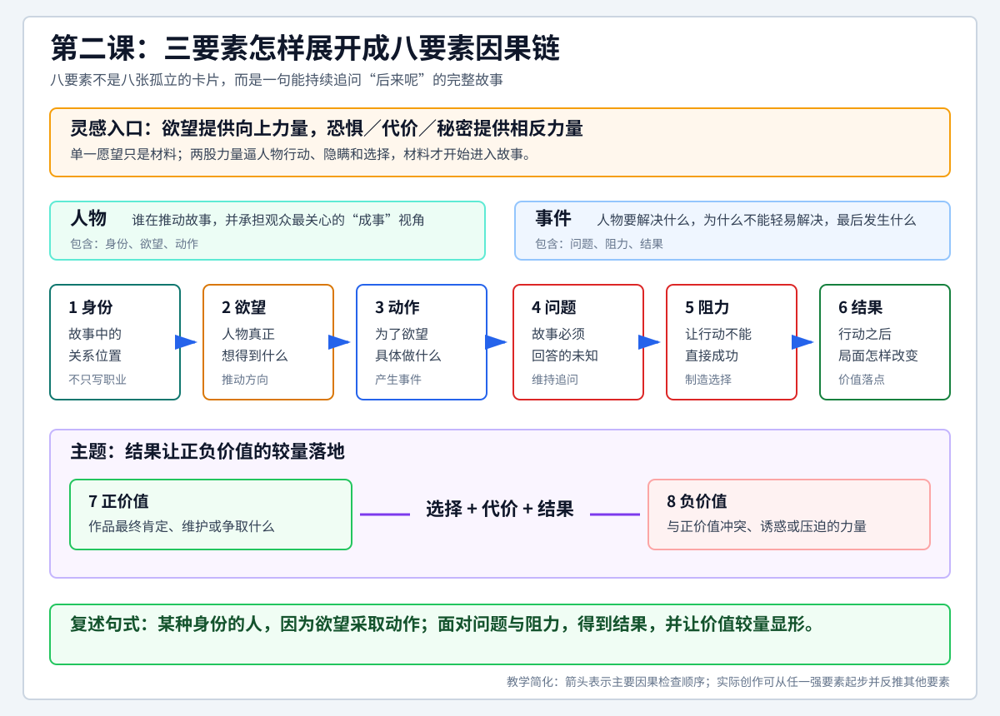

# 查理老师的编剧课 - 第二课 故事的要素

> 导航：[[知识库/学习区/课程/查理老师的编剧课/00 - 课程总览|课程总览]]｜[[查理老师的编剧课|统一知识总结]]

视频：[P5 第二课-故事的要素2.1](https://www.bilibili.com/video/BV1eE411F73t?p=5)｜[P6 第二课-故事的要素2.2](https://www.bilibili.com/video/BV1eE411F73t?p=6)  
说明：本笔记按“课”聚合 P5-P6，根据本地 ASR 整理，不是官方逐字稿；个别专名以原视频为准。

## 本课速览

- 核心问题：怎样把欲望、恐惧和观察组织成一个完整故事。
- 主要结论：先把灵感从神秘天赋变成可收集的素材，再用人物、事件、主题三要素和八要素建立完整因果。
- 学习价值：把本课多个分 P 放回同一教学目标，既可顺序复习，也能看清每集承担的推进任务。
- 适用环节：灵感与命题、故事骨架。

## 直观教学图

> [!tip] 怎么读
> 先看顶部“欲望 + 相反力量”怎样让灵感进入冲突，再按身份、欲望、动作、问题、阻力、结果读完主因果链，最后检查结果是否让正价值与负价值的较量真正落地。

> [!note] 适用边界
> 箭头是完整性检查顺序，不是唯一构思顺序。创作可以从人物、事件、主题或任一强要素起步，但最终仍需把八项重新连成因果，而不是填八个互不相干的名词。

## 来源可靠性

- 信息来源：本地 faster-whisper ASR，无官方字幕。
- 完整程度：P5-P6 均完整读取到片尾。
- 校正说明：关键编剧术语已按上下文校正，口语举例仍以原视频为准。
- 外部补充：无；本笔记只整理讲者内容及已有课程综合。

## 分集脉络

- **P5｜第二课-故事的要素2.1**：从欲望、恐惧与共情寻找灵感，用相反力量让单一愿望开始产生故事。
- **P6｜第二课-故事的要素2.2**：把故事拆成人物、事件、主题三要素及八个小要素，并把它们连成因果链。

## 时间线笔记

### P5 第二课-故事的要素2.1

#### 整体脉络

- `00:00-05:30`｜从“没有故事就无法学编剧”的卡点切入，把灵感从神秘天赋改写成可以训练、记录和调用的创作材料。
- `05:30-11:30`｜提出“始于心，成于脑”：故事先由直觉冲动启动，再由理性加工；灵感的两大来源是自己的肉身经验与对他人的共情。
- `11:30-18:30`｜把欲望与恐惧组合成最小冲突。以“想拥有两亿元”和“害怕偷窃身份暴露”为例，展示单一愿望怎样因向下力量而成为故事。
- `18:30-21:13`｜要求建立素材矩阵：围绕一个欲望，把来源、花法、代价、恐惧、现实观察和共情对象都列出，形成可继续筛选的素材包。

#### 详细导览

这集最重要的纠偏是：灵感不是等来的闪电，而是被记录下来的体验。第一部作品可以优先从自己的欲望、恐惧、羞耻和遗憾出发，因为这些材料最真实；以后持续创作则需要训练共情，去理解别人想得到什么、害怕失去什么。课程并不要求一开始就精彩，而是先让灵感从零变成可加工的材料。

“两亿元”本身只是愿望，不是故事；给它配上“这笔钱是偷来的”或“继承身份其实是冒名所得”的恐惧，人物就必须行动、隐瞒、选择，观众才会追问“后来呢”。检验灵感是否进入故事的简单办法，是讲给别人听，看对方是否自然追问后续。

### P6 第二课-故事的要素2.2

#### 整体脉络

- `00:00-06:00`｜把可成为剧本的故事分成人物、事件、主题三要素；主角既是推动者，也是观众最希望其“成事”的视角人物。
- `06:00-16:00`｜把三要素细分为八要素：人物的身份、欲望、动作；事件的问题、阻力、结果；主题的正价值、负价值。
- `16:00-22:00`｜用《喜剧之王》检查八要素，说明外部目标即便未完全达成，人物仍可能获得更深层的价值结果。
- `22:00-30:00`｜用《西游记》讨论群像与“假多主角”：多个角色有时是同一人物不同性格或选择的外化；真正多主角必须存在关系变化与互相影响。
- `30:00-32:23`｜把八要素连成一句完整因果链，为后续“怎样从完整走向精彩”留下问题。

#### 详细导览

八要素不是八个孤立标签，而是一条因果句：一个处于某种身份的人产生欲望，为此采取动作；他要解决核心问题，受到多层阻力，最终得到结果；这个结果使正负价值的较量落地。身份不是职业标签，而是人物在这个故事中的关系位置，例如侠客在复仇故事里首先可能是“儿子”。

课程把“主题”定义为作品最终肯定的价值，而不是一句口号。这个说法带有讲者鲜明的方法论立场，后续 P11-P12 会进一步区分：结果可以失败、黑暗甚至让邪恶暂时得胜，但主题层面的价值判断仍应清楚。

## 核心观点

- 灵感首先来自自己的肉身经验，也要通过共情扩展到他人的处境。
- 欲望提供向上的力量，恐惧、代价、秘密或相反力量让愿望变成冲突。
- 八要素不是人物卡，而是身份、欲望、动作、问题、阻力、结果与价值之间的因果链。
- 完整故事先回答人物要什么、怎样行动、遇到什么阻力、结果改变了什么。

## 方法与案例

1. 建立灵感素材包：围绕一个欲望收集记忆、现实观察、恐惧、代价、秘密与共情对象。
2. 把八要素写成一句因果句，而不是分别填八个名词。
3. 用‘讲给别人后，对方是否追问后来呢’检查素材是否已经进入故事。

## 可实践练习

1. 写下一个真实欲望和一个最害怕发生的结果，把它们组合成一句故事种子。
2. 不看笔记写出八要素，并用一段话把它们连成因果。
3. 选一个熟悉人物，区分他的职业身份与他在当前故事中的关系身份。

## 主题沉淀

### 已沉淀

- [[知识库/学习区/综合整理/01-故事与剧本/从灵感到完整故事]]：本课相关方法已进入统一主题笔记。

### 待沉淀

- 暂无新增候选；相关内容已并入现有主题。

## 复习区

### 一分钟核心摘要

先把灵感从神秘天赋变成可收集的素材，再用人物、事件、主题三要素和八要素建立完整因果。

### 自测问题

1. 本课主要解决了哪个写作问题？
2. 各分 P 分别承担了什么教学推进任务？
3. 怎样把本课方法应用到一个具体故事，而不是只复述术语？

### 任务

- [ ] #复习 不看笔记，用一分钟复述“故事的要素”的核心方法。
- [ ] #复习 回看本课一个关键时间点，核对自己最容易混淆的概念。
- [ ] #创作练习 把本课方法应用到当前项目的一个具体人物、事件或场景。

## 二刷时可以重点听

- P5 欲望与恐惧怎样组合成最小冲突，以及素材矩阵的建立方法。
- P6 八要素的定义、《喜剧之王》和《西游记》的完整性分析。
