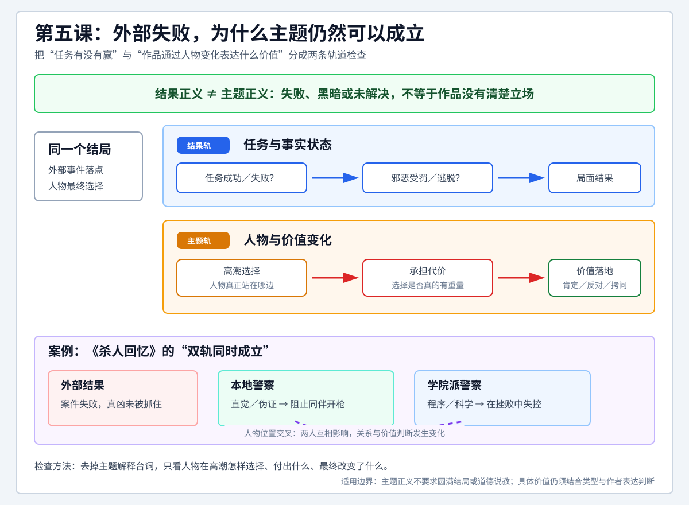

# 查理老师的编剧课 - 第五课 剧本的正义

> 导航：[[知识库/学习区/课程/查理老师的编剧课/00 - 课程总览|课程总览]]｜[[查理老师的编剧课|统一知识总结]]

视频：[P11 第五课-剧本的正义5.1](https://www.bilibili.com/video/BV1eE411F73t?p=11)｜[P12 第五课-剧本的正义5.2](https://www.bilibili.com/video/BV1eE411F73t?p=12)。两P合为第五课，时码分别起算。

这是一节因学员反馈追加的课，回应两个问题：为什么不直接教剧本格式；既然现实和好电影都有坏人获胜，为什么老师还要求主题具有正价值。后一个问题的关键是：**外部结果的输赢，与人物变化所承载的主题，是两个层次。**本课以《杀人回忆》两名警察的关系变化展开解释。

来源说明：两P完整视频和既有音频均已取得；全文ASR经来源先行阅读与成稿后回读，原帧核查覆盖两P全时长抽样及关键字幕、板书。未听审原声、未连续审看，静帧不能证明语气、运动、节奏或声画同步已核清。片例、从业往事、类型归类及社会背景解释按讲师课堂说法保存，未另作外部事实核查。时码用作回查索引，与字幕可能有数秒偏差。

本轮增量复核（2026-10-03）：先完整读取冻结清单内P11、P12的large-v3全音轨机器转写，再对照本篇完整正式正文逐项检查观点、理由、独特案例、条件与方法关系；本轮完成文字语义复核，并实际定点核看P11 925.547秒一帧原视频硬字幕“一个故事包含完整八要素的故事”；未回听原声、未连续审看，其余图文范围沿用历史记录。本轮仍待核：P11新raw461“不完整”与实际硬字幕“完整”不同；作业要求已按硬字幕和前后文核清，原声措辞仍未听核；整体原声与连续声画未审。

<!-- source-evidence: bili-BV1eE411F73t-p11 -->
<!-- source-evidence: bili-BV1eE411F73t-p12 -->

## 分集脉络

- P11｜第五课-剧本的正义5.1：先学故事的理由与三个失败经历；区分主题正义、结果正义；引入《杀人回忆》。
- P12｜第五课-剧本的正义5.2：案件线与双主角关系线；编剧对所有人物共情；两名警察的变化如何承载主题；明确第一篇故事作业。

## 时间线笔记

### P11｜先写故事，再谈剧本的正义

#### 00:04–04:41｜八要素与五个突破口，不是同一张清单

前面的课先教故事，是因为故事是剧本的原材料。电影、电视剧都是讲故事的方式；编剧首先要能讲出故事。

查理重新写出三大要素及八项细分：人物包括身份、欲望、动作；事件包括问题、障碍（阻力，课中还提到“沟壑”的叫法）、结果；主题包括正价值与负价值。八项串起来可以成为完整故事，但完整也可能平庸，所以第三课进一步讨论怎样提高各项的烈度。

第四课又解决“明白完整和精彩，却仍不知道从哪里下手”的问题，提出身份、激励事件、过激行为、悬念、环境五个突破口。老师在此特别澄清：**五个点是从八要素中抽出的入手处，不是用来取代八要素的另一套完整构成。**其中一个点有力，就可以开始动手，再把故事的其余部分写出来。

#### 04:41–06:50｜“给我一个格式，我就能输出故事”的误判

有学员希望跳过原理和故事训练，直接知道剧本格式、多少页、多少场，镜头怎样摆、演员怎样调度。

查理推想，这种急切可能来自两种自信：一是自觉有天赋，认为故事已经在心里，只差一个模板把它倒出来；二是阅片很多，熟悉名作、经典细节，会写影评，便觉得不必再学讲故事。他没有否认这两种积累，而是提醒：它们还不能证明实际写作已经过关。

#### 06:50–10:31｜自己只索要旧剧本，回去却写成流水账

老师回忆刚入行时，曾向一位老编剧请教。对方认真备了书，准备从理论到实践系统讲解；他听了几句，却借口赶时间，只想拿一集旧剧本回去看格式，甚至说十年前、不需要保密的淘汰稿也可以。

当时他的想法是：好莱坞影片自己都看得懂，隐喻和经典细节也能说出来，何必再听这位前辈从头教？后来回去动笔，才发现写出来是流水账。

查理用汽车作比喻：开过法拉利、保时捷，并不意味着有资格轻视一个比亚迪发动机设计师。后者至少能做出零件、造出汽车，前者可能只是会开。**欣赏、分析过好作品，不等于已经掌握生产它的能力。**这个比喻是对自己当年心态的反省，不是对品牌的技术比较。

他还指出，学员问的镜头摆放、演员调度，属于导演组的拍摄脚本工作，与这里要学的编剧剧本不同。本课没有展开拍摄脚本格式；他的建议仍是先试着写故事，别以为拿到格式就自然会写剧本。

#### 10:31–12:49｜文学经验也不能省掉媒介转换的学习

老师补充，并非所有“只差格式”的提问者都只看不写，有些人已有小说和文学功底。他以一次《盗墓笔记》电影开发经历说明这个区别。

按查理的回忆，当时版权在朋友手里，他们与南派三叔一起开会。作家对写剧本很自信，表示自己来写；查理觉得小说与剧本隔着行，便给了一份结构纲，提示先处理人物出场、激励事件等问题。几个月后仍没有拿到剧本。

老师说到“一天能写一万字，写剧本岂不是三四天”时，明确补了一句：**对方不是这样说的，这是他所理解的自信感受。**本笔记因此不把这句话当南派三叔的直接引语，也不由这段课堂回忆推断其全部创作能力。

这一例服务于本课结论：剧本讲故事有自己的逻辑。即使有文学基础，只要没做过，仍值得先学和实际尝试。

#### 12:49–14:53｜口头段子好听，换三个地点仍可能只是相声

另一个朋友平时说话很逗，能把大家逗得前仰后合，写稿也快。查理看他的剧本，却发现连续七八页都是甲说什么、乙说什么。

稿子不是没有换场：第一场在家里沙发上，第二场在车上，甲开车、乙坐副驾驶，第三场两人在饭店吃饭。但每场仍只是两个人接着说，换地点没有产生必须换场的理由。

老师对朋友说，好看是好看，可这更像相声：这三场内容坐在家里也能说完，为什么要换场？这个失败例子不是禁止剧本写长对话，而是提醒学员，口才、段子天赋和地点数量本身，不足以证明已经写出适合剧本的故事。

#### 14:53–16:53｜先用一篇完整故事检验自己

不管自认为有天赋、阅片无数，还是已经从事文字创作，老师都建议先写一篇来检验，而不是只争论自己需不需要学。

他在这里布置：**从五个突破口选一个，把八要素写完整，写一篇1000–2000字、约1500字的故事。**这样下一阶段学把故事转成剧本时，手里已有自己的原材料。

课堂当时提供了交流和交作业渠道，老师表示会逐篇沟通怎么修改；本视频没有展示这些作业或点评结果。他还以“好故事只差格式，我可以帮你改”强调轻重：好故事珍贵，格式可调整，不能把不会格式当成故事写不好的根本原因。这些是授课时的表态，不是本笔记新提供的服务。

#### 16:53–20:10｜主题的正义，与结果的正义分开看

另一位学员质疑：老师反复要求正义战胜邪恶，可现实中邪恶会赢，优秀电影中也有坏人胜利，为什么一定要这样写？

查理承认会有邪恶获胜的结果。他强调，此前说的是**主题的正价值战胜负价值**。例如战争中邪恶一方赢了，这说的是事件结果；结果可能令人失望，并不自动意味着作品主题也在肯定邪恶。

因此，“剧本的正义”首先是区分两个问题：故事最终发生了什么；故事的主题在肯定什么。老师要求的正价值属于后一层。这是他的课程立场，不把它改成所有作品必须有圆满结局的规则。

#### 20:10–21:41｜求死警察可以死、可以失败，主题仍可改变

第三课那个迫切想殉职的警察，主题是“活着更好，可以保护更多女儿、更多人”。

结局可以有不同选择：他抓住凶手，勇敢活下去；他与凶手同归于尽；甚至没抓到凶手。老师认为，关键是人物已经发生蜕变，从只想求死，转为认同活着守护他人的价值。事件结果即使没有胜利，主题仍可能得到伸张。

结合前面的八要素来读，这里“结果不重要”是在区分主题与外部输赢；不宜将这句话扩展成故事不需要结果，或任意结局都同样合适。

#### 21:41–24:43｜《杀人回忆》：没抓到凶手，是否就是负价值

老师很推崇《杀人回忆》，将它与同由奉俊昊执导、宋康昊主演的《寄生虫》联系起来，并以韩国影史地位、与《霸王别姬》相比来表达评价。这里记录他的推荐和比较，不把课堂赞语当作已经核实的统一排名。老师特别建议，没看过的学员在听完本课后去看这部电影。

按课堂简述，20世纪80年代一个韩国小镇发生连环奸杀案。两个警察，一个是本地警察，一个是从首尔来支援的刑警，共同追查。到最后，他们面对一个自认已经有约95%把握的嫌疑人，仍无法将其定罪，最终放人，没有抓到凶手。

从主角任务结果看，正义似乎没有实现。但这是否说明电影没有正价值？P12继续分析。老师所说的把握程度，是叙述人物和观众的确信感，不能当成嫌疑人已经被证明有罪。

### P12｜从案件线转向两个人怎样互相改变

#### 00:03–03:47｜两名警察、几轮嫌疑人与证据冲突

查理将两名主角简记为警A、警B：A是宋康昊饰演的地方警察；B从首尔来，受过大学和专业刑侦教育。小镇连环案件引起关注，B来支援，两人共同侦查。老师用第一、第二、第三、第四嫌疑人梳理推进，不是在本课列全原片每个调查对象。

第一名嫌疑人是当地一个有智力和身体障碍的年轻人，经常跟着镇上的女性。在人心惶惶的情况下，他先被怀疑；A又从口供中找到自认为支持定罪的线索。B却认为证据不足，而且对方的身体条件难以实施案中的捆绑和侵害。后来证明不是他。

案件继续，两人的判断也多次不同。到最后一名主要嫌疑人时，老师说两名警察和观众几乎都认定是他，甚至愤怒到动手。然而现场取得的DNA样本与他不一致，还是必须放走，影片没有交代真凶是谁。

老师提到，这部电影取材于真实案件，并说相对授课时间的“去年年底”有新闻报道，通过DNA排查找到了凶手。这个课堂背景和影片结局是两回事：电影里仍未破案。这里未另核现实案件的后续信息。

#### 03:47–05:17｜多年后回到现场，凝视镜头的课堂解读

老师继续转述片尾：多年以后，A已经不当警察，改做小生意。一次开车送货经过小镇，他忍不住回到当年案发地，又去看发现第一具尸体的沟渠。

一个孩子走来，问他看什么，又说此前也有一个普通男人来这里看过。那人说自己以前在这里做过一些事，想回来回顾。A立刻警觉，追问对方是谁。

接着，按老师的描述，警察转向镜头，长久凝视。他将这个镜头解释成对凶手的质问：虽然没抓到你，但我看着你。此处为课堂对镜头的转述和解释，并非对原片声画过程的独立核验。

#### 05:17–07:12｜观众替主角难过，编剧还要理解其他人

查理说，自己看过多次，仍会因凶手没被抓到而生气、难受。这样的压抑感说明电影把观众带入了人物处境；但转到编剧工作时，不能只停留在“这么好的警察为什么没成功”的情绪里。

观众可以跟着两位主角着急，编剧却要进入老师所谓“无我”的状态：**对剧中的每个人产生共情。**警A、警B是自己的人物，嫌疑人同样也是，不能只站在一两个人的立场给整个故事下判断。

#### 07:12–09:31｜孤胆英雄的反例：被清掉的喽啰也有人生

老师举一种常见故事：孤胆英雄潜入敌方建筑或游轮，为避免惊动目标，悄悄解决沿途几十个小喽啰，最后杀死坏人头目。只跟着主角看，好像正义伸张了。

他反问，那些喽啰呢？他们也可能有家庭、有爱恨情仇，也许只是到某个公司上班，老板恰好是坏人，就被主角一起杀掉。这个反例要求作者再换一个人物的立场，不能因为主角完成任务，就自动把涉及所有人的结果叫作正义。老师没有逐案论证这些部下是否无辜。

回到《杀人回忆》，编剧还要理解被怀疑的人、受害女孩、真凶以及镇上的普通居民。查理再次提到第一课“与空调共情”的说法，是为了强调这种不只偏向主角的视角。

他说编剧要“冷血”，同时又说要与任何角色共情；放在这一段里，指的是跳出单一主角的情绪，组织全体人物。结果是否令观众觉得正义，可以成为观众继续思考的问题；本课强调的仍是主题层面的正价值。

#### 09:31–12:49｜老师为何按“兄弟情”来分析这部电影

查理把《杀人回忆》归入他所用的爱情大类之下的“兄弟情”，而不以破案片作为本次分析的主轴。他认为，结构主要在讲两名警察如何通过同一件事互相影响、成长、成全。这是课堂的类型分析口径，不等于电影只有一种被普遍认可的类型标签。

两人起点相反。A粗野，老师形容他白天当警察、晚上唱KTV（课堂在此把“逛窑子”的口头说法改口为唱KTV）。他凭直觉和地方经验办案：认定一个人，却没有证据，就把嫌疑人的鞋拿到现场按出鞋印、拍成“证据”；没有口供，就打人逼供。B的形象则高大挺拔、浓眉大眼，老师用“一米八五版朱时茂”作外形类比。他重证据、重流程，受学院训练，上来把案件按连环案分析，采用课堂所说的FBI理论和犯罪侧写。老师从外形、行为和方法几方面建立两种人的对照。

第一轮对嫌疑人的判断，B证明A错了，取得上风。下一轮由B主导，却也有判断错误；A的实战小技巧和野路子又扳回一分。两人你来我往，有争吵、打架、撕破脸，到最后才共同面对主要嫌疑人。

板书先将警A、警B接入同一件案件，再以①至④串起嫌疑人推进；讲到类型时，老师又把两名警察框在一起强调。他借这张图把注意力从案件结果转向两人的关系。

老师没有逐一讲完每一轮的证据链。此处保存的是这些轮次怎样改变两人关系，而不补写原片没有在课堂展开的侦查过程。

#### 12:49–14:55｜野路子与科学，两个人都不是完整无缺的

为说明A有多野，老师讲他去找“大仙”算命，希望知道该去哪里抓嫌疑人。对方给他一壶液体，让他去犯罪现场抓一把泥，撒进液体，然后“往水上一泼”，称等干后就会显出嫌疑人的脸；A竟相信这种办法。“往水上”按画内字幕原样记，未听审原声确认该字；原课没有具体解释这个做法。

另一次，老师说系列案件已经有六七名受害人，其中一次现场清理得没有那么干净，警方终于取得精液样本和DNA，却没有发现阴毛。按老师的解释，实施侵害时毛发可能脱落，所以这种“留下精液却没留下阴毛”的差别引起A注意。A据此推测凶手没有阴毛，骂了一句“白虎”，便到各处澡堂洗澡、蹲守，观察来洗澡的人。这里的受害人数和线索推理按课堂转述保留。这个带喜剧意味的细节，连同求大仙的例子，用来展示人物的野路子；不是本课提供的真实侦查准则。

B坚持DNA和科技破案，但老师同样指出他的缺陷：固执、高傲，有想法不愿分享。他还反问，为什么首尔的刑警会来到这个小镇，以此提醒不要只看B的光鲜履历；本课没有给出已证实的来镇原因。

因此，人物关系不是“一个全错，一个全对”。两人都走自己的极端，也各有缺陷，才会在共同事件中不断碰撞。

#### 14:55–16:40｜结局不是只有“合作”，还有位置交叉

最后面对那名两人都高度怀疑的嫌疑人时，他们已经站到一起。然而更显著的变化是：两人的立场交换了。

原本最稳、最讲科学证据的B，此时想拿枪直接杀掉嫌疑人；原本粗野、会伪造证据的A反而阻拦，提醒“我们是警察”，不能这样杀人。

查理认为，这不是仅仅从不合作变成合作，而是两人彼此影响，关系和行为位置发生了交叉。他据此把故事的重心放在两个男人的变化。这里既保存老师称之为成长、成全的解释，也保留B走向冲动这一具体表现，不把两人的变化简化为各方面都变好了。

#### 16:40–17:57｜社会群体的映射，是讲师进一步的解释

老师进一步把片中20世纪80年代、1986年的案件背景与韩国学生运动联系起来，又提到《出租车司机》。他认为，当时知识分子和工农群体之间的社会矛盾，可以在这两名警察的差异中找到映射：两人代表不同群体，最后通过同一事件互相影响、理解。

这段是讲师的社会解读，课堂没有考证两个电影所涉历史事件的具体年代，也没有证明这种人物对应是创作者明确表态。笔记保留其解释，不把两部影片强行归为同一年或同一历史事件。

查理由此总结：共同经历让两人发生变化和蜕变，主题上的正价值得以呈现。案件未解决、观众得不到外部胜利的安慰，与这一主题判断可以同时存在。

#### 17:57–19:36｜初学阶段先把朴素价值和线性故事写清楚

老师原本想在后面再讲这个问题，是怕过早引入复杂分辨，干扰初学者写第一篇故事。他仍建议先用最朴素、普适的正价值。现实生活里什么算正价值并不总那么容易区分，所以初步训练先从清楚的价值出发。

课末再次布置约1500字的故事：八要素完整，自己选一个有力的突破口，补上其余内容，按顺序写成**线性故事**。复杂结构和“玩花”的办法留到以后。完成这篇，下一步才进入把故事转成剧本。

## 老师的作业与本课未展开的部分

写一篇1000–2000字、约1500字的完整故事：从五个突破口选一个做好，包含八要素，按顺序写成线性故事，主题先采用朴素、普适的正价值。老师表示这篇会成为后续改写剧本的依据。

老师还建议听完课去看《杀人回忆》，但没有另给观影问题清单。

原课没有提供这篇作业的统一标准答案，也没有展示学员提交与个别修改结果。《杀人回忆》是分析例子，不是要求照写的作业范本。本课没有详教剧本格式、拍摄脚本、每种复杂类型的价值判断或全部历史背景。

## 原有教学图与关联

保留既有整理图。图中“高潮选择—承担代价—价值落地”“去掉主题解释台词”等是原稿整理者的检查方法，不是本课逐字板书。图中两名警察位置交叉与案件未解决的对照，可结合上文老师实际讲述的情境理解。

原有主题关联：[[知识库/学习区/综合整理/01-故事与剧本/从灵感到完整故事]]。原有状态、学习栏目和完整旧稿入口另存于[[知识库/学习区/个人思考/查理老师的编剧课 - 第五课原有学习记录]]。本批只复核课程正文，保留统一总结和既有主题关联。
