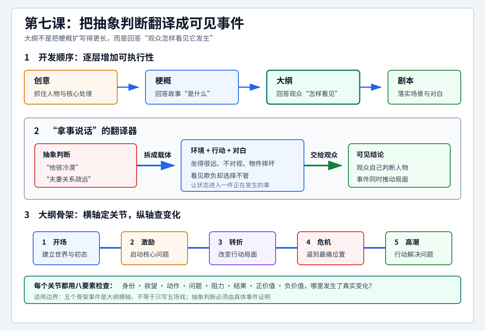

# 查理老师的编剧课 - 第七课 拿事儿说话

> 导航：[[知识库/学习区/课程/查理老师的编剧课/00 - 课程总览|课程总览]]｜[[查理老师的编剧课|统一知识总结]]

视频：[P14 第七课-拿事儿说话7](https://www.bilibili.com/video/BV1eE411F73t?p=14)。第七课只有这一P。

梗概可以直接说人物是什么样、想做什么；进入大纲，这些描述必须变成事情，使观众能够看见。本课先解释这一变化，再把四个结构阶段连成五个骨架事件，用八要素检查人物、事件和主题在各阶段的发展。

来源说明：完整视频和既有音频已取得；全文ASR与覆盖全时长抽样、关键板书及识别疑点的原帧结合核查。未听审原声、未连续审看，静帧不能证明语气、连续动作、剪接节奏或声画同步已核清。下文的三幕、四幕和五事件对应按老师本课的教学模型保存，不作为所有影片的固定时长规范。时码供回查。

<!-- source-evidence: bili-BV1eE411F73t-p14 -->

## 分集脉络

- P14｜梗概与大纲的区别 → 老李性格的说明与反例 → 三幕、四幕和起承转合 → 五个骨架事件 → 警察“想殉职”的事件化 → 八要素与五事件的表格。

## 时间线笔记

### 00:03–02:58｜从八要素梗概到万字纲，改变的是写法

上一课提前插讲格式，这课回到剧本开发的顺序。前几课让学员写一个约1500字、1000–2000字范围内包含八要素的故事。老师在这里说明，那份作业是**梗概**。通常的开发顺序是：

**创意 → 梗概 → 大纲 → 剧本。**

创意可以从前课讲过的五个地方入手；形成梗概后，还要经过大纲才能进入剧本。大纲常在一万字左右，所以课堂称“万字纲”。这只是老师说明的通常体量，不表示只要写到一万字就完成了大纲。

老师模拟学员的疑问：既然要一万字，为什么之前不直接把1500字写得详细些、扩到一万字？他的回答是，梗概和大纲有**质的区别**，不是字数区别。大纲已经更接近剧本；把这一层工作做清楚，后面转成剧本会容易得多。

### 02:59–06:45｜“外表冷漠、内心狂热”，观众从哪里知道

**老李的性格设定。**梗概中可以写：“老李是一个外表冷淡、内心狂热的人。”作者会觉得这两面很矛盾，人物因而很立体。小说读者能直接读到这句话，电影观众却没有机会读作者写在纸上的判断。

问题随之变成：通过什么事情，让观众知道老李既冷漠又狂热？到了万字纲，梗概里的这类描述要转成事件。倘若始终没有一件事把它交代出来，那项设定在影片中就没有成立，老师称它“无效”。这就是他反复强调的“拿事儿说话”。

如果老李是主角，而外冷内热是他的主要设定，老师进一步要求：基本上第一场戏就要把它做出来。这里的着重点是尽早使主角的核心设定成为观众能接收到的信息，而不是只留在作者的说明里。

**用台词硬说的反例。**老师假设老李碰到老王，自我介绍说自己外表冷漠、内心狂热；老王又说，真巧，自己外表嘻嘻哈哈、内心踏实。这样的谈话不像人物真的会说的话，观众也不会买账。这个反例针对把性格标签硬塞进自我介绍的做法，不能据此理解为故事中一概不能用台词。

本课没有接着给出一场完整、具体的老李正面示范，而是转入大纲结构：如果需要许多事来表达人物，先考虑这些事应该放在哪里。

### 06:46–09:34｜三幕、四幕与起承转合

老师先介绍三幕式：**建置、对抗、解决**。“建置”按板书用字，部分画内字幕写作“建制”。建置先构建世界、环境和人物，把前期条件立起来；对抗展开与环境等的各种对抗、拉锯；解决处理事情最后何去何从。

他把“幕”追溯到戏剧，提到亚里士多德、莎士比亚等前人。这里按课堂说法保留，不把这段简述当作已经核实的理论史结论。

以一部100分钟的电影为例，老师给出大致的**25分钟建置、50分钟对抗、25分钟解决**。中间50分钟又可以拆成“推进”和“转折”，于是得到四个各约25分钟的部分。

| 三幕的分法 | 四个阶段 | 本课对应的起承转合 |
| --- | --- | --- |
| 建置 | 建置 | 起 |
| 对抗的前半 | 推进 | 承 |
| 对抗的后半 | 转折 | 转 |
| 解决 | 解决 | 合 |

因此，本课所讲的三幕与四幕是同一结构的不同拆分：四幕把中间的对抗讲得更细。上述时长是课堂举例的基本分配。

### 09:35–14:04｜用五个事件连接四个阶段

分幕不是为了再加一套让人困惑的名词，而是为了说明“事放在哪儿”。老师把线性故事画成建置、推进、转折、解决四段，在三处分界上依次标出**激励事件、转折事件、危机事件**；再加上最前面的**开场事件**和最后的**高潮事件**，形成五个骨架点。

| 骨架事件 | 本课图示的位置与解释 |
| --- | --- |
| 开场事件 | 故事开头，以事件呈现人物的初始状态与重要设定。 |
| 激励事件 | 建置与推进之间，把故事从“起”拉向“承”。 |
| 转折事件 | 推进与转折之间，使事情开始变化。老师用“一次动作失败后，要干二次动作”帮助理解。 |
| 危机事件 | 转折与解决之间。老师用“最后要搞死人那一下”的强烈说法提示危机。 |
| 高潮事件 | 解决的末端，主角怎样把事件解决，怎样“绝地大反击”。 |

老师特别限定“一次动作失败、转入二次动作”这个解释：这是他为了帮助学员理解而说的，不是引用教科书中的统一定义。因此，不能把它改写为转折事件在任何故事里都只能如此。

对“都到结束了，怎么还有高潮”的疑问，老师把高潮放在解决的末端，并用炸弹爆炸、英雄出现作简短说明：在他此处的示意中，高潮与故事的结束相接。本课没有展开尾声的不同处理，也没有由此论证所有故事都必须有人死亡；“危机”和“高潮”的口语例子要放在这段结构讲解中理解。

四段有五个骨架点。写万字纲时，要以这五件事作骨架，再把故事做出来。

### 14:06–15:54｜警察“想殉职”，在开场中要成为事情

八要素没有被五事件取代。老师之前让学员用八要素写梗概，梗概中直接描述老李的性格，或说那个警察想殉职，都可以；现在进入大纲，要求的是按事件顺序呈现这些内容。

以想殉职的警察为例，只在梗概里写“他想殉职”，欲望仍是一段说明。进入开场事件，就要让观众看到他在找死，而不只是听到街上传闻或别人反复说他想殉职。

老师在这里指出开场要表现什么，没有进一步演示一场具体的完整戏。因此，本课可保存的是“把求死欲望做成可见的事”这个要求，不能据此补出警察如何遇敌、枪战怎样发生等未讲的场面，也不能把“想殉职”写成开场已经殉职成功。

### 15:54–19:27｜五事件作横轴，八要素作纵轴

八要素作为纵轴，五个骨架事件作为横轴，合成大纲表格。纵轴仍是前课的八项：

| 所属部分 | 纵轴项目 |
| --- | --- |
| 人物 | 身份、欲望、动作 |
| 事件 | 问题、阻力、结果 |
| 主题 | 正价值、负价值 |

横向依次经过开场、激励、转折、危机、高潮。填写的不是八要素的静态简介，而是它们在每件大事中的状态、发展程度与变化。

**身份的变化。**老师继续用想殉职的警察举例：开场事件中，他是一个警察；到了转折事件时，他“变成了一个父亲”（约17:18的画内字幕）。本P没有展开促成这一变化的具体事件。这一对照说明，同一项要素要沿着故事进程追踪，不能只在最前面填一次。

**主题的变化。**开场时负价值主导，因为警察想死、想一死了之。到了什么时候开始转为正价值主导？老师把这个问题交给横轴上的事件来落实；本课没有在这里指定一个所有故事都通用的转正位置。

同样，欲望、动作、阻力以及问题所形成的悬念，都要逐阶段看它们怎样发展。把发展变化填进相应的小方格，五件大事就与八要素接在一起，成为万字纲的骨架。写出来的内容会更接近剧本，而不再停留于“老李外表冷漠、内心狂热”这样的判断。

五个事件只是大骨架，中间还有小事件。老师明确表示后面会继续细分，第二阶段需要较多课时；本课先建立整体框架。因此，“五事件”不等于全片只写五场戏。

### 19:28–19:38｜原课的练习与未给出的答案

老师让学员记住这个表格，自己回去“比划比划”，下节课再详细讲。结合前面的说明，就是把自己的八要素梗概放进五事件的横纵结构，尝试填写各阶段的发展变化。

本P展示结构、说明警察身份与价值的局部变化，但没有给出一张全部填完的八要素×五事件标准答案，也没有完成老李的具体事件示范。

## 既有整理图与关联记录

上图是原笔记已有的整理图，继续保留。图中“夫妻关系疏远”“坐得很远、不对视、物件摔坏”“看见欺负却选择不管”等是旧整理示例，并非本P逐一展示的课堂案例；图里的事件功能短句也不能代替本课的具体说明与限定。

原有主题关联：[[知识库/学习区/综合整理/01-故事与剧本/从梗概到可拍大纲]]。本次保留既有沉淀状态，没有据此重新整理主题或生成方法论。

原笔记的学习状态、练习、自测与其他独特表达另存于[[知识库/学习区/个人思考/查理老师的编剧课 - 第七课原有学习记录]]，完整旧稿在库外保留。
