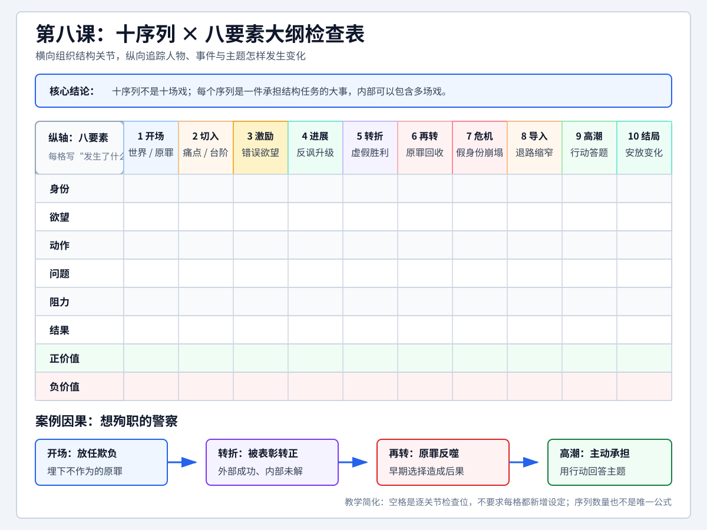

# 查理老师的编剧课 - 第八课 勾勒画面

> 导航：[[知识库/学习区/课程/查理老师的编剧课/00 - 课程总览|课程总览]]｜[[查理老师的编剧课|统一知识总结]]

视频：[P15 第八课-勾勒画面8.1](https://www.bilibili.com/video/BV1eE411F73t?p=15)｜[P16 第八课-勾勒画面8.2](https://www.bilibili.com/video/BV1eE411F73t?p=16)｜[P17 第八课-勾勒画面8.3](https://www.bilibili.com/video/BV1eE411F73t?p=17)。三段合为同一课，约99分钟。以下时码各自从所在P开头计算；ASR与画内字幕可能相差数秒。

本课把上一课的“拿事儿说话”继续落实为大纲：先把五个骨架事件细分为十个序列，再让人物、事件与主题的八要素在其中发展，最后用“想殉职的警察”现场示范如何把抽象设定变成场面。示范中提出、否定和暂用的方案，是课程知识的一部分；下文保留它们的区别，没有替老师补成唯一的完成稿。

## 本课速览

梗概先按逻辑讲清故事，大纲开始决定这些信息怎样成为画面和声音。十序列帮助分配事件及其作用，八要素检查人物、事件和正负价值如何发展；它们是本课实战教法，不是唯一公式，也不等于十场戏。警察案例保留边想边改、否定与暂用方案，以及为什么这样选择的理由。

## 分集脉络

- P15：讲清大纲的用途、三种呈现手段与旁白/闪回的边界，建立十序列横轴和八要素纵轴。
- P16：从好警察结尾反推烂警察开场，把夜市、家庭打击、捐款与求死失败逐步写成事件。
- P17：戳破虚假胜利，让开场过失回到主角身上，再讨论危机、高潮、不同结尾及实际作业。

## 时间线笔记

<!-- source-evidence: bili-BV1eE411F73t-p15 -->

### 从梗概到大纲：把信息落实为画面和声音

**P15 00:03–07:04。** 老师回顾的工作顺序是梗概、大纲、剧本：梗概约1500字，大纲约一两万字，剧本约四至六万字。这些是课堂体量示意，真正的变化不是把字数加长，而是内容越来越接近影片能呈现的事情。

“大纲又不是拿去卖钱，为什么不直接写剧本？”是老师模拟的学员疑问。大纲首先是创作者自己的工作需要：梗概中按逻辑讲清了想表达什么，从大纲起就要决定这些信息具体怎样出现。

老李“外表冷漠、内心狂热”，这仍是作者替人物下的判断。本课又补了一项背景——他年少时命运多舛。写大纲时先问：这段过去拍不拍？若要进入影片，是他看到旧照片开始回忆，还是由母亲口述？不能只写一句背景，让读者知道了就算完成。母亲的口述本身也有可见的人物与可听的话语，因此这里的要求不是禁用对白，而是明确影片到底呈现什么。

老师把基本承载手段归为三种：**环境描述、动作、对白**。例如要传达一个人不修边幅、生活随性，可以考虑他的居住环境和衣服；要传达他与妻子貌合神离，就要写出两人实际相处的状态。梗概里的意思可以保留，但表达形式必须向画面和声音转化。

### “感觉他们刚吵过架”怎样成为可拍的内容

**P15 30:24–34:34。** 你去一对夫妻朋友家，进门后他们抬头打招呼，表面似乎一切正常，你却感觉两人刚吵过架。若大纲只写“我感觉他们刚吵过”，导演无法直接拍“感觉”；给来访者加一段内心独白把判断说出来，也没有解决场面怎样传达信息的问题。

老师要求回到触发感觉的具体细节：两人怎么坐，地上有什么，招呼的语气如何，电视正在播什么，抬头时是什么眼神，来访者接收到这些信息后怎样反应。课上列出的是观察和描写的方向，没有逐项指定成一套完整布景。

他给了一个很小的对白对照：平日热情地招呼“哎，你来了”，还请你坐，今天只说“来了”。少掉的招呼和邀请，可以成为关系气氛不对的线索。它依赖日常积累：下次你觉得某处气氛不对，先留意到底是什么使你产生这种感觉。大纲从每一笔起，就应承担这种描绘责任。

线索也要符合情境。地上一滩血、旁边一把菜刀，已经把事情推向严重事故，老师说这时该报警了，不能拿来轻易说明一场普通夫妻争吵。强烈不等于合适；这个反例提醒作者辨认自己究竟在表现哪一种事。

### 旁白、内心独白、回忆和闪回的边界

**P15 25:52–30:23。** 老师承认这些手法可以用，也明确闪回本身当然能拍成画面。他的提醒针对当前初学阶段：不要一遇到难以表达的信息，就依赖旁白解释，或随手闪回一小段过去。

他的餐厅类比有两面。一大盘龙虾、一大盘螃蟹已经摆上桌，再多出的鲍鱼用小碟端上来，客人可能反而觉得丰富；大盘空着，只用小碟装一点西红柿炒鸡蛋，却声称盘子装不下，就站不住脚。对应到影片，信息本来很丰富，画面容纳不下而借助一点旁白，与事情尚未设计出来便急着用解释补上，是两种情况。

环境、年代的跨度也可能需要旁白，例如“三十年以后”，或老师随口示范的1942年寒冬与河南农民逃荒的信息。这里保留其说明的用途，不将这几句认定为某部影片的准确引文。老师还提到，改编作品有时因原作信息量大而借助闪回；初学者写原生剧本，先把故事讲清楚。他又说回忆可以用，反对的是需要一点过去信息就机械地闪一下，不能据此归纳成旁白或回忆一律禁用。

### 用十序列细分结构，再与八要素交叉

**P15 07:04–25:50、34:35–38:30。** 上一课的起、承、转、合和五个骨架事件，给出了故事的关键位置，但路标之间还要有路上的事情。老师在“幕”和“场”之间引入“序列”，帮助继续细分和填充内容。在他此处的工作划分里，幕是大单位，场是剧本呈现的小单位，序列处在两者之间；提到其他教材的“节拍”叫法，也不等于宣布所有理论中的节拍与序列完全同义。

老师特别说明，编剧是技术与艺术的结合，没有一种百分之百正确、人人通用的教学公式。刘翔跨栏以谁先到终点判断胜负，艺术体操却还涉及评判；剧本也有高下，但不像跑步那样能直接量出唯一结果。他用文人相轻与武人能当场比试的玩笑进一步解释这种差别：质疑刘翔可以赛跑，质疑张伟丽可以比试，直接的较量能分出胜负。八序列、十序列、十三序列等不同划分都存在；本课采用十序列，是老师为理解和实战选择的教法，节拍器的优缺点留待后课讨论。

五个骨架事件是**开场、激励、转折、危机、高潮**。在相邻事件之间，依次加入**切入、进展、再转、导入**，高潮后再加**结局**，得到十序列。黑板把它们横向排在起承转合之下，结局接在高潮之后，承担观众情绪的安放。

| 序列 | 本课所讲的任务及与前后的关系 |
| --- | --- |
| 开场 | 交代主角身份、所处世界、基本处境及负价值状态。交代清楚只是及格，更要使观众产生继续看的兴趣。 |
| 切入 | 继续强化人物信息，并为激励事件做铺垫。哪些背景值得加强，要看后面怎样发端核心问题。 |
| 激励 | 使核心问题发端、显现，促使主角开始行动。 |
| 进展 | 激励之后的行动，往往包含无效尝试，推进到原有局面需要改变之处。示范中可以不止一次尝试。 |
| 转折 | 主角相关的某个重要因素，在方向或程度上发生改变。 |
| 再转 | 因因素已经变化，主角调整策略应对；老师用铤而走险、放手一搏说明一种常见走向。 |
| 危机 | 主角最大的考验，或对手最强的一次攻击。 |
| 导入 | 在最大危机与最终解决之间增加情绪烈度，让观众更着急、更关心结果。 |
| 高潮 | 解决核心问题，使此前积累的冲突抵达决定性行动。 |
| 结局 | 根据此前的情绪积累与气口，安放、宣泄观众情绪。 |

老师把五个骨架事件比作风向标、路口，另外五段为它们服务。“服务”仍意味着各有工作，并非可以随意省略的空白。十个序列也不等于十场戏：一个序列内部可以安排数场事情。

**十序列是横轴，八要素是纵轴。** 纵向列出身份、欲望、动作、问题、阻力、结果、正价值、负价值，思考它们在每个序列中的位置、作用和变化。例如身份在开场交代，到转折可能发生变化；欲望在前、中、后段也会改变。表格帮助同时看见事件向前走、人物与主题怎样发展，并非把八个词抄完就算写好了大纲。

<!-- source-evidence: bili-BV1eE411F73t-p16 -->

### 现场示范：把“想殉职的警察”发展为大纲

**P16 00:03起，P17接续并回顾补充。** 这是老师当堂构思的虚构故事，不是实际警务案例。协警身份、转正、捐款、抚恤金额和后面武器障碍等，均按课堂情境保存，不能用作现实制度或技术依据。下文将散在两P中的补充放回相应环节，并注明仍是选项的部分。

### 先把注意力放在主角和他需要经历的事

这个警察想通过殉职给妻女留下钱，故事最后却希望他成为真正的好警察。老师先反推：既然要有这样的变化，开场就应是烂警察、不负责任的警察，用一场事情表现出来。

P16 03:27–05:14还回应了“怎么只有一个人”的疑问。老师要求在这一阶段先抓住一个主角、一个主要视角，等事件提出需要，再让配角长出来：有劫持，就需要劫匪与人质；若要搭档，可以把原主角的不同面向拆开，一个想死，一个想活，一个英勇，一个笨拙。它是本阶段聚焦故事的建议，不是所有影片只能有一个主角的规定。

主角被设为协警，一方面是老师当时对表现“不负责任的警察”所作的审查判断，另一方面也利用较低的收入和处境，使缺钱成为有分量的需求。这些是老师选择设定的理由。

### 开场：先让观众看见不作为，再揭示身份

**P16 05:17–10:07；P17 15:24–17:54。** 夜市上，一个便装中年人独自喝酒，显得落魄。旁边的小流氓欺负人，他看见、听见，却继续喝酒。老师先提出调戏女服务员或欺负卖夜宵夫妻等选项，后来复述时落在夫妻摊主：流氓借口菜不好，不想付钱，进而动手。

如果还要增加这一场的情绪分量，可以让夫妻五岁的儿子在旁玩泥巴，受惊后哭着求对方别打父母。主角仍不动心，观众先对一个见事不帮忙的人生气。接着老板娘或旁人报警，附近警力收到呼叫，他桌上的对讲机却响起来了。

这才让观众知道：他原来就是警察。周围有人投来希望的目光，有人好奇，流氓则惊慌、短暂停手；他却关掉对讲机，再开一罐啤酒继续喝，流氓随即继续欺负人。如果用“你不是警察吗？”与“我是协警”的应答，还可以把具体身份带出来。

这里的信息顺序有作用：梗概可以开头直接介绍“一个警察”，大纲和影片却能先保留身份，再用对讲机揭露，使观众对他的不满加深。一场戏同时提供身份、处境、不负责任的选择、荒诞感，也埋下后来要回收的过失。

家庭信息可以夹在这场里。老师先设想他打电话得知前妻有男友、可能再婚，或女儿要叫别人爸爸；问婚礼地址又使前妻担心他闹事。后来回顾时提出更简洁的连接：给妻子、女儿打电话都没人接，所以第二天登门。它们是不同构思方向，不必全放进同一场。

### 切入：加重具体打击，为钱与求死的念头搭台阶

**P16 10:09–16:54；P17 17:54–19:04、20:04–21:02。** 次日一早，主角宿醉未醒，穿着昨夜的衣服去找前妻和女儿。只是被骂、被赶走、被冷落，还只是在重复“过得不好”；新一段要把痛点向前推。

老师先从中年父亲的感受出发，设想十八九岁的女儿与小混混交往，主角对此受刺激。但他又觉得，顺手安排女儿交了这样的男友，仍太惯性；前妻找个更强、更有车的男人，也还可以再改。

后来提出的是一对父子：父亲成了前妻的新伴侣，儿子与女儿亲近，两人住进他原来的家。这对父子未必条件很好，甚至可能无业、流里流气，妻女却说“至少能陪伴我们”。主角不但被替代，还眼看自己给家里的钱被拿来给对方买哈尔滨啤酒。这些细节将他的屈辱感具体化；人物的愤怒是这个父亲的视角，不是对所有类似家庭关系的结论。

接下来要发端与钱有关的核心问题，切入就必须把钱带进来。女儿想读音乐或艺术学校，学费贵；给钱本来是他挽回一点尊重的机会，他却拿不出来。女儿一句“那我问问我李叔”，又把经济无力与父亲位置被替代连在一起。

后来老师重梳时补了一项条件：如果写到这里，觉得从缺钱突然变成想殉职仍太突兀，就应回到切入加重打击。可以让主角借着酒意走到天台或天桥边，短暂动过求死念头，却因胆小没敢付诸行动。这样后面出现“因公牺牲还能留下钱”的信息时，诱因与先前的心理状态更能接上。这是为解决特定因果跳跃提出的修正，不是每个版本都必须加入的桥段。

### 激励：捐款场面怎样比追悼会更有趣

**P16 16:59–20:46；P17 19:04–21:02。** 主角回所，仍是容易被轻视的老协警；还可以先因前夜关掉对讲机被领导训斥。老师强调，新场面承担本段功能时，也能继续交代和强化前面的身份、地位等信息。

这时所里为邻县因公牺牲的警察募捐，每人一百元。主角本来就缺钱，听说是隔壁县、又不认识，想问为什么还要捐，不是已经有抚恤金吗？同事说抚恤金有一百五十万元，但死者留下妻儿，系统内又号召捐款。主角说自己不是自愿的，钱还是交了。

当下，他的钱更少、心情更糟；另一面，他却突然看见一条歪的出路：如果自己也因公牺牲，至少可以给家里留下钱。前面已铺足钱和家庭的困境，此处人物眼神一转，观众就能理解新念头，不必再安排一长段自述。

老师也比较了另一方案：让他参加牺牲者的葬礼、追悼会，看到荣誉和给家人留下的钱，同样可以触发这个念头，但较为顺拐、容易想到。捐款方案则一边夺走他仅有的钱，一边让他产生这个念头，场面的反差更有趣。保留这层选择理由，比只记“捐款是激励事件”更能看清大纲怎样形成。

### 进展：救人成功，求死却不断失败

**P16 20:47–25:28；P17 21:02–22:39。** 主角开始主动找危险，希望借执勤殉职。老师先提出一次较大的事件：有人在银行大厅用身上的炸弹威胁，外面已经设警戒，谈判、特警、排爆和领导都在应对。主角本来只负责外围秩序，却觉得机会来了，直接走进去。

他的要求与正常解救行动相反：不要只把自己炸残，要等自己靠近，甚至抱住对方再引爆。外面的同事听不清里面说什么，只看见他毫不畏惧地接近威胁者；对方反而被这种不怕死吓住，最终投降。对公共危险来说，他解决了事情；对他自己的求死目标来说，这次动作失败了。“无效尝试”指向的是人物欲望，不等于没救成别人。

老师顺手提出“升职加薪”，接着又撤回加薪：如果现在就给到足够的钱，前面推动求死的经济问题会过早解决。因此先给表彰、荣誉，让好警察的正价值露出一点，钱的困难暂时仍在。

只有这一场事件又太薄，老师回头增加多次尝试，并把较大的炸弹事件后移。主角可以先去找辖区内过去不敢惹的小流氓、刑满释放者，或挑衅前妻家的父子；对方看见他不要命，反而退让。后一次复述还提出救火、高处救人：他原想把人推回安全处，自己掉下去，被救的人却把他也拉回。不同场面各有具体过程，都形成“想死没死成，反而做了好事”的反讽。它们是可以选择、组合的构思，并非必须全部拍进同一版本。

### 转折与虚假胜利：外界认可暂时遮住了真正的问题

**P16 25:31–26:57；P17 00:03–00:44、05:57–07:45、22:39–24:30。** 几次冒险为主角赢来表彰，老师又提出从协警转为正式警察，让他短暂觉得生活好起来。板书中的身份变化与正负价值变化，在这里落实成了事件。

这种“好起来”需要前后对照。可以先埋下办公室或接待处女同事不理他、连名字都叫不对的细节，等表彰后让她刮目相看；此前协警与正式警察各吃各的饭，现在正式警察邀他一起吃涮肉，他回头看看旧伙伴，跟新群体走了。他获得了地位和关注，观众也能暂时感受到上升。

但别人殷勤不等于妻女回来。他戴着新警徽去找家人，前妻和女儿已有新的生活；此前他还挑衅过那对父子，可能使自己更像无赖、对方更像可靠的人。钱的问题也没有消失：女儿交学费的期限已经过去，刚获提升的他此时仍拿不出现钱。

这才叫虚假胜利：警察头衔、英勇形象和社会认可出现了，他想修补的父亲、丈夫位置以及实际责任却没有因此解决。不是因为“所有升职都是假的”，而是这次表面所得尚未回答这个人物的核心问题。

<!-- source-evidence: bili-BV1eE411F73t-p17 -->

### 再转：最重的打击从他自己的不作为回来

**P17 00:44–07:45、24:30–28:06。** 更重的一击来自开场。他当时放任离去的流氓原来是逃犯，后来又犯下严重罪行。主角看见照片，认出这是自己眼睁睁放走的人：如果自己当时履行职责，事情也许不会发展成这样。老师没有确认后来的受害者就是夜市那对夫妻，不能自行把两段拼成这一事实。

这里的因果比“突然又出现一个很坏的人”重要。新危险是主角以前的选择、不作为留下的后果，才会使他觉得无法原谅自己；同样的坏事若与他毫无责任关系，不能自动产生同样的愧疚。

老师比较了后果的分量。只抢走一个钱包，被他认为不足以支撑本故事如此强的罪责感；杀人、性侵或使人陷入严重伤残，则是他现场提出的更重选项。他还讨论不同受害者可能使观众产生不同程度的痛感，同时明确说生命本身平等。这是构思时对观众反应的判断，不是生命价值排序。后来回顾又提出“伤害到主角女儿”的极端版本，但没有采用；他最终较倾向以杀人继续，依据的是这个故事的整体调性，并非越惨越好。

主角因此重新行动：调查、走访、跟踪，去找当初放走的凶徒；若需要，可以把对手扩大为团伙。不能只在大纲写“他展开调查”就算完成，再转也要有具体遭遇，例如差一点抓住一人，结果打不过，反被打伤，逐步走向更大的生死考验。

求死计划此前被虚假胜利暂时打断，现在虽又恢复，却增加了补救自己过失的目的。老师用“假的警察、丈夫、父亲”与“做一回真男人”描述本故事的价值变化：从占着身份、逃避责任，转向真正承担。这是课堂对该人物的主题措辞，不是对所有男性的统一要求。

### 危机与导入：让人物和观众面对更难的最后选择

**P17 07:45–11:04、28:06–28:43。** 主角带着同归于尽的念头去找凶徒，生命危险成为最大考验。前面必须已经建立观众对他的共情，使观众现在希望他活下来，否则单有死亡危险并不会自动产生同样的紧张。

老师把后续增难分成两面。一面是凶徒：原本主角可能有突然接近的优势，现在对方已经知道他要来。消息可以来自耳目、偶然发现，或主角缺乏经验暴露自己；观众知道对手有准备，就更担心他能否完成行动。

另一面是死亡与时间：先前的炸弹事件给主角提供了这个思路，后面又可让虚构装置发生故障，形成必须在短时间内靠近对手的限制。老师口述过无信号、慌乱操作后出现五分钟倒计时的方案，作用是拿掉等待和从容选择的余地。本课没有论证装置的实际可行性，也没有制作示范。

人物资源也可以削弱。老师后来提出，主角因喝酒误事被收走刚配的枪，或有枪却没有子弹、只有橡皮子弹。这些是不同的戏剧障碍选项，不是已经确认的现实警务制度，也不必全部叠加。

### 高潮：把补救责任落成最后的行动

**P17 11:04–12:15、28:43–29:07。** 负伤、体力不支的主角仍设法接近、抓住歹徒；对方看见危险后逃散，他还要寻找最后的机会。老师提出一个具体场面：主角在三楼窗口听楼梯上的脚步，等对方冲出楼门时从窗口扑下去，压住一人，随后发生爆炸。

这使此前的欲望、阻力、危机汇到一个可描述的行动上，而非写一句“他终于勇敢地承担责任”。课堂是在口头推演场面，未播放该动作的成片，也未完成实际拍摄、特技或动作执行设计。

### 结局：根据已经形成的情绪，选择代价与回报

**P17 12:15–15:24、29:07–29:48。** 老师先把结局标为“斟酌”。意思是等前面的事情和情绪串起来，再判断观众此时需要怎样被安放，并不是大纲没有能力写结局。

一种版本是主角死去：追悼会上，前妻、女儿和那对父子四人抬他的遗体。大家终于把他当作真正的丈夫、父亲、警察，可他已付出生命。这个版本保留了代价，不能与后面的存活结尾合并成一个既定结果。

另一种是他在医院活过来。如果仅仅活着仍不足以回应观众的情绪，可以让妻女都回到身边；也可以只让女儿重新认可父亲，前妻继续她自己的生活。老师暂时更倾向后一种，并补充前妻的新伴侣可能并非坏人，没有坚持把所有对主角不利的人都写坏，也没有把复婚当作唯一圆满。

存活结尾还有两种呈现。最初是主角醒来，听见女儿打电话向同学夸父亲英勇，为了多听几句，满意地继续装昏迷。后来复述改成女儿拍抖音短视频，向外宣扬父亲的事迹；主角继续闭着眼，嘴角露出微笑。后者把女儿的认可转成更明确的对外表达。两者属于现场修改前后的版本，不必都发生。

## 把十序列和八要素写活，而不是填完标签

**P17 29:48–31:38。** 回到表格，身份、欲望、动作、问题、阻力等都应随序列变化：主角从协警获得正式身份，欲望从求死留钱到承担自己造成的问题，外界认可一度升高又被真实责任击破。正负价值会轮流占上风，前后变化、对立拉开，使故事产生张力。

老师以此解释这个案例怎样变得好看。它并不意味着每个故事都要把伤害推到最极端，也不是只在表上画上下箭头就能代替事件。大纲里的每个序列，最终仍须写成能转为画面和声音的事情。

P15可解码前缀以及P16、P17的原板书横向列出开场、切入、激励、进展、转折、再转、危机、导入、高潮、结局，上方标起、承、转、合；纵向列身份、欲望、动作、问题、阻力、结果和正负价值。老师边讲边填少量词、改写和画变化箭头，没有提供填满八十个格子的标准答案。

## 老师布置的练习

**P17 31:38–33:07。** 记住十个环节，本次不必另创一个故事，就把课上这个“想殉职的警察”自己写成大纲。课堂给出了口头展开和方案比较，没有交付一份完整书面大纲作为标准答案。

十序列不等于十场戏。一段回所捐款，可以先写被所长训斥，再写同事间的往来、躲捐款、谎称自己已经捐过、被大家查出其实没捐，最后才交钱。老师用这个例子提醒：事件不是只剩“回去—捐钱”的直线交代，一个序列内部也需要具体的过程。

## 保留的旧整理图与关联

上图是旧稿留下的整理图，不是原课板书；图中“原罪回收”“退路缩窄”等标签简化了这个警察案例，不能当成所有故事每一序列的固定定义。附件保留原文件。

原有学习状态、未完成任务和旧整理表达另存于[[知识库/学习区/个人思考/查理老师的编剧课 - 第八课原有学习记录]]。此前关联的[[知识库/学习区/综合整理/01-故事与剧本/从梗概到可拍大纲]]继续保留，本次未改写该综合笔记。

## 来源与复核边界

- **材料取得：**三P全段ASR保留；P16/P17完整视频已取得。P15完整原件仍未取得，复用2295.533秒可解码前缀，并于本次有界补到2317秒。最后0.327秒未取得；2313–2316秒已见宣传卡，不影响此前表格式大纲说明。
- **图文复核：**复用历史全文阅读和535个不同时间点的字幕/板书核查；本次再次从三份来源原文检查观点、论证、全部构思过程、条件、回顾增量与原课作业，再反查候选及旧稿去向。实际复看尾段横纵轴、学费/捐款字幕和结尾遗体/存活选项；未把历史核图数量当成本次新增。
- **尚未独立核实：**原声语气与连续声画未听审/审看；P15仍不登记全片完整取得。本课警察故事为口头虚构，没有该故事的成片或已验证警务制度/技术演示，不用板书和静帧认证它的实际执行效果。

## 核心观点

大纲不是把梗概加长，而是让有效信息有可呈现的形式。结构路标之间仍要有事，十序列既有方向性事件，也有服务它们的过渡工作；八要素在其中各有位置并发生变化。手法和序列数带有课程选择及学习阶段条件，不能变成普遍禁令或唯一正统。

警察案例的反讽是求死动作失败而救人成功；外界表彰又没有解决经济、家庭和真实责任，因而形成虚假胜利。后面的愧疚与补救来自开场选择留下的后果，高潮把承担落在具体动作上，结尾再按情绪气口选择代价与回报。

## 方法与案例

- 抽象信息怎样落成可拍内容：见时间线夫妻来访对照及餐厅比喻。观察方向与老师指定的具体细节分开，旧整理的完整布景不冒充原课答案。
- 十序列任务与八要素交叉：见表格和课堂板书说明；警察的各阶段过程、局部返修和两种结尾见现场示范。原课作业是写这个故事的大纲，不要求另创故事或填满80格。

## 主题沉淀

既有《从梗概到可拍大纲》关联及旧图保留，本次只更新课程来源正文和原有记录，未改写或重新验收综合主题与Skills。不同结局、加薪撤回、序列限定和原罪调性等证据的后续影响另行登记。

## 来源复核记录

图文验收与独立声画待核分别登记：[P15来源记录](../../../../../evidence/sources/bili-BV1eE411F73t-p15/review.md)｜[P16来源记录](../../../../../evidence/sources/bili-BV1eE411F73t-p16/review.md)｜[P17来源记录](../../../../../evidence/sources/bili-BV1eE411F73t-p17/review.md)。
