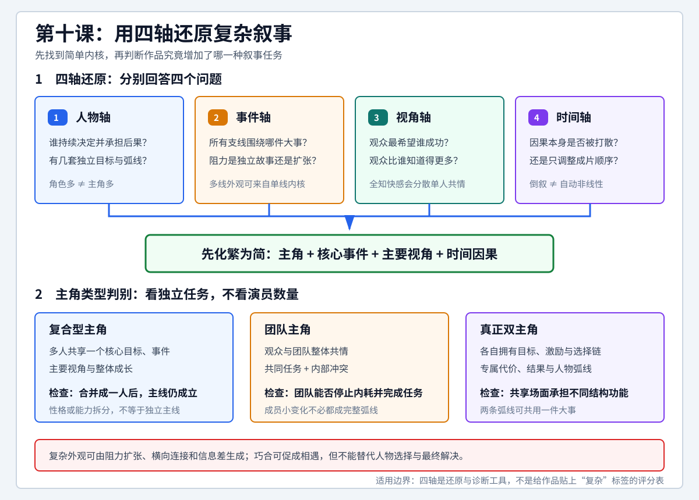

# 查理老师的编剧课 - 第十课 复杂叙事

> 导航：[[知识库/学习区/课程/查理老师的编剧课/00 - 课程总览|课程总览]]｜[[查理老师的编剧课|统一知识总结]]

视频：[P20 第十课-复杂叙事10.1](https://www.bilibili.com/video/BV1eE411F73t?p=20)｜[P21 第十课-复杂叙事10.2](https://www.bilibili.com/video/BV1eE411F73t?p=21)  
说明：本笔记按“课”聚合 P20-P21，根据本地 ASR 整理，不是官方逐字稿；片名、人名和部分术语已按上下文校正，不确定项保留说明。

## 本课速览

- 核心问题：人物、视角、事件线和时间顺序发生变化后，怎样判断故事是真的复杂，还是只有人物多、剪辑快和形式花。
- 主要结论：复杂叙事没有清晰的二元边界。最实用的判断不是给作品贴标签，而是检查它是否真的需要同时维护多个独立人物弧线、信息视角或事件力量。
- 基础模型：此前课程训练的是一个核心人物、一个主要事件、一个主视角和线性推进。复杂叙事应从这个简单内核逐层生长，而不是从多线外观倒推故事。
- P20 任务：区分复合型主角、团队主角和真正双主角，说明人物数量、人物弧线与观众视角之间的关系。
- P21 任务：区分倒叙与真正的非线性／多线结构，并用《疯狂的石头》分析阻力扩张、信息分配、巧合连接和上帝视角。
- 学习价值：把“复杂”还原成可检查的写作动作，使多人物、多视角和多线结构仍能保持主角、目标、因果与观众情感的清晰。
- 适用环节：故事骨架、人物设计、事件化大纲、复杂结构检查。

## 直观教学图

> [!tip] 怎么读
> 先分别回答上方人物、事件、视角、时间四个问题，把作品还原成简单内核；再用下方三栏判断多角色属于复合型主角、团队主角，还是真正需要维护两条独立弧线的双主角。

> [!note] 适用边界
> 人物多、倒叙或切换快都不自动构成复杂叙事。四轴用于识别新增的叙事任务与代价，不是给作品复杂度打分。

## 来源可靠性

- 信息来源：P20、P21 均为本地 faster-whisper ASR，无官方字幕。
- 完整程度：P20 完整读取至 `37:26`，P21 完整读取至 `23:40`。
- metadata：P20、P21 均对应 BV1eE411F73t 的真实分 P；标题分别为“第十课-复杂叙事10.1”和“第十课-复杂叙事10.2”。
- ASR 情况：P20 为大量短时间片段，P21 为较长语义片段；整体论证可以恢复，但片名、人名和专业术语误识别较多。
- 关键校正：福达训试／负杂训示→复杂叙事，现性去世→线性叙事，非现性去世→非线性叙事，道续→倒叙，人物无限／人物狐献→人物弧线／人物弧光，虚列→序列，有情片→友情片，老坑粉碎→老坑翡翠，上帝世脚→上帝视角。
- 片名校正：《太太尼克》→《泰坦尼克号》，《太久》→《泰囧》，《封床石头》→《疯狂的石头》，《西罗汉》→《十一罗汉》，《干死队》→《敢死队》，负脸／复丑脸梦→复联／复仇者联盟。
- 人名校正：Jekker／DK不了→Jack／杰克，郭托／郭逃等均指郭涛或其饰演的包世宏；P21 所说香港窃贼按影片角色校正为麦克。
- 不确定项：P21 提到的韩国电影被识别为《情侣门》，可能是《情侣们》，仅作为讲者推荐保留，不据此扩展外部信息。
- 外部补充：无；本笔记只整理两份转写、metadata、前课既有知识和两集内部能够相互验证的内容。

## 分集脉络

- **P20｜第十课-复杂叙事10.1**：从“复杂叙事边界很空”出发，先按人物数量、人物弧线和观众视角区分复合型主角、团队主角与真正双主角，再比较《泰坦尼克号》和《泰囧》的双人物结构。
- **P21｜第十课-复杂叙事10.2**：转向线性与非线性，否定“把结尾提前就是非线性”的表面判断，并把《疯狂的石头》还原成一个主角、一件核心任务和四股被放大的阻力。
- **两集关系**：P20 回答“谁拥有故事”，P21 回答“故事如何被多视角和多股力量呈现”；共同结论是先找到简单内核，再决定复杂形式是否真的增加了新的叙事任务。

## 时间线笔记

### P20 第十课-复杂叙事10.1

#### 整体脉络

- `00:02-06:05`｜提出“复杂叙事很空”：它并非不存在，而是没有绝对边界。此前课程一直训练一个核心人物、一个主要事件、一个主视角和线性推进的简单叙事；讲者借渐悟、顿悟说明，复杂能力来自基础训练的积累。
- `06:05-10:58`｜人物增多不等于叙事变复杂。一个主角可以按性格、功能和对话需要拆成几个人；《疯狂的外星人》中黄渤、沈腾虽然都是重要角色，但讲者认为主要视角和行动线仍集中在黄渤身上。
- `10:58-14:10`｜用《西游记》继续说明复合型主角。师徒四人性格不同，孙悟空也有短暂离队，但宏观上仍共同完成取经任务；判断角色是否独立，应看他有没有足以贯穿故事的独立人物弧线。
- `14:10-18:55`｜讨论《十一罗汉》《敢死队》《复仇者联盟》等群像片。成员很多，也可能各有小变化，但观众主要关心团队能否停止内耗、完成共同任务，因此团队整体可以被视为主角。
- `18:55-22:38`｜提出团队压缩法：先把团队按“张三要抢银行”写完整，再把张三的能力、性格和内部斗争拆成多人。成员放下偏见或临时合作可以算变化，但不一定构成完整人物弧线。
- `22:38-27:37`｜进入真正双主角结构。爱情片、友情片天然需要两个人；《泰坦尼克号》的杰克与露丝分别建立出场、困境、激励和弧线，甲板相遇后才逐渐汇合。
- `27:37-30:04`｜说明同一事件可以在两条弧线中承担不同功能。下层船舱跳舞对杰克是日常，对露丝却是发现另一种生活可能性的转折；共享场面不等于共享叙事功能。
- `30:04-34:13`｜用《泰囧》分析一主一从的双人物结构。徐峥承担主要任务、压力、对手和观众视角；王宝强也有目标与人物弧线，但规模较小，两人的事件和序列高度重合。
- `34:13-37:26`｜总结爱情／友情双人物模型：一个有明显残缺的主人公，配一个能在行动中补足残缺的伙伴。双视角并非必需，而且更难控制；稳妥写法是两条人物弧线、一个主视角、一个共同事件。

#### 详细导览

P20 首先反对用人物数量直接判断复杂度。创作者为了增加对话、制造性格反差或满足表演需要，可以把一个核心人物拆成多个角色。这些角色可能看起来同等重要，但只要他们共享同一个目标、同一件大事、主要视角和整体成长，就仍可按复合型主角理解。

《疯狂的外星人》用于说明“角色拆分”。讲者认为沈腾角色即使暂时离开黄渤、偷走外星人或制造麻烦，本质上仍是在给黄渤的行动制造障碍，没有建立足以脱离主线的独立故事。《西游记》师徒四人也是同样逻辑：他们代表不同性格和能力，却共同构成“取经人”这个团队主角。孙悟空被赶回花果山、猪八戒偶尔动摇，是长篇叙事中的局部岔路，不自动把整体改造成四条独立主线。

《十一罗汉》等团队片进一步说明，观众可以与团队而不是某个个体共情。成员之间的不和、招募困难和能力差异，相当于一个单主角故事里的内部斗争；银行、安保和执法力量构成外部阻力。创作时完全可以先写“一个人完成任务”，再把内部矛盾拆成成员冲突，把能力拆成不同专业角色。

真正的双主角要求更高。两个人不仅要有不同性格，还要各自拥有目标、激励事件、选择、代价和人物弧线。《泰坦尼克号》先分别建立杰克和露丝，再让他们在共同事件中相遇；同一场面会在两条弧线中产生不同作用。《泰囧》则采用更规整的一主一从：两个人都有弧线，但观众主要跟随徐峥，王宝强承担较强的伙伴和价值补足功能。

因此，P20 的实用判断不是“有几个演员”，而是“有几套必须独立维护的目标、选择和变化”。人物小变化不等于完整人物弧线，短暂离队不等于独立主线，多个人共同做一件事也不等于真正多主角。

### P21 第十课-复杂叙事10.2

#### 整体脉络

- `00:03-01:50`｜从多人物转入非线性叙事，提出《疯狂的石头》作为最重要案例；讲者再次声明复杂与非线性的边界并非绝对。
- `01:50-03:17`｜否定“倒叙自动等于非线性”。把中段或结尾的一场戏移到开头，往往只是为了增强悬念和期待，故事本身仍可能按照线性因果写成。
- `03:17-06:20`｜按人物、视角和事件审视《疯狂的石头》。影片存在包世宏一方、道哥团伙、香港窃贼麦克、徐峥／王迅一方和厂长儿子谢小盟等多股力量，外观看起来非常复杂。
- `06:20-09:57`｜用八要素找回核心主角。包世宏从疾病和欠薪建立共情，欲望是解决缺钱，动作是保护翡翠，多股盗窃力量构成阻力；最后未按预定方式完成动作，却实现了不再缺钱的欲望。
- `09:58-13:39`｜解释反派为什么提前出场。道哥团伙偷了麦克的箱子、入住包世宏隔壁，徐峥／王迅一方又与包世宏发生撞车联系，使原本应在实施盗窃时才出现的阻力提前获得独立戏份。
- `13:39-17:20`｜分析谢小盟、道哥女友、撞车、偷箱子等巧合。巧合把相距很远的几股力量纠缠在一起，制造精巧感和快速推进，同时冒着严重损害可信度的风险。
- `17:20-19:25`｜说明多视角怎样把观众推到上帝视角。角色只知道局部信息，观众却知道翡翠、偷盗计划、骗局和人物关系的全貌，乐趣从担心主角转为观察众人互相误判。
- `19:25-21:26`｜把五线外观还原为单线内核：包世宏保护翡翠，遭遇四股被充分展开、彼此连接的阻力。它既可以被称为多线，也可以按一条主线扩张后的结构理解。
- `21:26-23:40`｜给出学习立场：学写剧本应化繁为简，先知道作品原本怎样作为一个简单故事成立，再研究它增加了哪些结构技术、获得了什么效果、付出了什么副作用。

#### 详细导览

P21 先区分故事结构和成片呈现。把结尾片段放到开头，可能增加悬念，也可能是导演、剪辑师或制片阶段的调整；如果人物仍按同一条因果链完成行动，这种顺序变化不足以证明编剧层面已经产生真正的非线性结构。判断重点仍应回到人物、事件、视角和因果。

《疯狂的石头》表面上有多股力量、快速切换和大量巧合，但包世宏的八要素非常完整。身份与处境通过身体疾病、欠薪和家庭压力建立；欲望是获得工资、摆脱缺钱；动作是保护老坑翡翠；问题是翡翠引来多股盗窃力量；阻力被拆成数个各具性格、手段和关系的反派；结果则延续课程此前的“绕过动作实现欲望”。从这个角度看，它仍是一条清楚的单主角行动线。

影片的复杂外观来自阻力扩张。四股反派没有只在阻挠主角时短暂出现，而是分别获得目标、生活、关系和戏份。为了让这些力量提前进入影片，创作者通过偷箱子、撞车、住隔壁、恋爱与背叛等巧合建立横向连接。核心翡翠把所有人的目标集中起来，其他关系则让人物在正式争夺前就发生接触。

这种结构改变了观众的位置。若严格跟随包世宏，观众会主要担心他能否守住翡翠、拿回工资；当影片不断切到盗贼、麦克、谢小盟等人物，并让观众比所有角色知道得更多时，主角共情被部分牺牲，取而代之的是上帝视角的全知快感。观众看见每个人带着错误信息行动，由此产生悬念、误会、喜剧和戏剧性反讽。

讲者同时强调副作用。巧合越多，观众越可能怀疑作者在强行安排；反派越充分，越会分走主角的戏份和情感；视角越多，越需要镜头、表演和叙事流畅度维持清晰。《疯狂的石头》成功压住了这些风险，但不能因此把大量巧合和快速切换当成可直接复制的表面公式。

## 核心观点

- 复杂叙事不是固定类别，而是一组需要同时维护的人物、事件、视角、信息和时间关系。
- 人物多不等于主角多；主角数量取决于是否存在彼此独立的目标、选择、代价和人物弧线。
- 多个角色共享目标、事件、主要视角和整体成长时，可以按复合型主角或团队主角处理。
- 真正双主角可以共同经历同一事件，但该事件应在两条人物弧线中承担不同结构功能。
- 倒叙或把结尾移到开头主要改变呈现顺序，不一定改变故事的线性因果。
- 多线外观可以来自把一个主角的数股阻力分别做大、提前出场并横向连接。
- 上帝视角来自信息不对称：角色各知局部，观众掌握全局，因此获得戏剧性反讽和预测快感。
- 多视角会分散单主角共情。创作者必须主动选择观众跟随单人、双人、团队，还是站在全知位置。
- 巧合可以连接人物和启动冲突，但密度过高会破坏可信度；重要选择和结果不能全部由巧合完成。
- 学习复杂叙事的正确顺序是先化繁为简，再理解简单故事如何逐层生长，而不是模仿成片表面的花哨。

## 方法与案例

### 方法一：四轴还原法

先用四个问题还原复杂作品：

1. 人物：谁持续作出决定并承担后果？
2. 事件：所有支线围绕哪一件大事汇合？
3. 视角：观众最希望谁成功，又比谁知道得更多？
4. 时间：因果本身被打散了，还是只有成片顺序被调整？

四轴还原后仍只有一个清楚的主角、目标和因果链，作品可能只是复杂呈现，而不是多套独立故事。

### 方法二：角色独立性检查

逐个角色检查五项：独立目标、独立激励事件、持续选择链、专属代价与结果、可辨认的人物弧线。只有戏份、性格和小变化，不足以自动升级为第二主角。

### 方法三：团队压缩与拆分

先把团队合并成一个“张三”，用八要素写完任务、阻力和成长。主线成立后，再把张三的能力、性格和内部冲突拆给多名成员。拆分后仍要保留一个清楚的团队目标和观众情感中心。

### 方法四：共同事件双栏表

双主角共同经历一场戏时，分别标注它对甲、乙是什么：日常、激励、进展、转折、危机或高潮。同一场戏在两条弧线中的位置不同，才真正产生结构价值。

### 方法五：阻力扩张

先写一个笼统阻力，再按利益、手段、性格或专业能力拆成数股力量。每股力量必须继续服务主角的核心问题，不能因为获得独立戏份就脱离大事件。

### 方法六：连接中心与信息矩阵

用共同目标、核心物件、地点、关系或因果债务连接各线；再逐场记录谁知道什么、谁误会什么、观众知道什么。《疯狂的石头》以翡翠为连接中心，以各方互不知情而观众知情制造上帝视角。

### 方法七：巧合预算

每个巧合都要回答三个问题：它连接了哪两股力量，除了方便作者还有什么人物或环境依据，它是否替代了本应由人物选择完成的因果。巧合可以让人物相遇，不能包办人物的成长与最终解决。

### 方法八：化繁为简复核

完成多线大纲后，删除支线、合并角色并按时间顺序复述。如果仍能说清主角、欲望、动作、阻力和结果，复杂结构有稳定内核；如果还原后故事不存在，说明形式可能掩盖了因果缺口。

### 案例索引

- **《疯狂的外星人》**：用于说明多个重要角色仍可能是一个核心人物功能的拆分；讲者把主要视角和行动归于黄渤。
- **《西游记》**：用于说明团队使命、性格拆分和局部离队不等于四条独立主线。
- **《十一罗汉》**：用于说明团队整体可以成为共情对象，成员的小转变不一定构成完整人物弧线。
- **《敢死队》《复仇者联盟》**：作为明星和角色很多、但仍可按团队主角理解的群像例子。
- **《建国大业》《建党大业》**：只被讲者作为人物极多的边界情况带过，没有形成完整论证。
- **《泰坦尼克号》**：双人物、双弧线和较丰富的双视角；杰克与露丝先分别建立，再在爱情和灾难事件中汇合。
- **《泰囧》**：一主一从的双男主；徐峥承担主要视角和任务压力，王宝强拥有较小但完整的目标与成长，并补足徐峥的人性残缺。
- **《疯狂的石头》**：整课最重要案例。一个主角和一件保护翡翠的任务，通过扩大四股阻力、巧合连接、快速切换和信息差形成多线外观。
- **韩国电影“《情侣门》”**：讲者作为类似非线性作品推荐，片名可能是《情侣们》，需回看原视频确认。
- **威廉王子与迈克尔·乔丹的虚构巧合**：讲者用荒诞口述反例说明，巧合过密会让听众立刻失去信任。

## 可实践练习

1. 选一个五人团队故事，把五个人合并成“张三”，用八要素写出团队版，再按能力、性格和内部冲突拆回五人。
2. 为两个候选主角分别填写目标、激励事件、关键选择、危机、高潮和最终变化，检查是否真的存在两条人物弧线。
3. 选一场双人共同经历的戏，分别标注它在两条人物弧线中的结构功能。
4. 用四轴还原法分析一部看似复杂的影片，分别写出人物、事件、视角和时间结构。
5. 把《疯狂的石头》压缩成“包世宏保护翡翠”的单线版本，再列出四股阻力是怎样被分别做大的。
6. 为自己的故事建立“角色×秘密”信息矩阵，标出每场后谁知情、谁误判、观众比角色多知道什么。
7. 把一个普通反派拆成三股阻力；每新增一条人物连接，都写清因果依据，不允许只写“恰好遇见”。
8. 写一个倒叙开场，再把它放回原位置；若故事因果没有变化，说明它主要是呈现技巧，而非结构上的非线性。
9. 删除全部支线，只保留主角线；若主线无法成立，检查支线是否替主角承担了本应存在的关键决定。
10. 为同一个故事分别设计单主角共情版和上帝视角版，比较悬念、幽默、情感投入和信息量的变化。

## 主题沉淀

### 已沉淀

- [[知识库/学习区/综合整理/01-故事与剧本/从梗概到可拍大纲]]：本课相关方法已进入统一主题笔记。
- [[知识库/学习区/综合整理/01-故事与剧本/从人物共情到人物弧光]]：本课相关方法已进入统一主题笔记。

### 待沉淀

- 暂无新增候选；相关内容已并入现有主题。

## 复习区

### 一分钟核心摘要

复杂叙事不是人物多、时间乱或剪辑快，而是需要同时维护多个独立人物弧线、信息视角或事件力量。P20 用《疯狂的外星人》《西游记》《十一罗汉》《泰坦尼克号》和《泰囧》区分复合型主角、团队主角和真正双主角；P21 用《疯狂的石头》说明，一个单主角、单目标故事可以通过扩大阻力、建立横向连接、分配秘密和切换视角形成多线外观。创作时应先完成简单内核，再增加复杂维度，并持续检查因果、共情、信息清晰度和巧合副作用。

### 关键概念

- 简单叙事
- 复杂叙事
- 线性叙事／非线性叙事
- 复合型主角
- 团队主角
- 真正双主角
- 独立人物弧线
- 共同事件的差异功能
- 阻力扩张
- 连接中心
- 信息矩阵
- 上帝视角
- 戏剧性反讽
- 巧合预算
- 化繁为简复核

### 自测问题

1. 为什么人物多不等于多主角？
2. 怎样区分角色的一次变化和完整人物弧线？
3. 复合型主角、团队主角和真正双主角分别怎样判断？
4. 为什么同一场戏可以同时是甲的日常和乙的转折？
5. 倒叙为什么不一定构成真正的非线性叙事？
6. 《疯狂的石头》怎样从一条包世宏主线长出多线外观？
7. 多股反派为什么要提前出场，又付出了什么代价？
8. 上帝视角怎样改变悬念、喜剧和主角共情？
9. 巧合什么时候能连接故事，什么时候会破坏可信度？
10. 为什么学习复杂叙事必须先做化繁为简复核？

### 任务

- [ ] #复习 不看笔记，用一分钟区分复合型主角、团队主角和真正双主角。
- [ ] #复习 复述《疯狂的石头》从单线内核长出多线外观的五个步骤。
- [ ] #创作练习 对当前故事完成一次四轴还原，并写出唯一核心人物、核心事件、主要视角和时间因果。
- [ ] #创作练习 建立一张“角色×秘密”信息矩阵，检查观众在每个结构关节比角色多知道什么。

## 二刷时可以重点听

- P20 `01:15-06:03`：简单叙事的基础模型，以及“复杂叙事很空”的真正含义。
- P20 `06:17-14:10`：《疯狂的外星人》《西游记》怎样说明角色拆分不等于多主角。
- P20 `14:10-22:38`：《十一罗汉》团队共情、团队主角与“先写张三再拆分”的方法。
- P20 `23:14-30:04`：《泰坦尼克号》双弧线，以及同一事件在两条故事线中的不同位置。
- P20 `30:04-37:26`：《泰囧》一主一从、互补伙伴和双视角风险。
- P21 `01:50-03:17`：倒叙为什么仍可能属于线性叙事。
- P21 `06:20-09:57`：用八要素确认包世宏是《疯狂的石头》的核心主角。
- P21 `09:58-17:20`：四股阻力如何被提前出场，并通过巧合建立横向连接。
- P21 `17:20-20:21`：上帝视角、信息差、主角共情转移和假多线外观。
- P21 `21:26-23:40`：复杂作品的学习顺序，以及从简单内核逐步生长的写作立场。
