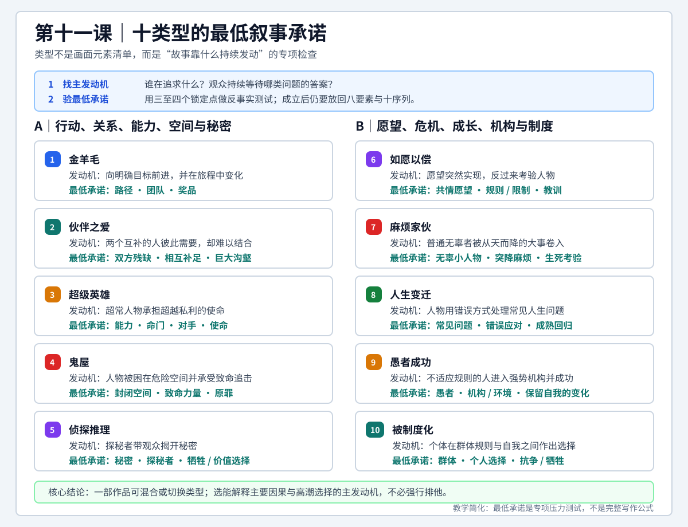

# 查理老师的编剧课 - 第十一课 类型片

> 导航：[[知识库/学习区/课程/查理老师的编剧课/00 - 课程总览|课程总览]]｜[[查理老师的编剧课|统一知识总结]]

视频：[P22 第十一课-类型片11.1](https://www.bilibili.com/video/BV1eE411F73t?p=22)｜[P23 第十一课-类型片11.2](https://www.bilibili.com/video/BV1eE411F73t?p=23)｜[P24 第十一课-类型片11.3](https://www.bilibili.com/video/BV1eE411F73t?p=24)  
说明：本笔记按“课”聚合 P22-P24，根据三份本地 faster-whisper ASR 与 metadata 整理，不是官方逐字稿；类型名称、影片专名和明显近音词已结合上下文校正，存疑项仍保留不确定性。

## 本课速览

- 核心问题：怎样把“类型”从模糊的市场标签转化为编剧可用的故事发动方式和最低承诺检查，同时不让公式取代人物、因果与结构。
- 主要结论：商业／文艺、动作／爱情／恐怖和《救猫咪》十类型属于三个不同分类轴；本课真正采用的是创作者侧的十种故事思路。每类只额外锁定几个关键要素，仍须放回八要素和十序列中完成。
- 学习价值：先辨认故事主要靠什么发动、观众在等待什么，再检查路径、关系、秘密、规则、空间、选择或牺牲是否真正被剧情兑现。
- 适用环节：点子筛选、类型定位、梗概诊断、大纲补强、混合类型分析和类型承诺复核。
- 本课边界：十类型不是严密、互斥的电影学分类；一部电影可以并列使用两类，也可以在前后半程切换故事机制。

## 直观教学图

> [!tip] 怎么读
> 先从“谁在追求什么、观众持续等待什么”判断主发动机，再在对应类型中核对三至四个最低承诺；这些条件成立后，仍要回到八要素与十序列完成因果和结构。

> [!note] 适用边界
> 十类型是启发式压力测试，不是互斥分类或完整公式。同一作品可以混合、切换类型，重点是辨认主要因果和高潮选择由哪一种机制发动。

## 来源可靠性

- 信息来源：P22-P24 的本地 faster-whisper `base` 中文 ASR；三页 metadata 均显示 `subtitle_count: 0`，没有官方字幕可供对照。
- 完整程度：P22 读取至 `31:35`，P23 读取至 `31:41`，P24 读取至 `22:30`，合计约 `85:46`，三页均覆盖到片尾。
- 可用程度：主要论点、十类型框架、关键要素和核心案例能够连续互证；短句切分较碎，P23 还出现繁体输出，但不影响整体理解。
- 校正说明：`舅猫咪／救贸弥`校正为《救猫咪》，`布莱克斯奈德／斯莱德`校正为布莱克·斯奈德，`金牙毛／金鸭毛`校正为金羊毛，`购物／勾贺`按语境校正为沟壑。
- 专名校正：包括《泰坦尼克号》《冒牌天神》《大话王》《夏洛特烦恼》《西虹市首富》《律政俏佳人》《飞越疯人院》《梅花烙》《电锯惊魂》《侏罗纪公园》等。
- 存疑项：P23 疑似提到《飓风营救》，P24 提到一部讲者自己也记不起片名、ASR 疑似苏有朋主演的别墅恐怖片；本笔记不把片名写成已确认事实。
- 证据边界：关于爱情观念史、中国商业片类型占比和国产恐怖片创作环境的说法属于讲者概括或授课时语境，未经过外部史料、市场数据或现行规则核验。

## 分集脉络

- **P22｜第十一课-类型片11.1**：区分创作目的、市场标签和故事机制三种分类方式，引入布莱克·斯奈德的十类型，并开始讲金羊毛。
- **P23｜第十一课-类型片11.2**：依次展开金羊毛、伙伴之爱、鬼屋、超级英雄、侦探推理、如愿以偿、麻烦家伙和人生变迁的关键要素与案例。
- **P24｜第十一课-类型片11.3**：补齐愚者成功和被制度化，再用《半个喜剧》《梅花烙》及鬼屋反例说明“最低承诺”看似简单，实际决定类型能否成立。

## 时间线笔记

### P22 第十一课-类型片11.1

#### 整体脉络

- `00:04-02:01`｜把类型片还原为分类研究工具。课程先讨论商业片与文艺片，反对把它们粗暴理解成“好看”和“不好看”。
- `02:01-07:47`｜商业片以服务观众、强化观看体验为主要目标，文艺片更偏创作者实验。用“量产车／概念车”说明二者功能不同，但探索与好看可以并存。
- `07:47-10:18`｜视频网站上的喜剧、动作、爱情、恐怖等类别来自宣传和观看习惯，本质是海报、明星形象和简介向观众作出的体验承诺。
- `10:18-16:16`｜说明市场标签可以重叠，恐怖与惊悚的边界也不稳定，“剧情片”常成为无法归类时的兜底。李连杰《海洋天堂》和“奥利奥做轮胎”用于解释明星／品牌预期。
- `16:16-24:19`｜引入布莱克·斯奈德与《救猫咪》。课程承认其分类不完全严谨，但认为它从编剧角度提供了可执行的创作思路。
- `24:19-28:22`｜列出金羊毛、伙伴之爱、超级英雄、鬼屋、侦探推理、如愿以偿、麻烦家伙、人生变迁、愚者成功、被制度化十类。
- `28:22-30:58`｜从金羊毛开始：寻宝、公路、盗墓和抢银行虽然市场标签不同，却可能共享“向明确目标前进”的故事发动方式。
- `30:58-31:35`｜强调任何类型仍跳不出八要素、结构模式和十序列；类型只指出某类故事必须额外做牢的几个重点。

#### 详细导览

P22 先拆掉“类型片很高深”的印象。课程认为分类的价值不在于给电影贴上唯一正确的名字，而在于帮助创作者寻找可重复的规律。商业片与文艺片的区分首先是创作目的：前者更明确地服务观众，后者可能用来试验新的技术、材料、表达方式或叙事方法。讲者用量产车和概念车作比，强调概念车不是失败的量产车，文艺片也不应成为“商业叙事没有做好”的借口。

第二种分类来自观众和市场。观众从海报、片名、预告、简介、明星形象中形成期待，因此动作、爱情、恐怖等标签更像一种消费承诺。爱情海报承诺浪漫和情感满足，动作明星的出现承诺动作场面。李连杰与文章主演的《海洋天堂》被用来说明：作品效果不理想未必源于演员演技，而可能是长期形成的动作明星承诺与影片实际体验不一致。“奥利奥做轮胎”的比喻进一步说明，品牌即使有能力跨界，也要面对既有认知。

这种市场分类并不适合直接指导编剧。动作、爱情、喜剧、科幻可以同时出现在一部作品中，恐怖与惊悚还可能按超自然／人为威胁划分，无法归类的作品又被统一放进“剧情片”。因此课程转向《救猫咪》的十类型：不是从观众看到什么元素来分，而是从创作者用什么机制发动故事来分。

讲者对布莱克·斯奈德的态度是“并不完全严谨，但很有用”。华佗与现代医生的比喻用来支持剧作技术会不断发展；这属于讲者的方法论立场，不代表新的理论天然正确。课程也明确提醒，《救猫咪》更适合已经熟悉基本故事规律的人用来强化技巧，而不是让初学者直接从十个模板拼装作品。

### P23 第十一课-类型片11.2

#### 整体脉络

- `00:04-03:04`｜金羊毛的三个重点是明确路径、同行团队和诱人奖品；用《心花路放》、1939 年《绿野仙踪》和抢银行故事说明。
- `03:04-10:58`｜伙伴之爱要求情感双方彼此互补且难以分开，同时存在阻止结合的巨大沟壑；这种机制也可处理友谊和兄弟情。
- `10:58-15:03`｜《泰坦尼克号》前半以杰克和露丝的互补建立伙伴之爱，后半转为鬼屋：封闭邮轮、冰山与大海的致命力量、人类狂妄的“原罪”。
- `15:03-20:25`｜超级英雄锁定能力、命门、对手和使命；侦探推理锁定秘密、探秘者及其为了真相作出的自我牺牲或价值选择。
- `20:25-24:12`｜如愿以偿需要具有共情的愿望、限制愿望的咒语／规则和最终教训；《冒牌天神》《大话王》《夏洛特烦恼》《西虹市首富》用于说明。
- `24:12-27:15`｜麻烦家伙更准确地说是“家伙遇到麻烦”：无辜小人物遭遇从天而降的大问题，最后进入生死考验。
- `27:15-31:41`｜人生变迁处理常见生活问题：人物先用错误、过激或逃避的方式应对，最后回到真正问题；案例是《录取通知书》和《触不可及》。

#### 详细导览

金羊毛的第一项是路径。公路片天然具有“从这里到那里”的可见路线，路线同时承担主角的成长历程。《心花路放》以去大理的行程建立方向，《绿野仙踪》让桃乐丝沿黄砖路去奥兹国寻找大法师。第二项是团队，标准形态通常至少是双人同行，《绿野仙踪》则由桃乐丝、稻草人、铁皮人和狮子组成互补队伍。第三项是可感知的奖品：回家、获得宝藏或抢到巨款，都必须足以解释人物为何出发并持续冒险。

伙伴之爱在课程中常被口语化为“爱情片”，但它真正处理的是强关系。双方各自缺少某种“零件”，对方恰好能够弥补；创作者一方面要让观众相信他们彼此需要、不可替代，另一方面又要建立阻止双方结合的巨大沟壑。情感双方不必是恋人，朋友、兄弟、搭档也可以使用同一结构。课程将《杀人回忆》的双警察关系视为情感故事处理，并用《泰坦尼克号》说明杰克拥有自由、勇气和生命力，露丝拥有财富和阶层位置，双方拥有的正是对方缺少的东西。

《泰坦尼克号》还证明一个电影可以跨类型。前半段的主要张力是互补双方能否跨越阶层和婚约沟壑，后半段则由沉船机制接管：邮轮构成无法轻易离开的封闭空间，冰山、海水和沉没构成致命力量，“人类已经征服自然”的自负成为课程所说的原罪。这里的“鬼屋”不是字面上必须有鬼，而是“人物被锁在一个危险空间里，为自己或前人招来的威胁付出代价”。

超级英雄的四个检查点承接第九课：能力提供奇观，命门补回脆弱性，对手必须足以威胁能力，使命则让英雄超越纯粹私利。孙悟空、大力神、超人、蜘蛛侠和漫威人物被作为跨文化的英雄母题。侦探推理则以秘密发动：先让观众产生“究竟发生了什么”的问题，再安排警察、私家侦探、记者或普通人承担探秘责任，最终让探秘者在真相、正义和人性之间作出代价明确的选择。

抢银行案例用于区分市场元素和故事机制。若故事跟随劫匪设计路线、组建团队、取得巨款，它属于金羊毛；若故事跟随警察面对无痕失窃、寻找未知作案者，它才是侦探推理。分类依据不是“画面里有没有银行”，而是谁在追求什么、观众被什么问题带着往下看。

如愿以偿从普遍幻想开始：突然得到巨款、成为上帝、不能说谎、回到过去重新生活。愿望若毫无限制，观众只会看到角色白得好处，因此故事必须设置咒语、期限、使用条件或代价，让愿望形成可持续冲突。最后的教训通常是珍惜当下、眼前人或原有生活。《夏洛特烦恼》和《西虹市首富》被课程视为沈腾反复使用这一故事机制的案例。

麻烦家伙的核心不是主角本身麻烦，而是普通、无害甚至善良的人突然被大事击中。问题必须迅速升级到生死层面，才能解释普通人为何被迫采取非常行动。人生变迁则不一定依靠外部灾难，它从考大学、疾病、残障或生活危机等常见问题出发，让人物先逃避或过激处理，再在后果中学会面对。《录取通知书》用伪造大学处理升学失败，《触不可及》用极不符合常规的护工关系重新面对瘫痪后的生活。

### P24 第十一课-类型片11.3

#### 整体脉络

- `00:03-03:00`｜愚者成功包含能力或认知不足的“愚者”、与其格格不入的强势机构／环境，以及表面适应但仍保留自我的变化；案例是《阿甘正传》《律政俏佳人》。
- `03:00-06:00`｜被制度化包含群体、个人与群体之间的选择、抗争或牺牲；《飞越疯人院》用精神病院呈现制度群体。
- `06:00-09:00`｜《教父》中迈克·柯里昂在普通生活与家族制度之间选择并牺牲；课程再次说明十类高度相邻，允许并列和前后转换。
- `09:00-12:00`｜用《半个喜剧》检验伙伴之爱：男女双方彼此不可替代的证据不足，观众难以确信“他们必须在一起”。
- `12:00-15:00`｜继续分析其沟壑：北京户口在现实中可以影响关系，但课程认为它不足以承担强商业爱情片所要求的极端情感代价。
- `15:00-18:00`｜《梅花烙》以掉包身份、假太子与亲生女儿相爱、真相暴露将牵连全家的设定，展示极端强沟壑。
- `18:00-21:00`｜分析一部片名不详的别墅恐怖片：超自然力量被削弱，又没有解释人物为何不能离开，鬼屋类型的两个关键条件同时失效。
- `21:00-22:30`｜《电锯惊魂》以囚禁、《侏罗纪公园》以孤岛证明“无处可逃”；结论是理解每类锁定点即可，不必迷信名称和边界。

#### 详细导览

愚者成功中的“愚者”并不等于道德或智力低下，而是能力、经验、规则知识或社会适应存在明显欠缺的人。他进入一个自己难以驾驭的强势机构，与既有规则格格不入，最后看似适应了环境，实际仍保留了最初的独特优点。《律政俏佳人》中的艾丽进入哈佛法学院，先尝试用别人的方式证明自己，最终以自己的气质和能力取得成功；变化不是被制度同化，而是学会应对制度。

被制度化把个体放进群体规则。《飞越疯人院》的选择是装疯并服从，还是保留认知、抗争和逃离；《教父》的迈克原本可以远离家族生意，但父亲遇刺迫使他在普通生活和黑手党家族之间选择。投身家族意味着失去原有爱情、身份和生活，因此“牺牲”必须通过具体后果外化，而不能只写成态度变化。

课程承认后五类比前五类更容易相互重叠。愚者成功可以被理解为小人物遇大事，也可能与愿望实现相似；被制度化同样包含小人物、强环境和变化。十类型的意义不是消灭重叠，而是给创作者提供不同的检查入口：这个故事最需要检查的是环境适应、群体选择，还是愿望代价。

《半个喜剧》被用作伙伴之爱的反例。讲者认为影片没有充分证明男女主角在能力、情感或生命状态上彼此不可替代，只建立了部分欢喜冤家感；同时，北京户口造成的阻碍虽然符合现实利益，却没有达到课程所强调的生死级沟壑。因此观众可以理解人物为什么犹豫，却未必愿意为“他们必须在一起”持续担心。这个判断属于强商业爱情叙事标准，不应直接推导为所有现实主义爱情都必须使用生死障碍。

《梅花烙》则把沟壑推到极端：妃子用男婴掉包亲生女儿以争取地位，又在女婴肩上烙下梅花记号；长大后的假太子与被送入民间的亲生女儿相爱。一旦身份真相暴露，男女双方、养父母、妃子和参与掉包的人都可能受到致命惩罚。课程用它对照《罗密欧与朱丽叶》《梁山伯与祝英台》，说明强沟壑会让“结合”本身成为代价，而不只是延迟恋爱进度。

最后的鬼屋反例把方法落到最简单的检查。片中人物在山顶别墅不断遭遇死亡，却没有任何可靠理由说明门打不开、道路中断或外界无法求援，观众自然会问“为什么不回家”。《电锯惊魂》用物理囚禁锁住人物，《侏罗纪公园》用孤岛和恐龙生态封锁退路。封闭空间不是美术场景名称，而是必须通过行动证明人物无处可逃。

## 核心观点

- 类型首先是解决创作问题的工具，不是给电影寻找唯一归属的知识竞赛。
- 商业／文艺回答创作主要服务谁，动作／爱情／恐怖回答宣传承诺什么，十类型回答故事靠什么机制发动；三个轴不能混为一谈。
- 《救猫咪》十类型更接近十种故事或创作思路，而不是十种互斥电影。
- 类型关键点是八要素和十序列之上的专项检查，不会替代身份、欲望、动作、问题、阻力、结果和正负价值。
- 判断类型要回到主角行动与观众问题：谁在追求什么，什么未知、关系、规则、空间或选择让观众继续看。
- 类型承诺必须被事件兑现。口头说人物相爱、空间危险或愿望有代价都不够，剧本要让观众看见不可替代、无处可逃或规则真正生效。
- 混合类型不是问题，但要辨认主发动机、次要体验和切换位置，避免每种元素都有一点、没有一种机制真正成立。
- 反类型也不能只取消预期；若不提供新的体验和因果，它只是没有完成原类型承诺。

## 方法与案例

### 方法一：先拆开三个分类轴

1. 写明作品的主要创作取向：优先服务观众体验、进行表达实验，或同时兼顾。
2. 写明宣传层面的观看承诺：观众从片名、海报、演员、预告中会期待动作、爱情、恐怖、喜剧还是其他体验。
3. 写明故事发动机：人物究竟在寻找目标、建立关系、解开秘密、承受愿望、逃离空间，还是面对制度。
4. 检查三者是否冲突。冲突并非不能成立，但需要提前管理预期，不能让观众带着动作片期待却始终等不到动作。

### 方法二：确定主类型和次类型

先用一句因果句描述故事：“一个怎样的人，为了什么，必须通过什么主要机制行动。”真正决定中段大部分事件和高潮选择的机制是主类型；只负责局部关系、气氛或阶段体验的是次类型。若前后机制发生改变，要标出切换事件以及新类型如何继承原有欲望和人物关系。

《泰坦尼克号》的主关系先由伙伴之爱发动：杰克和露丝互补，却受阶层、婚约和家庭权力阻隔。撞上冰山后，故事任务切换为在封闭邮轮中求生，鬼屋机制接管外部行动；前半建立的爱情关系仍负责观众为何在乎他们能否逃生。

### 方法三：写出最低承诺

为选定类型只写三到四个不能缺的条件，不急着套完整节拍表。例如：

- 金羊毛：目的地或路径是什么，谁同行，奖品为何值得冒险。
- 伙伴之爱：双方各缺什么，怎样互补，什么沟壑阻止结合。
- 鬼屋：为什么逃不掉，什么力量会要命，这场灾难为何不是纯粹偶然。
- 侦探推理：秘密是什么，谁带观众调查，真相将迫使他牺牲什么。
- 如愿以偿：愿望为何具有共情，规则怎样限制好处，人物最终学到什么。

### 方法四：放回八要素和十序列

最低承诺只指出重点，真正写作仍要检查完整因果。以金羊毛为例，奖品对应欲望和结果，路径组织动作与阻力，团队关系改变身份和价值；十序列则要让路线中的每个阶段造成局面变化，而不是只把人物从一个景点送到下一个景点。以鬼屋为例，封闭空间必须在激励事件后锁住人物，致命力量持续升级，原罪或错误选择要在危机和高潮中得到回收。

### 方法五：做反事实压力测试

- 金羊毛若没有可见路线，观众能否判断人物离目标更近还是更远？
- 伙伴之爱若换掉其中一人，关系是否仍完全成立？若成立，互补性还没有写出来。
- 鬼屋人物若可以开门离开，后续危险是否全部失去可信度？
- 侦探故事若开场已经知道凶手、过程也没有更深秘密，观众还在追问什么？
- 如愿以偿若愿望没有限制，人物为什么不能持续享受好处？
- 被制度化若离开群体没有代价，个人选择和牺牲是否只是口头议论？

### 主要案例索引

- **量产车与概念车**：区分服务观众和表达实验，反对把文艺片当作商业叙事失败的遮羞布。
- **《海洋天堂》与奥利奥轮胎**：说明演员、品牌和宣传会形成观看承诺，跨越承诺需要重新管理观众预期。
- **《泰坦尼克号》**：同时展示伙伴之爱的互补与沟壑，以及后半段鬼屋的空间、力量和原罪。
- **抢银行的两种讲法**：劫匪寻找巨款是金羊毛，警察调查无痕失窃是侦探推理；同一题材可以有不同故事发动机。
- **《半个喜剧》与《梅花烙》**：一反一正展示伙伴之爱中的不可替代性与沟壑强度，但课程的生死标准主要适用于强商业情节剧。
- **别墅恐怖片与《电锯惊魂》《侏罗纪公园》**：证明封闭空间必须通过行动条件成立，场景看起来封闭并不等于人物真的无处可逃。

## 十类型矩阵

| 类型 | 故事发动机 | 最低承诺 | 课程主要案例 | 核心检查 |
|---|---|---|---|---|
| 金羊毛（Golden Fleece） | 向明确目标前进并在旅程中变化 | 路径、团队、奖品 | 《心花路放》《绿野仙踪》、公路片、寻宝／盗墓、抢银行 | 路线是否可感知？奖品是否足以驱动人物？团队是否改变旅程？ |
| 伙伴之爱（Buddy Love） | 两个互补的人既需要彼此又难以结合 | 双方残缺、相互补足、巨大沟壑 | 《泰坦尼克号》《杀人回忆》《半个喜剧》反例、《梅花烙》《罗密欧与朱丽叶》《梁山伯与祝英台》 | 为什么非对方不可？阻碍是否真正威胁结合？ |
| 超级英雄（Superhero） | 超常人物承担超越私利的使命 | 能力、命门、对手、使命 | 孙悟空、大力神、超人、蜘蛛侠、漫威人物 | 能力越强时，脆弱性、对手和使命是否同步增强？ |
| 鬼屋（Monster in the House） | 人物被困在危险空间并承受致命追击 | 封闭空间、致命力量、原罪 | 《泰坦尼克号》后半、《电锯惊魂》《侏罗纪公园》、片名不详的别墅恐怖片反例 | 为什么不能离开？力量为何持续有效？灾难与人物选择有何联系？ |
| 侦探推理（Whydunit） | 探秘者带观众揭开秘密 | 秘密、探秘者、自我牺牲／价值选择 | 包公、福尔摩斯、《唐人街探案》、警方调查抢银行案 | 观众真正不知道什么？真相会让探秘者失去什么？ |
| 如愿以偿（Out of the Bottle） | 普遍愿望突然实现并反过来考验人物 | 愿望、咒语／规则、教训 | 《冒牌天神》《大话王》《夏洛特烦恼》《西虹市首富》、穿越故事 | 愿望是否有共情？规则是否制造代价？结局是否改变人物认识？ |
| 麻烦家伙（Dude with a Problem） | 普通无辜者被突发大事卷入 | 无辜小人物、从天而降的麻烦、生死考验 | 周星驰电影、疑似《飓风营救》的救援故事 | 主角为何无辜？麻烦为何不能回避？升级是否达到必须行动的程度？ |
| 人生变迁（Rites of Passage） | 人物用错误方式处理常见人生问题并学会面对 | 常见问题、过激／逃避处理、正确回归 | 《录取通知书》《触不可及》 | 错误方法暴露了什么逃避？后果如何迫使人物面对真正问题？ |
| 愚者成功（Fool Triumphant） | 不适应规则的人进入强势机构并以自身特点成功 | 愚者、机构／环境、保留自我的变化 | 《阿甘正传》《律政俏佳人》 | 人物学会了什么？哪些优点没有被制度同化？ |
| 被制度化（Institutionalized） | 个体在群体规则与自我之间作出选择 | 群体、个人选择、抗争或牺牲 | 《飞越疯人院》《教父》 | 群体如何具体约束个人？选择会失去什么？牺牲是否外化？ |

## 可实践练习

### 练习一：三个分类轴

选择三部熟悉影片，分别填写：

1. 创作取向更偏服务观众、表达实验还是兼顾。
2. 海报、明星和预告向观众承诺了什么体验。
3. 故事真正由哪一种机制发动。

如果三项答案相同，重新检查自己是否把“画面元素”误当成“故事机制”。

### 练习二：类型最低承诺

为一个当前故事确定一个主类型和至多一个次类型。给主类型写出三到四个最低承诺，再逐项标记“已通过事件证明／只有设定没有事件／尚未出现”。不要为了填表新增无关支线。

### 练习三：映射八要素与十序列

把最低承诺分别放进身份、欲望、动作、问题、阻力、结果、正价值、负价值，并标出它们在哪些序列首次建立、升级、反转和回收。若某个类型点只在简介中出现、没有进入结构关节，它还没有真正成立。

### 练习四：混合类型切换

任选《泰坦尼克号》，写出伙伴之爱何时建立、鬼屋机制何时接管、前半关系怎样继续为后半求生提供情感重量。再用同样方法检查自己的故事，判断次类型是在服务主线，还是把主线切碎。

### 练习五：反例修复

任选一个薄弱类型前提进行最小修复：

- 鬼屋人物可以离开：只补一个可信且会产生后续影响的封锁条件。
- 爱情双方不够互补：各补一个只有对方能够回应的具体缺口。
- 愿望没有代价：补一条简单、可执行、会持续制造冲突的规则。
- 侦探故事没有秘密：把“谁做的”改成更有价值冲突的“为什么做、揭开后会伤害谁”。

## 适用边界

- 十类型是启发式诊断，不是唯一正确的电影分类，也不能证明所有作品必须归入其中。
- 课程建议先掌握基本故事、八要素、人物和结构，再用类型强化重点；初学阶段不宜反过来从类型清单拼装情节。
- “爱情需要生死级沟壑”是强商业情节剧的烈度口令，不适用于所有现实主义、含蓄关系、反类型或低情节作品。
- “鬼屋需要原罪”可以理解为威胁与人物选择存在因果，但并非所有封闭空间惊悚片都必须承担道德惩罚结构。
- 超级英雄的能力、命门、对手、使命是压力测试，不是不可变化的四项公式；使命也可能是私人责任逐步扩展，而非开场即宏大。
- 愚者成功、麻烦家伙、如愿以偿和被制度化会相互重叠，分类时应选择最能解释主要因果和高潮选择的入口，不必强行排他。
- 一部电影可以前后转换类型，但转换应继承已有欲望、关系或主题；若完全更换故事任务，观众可能感到前后断裂。
- 关于爱情观念起源、一夫一妻历史、中国商业片近半是金羊毛等说法未经本课材料之外的证据核验，不应作为历史或市场事实引用。
- 关于国产恐怖片审查和超自然表达的说法属于授课语境，可能随法规、平台和时期变化，不能直接当作现行制作规则。
- 《半个喜剧》和片名不详恐怖片的评价属于讲者立场；本笔记保留其诊断方法，不把主观好坏判断升级为事实结论。

## 主题沉淀

### 已沉淀

- [[知识库/学习区/综合整理/01-故事与剧本/短篇、类型与媒介的叙事选择]]：本课相关方法已进入统一主题笔记。

### 待沉淀

- 暂无新增候选；相关内容已并入现有主题。

## 复习区

### 一分钟核心摘要

类型至少有三个不同轴：商业／文艺是创作目的，动作／爱情／恐怖是市场与观看承诺，《救猫咪》十类型则是故事发动机。选类型时先问人物靠什么主要机制行动，再写出该类型三到四个最低承诺，最后把它们放回八要素和十序列。允许混合与切换，但必须明确主发动机，并用事件兑现路线、关系、秘密、规则、空间、选择和牺牲。

### 关键概念

- 创作目的
- 观看承诺
- 故事发动机
- 最低承诺
- 主类型与次类型
- 类型切换
- 路径、团队、奖品
- 互补与沟壑
- 空间、力量、原罪
- 秘密、探秘者、牺牲
- 愿望、规则、教训
- 群体、选择、牺牲

### 自测问题

1. 为什么商业片／文艺片、动作片／爱情片和《救猫咪》十类型不能混成同一套分类？
2. 抢银行故事在什么情况下是金羊毛，什么情况下是侦探推理？
3. 《泰坦尼克号》怎样从伙伴之爱切换到鬼屋，又没有让前半关系失效？
4. 金羊毛的路线、团队和奖品分别承担什么叙事功能？
5. 伙伴之爱为什么既要证明双方互补，又要建立阻止结合的沟壑？
6. 鬼屋的“封闭空间”为什么必须由行动条件证明？
7. 如愿以偿若没有规则和教训，会失去什么冲突？
8. 愚者成功与被制度化都面对强环境，它们的主要检查重点有什么不同？
9. 为什么类型关键点不能取代八要素和十序列？
10. 哪些课程观点属于可复用剧作方法，哪些只是讲者的历史、市场或审美判断？

### 任务

- [ ] #复习 不看矩阵，用一分钟复述十类型及每类最低承诺。
- [ ] #创作练习 为一个当前故事确定主类型和次类型，并分别写出不能缺的三个条件。
- [ ] #创作练习 用反事实问题检查一次：如果人物可以离开、关系可以替换、秘密提前公开或愿望没有限制，故事还剩下什么。
- [ ] #复习 回看 P23《泰坦尼克号》分析，区分“同一影片包含两类”与“影片市场标签很多”的差异。

## 二刷时可以重点听

- P22 `02:01-07:47`：量产车／概念车如何区分商业片、文艺片及其适用目的。
- P22 `07:47-16:16`：市场标签怎样从海报、明星和观众期待中形成，以及《海洋天堂》案例的承诺错位。
- P22 `24:19-31:35`：为什么十类型应理解为故事创作思路，以及类型重点与八要素、十序列的关系。
- P23 `00:04-03:04`：金羊毛的路径、团队、奖品怎样共同组织旅程。
- P23 `03:04-15:03`：伙伴之爱与鬼屋如何在《泰坦尼克号》中前后衔接。
- P23 `15:03-20:25`：超级英雄和侦探推理的关键要素，以及抢银行故事的视角区分。
- P23 `20:25-31:41`：如愿以偿、麻烦家伙和人生变迁怎样通过规则、突发麻烦或错误处理发动。
- P24 `00:03-09:00`：愚者成功与被制度化的相似处、差异和重叠边界。
- P24 `09:00-18:00`：《半个喜剧》与《梅花烙》对“互补＋沟壑”的正反检验。
- P24 `18:00-22:30`：片名不详恐怖片、《电锯惊魂》《侏罗纪公园》如何证明封闭空间必须真实成立。
