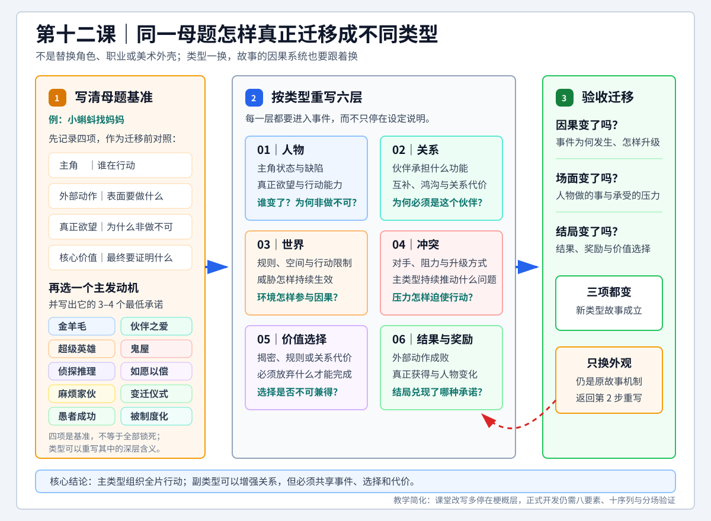

# 查理老师的编剧课 - 第十二课 小蝌蚪找妈妈

> 导航：[[知识库/学习区/课程/查理老师的编剧课/00 - 课程总览|课程总览]]｜[[查理老师的编剧课|统一知识总结]]

视频：[P25 十二课-小蝌蚪找妈妈12.1](https://www.bilibili.com/video/BV1eE411F73t?p=25)｜[P26 十二课-小蝌蚪找妈妈12.2](https://www.bilibili.com/video/BV1eE411F73t?p=26)｜[P27 十二课-小蝌蚪找妈妈12.3](https://www.bilibili.com/video/BV1eE411F73t?p=27)  
说明：本笔记按“课”聚合 P25-P27，根据三份本地 ASR 转写与 metadata 整理，不是官方逐字稿；课程以《小蝌蚪找妈妈》为统一母题，连续演示十种故事类型的改写方式。

## 本课速览

- 核心问题：怎样把同一个简单母题，按照十种故事类型各自必须抓住的核心要素，重新生成十个真正不同的故事，而不是只更换人物、背景或表面风格。
- 主要结论：类型首先是创作者组织故事的思路和约束，不只是面向观众的影片标签。确定主类型后，要用该类型的关键要素反推人物缺陷、伙伴功能、世界规则、对手、冲突和结局。
- 学习价值：第十一课负责解释十种类型的定义，本课用一个熟悉母题做连续迁移练习，把抽象类型知识变成可实际操作的故事生成方法。
- 适用环节：灵感与命题、故事骨架、剧本开发；尤其适合检验一个点子更接近哪种叙事发动机，以及当前版本缺少什么。
- 本课总问题：怎样在保留“小蝌蚪找妈妈”这一基础母题的同时，让金羊毛、爱情、超级英雄、鬼屋、侦探、如愿以偿、麻烦家伙、变迁仪式、愚者成功和被制度化分别形成独立、可辨认的故事。

## 直观教学图

> [!tip] 怎么读
> 从左到右：先写清原母题的四项基准，再选主类型并用最低承诺重写人物、关系、世界、冲突、价值与结局；最后检查因果、场面和结局是否都发生了实质变化。

> [!note] 适用边界
> 本图用于梗概层的类型迁移练习。课堂推演尚不能替代八要素、十序列、分场、人物可信度与真实题材研究；只换角色、职业或美术外观不算类型迁移。

## 来源可靠性

- 信息来源：P25、P26、P27 均为本地 `faster-whisper base` ASR；metadata 显示三段均无官方字幕。
- 音频范围：P25 约 26 分 33 秒，P26 约 28 分 23 秒，P27 约 31 分 47 秒；三份转写均覆盖到接近片尾。
- 录制边界：P26 开头提到此前录制曾因设备没电而丢失一段，但现有 P25 结尾与 P26 开头都从金羊毛转入爱情类型，当前可见课程论证连续。
- 片尾边界：P27 最后一处口头总结停在半句话，但“被制度化”案例的行动、结局和主题已经完整收束。
- 校正说明：关键术语已按第十一课上下文统一校正。高频误识别包括“金鸭毛／金牙毛／惊讶毛”应为“金羊毛”，“小克多／小客头”应为“小蝌蚪”，“王吧／王爸”应为“王八”，“生事”应为“身世”，“鱼王”应为“欲望”，“零点”应为“零件”，“勾贺”应为“沟壑／鸿沟”，“命满”应为“命门”。
- 类型名校正：“蒸碳／真大”按语境校正为“侦探”，“如愿一场”为“如愿以偿”，“麻烦家火”为“麻烦家伙”，“便千一世”为“变迁仪式”，“余者成功”为“愚者成功”。
- 专名校正：“救毛米／舅毛米”为《救猫咪》，“世代德先生”为布莱克·斯奈德；影片名结合上下文校正，但零星即兴口述仍以原视频为准。
- 外部补充：无。本笔记只归纳讲者内容、课程内部概念和三份转写能够支持的判断。

## 分集脉络

- **P25｜十二课-小蝌蚪找妈妈12.1**：重申十类型是十种创作思路，用原版《小蝌蚪找妈妈》建立金羊毛改写，重点演示“外部动作不等于真正欲望”“结果可以绕过动作实现欲望”以及互补伙伴的设计。
- **P26｜十二课-小蝌蚪找妈妈12.2**：依次把母题改成爱情／伙伴情、超级英雄、鬼屋、侦探和如愿以偿，展示每一类故事不可缺少的关系、规则、威胁或选择。
- **P27｜十二课-小蝌蚪找妈妈12.3**：完成麻烦家伙、变迁仪式、愚者成功和被制度化四类改写，语气从冒险、家庭成长、喜剧逐步转向群体制度与牺牲主题。

## 时间线笔记

### P25 十二课-小蝌蚪找妈妈12.1

#### 整体脉络

- `00:09-02:27`｜澄清十类型是十种讲故事的思路，不等于院线、平台或海报上的影片分类。一部电影可以混合多种类型，爱情尤其常作为情感副线进入其他主类型。
- `02:29-08:38`｜快速复盘十种类型及代表片例，重点区分金羊毛、麻烦家伙、变迁仪式、愚者成功、如愿以偿和被制度化。讲者用公路、任务、寻宝、调查、愿望和个人对群体等不同发动方式帮助记忆。
- `08:40-10:38`｜说明类型框架的用途：先判断自己的故事最接近哪种创作思路，再检查该类型必须抓牢的“七寸”。类型要求可以帮助创作者及时扶正故事，至少避免骨架级缺失。
- `10:47-13:32`｜回顾原版《小蝌蚪找妈妈》：小蝌蚪看见小鸡被母亲接回家，由此发现自己没有妈妈并决定寻找，构成清楚的激励事件；主角、目标和上路动作都很明确，因此天然接近金羊毛。
- `13:34-17:32`｜指出原童话还不足以直接撑成长片。把“找妈妈”从终极欲望降为外部动作，把真正欲望提升为确认身世、找到自己是什么、证明自身价值。小蝌蚪因外形不明而被鱼、虾、螃蟹排斥，身世之谜成为持续疼痛。
- `17:33-20:17`｜为旅程设计互补伙伴王八。小蝌蚪缺少家庭，王八拥有完整家庭却因被溺爱而离家；两者价值状态相反。选择王八而不是鱼虾，还因为旅途中需要穿越无水地带，伙伴必须能解决具体环境障碍。
- `20:18-23:18`｜让结果绕过动作实现欲望：小蝌蚪未必找到妈妈，却在长途跋涉中长出四肢、尾巴逐渐消失，从身体变化中确认自己是青蛙。早期由王八拖行，后期则由它反过来寻找水源、救助濒临干死的王八，行动关系发生反转。
- `23:18-26:28`｜主题从“知道自己是什么”继续升到“不需要由身世、母亲或他人定义价值”。小蝌蚪学会帮助自己和别人；王八也从逃离家庭成长为理解亲情。金羊毛版最终是“没有找到妈妈，却找到了自我”。

#### 详细导览

P25 先处理一个容易混淆的问题：课程中的十类型并不是常见的动作、喜剧、爱情、恐怖等消费分类，而是从创作者角度概括的十种故事发动方式。影片可以跨类型，也可以让一种类型承担主线、另一种承担关系或情感副线。使用这套框架的目的不是给成片贴标签，而是在故事开发阶段找到必须成立的关键结构。

《小蝌蚪找妈妈》原故事已经具备金羊毛的基础：主人公为了一个清楚目标踏上旅程，并在途中不断遇到误认、拒绝和危险。但若扩成长片，仅仅“见到几个动物、最后找到妈妈”还不够。课程因此把外在行动与内在欲望拆开：找妈妈是看得见的动作，确认身世和价值才是持续驱动人物的真正欲望。

伙伴王八的设计同时承担人物、关系和场面功能。它拥有小蝌蚪梦寐以求的家庭，却不懂珍惜；小蝌蚪渴望归属，王八渴望自由。王八还能在干涸河床或陆地段落拖行小蝌蚪，使伙伴选择直接进入旅程障碍。后半段小蝌蚪长出四肢并反过来救王八，既兑现身体变化，也把人物成长变成可见动作。

结局不必机械兑现“找到妈妈”。课程再次使用此前的“绕过动作实现欲望”：寻找失败仍可带来更深的获得。小蝌蚪通过成长和帮助别人确认自身价值，不再依赖血缘答案定义自己；王八则在共同冒险中重新认识家庭。这一版的真正奖励不是母亲，而是自我认同和关系成长。

### P26 十二课-小蝌蚪找妈妈12.2

#### 整体脉络

- `00:03-00:30`｜承接金羊毛案例，提出同一故事能否改成爱情或伙伴情故事。爱情不只指男女恋爱，也可以用来组织兄弟、朋友等彼此需要的情感关系。
- `00:31-04:47`｜建立“残缺主角＋互补零件”：让小蝌蚪失去尾巴和行动能力，由王八负责移动、觅食和保护；小蝌蚪虽然身体残缺，却负责观察、判断和识别危险，双方通过行动证明谁也离不开谁。
- `04:48-09:10`｜制造关系鸿沟：小蝌蚪逐渐变成青蛙，而王八／甲鱼具有捕食青蛙的本能。物种冲突、王八家族的压力、误会、分离、暗中保护和重逢构成情感主线；这条关系也可以作为金羊毛旅程里的副线。
- `09:12-13:27`｜改写超级英雄片，建立“能力、命门、对手、使命”。蝌蚪侠可以操纵水或借水完成行动，但离开水有明确时间限制；旗鼓相当的王八精掌握其命门，寻母的私人动机最终扩大为拯救整个水域。
- `13:36-17:39`｜改写鬼屋片：封闭小池塘是空间，深水区的血盆大口是致命力量，小蝌蚪不听母亲警告导致母亲为救它而被吞是原罪。主角经过痛苦后必须主动进入深水区，补偿自己招致的灾祸。
- `17:42-21:16`｜改写侦探片：秘密是“谁是我的母亲”以及池塘凶案真相，小蝌蚪承担带观众探秘的职责。最终它发现凶手正是生母，被迫在血缘与警察职责之间选择，并以亲手惩办母亲完成自我牺牲。
- `21:18-22:41`｜提醒若干类型边界相近，不能只记名称。如愿以偿的基本结构是一个可共情愿望、一套带条件的实现规则，以及愿望实现后必须得到的教训。
- `22:42-28:15`｜改写如愿以偿／穿越故事：成年青蛙后悔少年时没有去大海，获得重选机会后却干扰哪吒闹海，造成龙王三太子掌权和历史恶化。主角必须修复历史，并从母亲朴素的劝告中理解珍惜当下。

#### 详细导览

爱情／伙伴情版本把关系结构拆成三个层次：首先让一个主角真正残缺；其次让另一位角色成为不可替代的“零件”；最后在他们之间建立足够深的鸿沟。无尾小蝌蚪和王八不是性格上简单互补，而是在生存行动上彼此需要。随后，物种成长使朋友可能变成捕食者与猎物，关系中的安全感、偏见、家庭压力和误会才获得真正重量。

课程同时说明，情感关系不一定独立成为全片主类型。小蝌蚪和王八完全可以一边踏上金羊毛旅程，一边发展伙伴情。主类型负责组织全片行动，副类型负责加强关系和情感；二者合并的前提是共享同一条因果链，而不是各讲各的。

超级英雄版本通过四个要素迅速搭建。能力必须足够特殊，命门必须清楚、可视化且能被对手利用，对手必须构成对等压力，使命则不能长期停留在私人恩怨。课程用离水倒计时把弱点转成场面规则，再让寻母行动揭开对手统治水域的阴谋，使私人问题自然升级为公共使命。

鬼屋版本强调空间、致命力量与原罪三者互相扣合。池塘不仅是背景，而是无法轻易逃离、具有浅水与深水层级的封闭环境；怪物的出现不是偶然惊吓，而是由小蝌蚪违反警告引出；母亲的失踪又迫使它重返最恐惧的区域。恐怖因此来自主角必须主动面对自己造成的后果。

侦探版本把“找妈妈”直接转成秘密，但秘密本身还不够。小蝌蚪必须成为探秘者，并在揭开真相时付出改变行为路径的代价。当凶手和母亲合为一人，寻找亲情与履行职责形成不可兼得的选择，结局才不只是公布答案，而是完成探秘者的自我牺牲。

如愿以偿版本则使用穿越承载愿望。重新选择看似补偿人生遗憾，却因规则和历史连锁反应制造更大灾难。真正的故事任务从“去大海”转为修复自己改变的世界，最终教训也不是简单否定冒险，而是理解选择的代价、母亲经验的价值以及对当下生活的重新认识。

### P27 十二课-小蝌蚪找妈妈12.3

#### 整体脉络

- `00:04-02:32`｜改写麻烦家伙：先建立天真、无害、乐观、被母亲保护得很好的小蝌蚪，再让母亲突然被川菜馆抓走。弱小人物被迫承担远超日常能力的救援任务。
- `02:32-05:14`｜为生死考验设计训练段落：憋气、离水移动、攀爬水箱管道、利用现有材料伪装。曾逃出饭店却被下水道热油烫瞎的老王八成为导师，只能依据记忆训练主角，不能直接替它完成任务。
- `05:14-06:41`｜解释变迁仪式：面对常见生活问题时，人物没有使用正常方式处理，而是逃避或采取过激行动，引发一连串后果，最后回到更成熟的解决方式。课程再次提到《触不可及》作为辅助理解。
- `06:45-13:23`｜改写变迁仪式：青春期小蝌蚪发现王八养母与自己物种不同，因养母回避身世真相而离家寻找蛙群。它短暂获得外貌相似者的归属与爱情，形成虚假胜利，随后才理解养育自己的母亲和共同经历比血缘外表更深。
- `13:23-14:13`｜解释愚者成功：天真、被低估的“愚者”进入自己难以融入的伟业或机构，努力伪装成机构认可的样子，最后通过失败或暴露完成真实转变。
- `14:13-21:26`｜改写愚者成功：小蝌蚪进入水族馆观赏鱼缸，模仿金鱼游姿、吐泡和表演。正式演出前尾巴消失、四肢长出，伪装彻底失败；它却用青蛙独有的跳跃和攀爬赢得观众，从队尾走到领舞位置。
- `21:26-27:11`｜建立被制度化故事：轮胎水坑里的蝌蚪群接受“猫每天吃五只”的秩序，麻木地把概率性幸存当作人生规则。点点开始质疑群体命运，判断东侧泥土后面可能有水，并尝试组织大家挖掘逃生通道。
- `27:11-31:39`｜点点逐渐影响部分群体，却在即将挖通时遭遇拖拉机，伙伴大量死亡、计划破产，它也受到全体责骂。随后暴雨把幸存者冲入真正池塘；点点选择留在死去的伙伴身边，以牺牲证明反抗、希望和共同自由本身有价值。

#### 详细导览

麻烦家伙版本的关键不是灾祸本身，而是灾祸与主人公平日能力之间的巨大落差。越天真、弱小、无忧无虑的小蝌蚪，越不可能独自潜入饭店救母，任务也越能迫使它成长。训练段落不是额外装饰，每一项能力都对应后续路线中的具体难关；老王八则以过去经历提供知识，却因失明无法代替主角行动。

变迁仪式从宏大冒险转回日常关系。青春期、身世疑问、养母隐瞒和离家出走都是可以理解的家庭问题与错误处理。小蝌蚪在蛙群中获得外表相似、爱情和接纳，却只是虚假胜利；真正变化来自它理解养母当年失去孩子、拼死救下并抚养自己的经历。结局回归家庭，不是恢复原状，而是带着新理解重新建立母子关系。

愚者成功版本通过水族馆机构表现“伪装性变化”。小蝌蚪相信只有变成观赏鱼才能获得掌声，于是把全部努力用于模仿。身体成长在演出当天使伪装崩溃，看似最丢脸的时刻反而暴露它真正独特的能力。观众的笑从它误以为的嘲笑变成欣赏，它也从羞耻转向主动表演，完成“不是成为别人，而是成就自己的唯一”。

被制度化版本把冲突升到个体与群体规则。水坑中的蝌蚪并非不知道危险，而是把每天牺牲少数者合理化，只求自己不是当天被吃的五只。点点的反抗一开始并不宏大，它只是追问“为什么必须这样”，再根据泥土和水的本能寻找替代路径。群体拒绝、追随者出现、工程受挫和同伴死亡，使坚持自我付出真实代价。

暴雨最终帮助群体进入池塘，但课程没有把偶然天气当成对点点努力的否定。挖掘、牺牲和公开反抗已经改变了群体对制度的想象，使“存在别的选择”成为可被相信的事实。点点留下不是为了个人逃生，而是守住共同抗争的意义。这一版的“小蝌蚪找妈妈”已经转成沉重的制度寓言。

## 核心观点

- 十类型首先是十种故事创作思路，不是严格、互斥的市场分类。
- 类型的价值在于指出一种故事必须抓住的核心关系、规则和选择，帮助创作者诊断骨架缺失。
- 同一母题进入不同类型后，主角状态、真正欲望、伙伴、对手、世界规则、语气和结局都要随之改变；只替换外观不算类型迁移。
- 外部动作不等于真正欲望。“找妈妈”可以是可见行动，而真正欲望可能是确认身份、获得价值、理解亲情或挑战群体命运。
- 结果可以绕过动作实现欲望。主角未必完成原计划，却可以得到更深层的答案和变化。
- 人物设计要服从故事功能。互补伙伴不仅提供性格反差，还要在具体场面中解决主角无法解决的障碍，并拥有自己的价值矛盾和变化。
- 主类型负责组织全片行动，副类型可以加强关系或情感，但不能与主线割裂或夺走核心问题。
- 类型必备要素必须进入因果：超能力要受命门限制，怪物要与空间和原罪相连，秘密要迫使探秘者牺牲，愿望实现要产生规则后果。
- 类型框架能减少结构性错误，但不能自动保证人物真实、情感有效、题材适配或作品原创。

## 方法与案例

### 方法一：同母题十类型迁移

1. 写出原母题最稳定的四项：主角、外部动作、真正欲望、核心价值。
2. 选择一种主类型，列出该类型不可缺少的三至四个要素。
3. 根据这些要素重新设计人物缺陷、伙伴功能、世界规则、对手和必须发生的价值选择。
4. 检查类型变化是否真正改变因果、场面和结局，而不只是改变美术外壳或职业名称。
5. 用八要素和十序列重新验证完整性；类型重点不能替代主角、欲望、动作、阻力、结果和主题。

### 方法二：区分动作、欲望、结果与奖励

1. **动作**：主角打算做什么，例如找到妈妈。
2. **欲望**：主角为什么非做不可，例如确认身世、获得归属或证明价值。
3. **结果**：外部计划最终是否完成，例如没有找到妈妈。
4. **奖励**：人物最终真正获得什么，例如身体和行动证明了“我就是我”。
5. 尝试设计一次“绕过动作实现欲望”：原计划可以失败，但内在问题必须得到更深回应。

### 方法三：建立主类型与副类型

1. 用一句话写出主类型持续推动全片的行动问题。
2. 再写一句副类型关系问题，例如伙伴能否跨越物种鸿沟。
3. 检查两条线是否共享事件、选择和代价。
4. 删除只增加篇幅、却不能加强主问题的独立支线。

### 贯穿案例：金羊毛版《小蝌蚪找妈妈》

一个因身世不明而被池塘伙伴排斥的小蝌蚪，与一个拥有家庭却离家出走的王八同行寻找母亲。小蝌蚪一路经历危险和身体变化，未必找到妈妈，却确认自己是青蛙，并在反过来救助伙伴的过程中发现自身价值；王八也重新理解家庭。这个案例集中体现外部动作与真正欲望的区分、功能性伙伴、关系反转和绕过动作实现欲望。

### 重要辅助案例

- 金羊毛／旅程：课程提到《心花路放》《泰囧》《十一罗汉》《绿野仙踪》《西游记》《阳光小美女》，用来说明公路、任务和寻宝都可由旅程目标组织。
- 爱情与关系鸿沟：课程以《半个喜剧》《泰坦尼克号》等说明人物彼此需要后，还必须有足以阻止他们结合的深层鸿沟。
- 鬼屋／灾难：课程提到《大白鲨》《巨齿鲨》，强调封闭环境中的致命威胁。
- 侦探：课程提到《福尔摩斯》《唐人街探案》，强调秘密、探秘者和揭密代价。
- 变迁仪式：课程提到《录取通知书》《触不可及》，帮助理解日常问题、错误处理和成熟回归。
- 愚者成功：课程提到《阿甘正传》《丑小鸭》以及《士兵突击》的许三多，说明被低估者进入伟业或机构后的真实转变。
- 被制度化：课程提到《飞越疯人院》《教父》，说明个体与群体规则、传统和机构之间的选择。
- 训练段落：课程借《破坏之王》的无敌风火轮、断水流大师兄类比麻烦家伙版本的能力训练。
- 穿越愿望：课程借《夏洛特烦恼》说明重选人生，再用“改变哪吒闹海”构造干扰历史与修复历史的任务。
- 伙伴功能：课程借《权力的游戏》中霍多负重前行的形象，类比王八在小蝌蚪尚无陆地能力时承担移动功能。

## 十类型实操矩阵

| 类型 | 核心发动机／必备要素 | 《小蝌蚪找妈妈》改写 | 主要价值落点 |
|---|---|---|---|
| 金羊毛 | 目标、道路、伙伴、真正奖励 | 外在找妈妈，内在找身世与价值；与王八共同上路，未找到妈妈也完成自我确认 | 身份不必由血缘定义 |
| 爱情／伙伴情 | 残缺主角、互补零件、巨大鸿沟 | 无尾小蝌蚪与王八在行动和判断上互补，成长后的物种捕食关系迫使双方分离与牺牲 | 关系需要行动证明和代价 |
| 超级英雄 | 能力、命门、对手、使命 | 蝌蚪侠可以控水，却受离水时限制约；对抗王八精并从寻母扩大到拯救水域 | 能力越强，限制与使命越要清楚 |
| 鬼屋 | 封闭空间、致命力量、原罪 | 小池塘与深水区构成封闭空间，血盆大口是威胁，小蝌蚪因不听劝导致母亲被吞 | 必须面对自己招致的灾祸 |
| 侦探 | 秘密、探秘者、自我牺牲 | 小蝌蚪调查母亲与凶案，最终发现凶手就是生母，并在亲情与职责间选择 | 真相要求改变原有行为路径 |
| 如愿以偿 | 愿望、规则、实现、教训 | 成年青蛙穿越回少年时代去大海，却改变哪吒闹海并破坏历史，只能设法修复 | 重新理解选择代价与当下 |
| 麻烦家伙 | 无害小人物、突降大事、生死考验 | 天真小蝌蚪的母亲被饭店抓走，它接受训练并穿越下水道、水箱等险境救母 | 大任务迫使弱小者成长 |
| 变迁仪式 | 日常问题、错误处理、连锁后果、成熟回归 | 因养母隐瞒身世而离家，在蛙群获得虚假归属后理解养育之情并回家 | 从血缘执念走向关系理解 |
| 愚者成功 | 愚者、伟业／机构、伪装变化、真实转变 | 小蝌蚪模仿观赏鱼，演出时变成青蛙导致伪装失败，却以独有动作赢得观众 | 不必成为别人才能成功 |
| 被制度化 | 群体规则、个体选择、对抗与代价 | 蝌蚪群接受每天被猫吃五只，点点反抗并挖掘逃生通道，以牺牲换来群体自由 | 对制度的质疑使新选择成为可能 |

## 适用边界

- 十类型是布莱克·斯奈德提供的故事生成模型，不是唯一、严格或互斥的叙事分类学。
- 本课多数内容是课堂即兴前提推演，完成度主要停在故事梗概；它们尚未经过十序列、分场、人物可信度和场面执行检验。
- “一个母题可以改成十类型”用于训练迁移能力，不意味着实际项目要把十个版本全部开发，也不意味着任何组合都同样适合。
- 主类型应由故事最持久的行动问题决定。爱情、调查或家庭关系可以成为副线，但不能只因作品中出现这些元素就改变主类型判断。
- 儿童童话、爱情故事、恐怖片、现实家庭题材和制度悲剧面对的观众、尺度与语气不同；迁移类型时必须同步调整年龄层、暴力程度和情感承诺。
- 王八捕食青蛙、无尾蝌蚪存活、跨水陆移动等属于戏剧化设定。正式开发前需要补充生态、生理和环境研究，不能把课堂假设直接当作事实。
- 讲者关于男女观众偏好、国内审查、市场类型数量和影片受众的表述属于个人经验或时代性判断，不应直接当作稳定行业事实。
- “虚假的变化”一词在 ASR 中不稳定。结合愚者成功案例，更准确的语义是为了融入机构而进行的伪装性改变或虚假胜利，随后由真实身份完成真正转变。
- 类型要素只能帮助发现结构弱点，不能替代情感真实、人物观察、主题判断、原创表达和真实项目验证。

## 可实践练习

1. 选择自己的一个简单母题，分别写十条一句话类型前提；每条必须显出该类型的关键要素，不能只换时代、地点或美术风格。
2. 从十条中选出最有潜力的两条，各自补全身份、欲望、动作、问题、阻力、结果、正价值和负价值。
3. 为其中一条分别写清外部动作、真正欲望、外部结果和最终奖励，再设计一次“绕过动作实现欲望”的结局。
4. 设计一个互补伙伴：主角缺什么、伙伴拥有什么、伙伴又缺什么；至少安排一次前后关系反转，让早期被帮助者在后期反过来帮助伙伴。
5. 选择“主类型＋副情感线”，分别写出两条持续问题，并检查它们是否共享至少三个关键事件和同一组选择代价。
6. 把同一前提分别改成儿童动画、成人现实题材和黑暗寓言，比较人物年龄、冲突尺度、暴力程度、结局和主题表达必须怎样改变。
7. 选一个熟悉电影，先判断其主类型，再指出该类型最强的一项和最弱的一项；用本课矩阵提出一次最小修改。

## 与此前课程的衔接

- 第二至第五课：本课继续使用八要素、故事支点以及结果与主题的区分。金羊毛案例直接复用了“绕过动作实现欲望”。
- 第八课：原罪、虚假胜利和十序列在本课变成类型节点；鬼屋依赖原罪，变迁仪式和愚者成功都安排了虚假归属或虚假成功。
- 第九课：王八伙伴承担互补、功能性配角和副弧光，体现人物关系必须对主行动线产生推力、阻力与反转。
- 第十课复杂叙事：多线不等于杂乱。主类型提供主行动弧，爱情、伙伴或调查可以作为副线共同构成更复杂叙事。
- 第十一课类型片：第十一课讲十种类型的定义和必备要素，第十二课用同一母题完成迁移训练，是“理论辨认”到“实际生成”的直接承接。

## 主题沉淀

### 已沉淀

- [[知识库/学习区/综合整理/01-故事与剧本/短篇、类型与媒介的叙事选择]]：本课相关方法已进入统一主题笔记。

### 待沉淀

- 暂无新增候选；相关内容已并入现有主题。

## 复习区

### 一分钟核心摘要

十类型不是给成片贴标签，而是十种组织故事的创作思路。先识别主类型，再抓住该类型必须成立的关系、规则和选择，用它们反推人物、伙伴、世界、对手和结局。《小蝌蚪找妈妈》的十次改写说明，同一母题只有在行动、欲望、因果、语气和价值落点都随类型变化时，才算真正完成类型迁移。

### 关键概念

- 十种故事创作思路
- 主类型与副类型
- 类型核心要素
- 外部动作与真正欲望
- 绕过动作实现欲望
- 互补伙伴与关系反转
- 类型迁移
- 虚假胜利与真实转变

### 自测问题

1. 为什么课程把十类型称为创作思路，而不只是影片分类？
2. 金羊毛版中，“找妈妈”“确认身世”“发现自身价值”分别属于动作、欲望还是奖励？
3. 爱情／伙伴情版本为什么既需要互补，又需要足够深的鸿沟？
4. 超级英雄、鬼屋和侦探三类分别有哪些不能缺少的要素？
5. 如愿以偿中的愿望为什么必须受到规则限制，并最终产生教训？
6. 变迁仪式和愚者成功都出现虚假胜利，它们的生活问题和机构问题有何不同？
7. 被制度化版本中，点点的目标怎样从个人活命提升为证明反抗与希望的价值？
8. 怎样判断一条爱情线是主类型，还是服务于金羊毛旅程的副类型？

### 任务

- [ ] #复习 不看笔记，用一分钟说出十种类型及各自最重要的发动机。
- [ ] #复习 任选三种类型，复述《小蝌蚪找妈妈》对应版本的主角、阻力、结果和价值落点。
- [ ] #创作练习 用自己的一个母题完成十条一句话类型迁移，并选两条补全八要素。
- [ ] #创作练习 为一个已有故事区分外部动作、真正欲望、结果和奖励，尝试设计一次绕过动作实现欲望的结局。

## 二刷时可以重点听

- P25 `08:40-10:38`：为什么十类型的用途是找到故事“七寸”，以及类型要求怎样帮助扶正骨架。
- P25 `13:34-17:32`：把“找妈妈”从终极欲望改成外部动作，把真正欲望提升为寻找身世和价值。
- P25 `17:33-23:18`：王八伙伴为何既与主角价值互补，又能解决陆地段落；前后救助关系怎样完成反转。
- P25 `23:18-26:28`：没有找到妈妈却找到自我，以及结果如何绕过动作实现欲望。
- P26 `00:31-09:10`：爱情／伙伴情中的残缺主角、互补零件和关系鸿沟，以及主副类型的组合。
- P26 `09:12-17:39`：超级英雄的能力、命门、对手、使命，以及鬼屋的空间、致命力量、原罪。
- P26 `17:42-21:16`：侦探故事为什么不仅需要秘密，还需要探秘者在揭密时自我牺牲。
- P26 `22:42-28:15`：如愿以偿如何通过穿越规则、历史连锁反应和最终教训完成结构。
- P27 `00:04-05:14`：麻烦家伙如何用弱小人物、突降大事、训练和生死考验推动成长。
- P27 `06:45-13:23`：变迁仪式中的家庭问题、离家出走、蛙群虚假胜利和对养育之情的重新理解。
- P27 `14:13-21:26`：愚者成功版本中伪装失败、真实能力暴露和从队尾到领舞的转变。
- P27 `21:26-31:39`：被制度化版本如何建立麻木群体、个体质疑、反抗代价、集体自由与最终牺牲。
