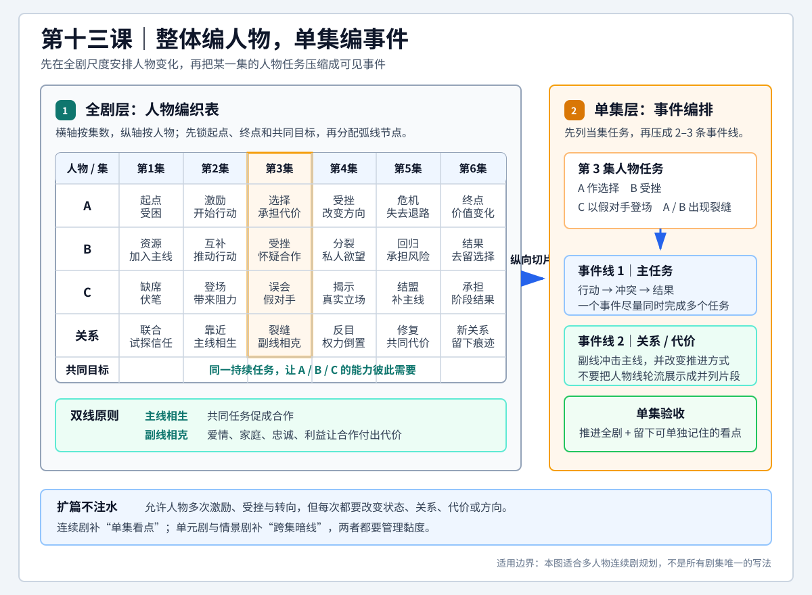

# 查理老师的编剧课 - 第十三课 电视剧

> 导航：[[知识库/学习区/课程/查理老师的编剧课/00 - 课程总览|课程总览]]｜[[查理老师的编剧课|统一知识总结]]

视频：[P28 十三课-电视剧13.1](https://www.bilibili.com/video/BV1eE411F73t?p=28)｜[P29 十三课-电视剧13.2](https://www.bilibili.com/video/BV1eE411F73t?p=29)｜[P30 十三课-电视剧13.3](https://www.bilibili.com/video/BV1eE411F73t?p=30)｜[P31 十三课-电视剧13.4](https://www.bilibili.com/video/BV1eE411F73t?p=31)  
说明：本笔记按“课”聚合 P28-P31，根据四份本地 ASR 转写与 metadata 整理，不是官方逐字稿。课程先从播放方式和商业模式解释电视剧形态，再给出多人物、多事件的实际规划方法，最后比较连续剧、非经典长篇、单元剧与情景剧。

## 本课速览

- 核心问题：电视剧为什么不能只是“把电影写长”，以及怎样把多人物、多事件、多集数编织成既连续又有单集看点的剧集。
- 媒介结论：叙事形态会随播放方式、商业模式和观看习惯改变。早期电视依靠广告、固定时段和被动观看，需要长时间陪伴、批量生产和较低理解负担；点播、付费和高质量终端则把剧集推向主动观看、强情节与电影级制作。
- 创作口诀：**整体编人物，单集编事件。** 先把主角群、各人物弧光和主角群关系曲线排进全剧分集表，再逐集切出任务，用两至三条事件线承载这些任务。
- 人物原则：多人戏仍应有可辨认的主角群和共同目标。主线让人物相生，副线让人物相克；人物关系还要单独规划反复的联合、分裂、亲近与对抗。
- 扩篇原则：剧集可以重复激励、阻力、选择和转折，可以让人物弧光发生多段变化，也可以引入类型化事件群、反复主题正负价值，但全剧起点与终点必须明确。
- 形态取舍：经典连续剧有天然黏度，却容易牺牲单集看点；单元剧依靠单集强事件，情景剧依靠强人物关系，二者易复制却黏度较弱，需要暗线补偿。
- 新手建议：优先在经典叙事框架内写主角群，不宜过早挑战依赖经典 IP、明星阵容和大时代跨度支撑的非经典宏大长篇。

## 直观教学图

> [!tip] 怎么读
> 先看左侧全剧表：横轴是集数，纵轴是人物与独立关系曲线；再沿高亮列纵向切出一集，把人物任务压成右侧两至三条有行动、冲突和结果的事件线。

> [!note] 适用边界
> “整体编人物，单集编事件”适合多人物连续剧规划，不是所有剧集的唯一写法。扩篇允许反复激励与转向，但每次都要改变状态、关系、代价或方向。

## 来源可靠性

- 信息来源：P28、P29、P30、P31 均为本地 `faster-whisper base` ASR；四份 metadata 均显示无官方字幕，转写来源为 `faster_whisper_asr`。
- 音频范围：P28 约 31 分 01 秒，P29 约 24 分 42 秒，P30 约 30 分 10 秒，P31 约 28 分 35 秒；四份转写均覆盖到当前分 P 的片尾。P28 与 P30 在句中结束，分别由 P29、P31 开头自然承接。
- 校正原则：只对上下文明确的高频误词、片名和术语做校正，不依据常识补写转写中没有的论点。讲者即兴口述的年份、价格、审批细节和行业判断未做外部核验。
- 核心术语校正：“整体编较多／整体编辞人物”按反复解释校正为“整体编人物”；“单级编时间”结合后文“单集以事件构建”校正为“单集编事件”；“主线相声、腹线相课”校正为“主线相生，副线相克”；“人物胡现”校正为“人物弧线”。
- 叙事术语校正：“经典训示／经典虚实”校正为“经典叙事”，“非经典虚实”校正为“非经典叙事”，“清灵剧”按“固定人物、固定场景、强人物关系”的定义校正为“情景剧”，“年度／黏度底”校正为“黏度低”。
- 片名校正：上下文稳定支持《西游记》《三国演义》《水浒传》《红楼梦》《渴望》《射雕英雄传》《莲花争霸》《封神榜》《东京爱情故事》《新白娘子传奇》《成长的烦恼》《海滩游侠》《编辑部的故事》《我爱我家》《中国式离婚》《士兵突击》《刘老根》《纸牌屋》《权力的游戏》《来自星星的你》《庆余年》《蜗居》《绝命毒师》《流星花园》《大宅门》《大时代》等。
- 不确定项：P29 约 `01:50-01:56` 的第一部海外剧名无法由 ASR 稳定确认，正文不补猜；P28 关于个别早期剧集的镜头长度、P29 平台交易价格以及送审年份，只作为讲者课堂回忆，不转写为已核实行业事实。
- 观点边界：关于观众性别、消费倾向、审查、国内外产业差距、平台权力和续集政策的表述具有明显时代性和个人经验色彩，适合用来理解讲者的媒介判断，不宜直接当成当前通行规则。
- 外部补充：无。本笔记只归纳四份 transcript 与 metadata 能支持的课程内容。

## 分集脉络

- **P28｜十三课-电视剧13.1**：从电视剧教材稀少、电影与电视剧的差别讲起，以广告模式解释早期电视剧的陪伴性、人物驱动和连续生产，并回顾中国电视剧的繁荣与代表作品。
- **P29｜十三课-电视剧13.2**：从国内电视剧的现实困境转向审查不明确、观看方式升级和平台技术变革，强调内容创作者应关注新平台带来的结构性机会。
- **P30｜十三课-电视剧13.3**：进入实操，提出“整体编人物，单集编事件”，用全剧人物表、主角群共同目标、主副线关系和人物关系曲线处理多人多线。
- **P31｜十三课-电视剧13.4**：补完人物弧线与逐集切分，给出扩篇、首集、经典／非经典叙事、单元剧／情景剧的具体方法，并以“黏度与单集看点”完成形态比较。

## 时间线笔记

### P28 十三课-电视剧13.1

1. `00:03-02:48`｜讲者先解释为何电视剧教材少：电视剧历史较短，产业和播放形态持续变化，很难过早固化为一套稳定教科书。现有实践通常先学电影、戏剧的故事方法，再依据电视剧的市场、集数和播放需求进行演化；这不是高低之分，而是同为讲故事却有不同媒介条件。

2. `02:48-05:50`｜课程回应电影、电视剧、网剧、网络内容之间的“鄙视链”。行业偏见确实存在，但创作者不应据此判断媒介价值；一个灵感适合电影、电视剧、小品或歌词，应由内容和表达需要决定。无论接到哪种媒介任务，都必须全力完成，而不是把某一媒介当作可以降低标准的次等工作。

3. `05:54-09:42`｜讲者用“电视剧最初是电视广告的马仔”概括早期商业逻辑：电视节目吸引观众停留，广告完成变现。由此产生几个形态特征：要大量填充播出时间、不能持续消耗观众精力、依靠人物形成陪伴、倾向连续生产，早期常见家庭、喜剧、爱情等较柔和类型。这里的重点不是字面定义，而是由商业任务反推叙事形式。

4. `09:42-15:50`｜课程插入方法论提醒：编剧学习应重视“从零到一怎样写”，警惕只堆术语或只带学员赞叹名作的课程。讲者用厨师只讲刀法源流却不教做菜作比，并提到《这个杀手不太冷》《阳光小美女》《回到未来》等常被逐场分析的作品；案例分析有价值，但若不能转化为创作步骤，就不能替代实际写作训练。

5. `15:50-17:24`｜回到媒介形态：为了持续填补时间，电视剧发展出连续剧和单元剧。连续剧以剧情延续；单元剧即使每集结案，也通过固定人物、固定场景或稳定职业环境保持连续。理解“为什么要连续”之后，创作者才能根据当前项目真正承担的播出与观看任务来选择结构。

6. `17:24-21:30`｜讲者回顾中国电视剧早期繁荣，列举《西游记》《三国演义》《水浒传》《红楼梦》《渴望》等作品，并提到王志文、江珊主演的早期言情／都市剧。课程借这些作品说明当时电视剧既有广泛社会影响，也敢于使用长镜头、抒情场面和鲜明表演风格；具体镜头时长因 ASR 不稳，不作确定记录。

7. `21:30-27:20`｜引进剧与本土创作相互刺激：《射雕英雄传》推动武侠剧热潮，新加坡《莲花争霸》展示不同于香港武侠的夸张想象，内地《封神榜》也进行类型尝试；《东京爱情故事》《新白娘子传奇》《成长的烦恼》《海滩游侠》提供爱情、歌唱叙事、家庭喜剧和职业／海滩视觉等差异化形态。《编辑部的故事》《我爱我家》则把美式情景剧的节奏和结构转化到本土语境。

8. `27:20-31:01`｜后续案例包括《中国式离婚》、TVB 剧、琼瑶剧、《士兵突击》和《刘老根》。《士兵突击》几乎没有女性和爱情线，服装、场景又单一，最初不符合当时电视台对女性观众和广告功能的预期，却在地方播出后走红；《刘老根》以紧凑、不注水和大胆设置地方权力型阻力给讲者留下深刻印象。P28 在该反派案例中结束，由 P29 开头承接其送审结果。

### P29 十三课-电视剧13.2

1. `00:04-02:52`｜P29 先收束《刘老根》案例：讲者认为其反派设置在当时非常大胆，作品最终能够通过并播出值得注意。随后把中国电视剧概括为“过去曾强、现在与国外差距拉大”，并以《纸牌屋》《权力的游戏》、韩国“请回答”系列和《来自星星的你》等说明网络点播时代全球剧集制作快速升级；这是讲者在录课时的产业观察，不是当前排名。

2. `02:53-05:12`｜讲者把国内创作萎缩的重要原因指向审查的不明确，而非简单主张“不要审查”或“越宽松越好”。若禁限内容有明确、稳定、可查询的书面规则，制作方仍能据此规划；真正增加风险的是口径传闻、执行不一致，以及投入后才发现项目无法播出的不确定性。

3. `05:14-10:07`｜送审经历说明这种不确定性：讲者的一部作品收到约十六页修改意见，虽然痛苦但至少可改；同行作品只收到一页“不建议播出”，后来《蜗居》未取得上星播出许可而先在地方台播。另有亲吻镜头只能保留纯后脑角度、厕所场景因出现马桶被删除等例子。课程强调这些是个人经历，用来说明口径可能具体到镜头，却未必有公开统一规则。

4. `10:08-14:09`｜《庆余年》被用作“标准不一致”的例子：在行业普遍认为穿越题材不被提倡时，仍有个别项目能够制作播出。讲者用“同去钓鱼却只有一人能进鱼多的坑”比喻不同项目面对的机会条件。随后转向国际剧集上升的根本变化：观众可以主动点播、愿意付费，屏幕、分辨率和声音都更接近电影体验，剧集因此由服务广告转为直接服务观众。

5. `14:10-16:00`｜课程判断中国电视剧仍有机会，因为国内现实水平与观众应得的成熟水平之间存在巨大空间。机会往往出现在技术变革中：短视频、5G、VR 等新工具会改变内容形态和分发关系。讲者用自己在视频网站初起时入行的经历展开说明，强调新平台早期看似边缘，却可能重排产业话语权。

6. `16:01-20:25`｜早期视频网站大量未经授权播放电视内容，传统行业曾抵制它们。讲者所在团队反向合作，主动提供海报、演员采访和高清素材；平台从每集约 1500 元版权费，发展到新项目开拍前即高价签约，甚至再转售。转写中的 150 万、450 万等数字属于课堂回忆且缺少外部核验，可靠结论是平台支付能力和议价权在极短时间内发生了数量级变化。

7. `20:27-22:39`｜讲者对比自己早期带白酒、托关系向电视台卖片的经历，指出视频网站从被视为侵权者变成主力平台。今天的网站也可能重新变得像旧电视台，而短视频平台只要增加顺滑的连续播放，就可能承载完整电影或连续剧，形成下一轮内容模式；5G、VR 同样可能改变观看接口。

8. `22:40-24:42`｜面对快速变化，创作者最稳妥的资产仍是内容能力，同时要避免因新技术初期粗糙、混乱而一概排斥。课程以早期淘宝等于假货、早期网络电影依靠猎奇片名等现象说明：新平台先经历不规范扩张，随后仍会回到内容竞争。P29 最终把问题交给下一部分：电视剧在新环境下具体有什么优势、该怎样写。

### P30 十三课-电视剧13.3

1. `00:07-04:18`｜进入写法后，课程先确认电视剧虽然由电影叙事演变而来，但现在直接服务主动选择的观众，情节强度和“好看”要求都在提高。面对多人物、多事件、多线并行，讲者提出核心口诀：**整体编人物，单集编事件**。全剧层面以人物弧光为规划单位，单集层面以事件组织当集任务。

2. `03:19-07:35`｜传统电视剧常以约 45 分钟为一集，讲者把这一习惯追溯到早期胶片盘和固定排播；点播时代集长已经可以变化，但“以集为单位”仍是规划基础。实际操作要做表：横轴按第 1 集到第 20 集排列，纵向列 A、B、C、D、E 等主要人物，逐格写出每人在各集经历的激励、尝试、受挫、选择和阶段结果。

3. `05:59-10:49`｜讲者用“穷小子成为富豪”示范人物弧线：受穷受辱、尝试犯罪、受惩罚、改走正路、积累、遭受打击、在帮助下重新开始，最后完成转变。现代剧集更倾向经典叙事，即主角及其目标清晰；国内多人戏可以把单一主角改成主角群，让 A、B、C 围绕共同目标前进，再在中途分裂、结盟或走向不同结果。

4. `10:49-14:11`｜主角群必须先有共同任务，再设计个体差异。课程总结为“主线相生，副线相克”：创业主线中，富二代的资源、行动者的能力、忠厚伙伴的稳定作用可以互补；爱情、忠诚、利益或背叛等副线则撕裂合作。共同目标不必细到“今天偷一辆自行车”，也可以是“共同创业”“出人头地”这类持续行动方向。

5. `14:11-17:22`｜《绝命毒师》是主角群案例：沃尔特与杰西以制毒、贩毒和在地下市场生存为共同主线；沃尔特的家庭、身为缉毒警察的连襟，杰西的吸毒和不自律等副线不断破坏主线。律师、家庭、朋友、对手等配角都应对共同目标形成推力或阻力。反派不等于戏份少，也不等于道德上必然是坏人，关键在于其行动是否阻碍主角群目标。

6. `17:22-23:50`｜全剧表中必须额外单列“人物关系”曲线，尤其记录主角群的联合、破裂、修复和权力起伏。《绝命毒师》中沃尔特与杰西反复合作又反目；《流星花园》的 F4 虽有四人，但道明寺、花泽类之间承担更多关系冲突，西门、美作因长期和谐而存在感较弱；《纸牌屋》中弗兰克与克莱尔各有事业线，却被共同向权力顶端攀升的目标和此消彼长的夫妻关系牵引。

7. `23:50-26:22`｜每条人物弧线仍可借用电影的激励、阻力、转折、危机、高潮和结局，但剧集会重复、变形这些节点。《绝命毒师》开场用癌症诊断与缉毒现场的现金刺激沃尔特进入行动；后续可以再次激励、再次转折。电视剧不是复制一个完整电影结构，而是把电影叙事节点灵活分配到更长、更反复的人物进程中。

8. `26:22-30:10`｜完成全剧人物表后，逐集纵向“切片”。中国剧集一集常有两至三条线：先列出该集必须完成的任务，再用少量事件把任务组合。例如第二集要完成 A 的激励、D 的出场、B 的选择、C 的受挫和 A/B 相遇，可以设计 A 酒驾撞到 D、与 D 冲突时被 B 目击等事件，把多个任务装入同一因果链。P30 结束时继续强调人物可以在后续再次受到激励并改变方向。

### P31 十三课-电视剧13.4

1. `00:03-04:49`｜课程先补充电视剧人物弧线的“球形”理解：电影常把人物从一个价值状态推到 180 度对面，电视剧篇幅更长，可以继续转向新的相邻状态，例如胆小变勇敢、勇敢滑向狂妄、狂妄受挫后学会谦虚。阻力、选择和序列都可多次出现。表格填细后再像切蛋糕一样切出某一集，用两三件事覆盖六个左右的人物任务。

2. `04:20-08:28`｜讲者重申操作顺序：全剧按人物／任务编，单集按事件编，人物关系另拉一条曲线。若全剧篇幅撑不满，可引入类型化事件群，例如一次制度性压迫、一次鬼屋困境；也可让十序列前进三步、后退两步地循环，让人物弧线继续转面，或让正义／邪恶等主题正负价值多次交替。可以扩充中段，但开头和最终方向必须锁定。

3. `08:28-11:21`｜第一集最容易被人物介绍拖垮，因此要“短促而有力”，快速进入剧情，避免把 A、B、C、D 的身份、童年和背景依次报到。可让次要人物在第二、三集分批出场；也可让未来伙伴先以假反派或误会中的对手形象登场，到下一集再反转真实立场。首集的任务不是完成全部档案，而是建立足够强的观看动力。

4. `11:21-18:35`｜讲者建议新手优先写经典叙事：即使有多主角，主角群仍共享目标，分合和情感纠葛只是增加阻力与篇幅。非经典宏大长篇如《红楼梦》《大宅门》《大时代》覆盖人物多、历史跨度长，更像多个电影／多个阶段故事的组合；《大宅门》中白景琦在不同年龄阶段的欲望和目标变化，近似更换主角。此类作品需要贯穿始终的核心、经典 IP、明星表演和高水平制作，新手从业初期不宜轻易挑战。

5. `18:35-21:22`｜除连续叙事外，还有单元剧和情景剧。单元剧每集一个相对完整的故事，有自身起承转合，常见于案件、职业或“每集来一个新人物／新问题”的结构；《编辑部的故事》被用作例子。情景剧也可视作单元化结构：固定人物和场景保持连续，每集问题相对独立。它们都诞生于批量播出的电视环境，但在强内容条件下仍可成立。

6. `21:22-23:49`｜两类单元化作品的优势不同：情节型单元剧依靠**单集强事件**，例如每集一个扑朔迷离的大案；情景剧依靠**强人物关系**，让固定角色的性格和互相挤兑持续生戏。它们不必每集兼顾所有角色的成长任务，因而可以稳定复制、连续拍摄多季；代价是上集看完后，观众未必非看下集，天然黏度较低。

7. `23:49-26:57`｜补黏度的办法是埋一条不抢单集主体的暗主线：让两个人长期若即若离却不立刻确认关系，让某角色隐藏秘密、害怕被群体发现，或让一个角色持续寻找亲生父亲／未解目标，每隔数集轻推一次。暗线若过快解决，就失去可复制的稳定关系；若完全不动，又不能形成牵挂。讲者关于当时续集审批和项目改名的内容只属录课时产业经验。

8. `26:57-28:35`｜结尾把连续剧与单元剧放在同一坐标比较：连续剧通过悬而未决的后果天然拥有黏度，却容易让某一集只负责铺垫、缺少独立事件；单元剧天然有单集看点，却缺少跨集牵挂。写连续剧时要检查每集是否有可单独成立的看点，写单元剧时要用人物关系或暗线增强黏度。两种形态不是高低之分，而是优势和先天弱点相反。

## 核心观点

- 电视剧不是固定不变的文学体裁，而是会随商业模式、播放接口、观看主动性和终端体验改变的媒介形态。
- 先理解媒介任务，再选择叙事结构。固定时段、广告和被动陪伴会鼓励连续、人物驱动、低负担和批量生产；点播、付费和主动观看会提高情节强度、单集完成度和制作规格。
- 电影方法是电视剧写作的基础，不是完整答案。电影的角色、事件、主题和结构节点要被延长、重复、拆分和重组，才能适配多集叙事。
- 多人物不等于没有主角。可把单一主角扩成拥有共同目标的主角群，再用不同资源、性格、弧线和副线把他们拆开。
- “主线相生，副线相克”：共同事业或任务使人物必须合作，爱情、家庭、忠诚、利益、成瘾等副线不断制造分裂与选择。
- 人物关系不是人物弧线的附属品。主角群之间的联合、反目、和解、权力变化需要一条独立曲线，否则多人同时出现也可能没有关系戏。
- “整体编人物，单集编事件”是从总体规划到场景生成的桥梁。全剧表规定人物任务，单集事件把任务转成可见、相互因果的行动。
- 扩篇可以靠序列循环、人物多段变化、类型化事件群和主题反复，但不能靠注水；每次重复都应改变方向、关系、代价或人物状态。
- 第一集要优先建立动力，不应把全部人物资料一次性交代完。分批登场、误会登场和假反派登场都可以把说明转化为戏。
- 经典连续剧、非经典宏大长篇、单元剧和情景剧各有适用条件。形态选择应由项目目标、持续发动机、制作资源和观众承诺共同决定。
- 连续剧与单元剧的核心取舍是“跨集黏度”和“单集看点”。成熟剧集要主动补足自己形态的先天短板。

## 方法与案例

### 方法一：从媒介条件反推电视剧形态

1. 写清观看是主动点播还是被动收看，是否付费，单次观看时长和终端体验如何。
2. 写清项目靠广告、订阅、单片付费、平台采购还是其他方式回收成本。
3. 判断观众需要的是陪伴、追更、单集满足、事件刺激还是人物关系。
4. 再决定连续剧、单元剧、情景剧、短集数限定剧或混合形态，而不是先套一个固定模板。
5. 对时代性产业判断单独核验，不把课程中的历史模式直接当作当前平台规则。

### 方法二：建立全剧人物编织表

1. 横轴按集数排列，例如第 1 集至第 20 集。
2. 纵轴列主角群、主要配角和对手，每人各占一行。
3. 先为每个人写全剧起点、终点和关键价值变化，再把激励、阻力、选择、转折、危机、高潮分配到具体集数。
4. 为主角群写一个共同目标，检查每位成员如何提供资源、能力或行动。
5. 加一条独立的“主角群人物关系”曲线，标明结盟、分裂、误会、修复、权力逆转。
6. 检查每个配角和对手对主线形成推力、阻力或代价；删除与共同目标无关的游离支线。

### 方法三：用“主线相生，副线相克”拆主角群

1. 先让主角群在一件持续任务上缺一不可，例如共同创业、共同破案、共同夺权。
2. 再给每个人设置不同的资源、缺陷和私人欲望。
3. 让副线冲击主线：爱情引发竞争，家庭暴露秘密，忠诚遭遇背叛，成瘾破坏合作。
4. 每次分裂都应改变主线推进方式，而不是只安排口角。
5. 结局可以让部分成员退出、转向对手或以不同方式实现共同目标。

### 方法四：逐集切片并用事件承载任务

1. 从全剧表中纵向切出某一集，列出该集所有人物任务。
2. 把任务压缩为两至三条事件线，每条事件必须有行动、冲突和结果。
3. 尽量让一个事件同时完成多个任务，例如登场、激励、选择和关系建立。
4. 检查事件之间是否有因果，而不是把多条人物线轮流展示。
5. 完成后反查：这一集既推动全剧人物表，又是否拥有可以单独记住的看点。

### 方法五：扩充篇幅而不注水

1. 允许同一人物经历多次激励、阻力、选择和转折，但每次都要改变状态或方向。
2. 把人物弧线理解为球面移动：胆小到勇敢、勇敢到狂妄、狂妄到谦虚，而非只走一次直线。
3. 引入完整类型事件群，例如鬼屋困境、制度压迫、调查谜案，让扩篇段落本身具有类型发动机。
4. 让主题正负价值反复争夺，例如正义与邪恶多次此消彼长。
5. 锁定全剧起点和终点，确认所有往复最终仍向结局积累，而不是恢复原状。

### 方法六：解决第一集的人物介绍困境

1. 第一集只交代理解当前行动所必需的信息。
2. 次要人物可分配到第二、三集出场。
3. 未来伙伴可先作为误会中的对手或假反派登场，让说明转化为冲突。
4. 背景、童年和关系史通过后续选择逐步显露。
5. 首集结束前建立清楚的主问题、关系牵引或后果悬念。

### 方法七：在连续剧与单元剧之间补短板

| 形态 | 先天优势 | 先天弱点 | 补偿方法 |
|---|---|---|---|
| 经典连续剧 | 共同目标明确，跨集因果和追更黏度强 | 某些集容易只铺垫、事件不精彩 | 每集设置独立看点，事件不能只服务未来 |
| 非经典宏大长篇 | 能容纳时代、家族和大量人物 | 发动机分散，写作与制作风险高 | 找到贯穿核心，并确保 IP、演员和制作资源足够 |
| 情节型单元剧 | 每集一个强事件，单集满足感高 | 跨集黏度低，人物成长有限 | 埋人物秘密、长期目标或关系暗线 |
| 情景剧 | 固定人物关系可持续复制 | 状态过稳会缺少追更动力 | 让关系若即若离，小幅推进但不立即耗尽 |

## 全部案例索引

### 媒介、产业与中国电视剧史

- **电影／电视剧／网剧／短视频／直播**：用于反对媒介鄙视链，说明创作者应根据内容需要选择表达形态。
- **早期电视广告模式**：用于解释电视剧为何需要陪伴、低负担、人物驱动、连续和批量生产。
- **《西游记》《三国演义》《水浒传》《红楼梦》《渴望》**：用于回顾中国电视剧早期的社会影响和类型繁荣。
- **王志文、江珊的早期都市／言情作品**：用于说明早期本土偶像与爱情剧的探索；转写同时提到《糊涂的爱》和《过把瘾》。
- **《射雕英雄传》**：用于说明引进香港武侠剧对内地观众和类型生产的刺激。
- **《莲花争霸》与《封神榜》**：用于比较新加坡武侠的夸张想象与内地类型尝试。
- **《东京爱情故事》《新白娘子传奇》**：分别代表日剧爱情叙事和以唱段推进的独特电视剧形态。
- **《成长的烦恼》《海滩游侠》**：用于说明海外家庭喜剧、职业环境和视觉奇观给当时观众带来的新鲜经验。
- **《编辑部的故事》《我爱我家》**：用于说明美式情景剧结构的本土转化，后文也作为单元化、固定人物与场景的参照。
- **《中国式离婚》、TVB 剧、琼瑶剧**：用于说明九十年代后仍持续出现不同流派和精品。
- **《士兵突击》**：没有女性主角和爱情线，初期不符合传统电视台购买预期，却在地方播出后走红；说明内容价值与既有商业模型可能错位。
- **《刘老根》**：用于说明紧凑、不注水、经典叙事和大胆权力型反派设置；送审结果在 P29 开头收束。

### 学习方法与行业现实

- **厨师与切青椒**：比喻只讲术语来源而不教实际操作，不能帮助学习者完成创作。
- **《这个杀手不太冷》《阳光小美女》《回到未来》**：作为常见拉片对象，说明分析优秀成品不能替代从零写作。
- **《纸牌屋》《权力的游戏》、韩国“请回答”系列、《来自星星的你》**：用于说明点播时代海外剧集制作、叙事和区域传播的提升。
- **《蜗居》送审**：与讲者收到十六页修改意见的作品对照，说明“可以修改”与“不建议播出”的差别。
- **亲吻后脑镜头、厕所马桶场景**：讲者个人送审经验，说明实际修改意见可能极细且口径不稳定。
- **《庆余年》与穿越题材**：用于说明讲者感受到的项目机会和执行标准不一致。
- **视频网站版权费变化**：从未经授权播放、低价合作到高价预购和转售，说明技术平台会迅速重排产业权力；数字未经外部核验。
- **带白酒向电视台卖片**：与网站直接采购对照，说明旧渠道的人情门槛和新平台早期机会。
- **短视频连续播放、5G、VR**：作为未来接口假设，说明技术变化会催生新的内容长度和发行模式。
- **早期淘宝、早期网络电影**：说明新平台初期往往伴随不规范和低质内容，但不能因此否定后续内容升级。

### 编织法与人物关系

- **穷小子到富豪**：示范如何把一条人物弧线拆成受辱、错误尝试、惩罚、改路、积累、受挫、重启和结果。
- **创业主角群**：A、B、C 共享创业／出人头地的主线，以资源、智慧、吃苦或忠厚等能力互补，再被爱情和背叛等副线撕裂。
- **《绝命毒师》**：沃尔特与杰西共享制毒贩毒目标，家庭、缉毒警连襟、吸毒和不自律制造副线阻力；也是人物关系反复分合、电影节点在剧集中循环使用的主案例。
- **《流星花园》**：F4 中关系冲突更强的道明寺、花泽类获得更高存在感，长期和谐的西门、美作相对弱化，说明角色同时出现不等于关系线成立。
- **《纸牌屋》**：弗兰克与克莱尔各有事业线和权力起伏，但共同政治目标与夫妻关系把双线连接起来。
- **酒驾撞人事件**：示范单集事件怎样同时容纳 A 的激励、D 的出场、B 的目击／选择和人物相遇等多个任务。

### 剧集形态与扩篇

- **胆小—勇敢—狂妄—谦虚**：示范电视剧人物弧线可以越过一次 180 度转变，在更长篇幅中继续移动。
- **鬼屋、制度化困境等类型事件群**：用于给长篇增加自带发动机的阶段故事，而不是空泛延长。
- **《红楼梦》**：作为非经典叙事例子，人物没有现代经典叙事式的单一主动目标；经典文学地位和既有认知为观看提供额外支撑。
- **《大宅门》**：以白景琦不同年龄阶段的欲望、目标和身份变化说明宏大长篇近似多个故事拼接，也说明明星阵容和表演对这类作品的重要性。
- **《大时代》**：与《大宅门》共同代表人物众多、跨度长、格局大的非经典长篇。
- **案件单元剧**：每集一个完整案件，以谜案和结案保证单集强事件。
- **《编辑部的故事》**：每集引入新人物或新问题，固定人物和场景保持连续。
- **若即若离的爱情、角色秘密、寻找亲生父亲**：三种跨集暗线，用于增强单元剧和情景剧的追更黏度。

## 适用边界

- “电视剧源于广告服务”是对早期商业电视的一种简化解释，能帮助理解陪伴性和连续生产，但不能覆盖公共电视、付费电视、流媒体限定剧、短剧和非商业制作。
- 讲者关于女性观众和冲动消费的概括带有时代性与性别刻板印象，不应直接用作当代受众研究结论。正式项目应依靠平台数据、用户访谈和真实发行反馈。
- P28-P29 的产业史以个人回忆为主，作品年份、镜头长度、版权价格、审批结果和平台政策均需在实际研究或商业决策前重新核验。
- 审查案例可以提醒创作者预留合规风险，但不能替代当前法规、平台规范和项目法律意见；课程录制时的口径可能已经变化。
- “整体编人物，单集编事件”适合多人物连续剧的规划，不是唯一写法。高度单主角、单地点、实验性、选集式或碎片化叙事可能需要不同表格。
- 主角群共同目标能提高可读性，但不意味着所有群像都必须收束为单一任务。非经典群像可以由地点、时代、制度或主题贯穿，只是写作风险和观众理解成本更高。
- 人物弧线“球形移动”不是为了让人物反复横跳。每次变化必须由新的行动、代价和认知推动，并保留前一阶段留下的痕迹。
- 类型化事件群可以扩充剧集，但如果与主线人物选择无关，仍会成为可删除的填充段落。
- 第一集“短促而有力”不等于必须动作密集；它要求尽早建立人物欲望、冲突、关系或悬念中的至少一个强牵引。
- 单元剧的暗线不能吞掉单元结构。若跨集主线成为理解每集的必要前提，作品已经更接近连续剧或混合形态。
- 《绝命毒师》《纸牌屋》《流星花园》等案例用于说明结构功能，不代表课程对作品伦理、价值观或全部人物设计的完整评价。
- 本课提供的是创作思路和规划工具，不能替代分场、对白、场面调度、预算、季弧、编剧室协作和发行策略。

## 可实践练习

1. 选择一个自己的剧集点子，写清观看方式、单集时长、付费／广告模式、观众为什么持续观看，再决定它更适合连续剧、单元剧、情景剧还是混合形态。
2. 建一张 8-12 集的全剧人物表：横轴为集数，纵轴至少列三名主角、两名配角和一条主角群人物关系。
3. 为主角群写一个共同目标，再分别写每个人的资源、缺陷和副线；检查副线是否至少三次具体破坏或改变主线合作。
4. 从表中切出第二集，列出全部人物任务，再用两至三条有因果的事件线把任务装进去。
5. 为一个人物设计“球形弧线”：至少经历三个相邻价值状态，每次变化都写明触发事件、错误选择和代价。
6. 给全剧中段加入一个类型化事件群，例如鬼屋、调查、制度压迫或旅程；检查它是否改变人物关系和最终行动，而不只是增加两集篇幅。
7. 重写第一集梗概：删去不影响当前行动的背景介绍，把两名角色延后出场，并让一名未来伙伴以误会中的对手身份出现。
8. 分别为连续剧和单元剧做一次逆向诊断：连续剧补一个本集独立看点，单元剧补一条每隔两三集推进的暗线。
9. 选《绝命毒师》《纸牌屋》或自己熟悉的群像剧，画出主角群共同目标、个人副线和人物关系起伏，验证“主线相生，副线相克”。
10. 把一个非经典宏大长篇点子改写成经典叙事版本：保留时代与群像，但明确一个主角群和共同目标，比较两版的优势、损失和制作条件。

## 与此前课程的衔接

- 第二至第五课：本课继续使用人物、事件、主题、欲望、阻力、结果等故事要素，只是把它们从单一故事扩展到多集表格。
- 第八课：十序列在电视剧中不再只走一次，可以重复、往复和变形，但每一轮仍要产生新状态。
- 第九课：人物弧光和功能性配角被扩展为主角群、各自人物弧线及独立的人物关系曲线。
- 第十课复杂叙事：多人物、多事件、多线并行在本课获得具体排布工具；复杂不等于随机交叉，而是整体人物任务与单集事件之间的编织。
- 第十一课类型片：类型不只决定整部作品，也可作为阶段性事件群填入连续剧中段，为扩篇提供独立发动机。
- 第十二课小蝌蚪找妈妈：上一课训练同母题的类型迁移，本课进一步回答多个类型段落、人物线和事件怎样进入长篇剧集。

## 主题沉淀

### 已沉淀

- [[知识库/学习区/综合整理/01-故事与剧本/短篇、类型与媒介的叙事选择]]：本课相关方法已进入统一主题笔记。

### 待沉淀

- 暂无新增候选；相关内容已并入现有主题。

## 复习区

### 一分钟核心摘要

电视剧写作不能只把电影拉长。先由播放方式、商业模式和观众习惯判断剧集需要怎样的连续性与强度，再用“整体编人物，单集编事件”落实：全剧表规划主角群共同目标、各人物弧线和独立的人物关系曲线，逐集切出任务并用两三条事件承载。连续剧强在跨集黏度，要补单集看点；单元剧强在单集事件，情景剧强在人物关系，要用暗线补黏度。

### 关键概念

- 媒介条件与叙事形态
- 主动观看与被动陪伴
- 整体编人物，单集编事件
- 主角群与共同目标
- 主线相生，副线相克
- 人物关系曲线
- 球形人物弧线
- 类型化事件群
- 首集短促而有力
- 连续剧黏度
- 单元剧单集看点
- 情景剧强人物关系

### 自测问题

1. 为什么课程要从广告、点播和付费方式讲电视剧，而不是直接给出格式定义？
2. “整体编人物，单集编事件”分别以什么为横轴、纵轴和组织单位？
3. 多主角怎样仍然保持经典叙事的清晰发动机？
4. “主线相生，副线相克”在《绝命毒师》中怎样体现？
5. 为什么主角群的人物关系必须独立拉出一条曲线？
6. 人物弧线的“球形”与简单反复、人物反常有什么区别？
7. 扩充剧集篇幅有哪些有效方法，哪些情况仍然属于注水？
8. 第一集为什么容易变成人物报到表？分批登场和假反派登场怎样解决？
9. 非经典宏大长篇为何更依赖贯穿核心、经典 IP、明星和制作资源？
10. 连续剧与单元剧的先天优势、先天弱点分别是什么？
11. 情节型单元剧与情景剧的核心发动机有何不同？
12. 怎样设计一条既增加黏度、又不破坏单元复制能力的暗主线？

### 任务

- [ ] #复习 不看笔记，用两分钟讲清“整体编人物，单集编事件”的完整操作顺序。
- [ ] #复习 从课程案例中各选一个，说明主角群共同目标、个人副线和人物关系起伏。
- [ ] #创作练习 为自己的剧集建立 8-12 集人物编织表，并单列主角群关系曲线。
- [ ] #创作练习 任选一集，把人物任务压缩成两至三条事件线，同时补足一个单集独立看点。

## 二刷时可以重点听

- P28 `01:35-02:48`：电影／戏剧方法如何演变为电视剧写法，以及媒介差异来自播放方式和观看习惯。
- P28 `05:54-09:42`：从广告商业模式反推早期电视剧的陪伴、人物驱动和连续生产。
- P28 `15:50-17:24`：连续剧与单元剧为什么都可以保持“连续”。
- P28 `27:20-31:01`：《士兵突击》《刘老根》怎样挑战当时的市场预期。
- P29 `02:53-10:07`：讲者所说的“审查不怕严，怕不明确”，以及个人送审案例的边界。
- P29 `12:12-14:09`：主动点播、付费和终端升级怎样把电视剧推向电影级体验。
- P29 `16:01-21:14`：视频网站从边缘渠道到主力平台的产业变迁。
- P29 `21:14-24:42`：短视频连续播放、5G、VR 与“内容永远是根本”。
- P30 `00:57-04:18`：“整体编人物，单集编事件”口诀及其基本单位。
- P30 `05:10-10:49`：全剧人物表、人物弧线和主角群的建立。
- P30 `11:29-17:22`：“主线相生，副线相克”与《绝命毒师》案例。
- P30 `17:22-23:50`：人物关系曲线，以及《流星花园》《纸牌屋》的对比。
- P30 `26:22-30:10`：从全剧表切出单集，用两三条事件承载多个任务。
- P31 `00:03-08:28`：球形人物弧线、序列循环、类型事件群和主题反复。
- P31 `08:28-11:21`：第一集“短促而有力”、分批登场和假反派登场。
- P31 `11:21-18:35`：经典叙事与《红楼梦》《大宅门》《大时代》式宏大长篇的适用条件。
- P31 `18:35-23:49`：单元剧的强事件、情景剧的强人物关系和低黏度问题。
- P31 `23:49-28:35`：暗线补黏度，以及连续剧与单元剧如何互相借鉴。
