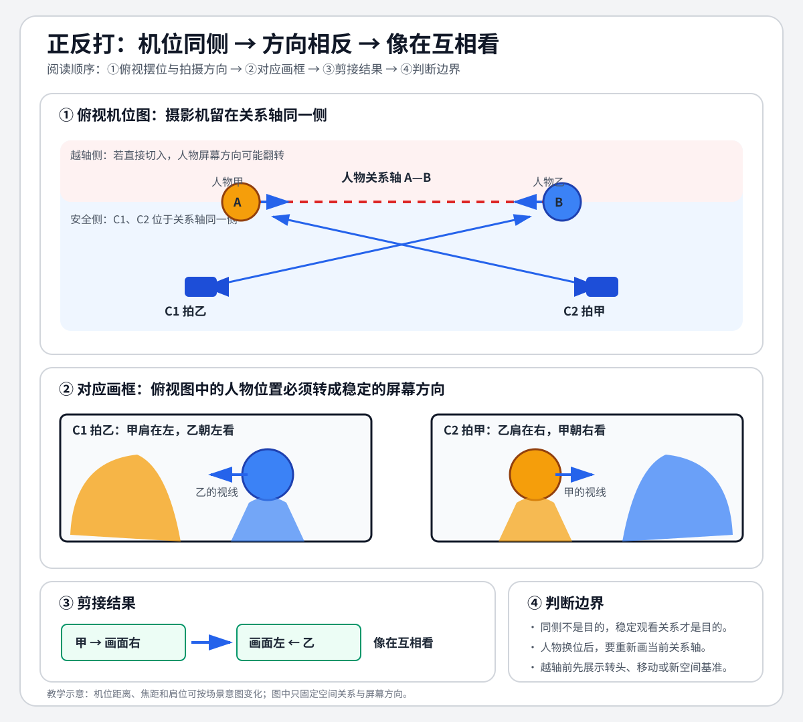

# 老白的分镜课 - 第一课 正反打

> 导航：[[知识库/学习区/课程/老白的分镜课/00 - 课程总览|课程总览]]｜[[老白的分镜课|统一知识总结]]

视频：[P1 第一课 正反打](https://www.bilibili.com/video/BV1QB4y1r73i?p=1)  
说明：依据已有本地 ASR 整理，并于 2026-09-30 复用原画面进行静帧及画内文字核对。下文区分讲者的示范、整理者的方法归纳与尚未核实的演示效果；不是官方逐字稿。

## 本课速览

- 核心问题：双人场景怎样用最小机位体系建立清楚的观看关系，又不落入机械反打？
- 主要结论：正反打提供可用的基础覆盖；真正的设计来自场景情绪、空间限制、人物关系和信息揭示对这套覆盖的改造。
- 学习价值：先有稳定语法，再理解为什么同一套机位可以形成完全不同的画面。
- 适用环节：双人对话、关系戏、AI 视频拆镜和最低覆盖设计。

## 来源可靠性

- 材料获取：复用同一BV/P/CID（794304391）的本地 `faster-whisper base` 全段ASR、音频及约19:23的360p无声原画面；本次哈希身份、时长与解码已核对。ASR时间到片尾不证明每个知识点均已识别。
- 内容复核范围：先全文读取转写、独立建立内容清单，再对照旧稿与候选重新回查；先用全课分布静帧定位讲图及电影示范，再补看五机位、庭院与室内位置图、字幕疑词。精确原时间见来源记录；采样不代表所有短暂变化均已穷尽。
- 未核范围：未听原声，未连续观看；两段原片的运动连续性、真实切点、节奏、表演与声音效果均未独立核验。第一段异常长时间条目及第二段破损电影对白不用于恢复完整台词。静帧中的图示与文字只支持其静态内容。
- 本文保存老师描述的情境、动作和设计理由，明确区分其教学解释与实际原片的效果。整理者SVG及方法归纳单独注明；不补造焦距参数、标准答案或电影导演意图。
- 重复机位枚举合并，场景条件、变体和反例仍留在详细案例；片尾课程计划与征求意见未写入知识正文。本课没有把课外练习布置给读者。

## 分集脉络

- **P1｜第一课 正反打**：先给出双人轴线与五类基础机位，再用庭院对话和长镜头示范如何在不丢关系的前提下改变构图、距离和运动。

## 时间线笔记

- `00:02-01:24`｜两人连线形成关系轴；机位通常留在同一侧，由两组过肩双人、两组单人和一个侧面双人构成基础五机位。
- `01:24-03:28`｜每场照搬会同质化。先明确庭院场景的“冷、远、旁观、正、对称”，再因四面墙和两人距离远而删除侧面机位。
- `03:28-05:42`｜把单人画面改正、改对称；先看跳舞者，再向上摇镜揭示二楼偷看者；观察者单人也可以改远、改侧。
- `05:44-08:57`｜省掉无互动的上楼过程；楼上人物靠近后恢复侧面双人。对话通过正、远、较平透视保持冷感，结尾离开与反打让另一人独自留下。
- `08:57-13:21`｜示范收尾及第一段原片演示、对白区间。应回看人物视线、空间和情绪是否与讲者设计目标一致；本轮未连续审看，不能称已验证剪接效果。
- `13:21-15:56`｜拆解已有电影：每次换位后选有效机位；为看见角色的脸和互动而承担换侧风险，再用摄影机运动把关系阶段连起来。
- `15:56-18:32`｜第二段原片演示。`16:00` 静帧可见电影画面与方位示意并置，但不能由这一帧证明整个长镜头运动已看完。
- `18:32-19:03`｜用“买肉而不必从养猪开始”的类比说明基础体系的作用：把精力留给后续创造。

## 核心观点

- 正反打是组织双方位置、脸向和视线的基础工具，不自带成片风格；本课强调把它作为设计出发点。
- 同一机位功能可以用不同距离、景别、正侧角度和人物前景关系实现。
- 人物的位置关系变了，轴线和可用机位也随之改变；不要把第一条轴锁死到整场结束。
- 本课两例中，镜头运动分别承担揭示信息、连接关系阶段的作用。整理者据此提醒：不要只因“显得高级”而加运动；这不是对所有镜头运动用途的穷尽定义。

## 方法与案例

### 从人物位置推导画面的顺序

以下是对老师两段演示的整理归纳：先连接当前人物位置建立轴线，再列出可选覆盖；用当前空间和本场观看目标决定采用、放弃或改变哪些机位；人物换位后重新判断；需要连续表现时，把各阶段选定的机位通过运动连接。它不要求五个机位全部用上，也不把本例的“冷、远、正、对称”当成所有戏的目标。来源：`00:09–01:24、03:00–03:28、06:06–08:31、13:38–15:56`。

### 图解：从机位摆放到银幕方向

> [!info] 怎么读
> 这是整理者绘制的教学示意，不是原课截图。上半部看甲乙关系轴与同侧机位，中部把 C1、C2 转成过肩画框，下半部比较脸向。图中的“越轴前先展示转头、移动或新空间基准”用来练习可读的空间变化，不能代替对实际片段的审看，也不把有意制造迷失的创作一律判错。

### 案例

#### 基础示范：五类机位怎样成为出发点

两人隔桌相对，先连接两人的位置，再在轴线同一侧考虑五类覆盖：从小红身后拍小兰、从小兰身后拍小红、分别拍两人单人、侧面拍双人。小红、小兰是讲者为示范使用的称呼，不据此确定电影角色名。五类机位先提供一个可选范围，不是要求每场都拍齐。

| 基础机位 | 摄影机相对人物的位置 | 对应的画面功能 |
|---|---|---|
| 从小红身后拍小兰 | 靠小红一边，朝小兰拍 | 小红作为近侧人物，与小兰同框 |
| 从小兰身后拍小红 | 靠小兰一边，朝小红拍 | 小兰作为近侧人物，与小红同框 |
| 小兰单人 | 朝小兰，去掉另一人前景 | 集中看小兰 |
| 小红单人 | 朝小红，去掉另一人前景 | 集中看小红 |
| 侧面双人 | 从两人关系的侧面看 | 同时呈现双方及其位置关系 |

上表对应老师的摆位与画框演示，不为原图添加机位编号；“同侧”在开场是倾向，另一侧也可成为起始选择。

讲者紧接着提醒：如果每场都照搬，即使加上特效和表演，也会拍成相近的味道。学习重点因而转向“这一场为什么采用或改变某个机位”。他也在后文澄清常规本身没有什么不好，只是本次示范有意展示怎样用基础体系做出不常规的镜头。来源：`00:09–01:48、06:43–07:03` 的讲解转写。

#### 庭院示范：把“冷、远、旁观”逐项落实

场景中一人在院内跳舞，另一人在二楼偷看；跳舞者随后上楼交谈并离开。讲者先给出本例的设计目标：离角色远一点，不贴近任何一方；构图更正、更对称，减少大幅俯仰。整理者注：这里的“冷”指这一示范的观看距离和态度，不应直接等同于冷色温。

| 时间 | 面临的选择 | 讲者的处理与理由 |
|---|---|---|
| `03:14–03:42` | 基础五类机位是否全部可用 | 庭院四面是墙，两人又相隔较远，侧面双人机位难实现，于是只保留四类。删减有具体空间条件。 |
| `03:42–04:25` | 跳舞者单人怎样符合本场目标 | 把构图改得更正、更对称，调整机位；老师明确说后续可有小红较近的特写，因此“冷”在本例也不等于永不近拍。`04:24–04:25` 的字幕确认此时“压在轴上拍”。画面功能与具体机位坐标不是同一回事。 |
| `04:25–04:58` | 何时让观众发现二楼偷看者 | 跳舞者还不知道自己被看，先让她投入地跳，再向上摇镜揭示二楼人物，使“发现”发生在一个镜头内部。 |
| `04:59–05:23` | 揭示偷看者后是否立即给近景 | 常规可以接她的近景，但讲者认为离她太近不符合本场冷感，改成远一点、侧一点的单人。 |
| `05:24–05:42` | 跳舞者发现偷看者，原先关系机位怎样再次使用 | 讲者把当前画面与通常应带前景的反打相比较，并联系前段向上揭示的设计。本轮 `05:35、05:37–05:39` 原帧中只有楼上蓝色人物，没有红色人物前景；损坏转写中的运动术语未恢复为引语。 |
| `05:44–06:07` | 要不要把走楼梯全过程拍出来 | 跳舞者不高兴后离开。讲者省略没有互动的上楼过程，直接切到小红已上楼、走过来质问小兰为什么偷看自己跳舞的互动阶段；`05:55` 原帧字幕明确出现“因为没有互动嘛”。这保留的是本例省略理由，不是所有走路过程都应删除。 |
| `06:06–06:28` | 到楼上后仍只有四类机位吗 | 两人变近且空间足够，重新建立关系轴，侧面双人机位恢复，用来表现两人与环境的关系。`06:20` 原图可见两人并列在楼上及相应侧面构图。 |
| `07:03–08:31` | 对话是否按常规越说越近 | 小兰改用较正、略远的正面单人；小红也拉远，取全些、采用透视变化较小的画面。`07:52–07:54` 画内字幕确认老师提到“长焦”，随即说这些后面才讲；不补焦距数值。之后可切两人所见的景象，再回到更全的双人；景别变化但关系覆盖功能延续。 |
| `08:32–08:57` | 情绪转折怎样结束这场关系 | 小兰说了某句话，小红生气转身，离开时切到较全画面；再回到先前“小兰看到小红”的画面呈现小红离去，随后正面反打小兰，使她独自留下。这里保留的是讲师描述的镜头顺序，未独立验证实际切点与情绪效果。`08:57` 原帧字幕写明小兰孤零零地留下；不把损坏的长时间戳误当成这一句持续到 `10:22`。 |

原帧抽核支持了部分构图、前景有无和字幕事实；“摇起来是否自然”“省略后是否顺畅”“情绪效果是否成立”仍需连续观看原片。两者不可混作一项完成状态。

还要区分机位在基础体系中的作用和后来取景的实际内容：`07:50–08:00` 的草图已经把红蓝两人都纳入较全画面。老师从常规对拍机位出发作距离和构图变化，不能因为起点被称作“单人机位”，就把变化后的草图记成始终只有一个人。

#### 长镜头示范：为什么要换侧，再怎样连接

讲者在 `13:21–13:38` 说明这是拆解别人已有的电影、借“假装设计”帮助理解，不是宣称现场原创了这一场。之后反复做同一件事：人物站定，画关系轴，列出该阶段机位，再选一个主要机位。

1. **跟随人物换位建立阶段。** 小兰走到另一处、走来坐下、走开再回来，每次关系改变都重新选机位；随后小红也移动到另一处坐下。不是把开头的一条轴锁死到全场结束。来源：`13:38–14:17`。
2. **说明必须换侧的收益。** 小红换位后出现越轴风险。如果坚持从原来一侧拍，就看不到小兰的脸，两人互动的呈现会出问题。讲者因此选择另一侧，并计划用运动把变化连过去。`14:28` 原帧字幕可核“拍不到小兰的脸”，`14:24` 图示可见该阶段的轴线与机位；这仍不等于完整运动已验收。来源：`14:17–14:31`。
3. **人物不动时，相机也可以改变关系观看。** 两人位置不变，相机移向侧面观察两人关系；最后小兰说关键内容时再推近她。`14:36、15:47、15:54` 原图分别显示所讨论的机位、侧移路径和末端靠近位置。来源：`14:34–14:49、15:46–15:56`。
4. **用运动连接已选机位。** 一场戏拟用一个长镜头：每次人物走位时不切镜，而让相机移到下一阶段选出的机位。小红移动较大且情绪发生变化时，相机也作较大移动。`15:24、15:44` 原图可见对应路径示意。来源：`14:50–15:56`。

原图进一步给出各阶段与场景物件的关系。以下“左、右、上、下”专指老师的俯视示意图，不是银幕人物朝向；红点代表小红、蓝点代表小兰，绿线代表当前两人位置连线，绿色摄影机代表所选机位。

| 关系阶段 | 原图中的位置与机位变化 | 为何保留这一步 |
|---|---|---|
| 开始，约`13:30–13:50` | 小兰在图左上门旁，小红在桌子左端；两人形成较陡的斜轴，老师从同侧机位中选一个 | 先从当前站位推导，尚未要求把所有覆盖都拍齐 |
| 小兰换位，约`14:00–14:10` | 蓝点先到桌右下侧，再回到桌下左侧座位附近；红点仍在桌左端，连线随站位改变 | 相同二人产生新的轴与可选机位 |
| 小红也坐下，约`14:20–14:30` | 蓝点在左椅、红点在右椅，轴近水平，所选机位转到图中轴上方一侧 | 原侧看不到小兰脸，因此老师解释换侧的必要与风险 |
| 二人暂不动，约`14:40–14:50` | 座位关系保持，摄影机改到轴下方、随后靠近小兰 | 这里改变的是相机观看位置；人物连线没有因为一句“换轴”便自行移动 |
| 把机位连接，约`15:20–15:50` | 蓝色弧线标小兰在桌下与门旁之间的路径；红色弧线标小红到右座位；末段绿色箭头标向另一所选机位的移动，随后讲师描述最后推近小兰 | 彩色路径区分人物移动与摄影机处理，不能把所有箭头都当成相机轨迹，也不能由此箭头单独确定推近方式 |

图示与讲师讲述共同支持上述关系阶段；这些离散原帧不能确定完整运动轨迹、速度或所有中间状态。

这个例子保留下来的因果链是：**角色位置变化 → 当前机位能否看清脸和互动 → 必要时接受换侧风险 → 用连续运动交代关系变化 → 关键话语时调整观看距离。** 这是整理者对讲解的归纳。`15:56–18:32` 的实际电影演示还需连续回看；单张方位图不能证明长镜头成片的节奏、表演或运动效果。

#### 收束类比：基础体系把精力留给创造

讲者把学习正反打比作炖肉时可以直接去买肉，不必先学养猪：有了基础体系，接下来的精力才用来研究怎么调味、做出自己的味道。这个类比解释的是“降低从零起步的负担”，并没有取消判断、变化和练习。来源：`18:32–19:03`。

## 主题沉淀

### 已沉淀

- [[知识库/学习区/综合整理/02-导演与视听语言/连续性剪辑与镜头衔接]]：作为正反打与关系轴的课程来源补充。

### 待沉淀

- 无；相关知识已有稳定主题承载。

## 阅读收束

正反打先建立双人空间语法，再由场景意图决定怎样变化。距离、正侧、景别、信息揭示和运动在本课两例中承担不同作用；人物换位之后必须重新检查当前关系，基础体系不能代替选择理由。

## 历史个人记录

原笔记中的个人理解、学习属性、练习与复习栏目已另存至 [[知识库/学习区/个人思考/老白分镜课-第01课历史个人记录-20260930|历史个人与学习记录]]；保留原文字，不认定为本次作答或新任务。

## 来源复核记录

<!-- source-evidence: bili-BV1QB4y1r73i-p1 -->
本篇已采用复核的具体范围与未核项，见[来源复核记录](<../../../../../evidence/sources/bili-BV1QB4y1r73i-p1/review.md>)。
