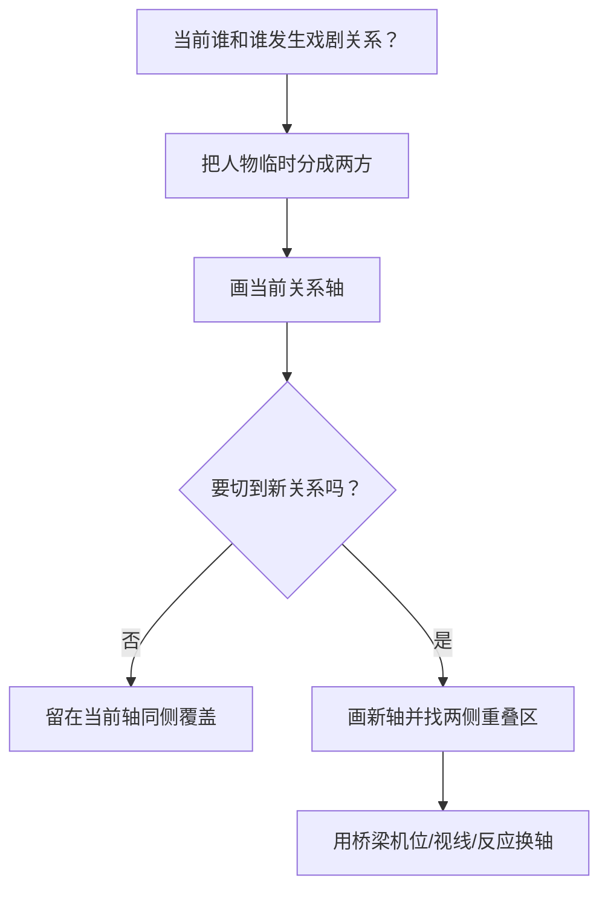
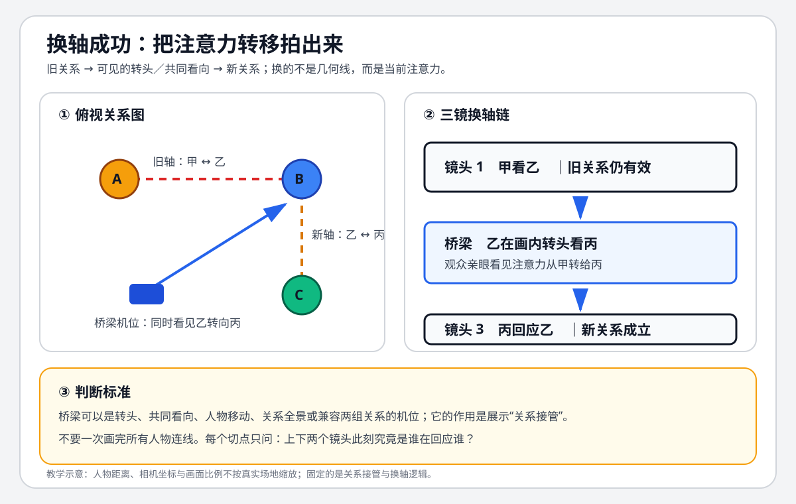

# 老白的分镜课 - 第二课 轴向

> 导航：[[知识库/学习区/课程/老白的分镜课/00 - 课程总览|课程总览]]｜[[老白的分镜课|统一知识总结]]

视频：[P2 轴向 2-1](https://www.bilibili.com/video/BV1QB4y1r73i?p=2)｜[P3 轴向 2-2](https://www.bilibili.com/video/BV1QB4y1r73i?p=3)  
说明：本课按真实“第二课”聚合 P2-P3；ASR 把“轴、轴向、机位”频繁识别为近音字，已按课程图示逻辑校正。

## 本课速览

- 核心问题：三人以上、多条关系轴并存时，怎样决定当前有效轴并安全切换？
- 主要结论：先按当前戏剧关系把人物分成两方；换到另一条关系轴时，优先找同时落在两条轴正确侧的桥梁机位。
- 学习价值：把“180 度规则”从单条线扩展为动态关系管理。
- 适用环节：三人对话、群像、会议、多人动作和 AI 多角色拆镜。

## 来源可靠性

- 信息来源：本地 ASR。
- 完整程度：P2-P3 全覆盖。
- 待核验：课程字母命名的视觉写法；笔记保留功能，不把字母当行业统一术语。
- 外部补充：无。

## 分集脉络

- **P2｜轴向 2-1**：从双人 I 型进入三人 L 型，说明新增互动会生成新轴，跨轴需要桥梁。
- **P3｜轴向 2-2**：处理不允许分组的三方 A 型，并把更复杂 U/O 型还原为多个局部关系。

## 时间线笔记

### P2｜轴向 2-1

- `00:00-03:17`｜双人关系轴、同侧机位与跳轴造成的左右翻转、空间混乱。
- `03:17-07:14`｜多人后轴线变多；L 型先把“两人一组”视作一方，维持最主要对抗。
- `07:14-11:25`｜新一对人物互动时建立第二条轴，用能兼顾旧轴与新轴的机位完成切换。
- `11:25-12:06`｜常用体系应先练熟双人和 L 型，不为少见复杂形状过度设计。

### P3｜轴向 2-2

- `00:00-03:20`｜三方不能被暗示成“二对一”时使用 A 型思考；选择两条轴正确侧重叠面积更大的区域。
- `03:20-06:51`｜两套正反打之间用处于重叠区域的单人/关系镜头做换轴桥梁。
- `06:51-09:38`｜简化版把机位放在三人中心区域，再用侧面全景补足整体位置。
- `09:38-12:07`｜U/O 型多人关系可以继续拆成局部 A 型；课程建议以常用双人和 L 型为先。

## 核心观点

- 场景里可能有很多几何连线，但只有当前参与叙事呼应的关系才是切点判断依据。
- “某机位在另一条轴正确侧”并不能自动证明这个切点安全；那条轴必须与上下镜的主体关系有关。
- 字母图形是记忆工具：I 型是双人，L 型是主要对抗加局部互动，A 型是三方独立对峙。
- 更复杂的群像通常不是一次解决全部轴，而是让当前关系逐步接管观众注意。

## 方法与案例

### 方法

1. 每个镜头旁写“谁与谁/谁与物正在发生关系”。
2. 只为当前关系画轴并标相机侧。
3. 新关系出现时，找同时满足旧轴和新轴的重叠区。
4. 若无理想重叠机位，用看向、反应、人物移动或全景重新建立空间。
5. 检查角色左右、脸向和背景是否让观众错误推断联盟。

### 图解：三人场景怎样换轴

> [!info] 怎么读
> 左侧只画当前有效的甲—乙旧轴和乙—丙新轴；右侧用“甲看乙—乙转头看丙—丙回应乙”展示关系接管。桥梁不是固定机位编号，而是让注意力转移本身被观众看见。

### 案例

- 三人 L 型：一人面对另外两人，先按“一对一组”处理；组内两人单独互动时再建立局部轴。
- 三方 A 型：不希望任何两人被看成联盟时，以中心机位或重叠区分别建立三方对峙。
- U/O 型会议：每次发言仍可还原成局部两方关系，再用全景维持整体地图。

## 可实践练习

1. 画三人争执的 L 型方位图，设计从“甲对乙丙”切到“乙对丙”的桥梁镜头。
2. 为四人会议标出三次发言转移时真正有效的轴，忽略无关连线。

## 主题沉淀

### 已沉淀

- [[知识库/学习区/综合整理/02-导演与视听语言/连续性剪辑与镜头衔接]]：补充多人关系分组、重叠区和桥梁机位判断。

### 待沉淀

- 无。

## 复习区

### 一分钟核心摘要

多人轴线不是几何连线越多越专业，而是随当前戏剧关系切换。先把场上人物临时分成两方，换关系时找同时兼容两条轴的桥梁，让观众知道“现在谁在回应谁”。

### 自测问题

1. 2 号机位与 6 号机位都在某条轴同侧，为什么仍可能接不上？
2. 什么情况下三人应视作“一对二”，什么情况下必须保持三方独立？

### 任务

- [ ] #复习 用自己的话解释“有效轴取决于当前呼应关系”。
- [ ] #创作练习 为三人场景画两条轴和一个桥梁机位。

## 我的学习提醒

> [!note] 我的理解
> 先追踪关系，再追踪轴；不要反过来用轴线图替人物关系做决定。

## 二刷时可以重点听

- P3 `02:38-06:51`：重叠区域与换轴桥梁。
