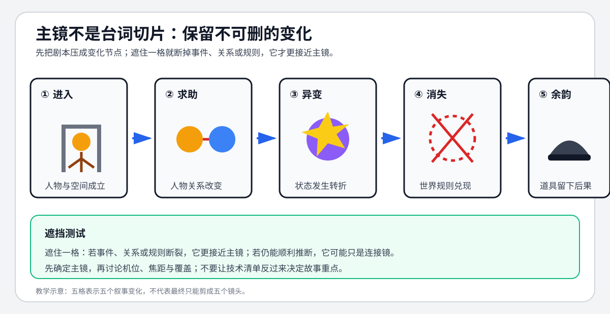

# 老白的分镜课 - 第五课 主镜的概念

> 导航：[[知识库/学习区/课程/老白的分镜课/00 - 课程总览|课程总览]]｜[[老白的分镜课|统一知识总结]]

视频：[P6 第五课 主镜的概念](https://www.bilibili.com/video/BV1QB4y1r73i?p=6)  
说明：课程以《寻梦环游记》相关片段示范；ASR 对角色名识别不稳定，本笔记以“少年、引导角色、临终角色”等功能称呼为主。

## 本课速览

- 核心问题：面对台词多、动作多的场景，怎样先抓住真正不可缺少的画面？
- 主要结论：先理解场景在全片中的作用，把内容压缩成少数变化节点；每个节点选择一个能讲清故事的关键画面，这组画面就是课程所称“主镜”。
- 学习价值：把按对白切镜改为按信息和关系变化切镜。
- 适用环节：剧本视觉化、关键帧、分镜缩略图和 AI 镜头预算控制。

## 来源可靠性

- 信息来源：本地 ASR。
- 完整程度：P6 全覆盖。
- 待核验：片段中的角色名和歌曲名。
- 外部补充：无。

## 分集脉络

- **P6｜第五课 主镜**：先梳理场景的世界观任务与人物反应，再把长段对白压缩为信息节点，为每个节点寻找不可删的画面。

## 时间线笔记

- `00:00-02:52`｜通读剧本与前后语境：场景既介绍“终极死亡”规则，也预示角色未来命运；少年视角承担观众反应。
- `02:52-04:43`｜先问“如果只能用一张图表现整场，应该是哪一刻”，找到最具代表性的消失瞬间。
- `04:43-07:17`｜把对白与动作归纳为进入、求助、冲突、异变、唱歌、消失、解释规则和道具余韵等节点。
- `07:17-09:38`｜解释“主镜”：讲述这一段故事不可缺少的画面，不是每句对白，也不同于 master shot。
- `09:38-13:42`｜为动作、反应、道具和世界观信息逐项寻找适合的视觉尺度。
- `13:42-16:27`｜有限主镜已经能讲清故事；精力集中在画面内部的元素排布，再由这些画面反推机位与轴线。

## 核心观点

```text
场景作用 → 内容压缩 → 不可删变化 → 主镜集合 → 再补连接
```

- 一句台词只有在带来新信息、行动、关系或反应时，才可能需要独立画面。
- 先想代表性画面能迫使创作者抓住场景的真正中心，而不是被对白数量带走。
- 观众记住的通常是关键视觉时刻，不是机位编号；机位与轴线是实现画面的工具。
- 本课“主镜”是课程内部术语，应避免和主镜头（master shot）混淆。

## 方法与案例

### 方法

1. 写场景在全片中的两个以内作用。
2. 把剧本压缩成 6–12 个“发生了变化”的节点。
3. 对每个节点问：删掉这个画面，观众还看得懂吗？
4. 为必要节点选取能同时承载动作、关系和信息的主镜。
5. 只在主镜之间缺少推断桥梁时补镜头。

### 图解：先画不可删除的变化



> [!info] 怎么读
> 五格不是按台词平均切分，而是分别承担空间成立、关系改变、状态转折、规则兑现和后果余韵。遮住某格后若叙事骨架断裂，它更接近主镜；仍能顺利推断，则可能只是连接镜。

### 案例

- 消失场景：临终角色消散、帽子落地、空酒杯翻扣，分别承担事件、余韵和命运暗示。
- 少年反应：不是装饰性反应镜头，而是观众学习世界规则的视角接口。

## 可实践练习

1. 把一页对白戏压缩成不超过 8 个变化节点。
2. 只画 5 张图讲清其中一段，再说明每张为什么不可删。

## 主题沉淀

### 已沉淀

- [[知识库/学习区/综合整理/02-导演与视听语言/镜头语言专业总表]]：补充“场景作用—主镜集合—反推技术”的路径。

### 待沉淀

- 无。

## 复习区

### 一分钟核心摘要

主镜是不可缺少的关键画面集合。先压缩剧本、找变化节点，再画能承载这些变化的画面；台词、机位和覆盖都不能替代场景作用的判断。

### 自测问题

1. 哪一句对白删掉后信息仍完整，因此不需要独立画面？
2. 你选出的“主镜中的主镜”为什么能代表整场？

### 任务

- [ ] #复习 区分主镜与主镜头。
- [ ] #创作练习 用 5 张主镜重述一页剧本。

## 我的学习提醒

> [!note] 我的理解
> 先限制画面数量，反而更容易看见场景真正的视觉骨架。

## 二刷时可以重点听

- `02:52-09:38`：从一张代表性画面到主镜定义。
