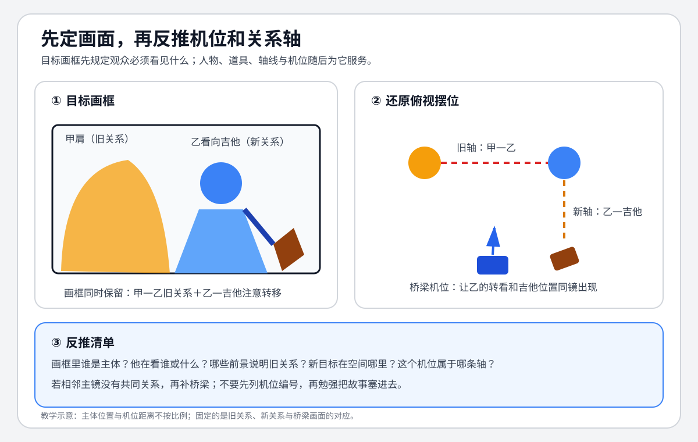

# 老白的分镜课 - 第六课 用画面推导机位

> 导航：[[知识库/学习区/课程/老白的分镜课/00 - 课程总览|课程总览]]｜[[老白的分镜课|统一知识总结]]

视频：[P7 第六课 用画面推导机位](https://www.bilibili.com/video/BV1QB4y1r73i?p=7)  
说明：沿用上一课案例；角色名与具体对白不作为结论依据。

## 本课速览

- 核心问题：主镜已经确定后，怎样反推空间、轴线、机位和可剪连接？
- 主要结论：把每张主镜还原到方位图，识别它属于哪条关系轴；相邻画面若没有共同关系，就用同时兼容两条轴的机位或反应过渡。
- 学习价值：把感性关键画面转成可制作的镜头系统。
- 适用环节：分镜校验、镜头表、AI 镜头首尾状态与剪辑接口设计。

## 来源可靠性

- 信息来源：本地 ASR。
- 完整程度：P7 全覆盖。
- 待核验：角色名与影片片段专名。
- 外部补充：无。

## 分集脉络

- **P7｜第六课 用画面推导机位**：从主镜画面反推红/绿/黑等多条关系轴，检查直接切换、桥梁机位和道具插入镜头。

## 时间线笔记

- `00:00-03:42`｜把想象画面放回位置图，反推各自机位、关系轴和同类变种；识别插入镜头。
- `03:42-05:28`｜基础机位可以有机排列成场景，人物走位后需要新的方位图。
- `05:28-07:27`｜道具与人物形成新轴；调整机位使它同时兼顾旧关系和新道具关系。
- `07:27-09:16`｜某两镜虽落在另一条轴同侧，但若上下镜主体与那条轴无关，仍不能直接相接。
- `09:16-13:20`｜练习复杂走位和局部关系，强调多看、多画方位图。
- `13:20-17:32`｜比较有无桥梁元素的切点；规则是表达工具，先掌握清楚再谈突破。

## 核心观点

- 画面是目标，机位与轴线是让目标落地的约束系统。
- 每个镜头都应注明“它在回应谁/什么”；否则无法判断使用哪条轴。
- 道具也能与人物形成关系轴，插入镜头不是脱离空间的万能遮剪。
- 顺畅是观众进入情绪的基础，但只顺畅会成为流水账；下一步还要选择重点和变化。

## 方法与案例

### 方法

1. 给每张主镜标主体、所见目标、人物左右和前后层。
2. 在俯视图中反推出可能机位。
3. 画出当前人物—人物、人物—道具关系轴。
4. 为每个切点写“靠哪条关系呼应”。
5. 无共同关系时，插入兼容机位、反应或人物转头，或重新设计上/下镜。

### 图解：从目标画面反推机位

> [!info] 怎么读
> 左侧先规定画框必须同时带到甲肩、乙的转看与吉他；右侧再还原甲—乙旧轴和乙—吉他新轴。桥梁机位的任务是保留关系转移，不是用无关特写藏切点。

### 案例

- 吉他与人物形成新轴：通过露出吉他的机位，把旧人物关系平滑转成道具关系。
- 10 号机位不能直接回 5 号：先切到同时兼容另一关系的 4 号，再进入 5 号。

## 可实践练习

1. 为一组 6 张主镜逐张标“当前有效轴”。
2. 找出一个看似顺畅但没有真实呼应关系的切点，设计桥梁。

## 主题沉淀

### 已沉淀

- [[知识库/学习区/综合整理/02-导演与视听语言/镜头语言专业总表]]：主镜反推技术参数的工作流。
- [[知识库/学习区/综合整理/02-导演与视听语言/连续性剪辑与镜头衔接]]：多轴切换必须基于上下镜真实呼应关系。

### 待沉淀

- 无。

## 复习区

### 一分钟核心摘要

先画想让观众看到的主镜，再把它还原为机位和关系轴。切点安全与否取决于上下镜实际在回应哪条关系；必要时用桥梁机位、反应或道具关系换轴。

### 自测问题

1. 为什么“都在绿轴同侧”有时仍不能证明两镜能接？
2. 插入道具镜头在什么条件下真正属于当前因果？

### 任务

- [ ] #复习 为三个切点分别写出其呼应关系。
- [ ] #创作练习 从 5 张关键画面反推方位图和机位。

## 我的学习提醒

> [!note] 我的理解
> 连续性检查不是看有没有一条轴能解释，而是看那条轴是不是此刻真正发生的关系。

## 二刷时可以重点听

- `05:28-09:16`：道具轴与多轴切换。
