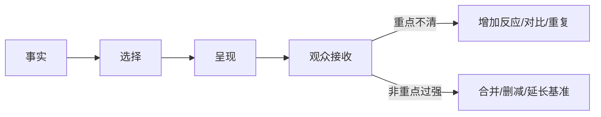

# 老白的分镜课 - 第七课 讲故事的基础三原则

> 导航：[[知识库/学习区/课程/老白的分镜课/00 - 课程总览|课程总览]]｜[[老白的分镜课|统一知识总结]]

视频：[P8 第七课 讲故事的基础三原则](https://www.bilibili.com/video/BV1QB4y1r73i?p=8)

## 本课速览

- 核心问题：画面已经把剧本内容呈现出来，为什么观众仍可能没接收到重点？
- 主要结论：依次检查“实际发生了什么—想让观众看到什么—观众实际上看到什么”；用强调重点和弱化非重点缩小三者差距。
- 学习价值：给分镜建立以观众接收为终点的复核标准。
- 适用环节：镜头选择、粗剪检查、信息铺垫与情绪强调。

## 来源可靠性

- 信息来源：本地 ASR。
- 完整程度：P8 全覆盖。
- 待核验：案例人物名，不影响方法。
- 外部补充：无。

## 分集脉络

- **P8｜第七课 三原则**：先用主镜和连接镜讲顺，再通过景别趋势、反应、重复和删减让关键事件真正进入观众注意。

## 时间线笔记

- `00:00-02:32`｜提出三问：事实、创作者希望看见、观众实际看见；画面里出现不等于被有效接收。
- `02:32-05:24`｜把主镜放进剧本段落，用正反打和插入镜头建立基本连接。
- `05:24-08:23`｜景别逐渐收紧推动冲突，突然切松和撤去声音形成转折强调。
- `08:23-13:31`｜通过角色反应、重复主镜和前后对比组织唱歌与消失段落。
- `13:31-16:13`｜复核后发现“讲全”仍可能是流水账；用多次反应和变化强调最重要事件。
- `16:13-19:09`｜用铺垫、反应和延迟强调角色隐藏能力。
- `19:09-23:17`｜总结工作流：分格—选择—接顺—强调重点—弱化非重点；引出景别与视高。

## 核心观点

- 重点可以靠更多镜头、关键反应、尺度变化、声音撤去或前后对比强调。
- 非重点弱化同样重要：减少变化，让真正的例外更突出。
- “镜头多”不是强调的唯一方式；一个长而稳定的全景后突然切特写，也能把细节变成重音。
- 观众注意力有限，信息设计必须考虑走神、观看时长和已有记忆。

## 方法与案例

### 方法

1. 列出场景所有事实。
2. 圈出观众必须接收的 1–3 个重点。
3. 先用主镜和连接镜讲顺。
4. 给重点配置反应、对比、重复、尺度或声音变化。
5. 合并非重点画面，建立安静基准。
6. 用不看剧本的观众视角复述，检查实际接收到什么。

### 图解：画面出现为什么仍不等于观众接收

> [!info] 怎么读
> 三栏依次区分场景事实、创作者希望强调的重点和观众最终记住的内容。底部两种杠杆必须同时使用：既强化重点，也通过合并、删减和稳定基准弱化非重点。

### 案例

- 冲突段：景别逐渐收紧，关键异变时突然切全景并安静下来。
- 消失段：主体异变、两人反应、再次异变、全景消失、道具与小动物反应层层确认。
- 吉他能力：提前把角色与吉他关联，再用观察者的多次惊讶强化隐藏信息。

## 可实践练习

1. 为一场戏分别写“事实清单”和“观众重点清单”，比较差异。
2. 删除 30% 非重点镜头，观察真正的重点是否更明显。

## 主题沉淀

### 已沉淀

- [[知识库/学习区/综合整理/02-导演与视听语言/镜头语言专业总表]]：补入以观众实际接收为终点的复核环。

### 待沉淀

- 无。

## 复习区

### 一分钟核心摘要

分镜不只负责把事实放进画面，还要控制观众真正接收什么。先讲顺，再用反应、对比、重复、尺度和声音强调重点，同时合并非重点，最后从观众记住了什么反推修改。

### 自测问题

1. 一个物件已经出现，为什么仍不等于观众把它记成重点？
2. 怎样通过弱化非重点而不是继续加镜头来强调？

### 任务

- [ ] #复习 用三问检查一个现有分镜段落。
- [ ] #创作练习 为同一重点设计“增加反应”和“减少非重点”两版。

## 我的学习提醒

> [!note] 我的理解
> “呈现”是素材事实，“接收”才是叙事结果。

## 二刷时可以重点听

- `13:31-21:33`：强调重点与弱化非重点。
