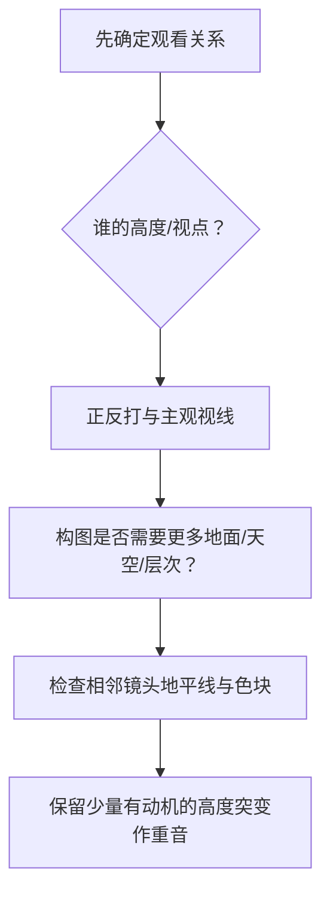

# 老白的分镜课 - 第九课 决定机位高度的六个原则

> 导航：[[知识库/学习区/课程/老白的分镜课/00 - 课程总览|课程总览]]｜[[老白的分镜课|统一知识总结]]

视频：[P10 第九课 决定机位高度的六个原则](https://www.bilibili.com/video/BV1QB4y1r73i?p=10)  
说明：“视高”指摄影机相对人物站立平面的高度；它与镜头俯仰相关但不是同一个变量。

## 本课速览

- 核心问题：为什么同一水平机位方向还要决定摄影机放多高、朝上还是朝下？
- 主要结论：视高由正反打关系、主观视线、观众认同、构图、跨镜画面分割与节奏共同决定。
- 学习价值：避免把仰拍/俯拍简化成“强大/弱小”的固定符号。
- 适用环节：机位设计、分镜构图、地平线连续和段落重音。

## 来源可靠性

- 信息来源：本地 ASR。
- 完整程度：P10 全覆盖。
- 待核验：案例影片专名；不影响六项原则。
- 外部补充：无。

## 分集脉络

- **P10｜第九课 机位高度六原则**：前 8 分钟建立六项判断，后续长案例演示同一场戏怎样在视高基准上做有动机变化。

## 时间线笔记

- `00:00-01:30`｜区分俯视、仰视、平视与“视高”；以摄影机相对地面的高度作为连续变量。
- `01:30-02:27`｜正反打：人物高差和同框要求会限定视高。
- `02:27-03:34`｜主观视线与观众视角：摄影机贴近角色观看高度，引导认同。
- `03:34-05:13`｜构图需要：为露出院落、天空、地面或纵深调整视高。
- `05:13-07:31`｜跨镜顺畅：地平线、天空/地面色块比例不能无动机大跳。
- `07:31-08:12`｜节奏变化：稳定平视基准上突然仰/俯才产生重音。
- `08:12-39:27`｜案例分析：普通视高、角色主观低视高、环境展示和高潮仰视如何交替。

## 核心观点

- 视高和光轴方向要分开记录：低机位可以平拍，高机位也可以平拍。
- 观众视角是整段观看位置，主观镜头是更直接的角色所见；两者不必等同。
- 相邻画面地平线相差过大，会让大色块跳动，即使角色左右没变也会不顺。
- 先建立大部分镜头共享的视高基准，再让少数变化承担段落作用。

## 方法与案例

### 方法

1. 标人物真实高差、坐站和地面层级。
2. 选择主要认同角色或客观观察高度。
3. 按构图需要决定露地面还是露天空。
4. 检查正反打眼线、地平线和色块分割。
5. 为每次明显抬高/降低写出信息或情绪收益。

### 图解：把“视高”和“俯仰”分开

> [!info] 怎么读
> 左侧把摄影机离地高度与光轴方向拆开；右侧说明低机位不必仰拍、高机位不必俯拍。镜头表可写成 `视高 0.8 m｜光轴上仰 10°`，避免只写含糊的“低角度”。

### 案例

- 一人站地面、一人站石台：为了双方头部和视线都可读，正反打自然出现一仰一俯。
- 空旷沙漠：低视高增加天空和辽阔感；高视高则更清楚地展示地面关系。
- 动作/情绪节点：一段平稳视高后突然低机位仰拍，形成“要出事”的节奏提示。

## 可实践练习

1. 同一双人场景画客观、甲方视角、乙方视角三套视高。
2. 把现有镜头表中的视高画成曲线，找出无动机跳变。

## 主题沉淀

### 已沉淀

- [[知识库/学习区/综合整理/02-导演与视听语言/镜头语言专业总表]]：补充视高与俯仰的分离判断。
- [[知识库/学习区/综合整理/02-导演与视听语言/镜头组与视听节奏]]：视高基准与少量突变形成段落重音。

### 待沉淀

- 无。

## 复习区

### 一分钟核心摘要

视高不是简单的俯拍/仰拍标签。它先由人物高差、观看视点和构图决定，再用地平线与色块检查跨镜顺畅；只有在稳定基准上，有动机的高度突变才会成为重音。

### 自测问题

1. 低机位为什么不一定是仰拍？
2. 哪种地平线变化会产生有效转折，哪种只是画面跳动？

### 任务

- [ ] #复习 默写六项视高判断。
- [ ] #创作练习 为同一场景设计一处有动机的视高变化。

## 我的学习提醒

> [!note] 我的理解
> 先把视高当连续变量，再谈它在某一刻被赋予什么意义。

## 二刷时可以重点听

- `01:30-08:12`：六项原则。
