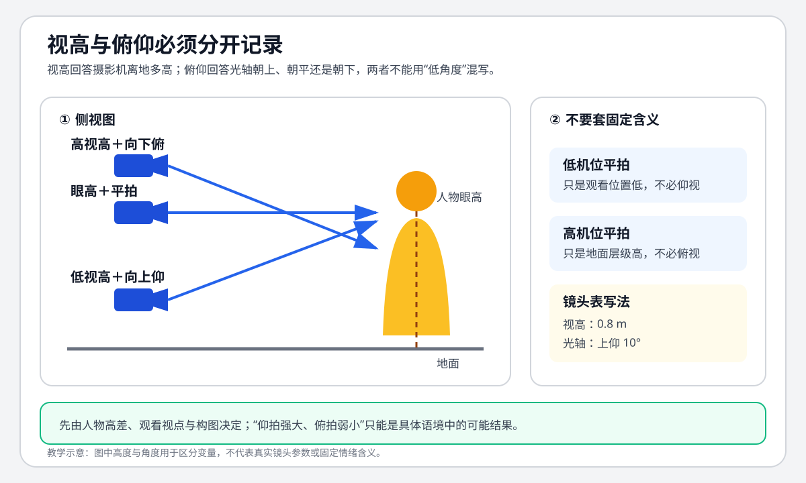

# 老白的分镜课 - 第九课 决定机位高度的六个原则

> 导航：[[知识库/学习区/课程/老白的分镜课/00 - 课程总览|课程总览]]｜[[老白的分镜课|统一知识总结]]

视频：[P10 第九课 决定机位高度的六个原则](https://www.bilibili.com/video/BV1QB4y1r73i?p=10)。本课以视高为变量讨论俯仰，再分析林中真人场面与苏菲、哈尔的厨房场面。

## 来源可靠性

本轮先完整阅读既有 `faster-whisper base` 转写00:00—39:27，建立来源清单后再读旧稿。核同BV/P10/CID850669621的原无声视频、全课分布静帧与必要字幕/图示。原板书分别写“视高”“视角”；`34:06` 字幕明确“视角不止跟视高有关系”，避免把后段近音“视钢”一律改成同一个术语。`32:12` 原字幕将篮中物件核为鸡蛋、火腿。

正文的动作、镜头顺序与选择理由按老师描述保存。静帧只支持静态位置、画内标注与可辨字幕；本轮未听原声、未连续审看片段，未独立核验摇动/抬降、真实切点、狗的运动、声音、表演与节奏效果。第一段电影ASR严重破损，第二段没有完整对白转写；均不据此补全台词或剧情。原画面采样不证明所有短暂变化已穷尽。

## 分集脉络

- **第9课 P10**：用视高细化俯仰 → 六种决定理由 → 稳定观看高度及有理由的微调 → 受害者/苏菲的观看位置 → 区分视高与更复杂的视角 → 原课练习与基础要求。本课是一个课级单元。

## 时间线笔记

- `00:00—01:27`：俯仰平的粗分类与视高定义。
- `01:27—08:12`：正反打、主观视线、观众视角、构图、跨镜顺畅、节奏六点；院落和沙漠正误对比。
- `08:13—14:48`：第一电影示范与开始讲图，存在破损转写和长时间条目。
- `14:48—21:42`：看树上人/狗、普通人高基准、避遮挡、降低看狗、蹲下与起身的高度变化。
- `21:42—28:43`：医生与小李仰拍分段、对话对象改变、地上受害者所见、构图层次和总结。
- `28:43—30:56`：第二电影示范，未恢复完整对白。
- `30:56—33:36`：苏菲基准、锅与篮遮挡、主观和正反打、哈尔脸与肩的课堂分析及余镜练习。
- `33:36—39:27`：视角为何复杂、基础透视和主动做范例；正反打不只有两头同框。

## 本课速览

| 决定理由 | 主要看什么 | 成立条件 |
|---|---|---|
| 正反打 | 两人的实际高差和当前同框要求 | 常规两头入框时会约束高度，另有其他构图方式 |
| 主观视线（POV） | 角色在看哪里，从其所见组织画面 | 可为构图微调，不机械等于每镜真实眼高 |
| 观众视角 | 希望观众在整场主要跟谁、处于什么高度 | 先选观看基准；人物不同高时须明确选谁 |
| 好看的构图 | 遮挡、天地比例、对象层次、轮廓 | 按本场画面目标调整，不是俯仰自带统一意义 |
| 画面切换顺畅 | 相邻镜地平线和天空/地面大色块 | 开阔可见天地交界时尤其明显，复杂背景较宽容 |
| 节奏变化 | 稳定基准之后的高度突变 | 高度变化只是手段之一，不能每个仰拍都贴同义标签 |

## 核心观点

只说俯拍、仰拍、平拍，尚未说明程度，也未统一所谓平拍是眼睛高还是肩膀高。老师因此用**相机距离被摄人物所站平面的高度**定义视高，再以它作为变量讨论俯仰。在他以同一站立人物为对象的示意里，相机升高向下看人，降低则向上看人。原图用相机到站立平面的竖向标线示意，不是相机与人物之间的水平距离。来源：`00:00—01:27`。

本课先定观看关系和视高基准，再按具体构图微调；不能一看相机低就替每个镜头编强大、压迫的情绪。老师的六条用来理解选择理由，未给固定米数、角度值或所有镜头的一套标准。相同镜头有时可以兼容主观、观众视角和正反打的解释，下面保持他的判断身份。

## 方法与案例

### 高低站位：常规两头同框的条件

小红站在石台上，小蓝站地面。从小蓝身后拍双人，若想把双方脑袋放进画面，老师选择向高处看的仰视方案；换到小红身后，也要根据实际高差和双方入框要求选高度。原平面/侧视关系图能核红高蓝低；不凭未画全的反向草图补具体机位坐标或人物大小。

这条理由有明确条件：正在做常规两头都在画面的正反打。老师在结尾另说，也可以远处人物的头、近处人物的脚入框，产生其他意味。所以“两头同框”不是所有正反打必须遵守的定义。来源：`01:27—02:27、36:50—37:10`。

### 主观视线与观众基准

主观视线把机位与角色所见联系起来；往上看是向上拍，往下看是向下拍。观众视角则有意识地让观众跟某个角色，在约其脸的高度看周围，让整场有一个较一致的观看位置。老师先把这两条粗说，后面用例子显示：它们经常重叠，也可以为清楚构图调整，并非只能选一个标签。来源：`02:27—03:36`。

### 构图需要：院落与沙漠是两个不同问题

院里有小房子。老师希望房子在前景，同时看到院内、院门、篱笆和鸡猪等活动；要得到这个层次关系，视高就需要较高。这里的选择来自想看见的对象和空间，不能概括成“院落一律俯拍”。

另一个例子是沙漠两人。初图天空露得少，老师认为沙漠辽阔感较难表现；降低视高，地平线落得较低，上面留下较多天空和云，会更显开阔。`04:34、05:04` 原字幕分别说明天空少与地方辽阔。这是本例的构图取舍，不是给所有场景规定天空占比。来源：`03:36—05:13`。

### 单镜好看还要检查切换：天空与地面的色块

老师接着在同一沙漠例中列出不顺的方案：双人图天空多、地面少；切小蓝单人时，把相机放到眼睛附近，地面忽然变多、天空变少；再切小红仰拍，不露地平线，几乎只剩天空。各张单独看都可能不错，连起来却像大色块不断跳。

修法不是地平线完全同一条：让各镜天地分割大致接近，留有区别，使双人到两边单人切换更顺；若过分相同，又可能触发上一课人物像瞬间替换的相似构图问题。原草图的着色与地平线标示支持正误方案对比，实际切换观感未独立审看。

老师明确限定：开阔环境能看到地面和天空交界，这个问题尤其明显；背景复杂时会宽容些。第一电影例并未特别展示这条，不要为了六条都齐而硬套。来源：`05:13—07:31、28:19—28:40`。

### 节奏：高度变化先需要基准

若整场基本平着拍，突然改成明显仰拍，老师认为这是提示要出事的变化，让场面不只是均匀流水账。作用来自前后差别；下面医生的一段会用到，不能把一张仰拍图自身当作节奏已被观众体验。来源：`07:31—08:12`。

## 林中场面：普通观看高度怎样被不同理由修改

以下沿用老师“姜戈、医生、小李、打手、受害者”等称呼。老师依据截帧和地平线判断高度，红色横线及绿圈是其课堂分析标记，不是本轮测量相机实物所得参数。

### 从树上人、地上狗进入人高基准

开头先仰看树上人，再向下看到地上狗，之后接姜戈等人，老师把它理解为他们的主观所见。但拍狗的高度并非真实姜戈眼高：若完全按真实位置往下看，地平线会不见，画面全是地面，分割不好看。因此这个镜头既有主观理由，也作了构图微调。

姜戈骑马过来，医生与小李坐在车上，多数画面在老师所称“一人高”的附近。他解释车上坐着者的头高与旁边地上站者相近，所以不能只按“坐着”就把观众基准设得很低。这里希望观众像站在场景旁边看；未给统一成人身高数值。来源：`14:48—16:58`。

| 后续变化 | 老师为何不僵守原高度 |
|---|---|
| 有的镜头稍高 | 原高度会让两个对象挡得厉害、层次不好；提高一点兼顾构图，仍可保留主要观看基准。 |
| 看狗之前降低 | 便于靠近狗，保留狗朝镜头的面向和威胁感；若仍人高强俯，老师认为威胁会减。此处只是课堂效果解释。 |
| 高个者与一排人物 | 为照顾高个者在画框中的位置，让这一排人关系更好读，略低于一般人高；老师在 `18:52` 原字幕把这一排称为“带”，说明后课构图会讲，本课未展开它的完整方法。 |

这些是不同理由，不能合成“所有镜头都是为了好看”。原帧可见狗的面向、人物排列和老师标的参照线，动态威胁及层次观感仍未独立验。来源：`16:58—19:40`。

### 下车、蹲下、起身：观看高度为何跟着变

从旁站者高度看小李下车，看到脚自然成为俯看。某镜先稍低取得构图，随后抬回人高；当小李蹲下来跟地上人长时间说话，相机也降下来。

老师给了两个同时成立的理由：一是让观众像一起蹲下，靠近双方、参与这一段谈话；二是如果仍从站立高度俯看，画面会全是地面，颜色单一，远树和层次都看不到。小李站起时再恢复人高。这里保存讲师描述的抬降顺序及动机，不称本轮连续看过相机运动。随后还有稍高/稍低的变化，为看清树与光、或把双方头部同框而调整。来源：`19:40—21:42`。

### 医生与小李的仰拍：节奏理由而非只为了漂亮

前面大多是旁站者的人高。医生突然出现这个基准通常不会得到的明显仰拍；老师排除了“平拍背景不好看”这个解释，因为医生身后本来就有丰富层次。他把此变化归为节奏，促使观众注意医生正在想什么、将做什么。

医生提出补偿时又回常规观看位置，随后继续医生仰拍，小李也从平常接近眼高的画面变为明显仰拍。老师联系小李怀疑来访者目的、发现价值立场不同的情境，解释这一小段为什么变了。金额只有课内译字幕“500元”可辨，不扩写货币换算或用破损原片对白恢复细节。

姜戈表示不愿后，人物之间又建立正反打：小李和医生的微俯/微仰，这时老师也可以用正反打解释。同为仰拍，决定理由因对话关系改变而不同。医生坐下时回观众基准；小李与后方打手交流时，又按新的对话对选择高度。接着回姜戈或打手常规视高，紧张主要还可以由景别承担。来源：`21:42—24:40`。

### 狗眼附近的低机位，归属于谁

这一处高度降到狗眼附近，老师明确反问：并非让观众成为狗。地上受害者的视线恰好也这么低，所以狗朝他过来、打手接近的画面，可以按受害者的主观所见理解。观看高度统一在受害者附近；原图可核低角度的狗/人和标示，冲击力只按老师描述保留。

之后突然取很俯的围聚画面，老师用“大家围着他”的构图解释；他也指出内容令人不适，与构图是否清楚、好看分别讨论。有受害者作前景的镜头，老师仍允许理解为其主观或正反打，因为两种观看关系在此接近；本文保存他的分类取向，不改成术语唯一答案。来源：`24:40—25:56`。

### 近似主观还可以为层次微调

后段在观众基准、正反打与人物主观间切换。老师指出某些主观镜略低于真实眼高，前后对象分层会更清楚；拍狗时若太俯，前后两只狗的层次会压掉，所以也降低些。最后以天空为背景看骑马者的轮廓，老师认为剪影更鲜明、帅气。

此例总结不是“哪条就严格执行哪条”：先按主观、正反打、观众基准或节奏定一个方向，再按画面对象和层次微调。嘴、肩、头顶附近的差别，不能仅因不在字面眼高就判错。本课没有要求所有构图固定五层，也没有记录这场戏特别用天地大色块连续的实例。来源：`25:56—28:43`。

## 苏菲、哈尔和孩子：人不一样高时先选谁

### 观众基准选择苏菲

哈尔比苏菲高，孩子又比苏菲矮。如果只说“观众站在地面上一人高”，仍不知道到底用谁的高度。这场老师选择苏菲，让观众跟她一起看孩子、环境与哈尔。先定这一主要基准，再分析偏离它的镜头，会比逐镜找标签清楚。

厨房有一镜比苏菲的眼高高得多，老师解释是为看清篮里的鸡蛋和火腿；照她真实高度拍，前景锅会挡住它们。`32:12` 原字幕可核篮内物件。孩子和哈尔回来一镜可按苏菲所见；后面苏菲与哈尔的对话则有主观及正反打，可兼容解释。来源：`30:56—32:49`。

### 哈尔迎面而来：老师为什么称它“做了一个假”

老师分析哈尔接近镜头的一拍：如果严格按前一角度的身体关系横着靠过来，首先冲到镜头前的应是肩，而非脸；影片却让他的脸朝向镜头，之后可见实际是肩朝苏菲。他称这为为了效果作的调整，因为美男子的脸比肩膀迎面而来更有作用。

本轮原帧可以核哈尔脸部近画面、随后苏菲与其肩部的静态对应，原字幕也可读老师“肩膀对在苏菲的脸上”。这段保存的是老师的几何分析与效果判断；没有连续观看或独立证明动画全过程的空间调整，也不把它改写成对一切不准确空间关系的许可。来源：`32:49—33:24`。

## 视高与更复杂的视角不能混作一个词

结尾问题是为什么不把**视角**也一并讲完，ASR却反复把视角、视高识成相似词。原板书和字幕可核：视角不仅与视高有关，还涉及主客观与景别。一场戏可能主要跟一个角色，也可能回到旁观/老师所称“上帝视角”看事件，通常不会全程都是严格跟眼睛的镜头。

老师回引米格为主要观看者的例子，说明视角有跨整场的组织作用；要理解它，先要懂前面透视、机位、景别等基础。本课只在视高问题中出现视角，并未提供完整视角理论。来源：`33:36—34:48`。

## 老师原课练习与学习建议

- 苏菲场面的其余镜头留给大家自己分析，每镜到底基于什么决定视高；老师没有在这段逐个给标准答案。来源：`33:24—33:36`。
- 若只能看出粗略俯仰，难从画面推相机高度，先回到透视等前课基础。老师承认讲解本身也可能不清楚，同时认为进阶知识依赖基础；不能把所有困惑归成观众不努力。来源：`34:48—36:22`。
- 自己选择喜欢的范例拉片，再画、拍或设计一个专练视高的范例，为每个机位给选择方法，不能只说凭感觉。老师用看约半小时视频后再花几天找片观察与动手作投入举例，并非硬性次数或日程。来源：`37:29—39:27`。

老师说明课程是受时长限制的知识归纳，正反打还可以远处头、前景脚等许多变体；观看讲解、觉得有道理与实际会做是不同阶段。原课练习作为知识保留，不记录小陌已作答，不生成复习待办。

## 原有图解

这是旧整理者的教学SVG，原路径保留；图中视高0.8m及上仰10°是旧整理者记录示例，未从原课确认成标准。完整原图解文字保存在历史个人记录。正文依据本课视高定义与具体理由保存，不以这张旧图代替原课图示。

## 主题沉淀

### 已沉淀

- [[知识库/学习区/综合整理/02-导演与视听语言/镜头语言专业总表]]：历史关联保留；原说明为“补充视高与俯仰的分离判断。”。本次未改主题正文。
- [[知识库/学习区/综合整理/02-导演与视听语言/镜头组与视听节奏]]：历史关联保留；原说明为“视高基准与少量突变形成段落重音。”。本次未改主题正文。

### 待沉淀

- 无。

## 历史个人记录

原有个人文字、学习属性、扩展方法与自动复习栏目已原样另存至 [[知识库/学习区/个人思考/老白分镜课第09课历史个人记录-20260930|历史个人与学习记录]]；不把历史文字认定为本次作答，不激活旧任务。

## 来源复核记录

<!-- source-evidence: bili-BV1QB4y1r73i-p10 -->
具体已核范围、实际图文与未核项见[来源复核记录](<../../../../../evidence/sources/bili-BV1QB4y1r73i-p10/review.md>)。

