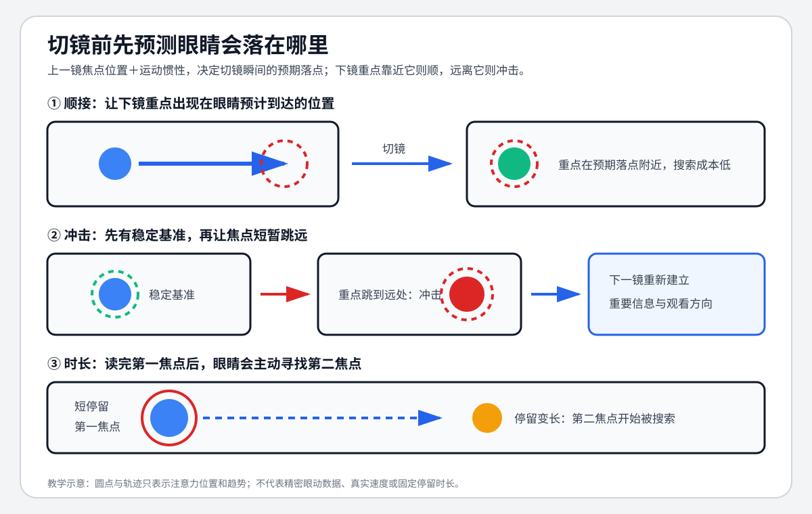

# 老白的分镜课 - 第十一课 视觉焦点的实际应用

> 导航：[[知识库/学习区/课程/老白的分镜课/00 - 课程总览|课程总览]]｜[[老白的分镜课|统一知识总结]]

视频：[P12 第十一课 视觉焦点的实际应用](https://www.bilibili.com/video/BV1QB4y1r73i?p=12)

## 本课速览

视觉焦点是看见画面时眼睛先盯哪一块，也会随时间和运动变化。老白从运动、元素、被引导、镜头时长四项入手，把人脸中的眼区提炼为“眼线”高度，随后比较同一场戏怎样接顺、怎样有意跳跃。高速动作案例还提醒：下镜只把人物摆在上一镜焦点附近未必够，切前向右的快速运动可能需要先空画，再从右侧入画。

本课保留“先学会接顺”的前提、全场乱跳丢信息的反例、不同观众跟随对象可能不同的限制。眼线不必完全齐平，中带也不被写成所有构图的强制位置；“热闹、惊吓、高潮”是教师分析的作用，不是本次已独立体验的结果。

## 来源可靠性

- 材料取得：沿用P12原ASR673行与来源包，原BV/P/CID对应；本任务用官方公开免费有界HEVC路径取得约20分21秒原画面流，技术解码通过。没有重新跑ASR或独立听原声。
- 本轮图文复核：先完整读转写、独立列清单，再看42个全课分布样本，补看66个图示/案例样本与8个必要字幕/入画样本。板书“眼线”、红蓝高低两版、身份坐站反例、中指图案、走廊引导、中带手枪与《无皇刃谭》案例方位已核；静帧只支持所见图文和讲师标示。
- 尚未核实：原声、实际切点、连续出入画轨迹/速度、观众眼动惯性、焦点选择、顺畅/刺激/惊吓/高潮感及声画节奏未独立验听/连续审看。下面动作与效果保留清楚的课堂描述，不把绿圈当眼动实验数据；视觉生理解释也保持讲师说明身份。
- 原稿保护：原方法五步、图解读法、练习、自测、任务、第一人称“我的理解”及复习栏目原样另存[[知识库/学习区/个人思考/老白分镜课-第11课历史个人记录-20260930|历史个人与整理记录]]。来源不明的第一人称不当本次作答，任务代码不激活；旧有效SVG与两项主题入口保留。

## 分集脉络

- **P12｜第十一课 视觉焦点的实际应用**：从沙发人物与猫说明焦点，比较眼线高度及身份暗示，再经元素/引导/时长和人物—猫—手枪例子解释顺接；最后用《无皇刃谭》的绿标示范说明顺、跳、观看路径差异与快速向右运动的延迟入画。

## 时间线笔记

### 00:00—01:04｜第一瞬间盯哪一块，运动会改焦点

草图是一个人躺在沙发上，前面茶几，后面挂画。老师问第一次看这个画面会盯哪一块，认为大概率先看脸，这便是本例的视觉焦点。[00:00—00:45；原图00:30、00:36]

若整幅画面和人都静止，旁边小猫来回走或从下面跳上沙发，老师认为目光会转去猫。这说明运动会改变重点，不能只按谁是故事主角判断。猫的动作是课堂设想，本次静图不证明真实猫的连续轨迹。[00:45—01:04；原板书/草图01:00]

### 01:04—02:29｜从脸到眼区：眼线是画面高度

第二项是元素。老师用日常注意人脸、表情及叙事常拍人来解释脸的吸引力，但接着把说法细化：普通近景说“看脸”容易理解；若整张脸占满大特写，视觉不会同时关注整个画面。他在本例中的理由是大部分时间嘴没有太多表情，眼睛、眉毛这一带会产生丰富表情，因此更具体地说是看眼区，而非一概关注整张脸。保留课堂理由，不推出嘴永远不能成为焦点。[01:04—02:18；原草图01:41、01:50、02:00]

由此提出**眼线**：眼睛在画面中所处的高度，不是化妆眼线，也不是此处在谈角色看向哪边。原板书确为“眼线”。这项定义服务后面的焦点衔接；没有把它改成摄影机对焦点。[02:18—02:29；原板书02:30]

### 02:29—03:34｜小红/小蓝：略低可用，大幅掉落再跳高不顺

先拍小红正打，再拍小蓝反打。小红的眼区略高，小蓝切来低一点点，老师说变化没有太大，所以可用；两人眼线不需要精确重合。[02:29—02:58；原小红02:46，小蓝成功版02:53、02:55]

再故意把小蓝画得更靠下：切来时焦点高度一下掉落，反打回小红又一下升高。小红→小蓝→小红反复上下跳太大，才被老师认为没有控制好、看着难受。成功版与失败版必须一起理解，不能只记“正反打齐眼线”。[02:58—03:34；原失败图03:00、03:16]

### 03:34—04:44｜为何重点看高度，横向变化仍有空间

老师以眼睛横向排列、视域大致横长来解释：左右看相对省力，上下看相对费劲。他又把小蓝向上调、小红向画面一侧挪，说明焦点在左右两侧间来回，比前面上下大跳更容易顺。这是课堂解释和本例比较，不是本次眼动实验结论，也不推出任何左右大跳都无条件顺畅。[03:34—04:44；原图04:12、04:20]

### 04:44—06:14｜身高与身份：坐的人也能在单镜眼线更高

眼线除控制焦点外，还可暗示身高。由小红切向眼区稍低的小蓝，需要往下调整视线，老师说观众可能默认小蓝较矮，或小蓝坐、小红站。[04:44—05:19；原图05:00、05:11]

另一例恰好颠倒实际坐站：**小红坐着，小蓝站在桌子对面汇报工作**，全景中小蓝头更高；分开拍时，却让小红单镜眼线较高、小蓝较低，老师说这可暗示小红身份更高。不能把它偷换成“实际高个永远权力更高”，也不能漏掉全景与单镜高度不同的条件。[05:19—06:00；原坐站图05:30、05:52，单镜05:41]

他随即限制：这种用法现在越来越少，观众接触视频多，这种微小差别可能较难形成暗示；了解理论即可。这是讲师判断，不在本次认证普遍观众反应。[06:00—06:14]

### 06:15—06:58｜元素竞争：可爱猫与后画中指可能抢眼

有人也不一定先看眼睛：前景蹲一只可爱的猫，可能先看猫；后面的画若是竖起中指，也可能因为抢眼先看画。06:40原字幕与图核清“竖起的中指”，没有据坏ASR另造道具。若希望观众看人，其他元素不要强过于人；本课没有列全套颜色/亮度/清晰度排序。[06:15—06:58；原图06:30、06:40、06:45]

### 06:58—07:26｜被引导：走廊线把注意带向汇聚处

走廊透视线往深处汇聚。老师先在右侧画一个人，再在汇聚处画另一个人，并标示深处的人作为焦点：线条往那里引，便形成引导力量。保留的是这个走廊里两处位置的对照，不把它扩成所有画面必须把人放消失点。[06:58—07:26；原图07:10、07:19]

### 07:26—08:40｜时长：看完画，再看人和猫

同一幅沙发画面，若某人容易被图案吸引，第一眼会看后画；一两秒后发现只是一张画，可能转去人；人没有反应、没有新信息，又可能看猫。这里的先后是示例，时间不是固定秒数，焦点会随着停留游移。[07:26—08:12；原图07:43、07:51、07:59]

因此镜头不能只求长或短：太短表达不清；太长除了节奏拖沓，也可能失去对观众焦点的把控，使接镜不顺。研究视觉焦点既为了顺畅，也可以为了后面的有意不顺畅。[08:12—08:40]

### 08:40—10:07｜男孩、女友、猫：跨镜只需稍作调整

老师把沙发上的男孩、对面的女友和男孩养的猫连成场景。先希望看男孩脸，切到女友时让她的脸落在前焦点附近；观众眼睛还停原位置，稍动就找到新对象。再切回看猫，用猫的单独构图把其头部放到女友脸附近的观看区域。原图也同时保留沙发全景：前景猫在左、男孩较靠中、后画在右，焦点目标不能靠背景元素猜。[08:40—09:45；原全景09:00，女友09:17、09:23，猫09:37]

老师说这几个镜头切换时，眼睛不用到处寻找该看什么，大致在中间区域看即可；这是本例的顺畅理由。猫“帮男孩追女朋友”是他给场景的趣味设想，不扩成另外一段确定剧情。[09:45—10:07；原图09:48、10:00]

### 10:07—10:52｜中带：两人正反打与桌上手枪

老师接回前课“重要东西尽量往中带放”的建议。画出1号人物正打、2号另一人反打、3号桌上手枪，三者重点大致处在近似高度的横带中；1→2、2→3、3→1都只需较轻的横向调整，上下移动不大。这保留了三镜可互接的具体示意，不写成所有东西必须居正中心。[10:07—10:52；原1号10:30、2号11:30、3号10:37及11:03]

### 10:52—13:04｜顺畅与热闹是两层，焦点跳跃可有意使用

运动戏不只有流畅目标，还可能要热闹、刺激。老师先说可以靠内容元素：受击时微震镜头、刀碰火花、发波亮光等；既顺又热闹时会显得不错。刺激元素不足时，也能利用焦点跳跃，让观众短暂跟不上。[10:52—12:21]

他画两小球打架的示意：上一镜两个对象在较中下区域，切特写变到偏左区域，再切较大全景变到右上角。眼睛来回找，会有眼花缭乱、目不暇接的感觉。它相对“接顺”是失败方式，却可以被有意拿来做热闹；不是把随机失控奉为优点，也不认证本次静图已产生实际刺激。[12:21—13:04；原示意12:30、12:38、12:49]

### 13:04—14:14｜先会接顺，整场都跳会损伤叙事

这些技术建立在学会顺接、懂得承接焦点的基础上。若整场都跳，观众可能没耐心，看不清、收不到信息，叙事作用打折扣；总体顺畅中某几个瞬间跳一下，才可能留下印象、形成节奏。老师用一条总体流线中插几个跳点画示意，但没有规定“四顺一跳”、固定次数或必须下一镜重建方向。[13:04—14:14；原曲线及标点13:47、14:11]

### 14:14—14:42｜《无皇刃谭》绿标示范：雪挡后突然出现

此前原字幕11:00核清片名《无皇刃谭》。老师给所选打斗加绿色圈/图案来标视觉焦点，先说明正反打没问题；雪盖住人后，焦点一时找不到人，再突然出现，形成一次跳跃、惊吓。14:30雪幕的绿标在偏左上区域，14:36金发人物面部的绿标接近画面中部，保留所见位置与教师示范关系，不从几帧认定整部影片切点或人人被吓到。[14:14—14:42；原图14:18、14:30、14:36]

### 14:42—15:13｜右侧出画，到下镜右侧的脸

老师说人物从右侧出画太快，目光未必跟得上，约停留画面右下/右侧这一块；下一镜的脸也在右侧，便可承接，再继续向右走，使视觉焦点与运动都顺。原图14:49右侧残留人物与14:56右侧脸对应；这是讲师对运动过程与接镜的说明，静图只核两处标示，不替代完整轨迹。[14:42—15:13；原图14:49、14:56、15:08]

### 15:13—15:50｜同一接点，跟不同对象可能有不同读法

往后大致跟刀光走，有一处老师觉得跳了；但他马上说要看怎么理解：有人跟着那个运动对象看，就会觉得接得顺；他自己跟着左边的人看，在他这里就成一次跳。跳也未必不好，可以给较长段落一个节奏/段落提示，让观众准备注意新内容。保留的是观看路径差异，绿圈不被当所有观众的唯一注视位置。[15:13—15:50；原图15:23、15:34]

### 15:50—16:19｜偏左的焦点，接偏左的打斗

上一镜的焦点在画面左侧，切到下一个两人打斗的镜头，打斗也偏左一些。老师据此强调人物偏左或偏右是经过分镜设计，而非随意；还提到后续不同景别也接得顺。原图可核老师指出的位置关系，不把“完美顺”当本次连续审看评分。[15:50—16:19；原图15:51、16:05、16:18]

### 16:19—17:46｜快速向右的惯性：摆在通常右侧仍会失败

另一接点，目光跟着刀快速往右。老师说若下镜人物已摆在中间、左侧，**甚至摆在通常的右侧位置也会不顺**：切后目光还按刚才速度向右移动，基本到右画框边。不能只记“同坐标就顺”，还要保留他解释的运动惯性与三种失败放法。[16:19—16:59；原刀/绿圈16:25、16:36，右边空画16:48、16:56]

所选处理先不让人物入画，待焦点移到右侧，再从画面右侧入画。17:09原帧有人物刚在最右边缘、绿标也在边缘，随后17:12的面部位置可核；老师说单从焦点而言这样很顺，并请大家再看、逐帧理解。这里保存明确方法、失败条件和图示对象，未把“惯性”的课堂解释升级精密眼动测量，也未声称本次已播放验证入画时序。[16:59—17:46；原空画17:07、入画17:09、后续17:12、17:15]

### 17:46—19:46｜正常速度示范与特殊段落的跳跃

老师提醒实际变化很多，不逐镜全部分析，改放正常速度。常规段的正反打、特写接全景和两把刀，都被他用来强调焦点经过设计、并非随机位置。这个播放段的示范目的保留，但反复“顺”不另堆成新规则。[17:46—18:40；原样本18:00、18:30]

随后从常规顺接转到特殊处理：老师说开始找不见人，人下去，又从这一侧出来、从另一侧出去；焦点的短时丢失/寻找使他读出更激烈、高潮的感觉，后面再接高潮并收尾。原图可见空画、不同区域的绿标与动作局部；完整切序、左右具体轨迹和真实激烈感未独立连续核。本课在此强调顺段与跳段的关系，不能缩成“越乱越高潮”。[18:41—19:46；原图18:54、19:03、19:06、19:10、19:44]

### 19:47—结尾｜简单原理在高速运动中有很多变化

老师总结，视觉焦点看似容易，在应用中学扎实可以引导情绪：顺的段落顺，某段开始跳以提高刺激，再衔接高潮。高速运动中焦点尤其重要，往往结合运动；怎样用运动做镜间衔接留到后课。尾画面为完整教程/交流提示，不另造知识或小陌任务。[19:47—20:14及原流尾20:19]

## 核心观点

- **先找本例谁在吸引目光。** 运动、元素、引导与时长会改变焦点，人的眼区只是常见目标，猫/中指图案可以竞争。
- **眼线重点是高度变化的幅度。** 略低可用、大幅上下跳失败；身高与身份暗示是两个带条件的不同例子。
- **静态落点和运动衔接分开看。** 中带三镜靠近可以接顺，快向右运动却可能需要空画后右侧入画，普通右侧摆法仍不够。
- **有意跳跃需要顺畅基础。** 全场跳丢信息，顺段中局部跳可供节奏/段落/刺激；观看路径不同也可能改变是否感到跳跃。

## 方法与案例

可直接对照本课的成功/失败方案：小蓝稍低与掉得过低；实际红坐蓝站和单镜红高蓝低；眼区与猫/后画竞争；两人/手枪中带互接；球形对象跨景别远跳；雪挡后出现；右侧出画接右侧脸；跟左边人或跟运动对象；左侧焦点接偏左打斗；快速刀向右时直接摆人失败、空画后右侧入画。这些情境比一个统一“焦点距离公式”保留更多使用条件。

这是原有整理者示意，保留有效路径，不是原课截图或精密眼动数据。图中“下一镜重建观看方向”及旧五步/练习为整理者归纳，已原样另存历史；本课没有规定每次跳跃后都必须立刻重建，也没有“四顺一跳”练习指令。老师让大家看原例、逐帧理解的建议仍归教师，不自动成为小陌任务。

## 主题沉淀

### 已沉淀

- [[知识库/学习区/综合整理/02-导演与视听语言/连续性剪辑与镜头衔接]]：保留已有焦点/惯性来源关联；本次不更新综合主题。
- [[知识库/学习区/综合整理/02-导演与视听语言/镜头组与视听节奏]]：保留已有顺段/局部跳跃来源关联；不冒称主题已同步。

### 待沉淀

- 本次完成课程来源复核，不新增主题或正式关系。

<!-- source-evidence: bili-BV1QB4y1r73i-p12 -->
本轮图文复核与独立声画未核范围见[来源复核记录](<../../../../../evidence/sources/bili-BV1QB4y1r73i-p12/review.md>)。
