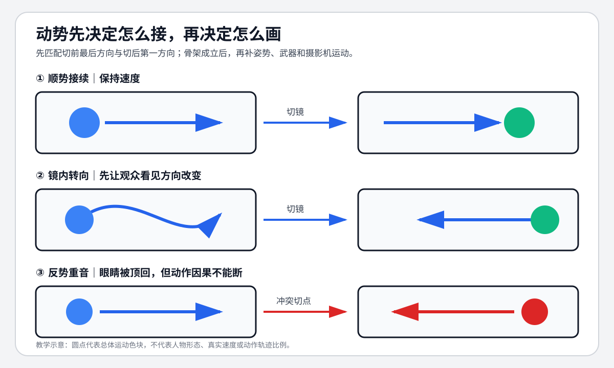

# 老白的分镜课 - 第十三课 运动

> 导航：[[知识库/学习区/课程/老白的分镜课/00 - 课程总览|课程总览]]｜[[老白的分镜课|统一知识总结]]

视频：[P14 第十三课 运动](https://www.bilibili.com/video/BV1QB4y1r73i?p=14)  
说明：课程核心词为“动势”，即复杂主体在画框中的总体运动趋势。

## 本课速览

- 核心问题：动作细节太多时，怎样先抓住跨镜运动方向和节奏骨架？
- 主要结论：把人物和物体暂时模糊成色块，记录它在画框中的上、下、左、右、前后动势；同向接续更顺，反向接续可制造节奏。
- 学习价值：把复杂动作拆成“总体路径”和“局部姿势”两层设计。
- 适用环节：动作分镜、追逐、运动匹配、AI 单镜动作简化。

## 来源可靠性

- 信息来源：本地 ASR。
- 完整程度：P14 全覆盖。
- 待核验：作者短片名称，不影响方法。
- 外部补充：无。

## 分集脉络

- **P14｜第十三课 运动**：从色块动势定义出发，用作业本、遮雨布和男孩追逐示范顺接、简化创作与节奏变化。

## 时间线笔记

- `00:00-01:00`｜定义动势：眯眼模糊动作，把复杂人物看成在画框中移动的色块。
- `01:00-03:37`｜追逐案例：右接右、镜内转向、左接左形成顺畅；无准备的右接左明显受阻。
- `03:37-05:01`｜创作先设计色块路径，再在路径上添加姿势、攻击和细节，降低动作复杂度。
- `05:01-06:27`｜危机升级时，用反向或不同方向的动势接续制造节奏，而不只缩短镜头。
- `06:27-08:50`｜总结三种作用：衔接顺畅、简化创作、建立节奏；主体可以更换，只要视觉趋势可接。

## 核心观点

- 动势是画框坐标中的趋势，不等同于角色在真实场地中的绝对方向。
- 上下镜主体不必相同：作业本向右飞可以接男孩向右跑，只要观众眼睛获得连续趋势。
- 镜头内转向是改变跨镜方向的桥梁；先让观众看见方向改变，再切到新方向。
- 反向接续是节奏工具，不应替代动作因果和接触点的清楚表达。

## 方法与案例

### 方法

1. 每镜画一个大色块和方向箭头。
2. 标切前最后动势、切后第一动势。
3. 顺畅段落优先同向接续；转向尽量在镜头内完成。
4. 危机或高潮可设计少量反向/垂直跳向。
5. 骨架成立后再添加姿势、手脚、武器和摄影机运动。

### 图解：先只看色块怎么走

> [!info] 怎么读
> 第一行同向接续保持速度；第二行先在镜内展示转向，再安全切入新方向；第三行直接反势，把观众眼睛顶回去形成重音。反势仍要保留动作因果，否则只剩方向冲突。

### 案例

- 作业本向右飞 → 男孩向右跑；男孩镜内转身后向左 → 遮雨布向左飞。
- 危机升级：原本顺接的动势突然反向、向下或向左，形成一串节奏重音。

## 可实践练习

1. 把 8 镜动作场面只画成色块与箭头。
2. 分别做“全程顺势”和“关键处反势”两版，比较节奏。

## 主题沉淀

### 已沉淀

- [[知识库/学习区/综合整理/02-导演与视听语言/连续性剪辑与镜头衔接]]：补入动势作为跨主体运动接口。
- [[知识库/学习区/综合整理/02-导演与视听语言/镜头组与视听节奏]]：补入顺势与反势的节奏变化。

### 待沉淀

- 无。

## 复习区

### 一分钟核心摘要

先把复杂动作看成色块方向，再设计跨镜动势。顺势让眼睛自然跟随，镜内转向负责换方向，少量反势制造重音；之后再补姿势和动作细节。

### 自测问题

1. 为什么不同主体也能靠动势相接？
2. 一次反向切换怎样证明是节奏设计而非连续性错误？

### 任务

- [ ] #复习 为一个动作段画动势箭头。
- [ ] #创作练习 设计一次镜内转向作为跨镜桥梁。

## 我的学习提醒

> [!note] 我的理解
> 动作先有大路径，再有好姿势；把顺序倒过来会让每格都精彩却连不起来。

## 二刷时可以重点听

- `01:00-06:27`：顺势、镜内转向与反势节奏。
