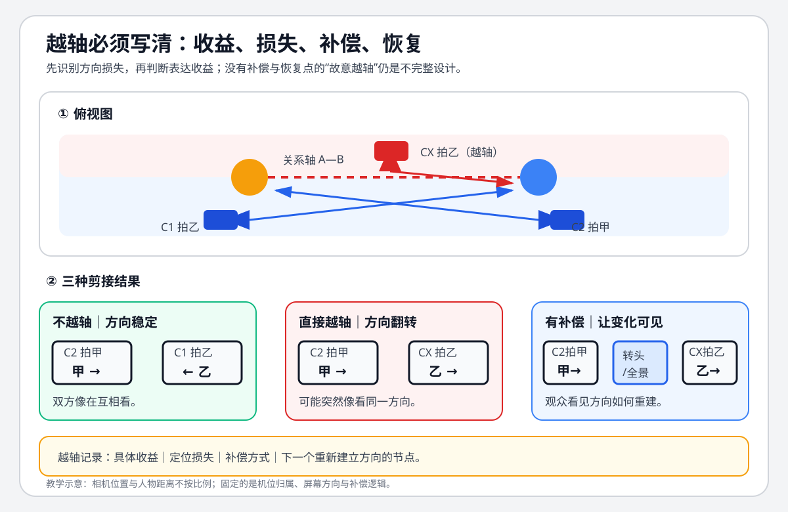

# 老白的分镜课 - 第十四课 什么时候能跳轴

> 导航：[[知识库/学习区/课程/老白的分镜课/00 - 课程总览|课程总览]]｜[[老白的分镜课|统一知识总结]]

视频：[P15 第十四课 什么时候能跳轴](https://www.bilibili.com/video/BV1QB4y1r73i?p=15)

## 本课速览

老白的立场是：学习时先扎实掌握轴向，让走向变化仍能处理得不跳轴；创作时还要照顾视角、构图、节奏，实在无法兼顾才作取舍。他归纳三类情况：有更重要的故事内容要照顾；为具体画面获得更好的构图；主动利用跳轴形成表达。[00:16—00:43；原板书03:48、06:00、08:33]

三类不是万能许可，也不是完整目录。下面保留每个例子的常规方案、被放弃的理由和已知代价；《无名》窗户氛围与分段解释明确是老师的两种**可能**，没有替导演认定唯一动机。

## 来源可靠性

- 材料取得：沿用原 ASR 298行、音频和此前核对同 BV/P/CID 的360p原画面流，约8分35秒；本次不重复下载；旧复核历史在本轮来源记录更新前备份保留。
- 本轮图文复核：先读全部现存转写列清单，再看19个全课分布样本，随后核30个方位/构图帧及7个字幕帧。已核《魁拔》首例角色称呼、1—4号机位及两条关系轴的对应，补清旧记录中的首例静态方位缺口；未根据人物名称猜电影设定。
- 尚未核实：原声、各示范的连续动作、实际剪接点、删转头的观看差别、追逐紧张感与关系情绪未独立验听/连续审看。脸向、机位图、窗口与构图可据原帧核查；效果和动作过程按老师的清楚讲解保存，不以静帧认证。
- 原稿保护：旧“收益—代价—补偿—恢复”框架、声音桥等延伸和练习/个人栏目另存[[知识库/学习区/个人思考/老白分镜课-第14课历史个人记录-20260930|历史个人与整理记录]]。它们原来已标整理者补充，本次保留其身份，不升级为本课标准答案或小陌本次作答。

## 分集脉络

- **P15｜第十四课 什么时候能跳轴**：自绘《魁拔》案例先说明故事视角与节奏的取舍，再以《无名》走廊说明构图条件；后续《无名》《关山飞渡》《喜剧之王》分别讨论段落/氛围、混乱速度感、亲密关系强调。

## 时间线笔记

### 00:00—01:58｜《魁拔》：哪一条轴、哪一次切换

开头展示老师参与分镜的《魁拔》片段，因为他熟悉自己的选择，可以解释取舍。人物为大仓、白发少年敖江、侧面的女孩、披风者雪伦，称呼依00:47、00:53—00:56、02:43的原字幕核查，而不是采用损坏ASR的“熬江、进行、雪轮”。女孩的原字幕写作“静心”，此处保留课堂字形说明，不把它认定为已作片外核实的正式角色名。[00:00—00:58]

俯视草图中，大仓与其余一组人物在纵向关系线上，女孩在侧面，关系线形成L形。老师不把所有人只当一条轴：1号拍大仓，2号把对方三人组纳入；3号以敖江的腿作前景看雪伦。1与2属于常规正反打；2→3可以按局部关系线理解，3→1却跨过原来纵向的绿色轴。**某个接点可按一条关系轴解释，不代表后续接点也不跨另一条轴。**[00:43—01:58；原方位图01:12、01:22、01:57、02:40]

### 01:58—02:46｜可以不跳，为什么仍选3号

老师先给出不跳的备选：2号交代三人的全景后，直接沿该方向切近，表现雪伦被招式作用。这样能够保持轴向，并非技术上无法做。[01:58—02:14；原图02:14红框]

他实际更看重这一小段是大仓与敖江的脉术对抗。雪伦用于显示大仓招式的厉害，3号角度类似敖江所见的雪伦，以观看关系服务双方对抗。老师因此加了3号，并接受其与回到1号之间的轴向问题。保留的是具体叙述视角的理由，不是“随便挑好看的反打”。[02:14—02:46；原字幕02:25“脉术的比拼”、02:43“类似于是敖江看到的雪伦”]

### 02:46—03:50｜传统过渡可用，但没有反应内容

常规方案可以在3→1之间加4号：给敖江一个反应，再由他的视线引向大仓。编号序列是1→2→3→4→1，老师认为这样过渡更顺。[02:46—03:13；原图03:00、03:20的4号与反应草图]

问题是敖江的人设不会对这种事作明显反应，切过去只是无表情的脸。仍然能用这张脸做技术过渡，但没有新增反应内容，容易拖慢本段节奏。因此实际方案删掉4号，直接3→1，承认跳轴。视角选择和节奏共同属于本段“照顾故事”的理由，不可只写成节省一个镜头。[03:13—03:50]

### 03:50—04:22｜“对脸”与删转头的比较

老师指出，雪伦结尾朝画面右侧看，大仓接着看向偏左，两镜形成近似对脸，看起来像雪伦与大仓的一组正反打，可能减轻突兀。再把雪伦结尾向右转头剪掉，作为更跳的对照。[03:50—04:22；原图03:57、04:04、04:16]

这项处理不等于原轴已经完全连续，也不等于真正的对抗核心变成雪伦与大仓。原帧可确认脸的朝向及课中对照说明；“删掉后更跳”的实际连续体验仍按老师评价记录。

### 04:22—05:54｜《无名》走廊：反打从纵深变成墙

老师用A、B两人在走廊里的方位图说明。同轴侧的1号能带出走廊纵深，按不跳轴方式安排2号反打却主要拍到一面墙。两镜方向可以顺，但来回剪时一个有纵深、另一个构图难看，尤其2号的问题突出。[04:22—05:23；原图04:54、05:12]

于是把2号移到轴另一侧，取得更合适的纵深构图，同时承认1、2号之间跳轴。这是“让画面更好看”的具体场景条件；要保留被放弃的单墙方案，不能把“好看”脱离背景关系当万能理由。[05:23—05:38]

接着老师推荐小津安二郎的影片，画面标《东京物语》，并说其中有大量跳轴，观众适应后可能不受影响。这是他的观看经验与推荐，本次没有另看整部片证明其普遍成立。[05:38—05:54；原字幕/标题05:42]

### 05:54—06:59｜《无名》长对话：两种可能的分析

第三类是主动利用跳轴形成效果。老师描述《无名》一段长对话：摄影机先在关系轴一侧，换到另一侧，后来又回原侧。解释原因时，他保留两种可能，没有给出导演本人确认的答案。[05:54—06:18]

第一种**可能**是画面氛围：一侧能带窗户，另一侧看不到窗户，因此出现不同背景与光线感受，老师认为这种变化与正在谈的内容可能相应。窗户是否出现在这些画面中可静态核查；导演为何这样拍不能仅由这些帧确定。[06:18—06:41；原字幕06:19“我觉得第一种可能呢”；原图06:20、06:35]

另一种**可能**是段落感。对话很长，在这一侧讲一会，再在另一侧讲一会，换侧时让观众感到说新的事；返回原侧又形成新的段落。两种解释是分析选项，不要求同时成立。[06:41—06:59；原字幕06:42“另外一种可能就是做段落感”]

### 06:59—07:30｜《关山飞渡》：有意制造追逐混乱

前面一组人在跑、后面一组人在追，常规做法会让双方在画面中朝同一方向，以便衔接顺畅。老师认为《关山飞渡》这一例却用跳轴造成混乱，从而使追逐更紧张、好像更快。它展示的是主动效果取舍，没有规定固定的几镜后恢复规则。[06:59—07:30；原标题/追逐画面07:00、07:04、07:14、07:26]

静态样本确认引用片名、车马追逐及课中说明，不能据车马朝向的几个截面独立证明整体节奏或速度感。

### 07:30—08:35｜《喜剧之王》：短暂换侧强调关系

老师描述，开始在常规轴侧说日常话，谈到重要且与情绪密切相关的内容时，摄影机跳到另一侧，构图显得两人更亲密；接着话题回到普通状态，又回原侧，人物随后离开。[07:30—08:02；原图07:44、07:50、08:04及片名标题]

这段对白和表演并不显著夸张，老师认为靠轴向与构图变化，能使短暂片段有特殊性，让人感到关系下的情感暗流。保存的是他的解读；不据破损ASR重造电影对白，也不说本次静帧已体验到完整情感。[08:02—08:26]

课尾“以我有限的知识”限制了归纳范围。三类和五个案例不是全部跳轴情况，不把本课改成穷尽目录。[08:26—08:35]

## 核心观点

1. **先能处理连续，再谈取舍。** 轴向之外还有视角、构图、节奏，无法兼顾时说明更重要的内容。
2. **多关系场景逐个接点判断。** 《魁拔》的2→3和3→1涉及不同关系轴，不能一概说整段同侧或整段无问题。
3. **过渡镜头也要有故事内容。** 4号技术上可用，角色无反应与节奏需求却使它成为被放弃的选择。
4. **分析可能与原意分开。** 《无名》的氛围、分段是讲者假设；追逐紧张和亲密暗流是讲者效果解读，均未升级独立导演意图证据。

## 方法与案例

本课可直接比较的取舍是：不跳轴的同角度切近与对手所见的3号；增加4号反应与保留节奏；死墙反打与异侧纵深；维持常态衔接与主动制造氛围、分段、混乱或关系强调。每次保留具体背景、角色特点和段落任务，不从三类口号推出统一的补偿或恢复动作。

### 方法：逐切口检查关系轴、观察者与换侧代价

以下步骤是整理者依据本课案例作的操作转译，不是讲者逐项给出的处方，也不是小陌的个人理解或练习结果。

1. **先认这一切口的关系轴及观察者、目标。** 写清前镜是谁在回应谁、谁在看什么，后镜把注意交给谁，再核对已交代的人物位置。多人场景不预设一条永久轴；《魁拔》2→3可按局部关系线解释，3→1仍跨原纵向轴，须分别判断。[P15 00:43—01:58；方位图01:12、01:22、01:57、02:40]
2. **找换轴或空间重建的具体证据。** 检查前后镜实际提供的转头、视线、人物位置和机位关系，说明观众凭什么认出观察者与目标；如果没有足够证据，就保留空间定位风险。《魁拔》4号敖江反应能把视线引向大仓，却因角色无明显反应而被删；雪伦向右、大仓偏左的“对脸”可能减轻突兀，不等于原轴连续，也不把真正对抗改成雪伦与大仓。[P15 02:46—03:50、03:50—04:22]
3. **另比观看与情绪代价，再选版本。** 保留不跳轴备选，与换侧版本比较它们各自给出的视角、构图、反应内容和节奏。《魁拔》可用同角度切近，却选择类似敖江所见的3号；《无名》同侧反打主要见墙，异侧取得纵深。这里比较的是具体取舍，不是越轴的一般许可。[P15 01:58—02:46、04:22—05:38]

这样分开检查，是为了避免“某一切口合轴，所以整段都没问题”或“空间看懂，所以对抗、压迫感与节奏都保住”的跳步。若换侧后空间清楚但目标情绪减弱，先比较常规与换侧版本怎样改变观察者、目标和段落任务；不足以确定原因时保留待核，不能自动归因于轴线。

失败判据属于整理者转译：未认清当前关系就套旧轴；用对脸替整段空间连续性担保；为技术过渡加入与本段任务无关的空反应；或只写“更好看”而不保留死墙/纵深的对照。《无名》长对话的窗户氛围与分段仍是老师的两种可能，不认定导演意图。[P15 05:54—06:59]

本方法可用于规划和候选比较；实际切点、删转头后的观看差别及情绪效果仍需连续声画核验。这里没有新增已验证作品、个人掌握或实践结果。

此图是原有整理者绘制的示意，保留原有效路径，不是原课图。图中“必须写清”及补偿/恢复要求属于旧整理者练习框架，不能代替本课三个具体取舍，也不能仅凭没有恢复点判定设计失败。相关延伸原文已在历史记录保护。

## 主题沉淀

### 已沉淀

- [[知识库/学习区/综合整理/02-导演与视听语言/连续性剪辑与镜头衔接]]：保留已有多来源关联。本次只复核本课来源，不更新该主题中的补偿/恢复框架。

- [[知识库/创作区/C-导演与视觉/镜头衔接：检查轴线、动作、视线与状态接口]]：选定本课逐切口的关系轴、观察者/目标与换侧取舍，步骤及失败判据标为整理者操作转译；这是来源沉淀回链，不是主题间正式关系。

### 待沉淀

- 本次不新增主题或跨分类正式关系。

<!-- source-evidence: bili-BV1QB4y1r73i-p15 -->
本轮图文复核与未核范围见[来源复核记录](<../../../../../evidence/sources/bili-BV1QB4y1r73i-p15/review.md>)；旧复核身份和记录在本次更新前保留备份。
