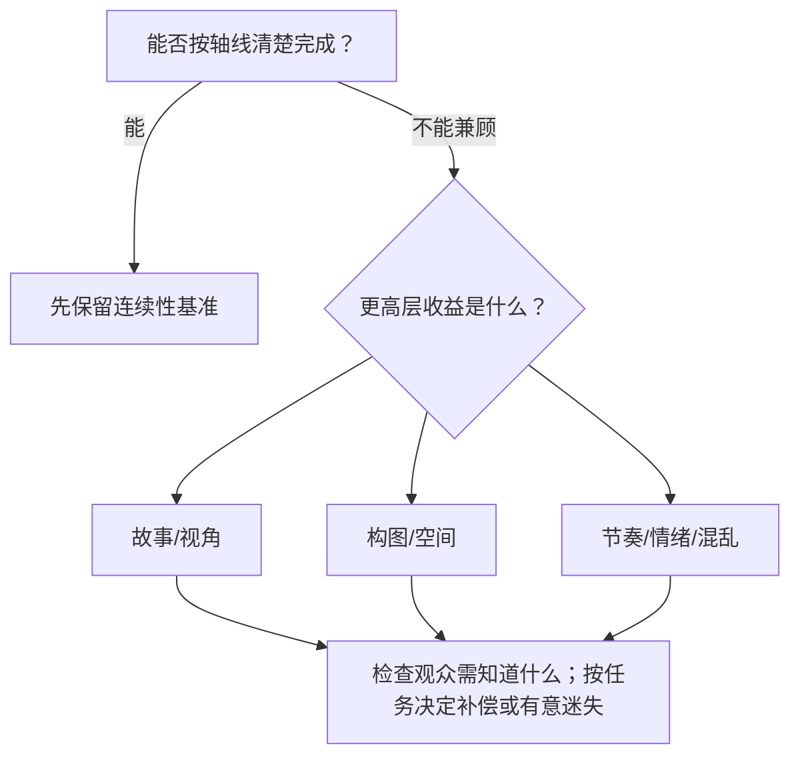

# 老白的分镜课 - 第十四课 什么时候能跳轴

> 导航：[[知识库/学习区/课程/老白的分镜课/00 - 课程总览|课程总览]]｜[[老白的分镜课|统一知识总结]]

视频：[P15 第十四课 什么时候能跳轴](https://www.bilibili.com/video/BV1QB4y1r73i?p=15)

## 本课速览

- 核心问题：连续性规则与视角、节奏、构图或情绪发生冲突时，什么时候可以越轴？
- 主要结论：讲者主张先扎实掌握不越轴，再在视角、构图、节奏无法兼顾时取舍；本课具体展示“对脸”的作用，并讨论有意越轴的表达。其中《无名》的氛围与分段解释明确属于讲者提出的两种可能。
- 学习价值：把越轴从“犯错/大师随便用”变成可说明的权衡。
- 适用环节：情绪切点、动作高潮、狭窄空间与风格化构图。

## 来源可靠性

- 材料获取：已有本地 faster-whisper ASR（base，中文）和音频；本次另取得同一 P15 的 360p 原视频无声流，时长约 `08:35`。没有把媒体获取成功视为全片核验。
- 内容复核范围：读完现存 `00:00–08:35` 转写并逐项核对观点、例子和限制；原帧抽查 `02:43、03:19、03:57、04:05、04:18、05:08、05:28、05:42、06:19、06:23、06:31、06:41–06:43、06:52、07:03、07:45、07:54`。其中 `06:19、06:42–06:43` 的画内字幕直接保留了两次“可能”；`05:42、07:03、07:45` 的片名/人名字幕支持相关专名校正。
- 尚未核实部分：本轮没有连续播放原片，也未回听原音；“删转头后更跳”“追逐更紧张”等连续观感按讲者分析记录，未当成本轮实际体验。首个动画例子的全部角色专名、未抽查的画面细节及各片导演实际意图仍不作确定判断。
- 原材料身份：本课是讲者的创作经验与案例分析；涉及《无名》的两个解释保留为讲者假设，不能写成已证实的导演用意。课尾也说明这只是其有限知识范围内的归纳。
- 整理者补充：“收益—代价—补偿—恢复”流程、方法表、练习、Mermaid 和教学 SVG 是整理者的重组或延伸；“同向动势、轴上/全景重建、声音桥”等不冒充本集直接讲授。相关延伸见现有主题笔记，不用它补写电影原意。
- 合理省略：合并重复口语，省去开场招呼和片尾互动邀请；保留讲者熟悉首例、参与其分镜的说明及每个有独特作用的案例。

## 分集脉络

- **P15｜第十四课 什么时候能跳轴**：用三类案例说明，为故事/视角/节奏、画面好看和主动效果而越轴。

## 时间线笔记

- `00:00-03:39`｜先熟练掌握不越轴；案例一先选接近对手所见的视角，再因过渡反应缺乏内容、拖慢节奏而删镜，接受越轴。
- `03:39-04:22`｜讲者通过“对脸”及删去转头的对照，说明脸向可能减轻方向翻转的突兀。
- `04:22-05:38`｜案例二：轴线同侧机位背景是死墙、构图很差，选择越轴换取更好的纵深和画面。
- `05:38-05:54`｜讲者另荐小津安二郎的作品，谈适应其大量越轴后的观看经验；原画面标出《东京物语》。
- `05:56-06:59`｜《无名》：讲者提出两种可能解释，一是随窗口可见性改变氛围，二是通过换侧形成段落感；均保留假设身份。
- `06:59-07:30`｜《关山飞渡》：讲者以追逐方向不稳定解释混乱、紧张与速度感。
- `07:30-08:26`｜《喜剧之王》：重要内容时短暂换侧及亲密构图，随后回原侧；讲者据此解读关系暗流。
- `08:26-08:35`｜讲者限定为自己有限知识中的几类情况，随后结束课程。

## 核心观点

下图是整理者的判断流程，不是讲者给出的逐字规则；“是否需要恢复”仍取决于段落任务。

- 讲者主张先能稳定做到不越轴；当故事视角、构图或节奏无法兼顾时，再考虑牺牲轴向。来源：`00:16–00:43`。
- 第一例说明一条用来过渡的反应镜头可能没有有效内容：强加反应会违背人物特点，保留无表情过渡又可能拖慢节奏。来源：`02:46–03:50`。
- “为好看而越轴”需要放回具体构图条件判断；本例比较的是有纵深的画面与死墙背景。《无名》的氛围变化和段落划分则是讲者的两种解释可能，不能并列写成已证目的。来源：`04:22–06:59`。
- 讲者把追逐方向的混乱、亲密关系的短暂强调列为主动利用越轴的例子，课尾没有宣称列举穷尽。整理者据此建议检查观众还需辨认哪些关系；这不是“任何混乱都必须马上恢复”的定律。来源：`06:59–08:30`。

## 方法与案例

### 方法

以下是整理者用于练习的五步框架。它把本课实例重组为可比较的决策；不是讲者在本课中列出的检查表。

1. 先画不越轴版本，确认最小过渡成本。
2. 写出越轴带来的具体收益与观众定位损失。
3. 比较收益是否高于代价。
4. 区分本课直接示范与延伸方法：本课展示了转头“对脸”；同向动势、轴上/全景重建、声音桥和段落边界属于整理者保留的延伸候选，需要另查使用条件。声音桥可以联系时间或段落，本身不证明画面左右关系已经重建。
5. 根据后续任务决定何时重建方向；如果本来要保留迷失，记录观众仍需知道的内容，不机械要求每次越轴后立即恢复。

整理者延伸的对应主题：[[知识库/学习区/综合整理/02-导演与视听语言/连续性剪辑与镜头衔接]]。该主题汇合多来源，不能反向当作本集原话。

### 图解：越轴前后观众会失去什么

> [!info] 怎么读
> 这是整理者绘制的教学示意，不是原课截图。可用它比较同侧、直接翻转与带空间线索的三种处理。图中“越轴必须写清”和“没有补偿与恢复点……仍是不完整设计”属于整理者练习要求，不能作为本课讲者已证明的普遍结论；有意保留迷失的段落也不能只凭缺少恢复点判错。真正要检查的是此处需要观众理解什么，以及实际片段是否达到了目标。

### 案例

#### 案例一：为了对抗视角与节奏，删掉技术上可用的过渡

讲者说明首例的分镜由自己绘制，因此熟悉其选择理由。场景有相互对抗的两方和旁侧人物；讲解以 L 形的多条关系线说明方位。先区分两件事：某次切换可以按其中一条关系线解释，并不代表接下来的切换也不会越过另一条轴。按照本例编号，`2→3` 可视为一组关系反打，`3→1` 则仍有越轴问题。来源：`00:10–01:58`；方位图没有在本轮完整逐帧复查，编号解释来自现存讲解转写。

新增 3 号机位有故事理由：场面核心是双方对抗，旁侧人物用于显示其中一方招数的效果。与直接在原角度切近相比，3 号机位更接近对手看到这件事的观看关系。`02:43` 原帧字幕明确使用“就类似于是敖江看到的雪伦”，并可见前景腿部与后方人物；这些名称只作为该帧字幕读数，不据此补定其他角色。来源：`01:58–02:46`。

随后比较两个方案：

| 方案 | 能解决什么 | 讲者指出的代价 |
|---|---|---|
| `1→2→3→4→1`，加一个对手反应，再由其视线引向另一方 | 按传统方式平顺过渡轴向 | 角色设定不会对这些事作出明显反应；硬加表情不符人设，保留无表情镜头又容易拖沓。 |
| 删掉 4 号反应，直接回到 1 号机位 | 保持当前视角安排和节奏 | 接受这个切点出现越轴；不能宣称左右关系仍完全连续。 |

来源：`02:46–03:50`。`03:19` 原帧是讲者绘制的反应表情示意，不是证明电影角色真实表演的素材。

讲者还展示了“对脸”如何减轻突兀：上镜人物在结尾向画面右侧转脸，下镜另一人看向偏左侧，使两镜近似互相面对；再把转头删掉作对照，说明会更跳。本轮抽查 `03:57、04:05、04:18` 的原帧与字幕，确认课中确有这一演示；**未连续播放两种版本，因此“更顺/更跳”的观感仍按讲者陈述记录。** 来源：`03:50–04:22`。

#### 案例二：同侧反打只剩死墙时，怎样取舍构图

走廊内两人交谈，常规同侧正反打可以维持方向，但其中一个反打会以近处墙面作背景，失去另一个方向具有的纵深。讲者比较方位与构图后，把反打机位放到轴另一侧：承认切换越轴，同时获得更合适的画面。关键是说明背景为什么难看，而不是把“好看”当万能理由。来源：`04:22–05:38`；`05:08、05:28` 原帧可见调整前后的机位及构图示意，未验证实际两镜剪接观感。

讲者随后推荐小津安二郎的影片，认为其中大量越轴在观众适应之后未必继续造成干扰。`05:42` 原帧有《东京物语》标题与“小津安二郎的片子”字幕，支持将损坏 ASR 专名校正为这两者。这是一条讲者的看片建议与观看经验，尚未在本轮另看整部影片验证。来源：`05:38–05:54`。

#### 案例三：《无名》的换侧——保留讲者提出的两种可能

讲者描述一段对话：摄影机先在关系轴一侧，后来转到另一侧，再返回原侧。对“为什么这么做”，他没有给出已经证实的导演解释，而是提出两种可能：

1. **可能是为了改变氛围。** 一侧拍摄能够带入窗户，另一侧看不到该窗，形成不同光线和背景感受；讲者认为这种变化与正在谈论的内容可能相配。来源：`06:18–06:41`；`06:19` 原帧字幕是“我觉得第一种可能呢”，`06:23、06:31` 帧内字幕分别讨论能否拍到窗户。静帧可比较所示画面，不能据此证实导演动机。
2. **另一种可能是为了形成段落感。** 对话较长，在一侧说一段，再换一侧说一段，让观众感到进入新内容；返回时又形成一个段落。来源：`06:41–06:59`；`06:42–06:43` 原帧字幕明确写“另外一种可能就是做段落感”。

因此，本例能支持“讲者如何分析形式选择”，不能写成“导演就是为了上述两个目的越轴”。两种解释也不必同时成立。

#### 案例四：《关山飞渡》追逐中的方向混乱

讲者先给出常规对照：追赶双方若朝相同的银幕方向运动，关系较顺畅。随后指出该例有意使用越轴制造混乱，并认为这种混乱使段落显得更紧张、更快。`07:03` 原帧的《关山飞渡》标题与画内字幕支持片名校正；本轮没有连续播放追逐，所以只记录讲者对效果的分析。来源：`06:59–07:30`。

整理者提醒：如果把这种方法迁移到自己的片段，需要实际检查哪些追逃信息必须可辨；这一使用建议不等于讲者在本例规定了固定的“几镜后恢复”规则。

#### 案例五：《喜剧之王》用短暂换侧标出亲密关系

讲者分析一小段看似日常的对话：开始按常规轴侧拍，谈到重要且与情绪相关的内容时换到另一侧，并采用更显亲密的构图；随后说“没事”又回到先前的方向。`07:45、07:54` 原帧带《喜剧之王》标题，可见前景人物关系与后方人物位置的变化。

讲者着重解释：不必靠特别直白的对白或显著表演变化，这一小段通过轴向和构图变化，便可能让观众感到它与前后不同、关系下存在情感暗流。这是讲者的影片解读；本轮两张静帧不能代替整段情绪体验。来源：`07:30–08:26`。

本课最后以“以我有限的知识”限定归纳范围，以上几类不是完整目录。来源：`08:26–08:30`。

## 可实践练习

1. 为一个越轴切点写“收益—代价—补偿”三栏。
2. 同一节点设计对脸缓冲、全景重建和直接跳越三版。

## 主题沉淀

### 已沉淀

- [[知识库/学习区/综合整理/02-导演与视听语言/连续性剪辑与镜头衔接]]：补充有条件越轴的决策与补偿。

### 待沉淀

- 无。

## 复习区

### 一分钟核心摘要

讲者主张先掌握不越轴，再在故事视角、构图、节奏或情绪的具体取舍中考虑越轴。首例保留了删去过渡反应的理由和“对脸”演示；《无名》的氛围与分段说法仍是讲者提出的两种可能。整理者的收益、代价和恢复检查表可用于练习，但不替代连续观片，也不把每次越轴都规定为必须立即恢复。

### 自测问题

1. 为什么“加一个过渡反应”有时反而是更差的方案？
2. 如何证明一次越轴在制造混乱，而不是创作者没管理方向？

### 任务

- [ ] #复习 复述三类越轴动机。
- [ ] #创作练习 为现有越轴镜头补写收益、代价与重建点。

## 我的学习提醒

> [!note] 我的理解
> 规则不是枷锁，但没有写清代价和收益的“破规则”也不是表达。

## 二刷时可以重点听

- `00:00-04:22`：为了人物、视角和节奏越轴。
- `06:18-06:59`：听清讲者怎样提出两种“可能”，再区分画面事实与解释。

## 来源复核记录

<!-- source-evidence: bili-BV1QB4y1r73i-p15 -->
本篇已采用复核的具体范围与未核项，见[来源复核记录](<../../../evidence/sources/bili-BV1QB4y1r73i-p15/review.md>)。
