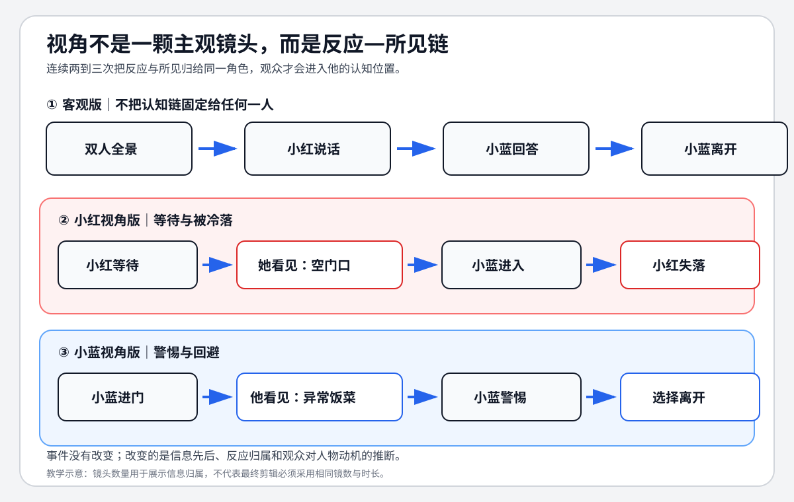

# 老白的分镜课 - 第十五课 视角

> 导航：[[知识库/学习区/课程/老白的分镜课/00 - 课程总览|课程总览]]｜[[老白的分镜课|统一知识总结]]

视频：[P16 第十五课 视角](https://www.bilibili.com/video/BV1QB4y1r73i?p=16)

## 本课速览

- 核心问题：对白与事件不变，怎样只靠镜头选择让观众同情不同角色？
- 主要结论：反复组织“角色的反应 ↔ 角色所看到的”，可以让观众进入该角色的观看位置；客观版则减少这种归属。
- 学习价值：用视点结构解决分镜“平”，而不是只加运镜和特写。
- 适用环节：角色认同、悬念、误解、关系戏与主客观切换。

## 来源可靠性

- 信息来源：本地 ASR。
- 完整程度：P16 全覆盖。
- 待核验：结尾影片案例专名。
- 外部补充：无。

## 分集脉络

- **P16｜第十五课 视角**：用同一“回家、问吃饭、离开”场景分别做客观版、小红版和小蓝版，再总结边界。

## 时间线笔记

- `00:00-01:34`｜客观常规版：定场、双人、双方单人、离开全景；信息清楚但缺少认同倾向。
- `01:34-04:45`｜小红视角版：小红反应与小红所见交替，让观众感到等待、期待和被冷落。
- `04:45-07:57`｜小蓝视角版：小蓝反应与小蓝所见交替，同样对白变成警惕、猜疑与回避。
- `07:57-09:04`｜视角手法能在零表演草图中先建立潜在情绪，但不应替代表演。
- `09:04-11:59`｜边界：拍摄/视听视角不同于故事叙述视角；一场可换多个视角，也可保持客观。

## 核心观点

```text
角色反应 → 角色所见 → 新反应 → 新所见
                  ↓
        观众把因果与情绪归到该角色
```

- 视角不是单个主观镜头，而是一段镜头选择反复把观众拉回谁的反应和认知。
- 同样对白因所见顺序不同，会改变观众对人物动机的推断。
- 一场戏可以分段切换视角，但切换应对应信息权、关系或目标变化。
- 客观处理不是“没有设计”，而是不给任何角色独占观看链，让观众保持评判距离。

## 方法与案例

### 方法

1. 写出场景中每个角色知道什么、不知道什么、最在意什么。
2. 选当前视角角色，只保留其反应与其可见信息。
3. 避免提前展示该角色尚不能看到的内容。
4. 若换视角，设置明确的信息或关系节点。
5. 最后比较客观版，确认主观结构带来的情绪收益。

### 图解：同一事件怎样站到不同人物一边



> [!info] 怎么读
> 第一行只是按事件顺序交代；第二、三行分别把反应与所见归给小红和小蓝。事件没有改变，变化的是信息先后、反应归属和观众对人物动机的推断。

### 案例

- 小红版：先看满桌菜与空门口，再见小蓝进入又离开，观众倾向同情等待者。
- 小蓝版：先从门外进入，看见不寻常的饭菜与小红，观众倾向怀疑小红动机。

## 可实践练习

1. 用同一页对白画甲视角、乙视角和客观版各 6 格。
2. 标出每版观众最早知道的事实和最晚知道的事实。

## 主题沉淀

### 已沉淀

- [[知识库/学习区/综合整理/02-导演与视听语言/镜头语言专业总表]]：补充“反应—所见”的视角链与客观版比较。

### 待沉淀

- 无。

## 复习区

### 一分钟核心摘要

视角是一段镜头如何分配认知与反应。围绕某角色反复组织“他怎样反应、他看见什么”，观众就更容易进入他的处境；减少这种结构则保持客观距离。

### 自测问题

1. 一个主观镜头为什么不足以建立整场视角？
2. 切换视角时，什么节点能让观众不迷失？

### 任务

- [ ] #复习 区分视听视角与故事叙述视角。
- [ ] #创作练习 为同一场景做双视角对照。

## 我的学习提醒

> [!note] 我的理解
> 谁的反应被反复看见，谁就更可能成为观众的情感入口。

## 二刷时可以重点听

- `01:34-07:57`：同一场景的两种主观版本。
