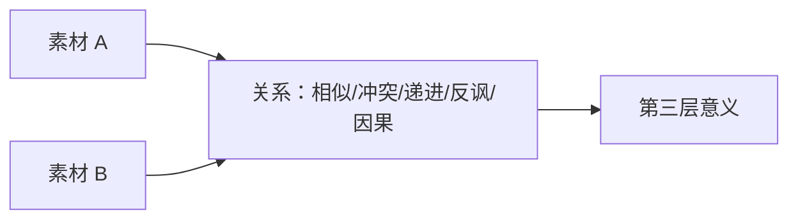

# 老白的分镜课 - 第十六课 蒙太奇

> 导航：[[知识库/学习区/课程/老白的分镜课/00 - 课程总览|课程总览]]｜[[老白的分镜课|统一知识总结]]

视频：[P17 第十六课 蒙太奇](https://www.bilibili.com/video/BV1QB4y1r73i?p=17)  
说明：本课涉及库里肖夫、爱森斯坦、希区柯克等历史人名和转述；ASR 不足以支持精确引语，本笔记只保留课程方法结构，不保留未经核验的原话。

## 本课速览

- 核心问题：为什么两个普通镜头、两条叙事线或一组画面与声音放在一起，会产生单项素材没有的含义？
- 主要结论：蒙太奇的底层可简化为“并置产生第三层意义”；并置对象可以是镜头、画内元素、叙事线、画面与声音、画面与音乐、声音与声音。
- 学习价值：从“镜头怎么接”进入“镜头关系说了什么”。
- 适用环节：分镜组接、预告、平行叙事、声音设计与主题表达。

## 来源可靠性

- 信息来源：本地 ASR。
- 完整程度：P17 全覆盖。
- 待核验：历史人物引语、影片名与导演访谈；不作为精确事实引用。
- 外部补充：统一总结链接 Yale 公开蒙太奇条目进行术语核验。

## 分集脉络

- **P17｜第十六课 蒙太奇**：从库里肖夫效应讲到镜内蒙太奇、动作省略、平行叙事、声画正配/反配/对位和声音并置。

## 时间线笔记

- `00:00-02:17`｜两镜并置产生新含义；中性表情与不同对象组接改变观众解释，素材越不“中性”越会限制结果。
- `02:17-04:20`｜简述苏联蒙太奇观点差异；课程保留最简操作原则。两个画内元素也能形成“镜内蒙太奇”。
- `04:20-04:57`｜动作、刀、身体局部与尖叫并置，让观众补全未直接展示的暴力。
- `04:57-07:29`｜两条叙事线和相反仪式/暴力氛围并置，产生人物双重性与主题对照。
- `07:29-08:06`｜画面与环境声音并置表达人物内心压力。
- `08:06-12:41`｜画面与音乐可正配、反配或对位；对位不是简单相反，而是两条独立表达共同生成新味道。
- `12:41-14:57`｜声音与声音并置让个人崩溃被解释为更普遍的情绪；结论落回“手法服务表达”。

## 核心观点

- 蒙太奇不是快剪同义词；关键是并置关系是否改变解释。
- 库里肖夫式实验要求镜头本身相对中性，否则原有表情已强烈限定意义。
- 镜内前后景、两条叙事线和声画关系都能产生并置，不局限于两个连续画面。
- 正配强化同向情绪，反配制造反差；对位是相对独立的表达线共同作用，不能简化成“悲画面配快乐歌”。
- 手法不替主题说话；先明确要说什么，再选择并置关系。

## 方法与案例

### 方法

1. 分别写出素材 A、素材 B 各自含义。
2. 指定两者关系：相似、冲突、递进、因果、反讽或对位。
3. 写出观众应得到的第三层意义。
4. 检查第三层意义是否依赖必要语境，还是只是整理者过度解读。
5. 用顺序、时长、声音和反应调节含义强度。

### 图解：A 与 B 怎样产生第三层意义

> [!info] 怎么读
> 上半部用同一中性人物与不同对象组接，说明解释来自材料之间的关系；下半部把并置扩展到镜头、叙事线、画面与声音、声音与声音。若第三层意义只能靠创作者额外解释，它还没有真正成立。

### 案例

- 中性脸＋食物/死亡/人物：相邻对象改变对表情的解释。
- 暴力省略：动作、武器、身体局部和声音让观众补全未见事件。
- 仪式与杀戮平行：两条线相互评论，产生道德反讽。
- 画面与音乐：同向、反向与独立对位形成不同情绪层次。

## 可实践练习

1. 用同一中性人物镜头分别接三个对象，写出三种解释。
2. 设计一段不直接展示接触点、却能让观众理解动作结果的 5 镜组。
3. 给同一画面配正配、反配、对位三种声音，说明它们不是情绪标签替换。

## 主题沉淀

### 已沉淀

- [[知识库/学习区/综合整理/02-导演与视听语言/镜头组与视听节奏]]：补充镜头、画内元素、叙事线和声音的多层并置。

### 待沉淀

- 无。

## 复习区

### 一分钟核心摘要

蒙太奇的核心不是剪得快，而是让 A 与 B 的关系产生第三层意义。A/B 可以是镜头、画内元素、叙事线、画面与声音或两个声音；先说清关系与要表达的命题，再决定组接。

### 自测问题

1. 为什么带明显“坏笑”的脸不适合充当中性库里肖夫素材？
2. 反配和对位有什么区别？
3. 怎样判断第三层意义是观众可获得的，而不是整理者强行解释？

### 任务

- [ ] #复习 用一句话解释“并置产生第三层意义”。
- [ ] #创作练习 为同一镜头做三种声画关系测试。

## 我的学习提醒

> [!note] 我的理解
> 蒙太奇真正设计的是素材之间的关系，而不是素材数量。

## 二刷时可以重点听

- `04:20-14:57`：从镜头并置扩展到叙事线、声画和声音并置。
