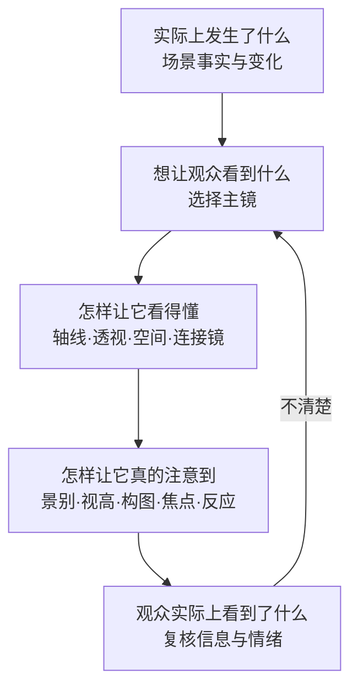
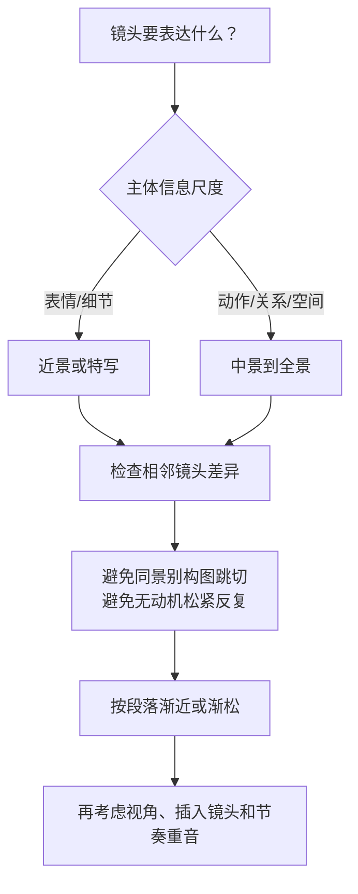

# 老白的分镜课

> 导航：[[知识库/学习区/课程/老白的分镜课/00 - 课程总览|先看每课与每集讲什么]]。本页只整合跨课可复用知识，不重复逐集时间线和案例全文。

> [!note] 本页范围与本次修正
> 本页保留历史跨课总结。2026-09-30仅修正第3课的案例定位，未全面同步本轮逐课来源纠正或既有综合主题；详细方法、案例条件和待核内容以新版课级正文为准。旧图中的运镜、长镜头支线不能当作第3课最后采用方案。原声和连续声画效果仍待核；原有练习、自测和个人记录保留为历史内容，不是本次新增学习任务。

## 材料简介

来源：[打开 Bilibili 课程](https://www.bilibili.com/video/BV1QB4y1r73i)  
讲者：老白的分镜  
当前范围：P1-P17，对应第一至第十六课  
历史读取情况：使用本地 ASR 整理P1-P17；本页未随本轮16课图文复核全面重写，详细证据见新版课级正文。  
可靠性：课程方法、例子与判断归于讲者；术语校正和跨课结构是 Codex 整理；外部资料另列。  

## 速览

- 课程主要解决的问题：怎样从一段剧本或一个场景意图出发，设计出观众看得懂、能投入、能剪接且不机械的镜头序列。
- 最重要的跨课结论：分镜不是“先挑机位”，而是沿着“事实—观众体验—关键画面—连接方式—注意控制—节奏与意义”逐层做决策。
- 适用创作阶段：剧本段落已可视化之后，镜头编号、静态分镜、动态预演、AI 视频生成和粗剪之前。

## 分章节／分集导览

- [[01 - 第一课 正反打（P1）|第一课 正反打]]：建立双人覆盖的最小语法。
- [[02 - 第二课 轴向（P2-P3）|第二课 轴向]]：把双人语法扩展到多人、多轴与换轴。
- [[03 - 第三课 范例一《老板，大门忘关了》（P4）|第三课 范例一]]：从公式进入真实叙事选择。
- [[04 - 第四课 透视基础（P5）|第四课 透视基础]]：让草图中的人物和空间站稳。
- [[05 - 第五课 主镜的概念（P6）|第五课 主镜]]、[[06 - 第六课 用画面推导机位（P7）|第六课 画面推导机位]]：先找关键画面，再反推机位与连接。
- [[07 - 第七课 讲故事的基础三原则（P8）|第七课 三原则]]：从“呈现了”推进到“观众真正接收了”。
- [[08 - 第八课 决定景别的六个原则（P9）|第八课 景别]]、[[09 - 第九课 决定机位高度的六个原则（P10）|第九课 视高]]：用尺度和角度组织段落强弱。
- [[10 - 第十课 构图的两种思路（P11）|第十课 构图]]、[[11 - 第十一课 视觉焦点的实际应用（P12）|第十一课 视觉焦点]]、[[12 - 第十二课 空间感（P13）|第十二课 空间感]]：控制画面内的层级、眼迹与纵深。
- [[13 - 第十三课 运动（P14）|第十三课 运动]]、[[14 - 第十四课 什么时候能跳轴（P15）|第十四课 跳轴]]、[[15 - 第十五课 视角（P16）|第十五课 视角]]：把连续性转化为可主动取舍的表达工具。
- [[16 - 第十六课 蒙太奇（P17）|第十六课 蒙太奇]]：让镜头、叙事线、声音与音乐并置出单项材料没有的新含义。

## 核心模型与概念

### 1. 分镜的五层决策链



这个模型把第七课的“三问”放到全课程中：主镜负责选取不可缺少的视觉事件；连接镜、连续性和空间关系负责让事件可读；景别、构图、眼迹和节奏负责强调或弱化；最后再从观众实际接收反推修订。

### 2. 主镜不是主镜头

- 课程中的“主镜”指讲清这一段故事不可缺少的关键画面集合，不等同于覆盖整场的主镜头（master shot）。
- 一条信息不必对应一句台词；先把对白压缩为行动、发现、转折、反应和结果，再为每个不可删的变化找画面。
- 主镜之间如果不能直接相接，才补连接镜；连接镜的价值是建立视线、动作、空间、情绪或信息桥梁，不是填满每句对白。

### 3. 连续性是一张“观众推断网”

```text
人物/目标形成关系轴
        ↓
稳定左右、脸向、运动方向
        ↓
人物移动或关系改变 → 重新识别当前有效轴
        ↓
跨轴时寻找同时属于两套关系的桥梁机位／反应／动势
```

- 双人正反打是基础；多人场景先按当前戏剧关系分组，而不是一次把所有轴都画完。
- L 型、A 型、U/O 型的价值在于提醒“当前哪两方正在发生关系”，而不是要求死背字母图形。
- 判断某个切换是否越轴，必须看这两个镜头正在呼应哪一条关系轴；一条无关的轴不能替它辩护。

### 4. 六项景别判断



重点不是给每个情绪贴固定景别，而是让镜头尺度形成趋势、转折和段落边界。

### 5. 六项视高判断

1. 正反打：先满足双方头部、视线和空间关系可读。
2. 主观视线：摄影机贴近角色观看高度，跟随其抬头或低头。
3. 观众视角：让整段摄影机高度靠近被要求认同的角色。
4. 构图需要：为了露出地面、天空、前后层或关键环境调整视高。
5. 跨镜顺畅：地平线、色块和画面分割不要无动机大跳。
6. 节奏变化：在稳定基准上突然抬高或降低，才会成为重音。

### 6. 画面内的注意力排序

- 强吸引源：运动、眼睛/人脸、高反差或异常元素、汇聚线条、新出现的信息。
- 镜头时长会让焦点游移；时长过短看不清，过长则观众开始自行搜索。
- 顺畅剪接让上镜焦点与下镜目标接近；有意跳跃可以制造惊吓、混乱或高潮，但需要以一段稳定眼迹作基准。

### 7. 空间感的两个抓手

- **露出更多面**：避免正对平面；通过水平角度、俯仰、视距与开角，让墙、地面、顶面或物体侧面共同出现。
- **增加远近层次**：前景遮挡/虚化、中景主体、远景目标形成纵深，但每层都应承担构图或叙事功能。

### 8. 动势与蒙太奇

- 动势：把复杂动作暂时模糊成色块，记录它在画框中的上、下、左、右、前后趋势。同向接续更顺，反向或跳向可形成冲击与节奏。
- 蒙太奇：并置不是简单相加；镜头 A 与镜头 B、画面与声音、两条叙事线或两个画内元素之间的关系，会产生第三层意义。

```text
A（中性人物脸） + B（食物）      → 饥饿
A（中性人物脸） + C（死亡现场）  → 悲伤
同一素材因相邻材料变化而改变解释
```

## 方法与工作流

1. 写一句场景任务，列出开始状态、结束状态和真正发生变化的节点。
2. 用“实际发生—希望看见—实际看见”三问筛选信息。
3. 为每个不可删除的变化画一张主镜，不先标焦距和机位。
4. 画最小方位图：人物、关键道具、入口出口、当前关系轴与动作方向。
5. 从主镜反推机位；只在主镜无法直连时补连接镜。
6. 决定景别趋势、视高基准、画面层次和视觉焦点。
7. 用动势与眼迹检查每个切点；标出故意不顺的重音及其表达收益。
8. 通过蒙太奇问题复核：上下镜、声音或叙事线并置后，观众会不会得到一个意外但可控的新含义？
9. 删除只重复信息、关系和情绪的镜头。
10. 进入 AI 生成前，为每镜写明主要动作、开始/结束状态、轴线侧、屏幕方向和下一镜接口。

## 案例索引

| 案例 | 用来说明什么 | 详细出处 |
|---|---|---|
| 双人谈话与庭院场景 | 正反打公式怎样被空间和“冷感”构图改造 | [[01 - 第一课 正反打（P1）#方法与案例]] |
| 三人互动与多轴切换 | L/A 型、关系分组与桥梁机位 | [[02 - 第二课 轴向（P2-P3）#方法与案例]] |
| 《老板，大门忘关了》 | 机位与构图候选、切镜衔接和双重误会的喜剧情境；本例暂不采用运动镜头，运镜与长镜头支线不是最终采用方案 | [[03 - 第三课 范例一《老板，大门忘关了》（P4）#方法与案例]] |
| 《寻梦环游记》相关片段 | 主镜、世界观信息、反应和多轴连接 | [[05 - 第五课 主镜的概念（P6）#方法与案例]] |
| 动作片段 | 视觉焦点、动势连续和有限跳跃 | [[11 - 第十一课 视觉焦点的实际应用（P12）#方法与案例]] |
| 追逐与对话片段 | 为节奏、构图、视角或情绪承担越轴代价 | [[14 - 第十四课 什么时候能跳轴（P15）#方法与案例]] |
| 库里肖夫效应与声画并置 | 相邻素材怎样创造第三层意义 | [[16 - 第十六课 蒙太奇（P17）#方法与案例]] |

## 跨课关系

- 正反打与轴线提供“清楚”的基准；只有先会建立基准，越轴、焦点跳跃和动势冲突才可能成为有意表达。
- 主镜负责“选什么”，景别/视高/构图负责“强调到什么程度”，焦点/时长/运动负责“观众是否来得及接住”。
- 空间感是单镜内部的纵深组织，连续性是跨镜之间的空间推断，蒙太奇则允许跨镜关系主动产生超出物理连续的新意义。

## 适用边界与常见错误

- 课程是讲者的实用入门体系，不是唯一标准；字母轴型和“六原则”是帮助思考的压缩模型。
- ASR 中出现了大量专业词近音误识别；本页已按上下文校正，无法确认的片名、人名不作为结论依据。
- 不把“近景=紧张、仰拍=强大、横线=平静”当固定编码。意义必须由剧情、表演、空间、声音和上下镜共同决定。
- 不把“越轴没关系”理解为可忽略连续性；课程强调的是掌握基准后，为更高层收益做可说明的取舍。
- 不把蒙太奇等同于快剪或素材拼盘；没有明确关系的并置不会自动产生有效意义。

## 外部补充与分歧

- [外部补充，检索于 2026-07-28] [Yale Film Analysis：Editing](https://filmanalysis.yale.edu/editing/) 把连续性剪辑概括为维持屏幕方向、位置与时间关系，也把蒙太奇说明为通过并置创造单镜不具有的观念；与课程主线相符。
- [外部补充，检索于 2026-07-28] [Yale Film Analysis：Mise-en-scène](https://filmanalysis.yale.edu/mise-en-scene/) 强调摄影机位置、镜头、光线和布景都会影响空间的深度、比例与关系；这补充了第十二课以“露面与层次”为主的简化模型。
- 可靠性：大学公开教学页面；用于校准术语和边界，不冒充老白课程内容。
- 分歧：课程把复杂概念压缩成实用口诀，外部教材强调更多历史与风格差异；本笔记保留口诀的操作性，同时不把它升级为普遍定律。

## 可实践练习

1. 选一段 30 秒双人对话，先只画 3–5 张主镜，再画方位图反推最小机位，不按台词数拆镜。
2. 为同一段落设计“客观版、小红视角版、小蓝视角版”，只改变镜头选择，比较观众同情如何变化。
3. 设计一组 6 镜动作：前 4 镜动势和眼迹顺接，第 5 镜故意跳向形成重音，第 6 镜重新建立方向。
4. 选两个中性画面，分别配三种声音，记录每种声画并置产生的新解释。

## 主题沉淀

### 已沉淀

- [[知识库/学习区/综合整理/02-导演与视听语言/镜头语言专业总表]]：增加以观众接收为终点的分镜决策链。
- [[知识库/学习区/综合整理/02-导演与视听语言/连续性剪辑与镜头衔接]]：增加多轴、眼迹、动势和有条件越轴。
- [[知识库/学习区/综合整理/02-导演与视听语言/镜头组与视听节奏]]：增加尺度/角度节奏与多模态蒙太奇。
- [[知识库/学习区/综合整理/02-导演与视听语言/场景导演怎样把剧本事件统一成观众体验与部门执行]]：增加从场景事实到观众接收及部门共同优先级的导演判断。
- [[知识库/学习区/综合整理/03-摄影美术与现场制作/摄影选择怎样通过镜头、距离、景深、曝光与运动控制观看]]：提供从故事任务反推机位、景别、视高、构图、焦点与摄影时机的导演侧依据。

### 待沉淀

- 无；课程知识已由五篇主题容纳，暂不把景别、视高、构图、焦点、动势和视角各拆成空泛小主题。

## 复习区

### 一分钟核心摘要

先找场景事实和观众体验，再画不可缺少的主镜；用方位图、轴线、透视和连接镜保证可读，用景别、视高、构图、焦点、动势和时长控制强调与节奏，最后通过蒙太奇检查镜头、声音和叙事线并置后产生了什么新含义。

### 自测问题

1. “主镜”与“主镜头”有什么区别？
2. 一个切点同时处于某条轴的正确一侧，为什么仍可能不能证明它不跳轴？
3. 怎样区分“观众看见画面里有某物”与“观众真正接收到它是重点”？
4. 哪些情况下焦点跳跃或越轴的表达收益可能大于连续性代价？
5. 蒙太奇的第三层意义来自什么关系，而不是来自什么素材数量？

### 任务

- [ ] #复习 不看笔记复述“事实—主镜—连接—强调—验证”五层链。
- [ ] #创作练习 用当前项目的一场戏做一次“主镜先行”的 5 镜测试。
- [ ] #创作练习 给同一组画面换两套声音，比较新含义是否可控。

## 关键问题

> [!question] 本课程当前只保留一个最值得回答的问题
> 当你准备为一个场景增加新镜头时，怎样证明它是在改变观众获得的信息、关系、情绪、视点或节奏，而不是只把同一内容换个角度再说一遍？
