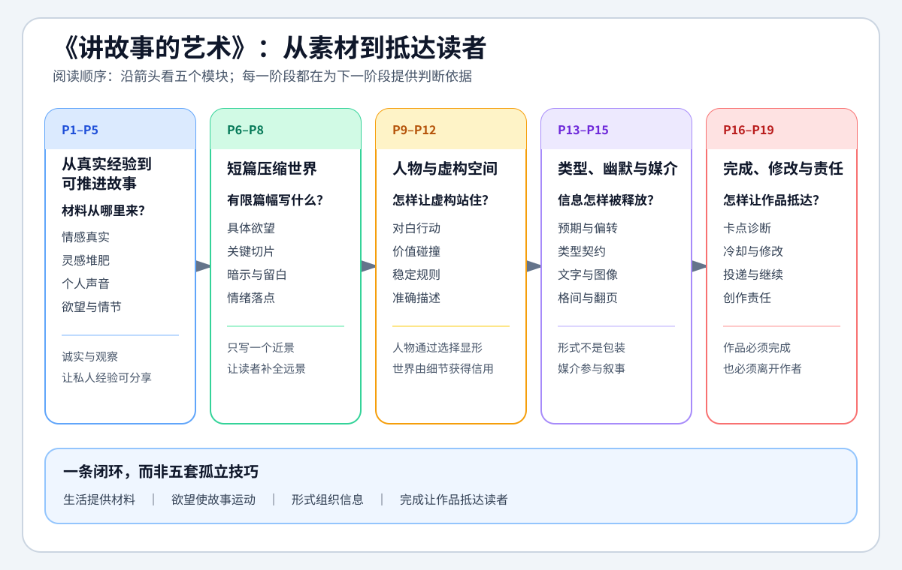

# 讲故事的艺术 - 课程总览

> 本页只回答“整门课分成哪些模块、每一课讲什么、该从哪里进入”。跨课整合后的方法见 [[讲故事的艺术|统一知识总结]]，时间线和讲者案例保留在各课原笔记中。

## 课程入口

- [打开 Bilibili 课程](https://www.bilibili.com/video/BV1FR4y1M73U?p=1)
- [[讲故事的艺术|统一知识总结]]：集中复习从真实经验到完成、修改和承担创作责任的写作闭环。
- 当前范围：P1-P19，共十九节完整课程。
- 信息来源：本地 `faster-whisper base.en` 英文 ASR、十九篇现有课级笔记与 Bilibili 页面；不是官方逐字稿，专名和逐字引文仍应回看原视频。
- 本轮复核：重新读取 P1-P19 的迁移前原始英文 ASR，保留课级时间线，重写跨课提炼，并把“来源原意”与“编剧化解释”分开。
- 原始材料边界：历史音频、ASR 和元数据只作本机核对证据，不搬入便携 Vault；Vault 内继续保存可追溯的课级学习笔记。

阅读这张图时先沿五个模块横向看，再注意它们并不是五套孤立技巧：前四课提供素材与诚实，P5-P15 把素材变成叙事，P16-P19 负责完成、修改、交付与责任。

## 课程矩阵

| 模块 | 课次 | 视频 | 本课解决的问题 | 详细笔记 |
|---|---:|---:|---|---|
| 从真实经验到可推进故事 | 第1课 | P1 | 怎样把课程理解为一组有用途和边界的写作工具 | [[01 - 第一课 课程介绍（P1）|打开本课]] |
| 从真实经验到可推进故事 | 第2课 | P2 | 虚构事实不存在时，作品怎样仍让读者感到真实 | [[02 - 第二课 虚构中的真实（P2）|打开本课]] |
| 从真实经验到可推进故事 | 第3课 | P3 | 怎样通过长期输入、观察和碰撞主动获得灵感 | [[03 - 第三课 灵感的来源（P3）|打开本课]] |
| 从真实经验到可推进故事 | 第4课 | P4 | 怎样让个人声音从模仿、试错和完成中显露 | [[04 - 第四课 寻找你的风格（P4）|打开本课]] |
| 从真实经验到可推进故事 | 第5课 | P5 | 点子怎样通过欲望、冲突和 aboutness 展开成情节 | [[05 - 第五课 故事情节的展开（P5）|打开本课]] |
| 短篇怎样压缩世界 | 第6课 | P6 | 开篇怎样同时建立威胁、欲望、规则和全书承诺 | [[06 - 第六课 案例分析之《坟场之书》（P6）|打开本课]] |
| 短篇怎样压缩世界 | 第7课 | P7 | 怎样用一个关键切片暗示完整人生与更大世界 | [[07 - 第七课 短篇小说（P7）|打开本课]] |
| 短篇怎样压缩世界 | 第8课 | P8 | 怎样把巨大背景藏进小场景与人物余震 | [[08 - 第八课 短篇小说案例分析之《三月童话》（P8）|打开本课]] |
| 人物声音与虚构空间 | 第9课 | P9 | 对白怎样承担目标、关系、信息和潜台词 | [[09 - 第九课 对白与角色（P9）|打开本课]] |
| 人物声音与虚构空间 | 第10课 | P10 | 人物变化怎样从价值系统碰撞中自然发生 | [[10 - 第十课 角色塑造案例分析《十月童话》（P10）|打开本课]] |
| 人物声音与虚构空间 | 第11课 | P11 | 虚构世界怎样可信又不被设定说明压住 | [[11 - 第十一课 构建世界（P11）|打开本课]] |
| 人物声音与虚构空间 | 第12课 | P12 | 描述怎样同时建立空间、情绪和人物视点 | [[12 - 第十二课 描述（P12）|打开本课]] |
| 类型、幽默与媒介 | 第13课 | P13 | 幽默怎样由预期、节奏和人物认真程度产生 | [[13 - 第十三课 幽默（P13）|打开本课]] |
| 类型、幽默与媒介 | 第14课 | P14 | 怎样理解并偏转作者与读者之间的类型契约 | [[14 - 第十四课 题材类型（P14）|打开本课]] |
| 类型、幽默与媒介 | 第15课 | P15 | 漫画怎样利用文字、图像、格间和翻页叙事 | [[15 - 第十五课 漫画（P15）|打开本课]] |
| 完成、修改与责任 | 第16课 | P16 | 写不下去时怎样诊断真正卡点并继续推进 | [[16 - 第十六课 写作困境（P16）|打开本课]] |
| 完成、修改与责任 | 第17课 | P17 | 第一稿完成后怎样以读者状态修改作品 | [[17 - 第十七课 编辑修改（P17）|打开本课]] |
| 完成、修改与责任 | 第18课 | P18 | 怎样把创作变成可重复的职业行动循环 | [[18 - 第十八课 作家的规则（P18）|打开本课]] |
| 完成、修改与责任 | 第19课 | P19 | 作家怎样承担对人物、读者和价值的责任 | [[19 - 第十九课 作家的责任（P19）|打开本课]] |

## 按模块与每课导览

### 模块一：从真实经验到可推进故事｜P1-P5

**模块主线**：写作不是等待天赋，而是用诚实、观察、积累和完成能力，把私人经验转成读者愿意追问的故事。

- [[01 - 第一课 课程介绍（P1）|P1 课程介绍]]：把课程定义为写作者的工具棚，建立“写作是一门可练习手艺”的总框架。
- [[02 - 第二课 虚构中的真实（P2）|P2 虚构中的真实]]：虚构事实可以不存在，但人物情感与人生经验必须真实。
- [[03 - 第三课 灵感的来源（P3）|P3 灵感的来源]]：灵感来自长期堆肥、跨领域吸收和两个旧元素的碰撞。
- [[04 - 第四课 寻找你的风格（P4）|P4 寻找你的风格]]：个人声音不是先设计的标签，而是在模仿、犯错和完成中逐渐显露。
- [[05 - 第五课 故事情节的展开（P5）|P5 故事情节的展开]]：用“然后发生什么”、人物欲望、障碍和代价建立持续推进。

### 模块二：短篇怎样压缩世界｜P6-P8

**模块主线**：短篇不是长篇缩小版，而是选择一个关键切片，让具体欲望、有限细节和情绪落点暗示更大世界。

- [[06 - 第六课 案例分析之《坟场之书》（P6）|P6 《坟场之书》]]：让每个登场者都有具体欲望，开篇冲突便会自然发生并建立全书承诺。
- [[07 - 第七课 短篇小说（P7）|P7 短篇小说]]：用压缩、暗示和一个清楚的转折或发现完成近景魔术。
- [[08 - 第八课 短篇小说案例分析之《三月童话》（P8）|P8 《三月童话》]]：把巨大背景藏进一个小场景、天气、身份余震和双层真话中。

### 模块三：人物声音与虚构空间｜P9-P12

**模块主线**：人物通过语言和选择显形，世界通过稳定规则和少数真实细节站住，描述则负责控制注意力与情绪。

- [[09 - 第九课 对白与角色（P9）|P9 对白与角色]]：对白就是人物行动，要压缩现实噪音，同时保留每个人独有的节奏、词汇和回避方式。
- [[10 - 第十课 角色塑造案例分析《十月童话》（P10）|P10 《十月童话》]]：让一个依赖既定规则的人遇到拒绝规则的人，价值系统的摩擦会迫使角色改变。
- [[11 - 第十一课 构建世界（P11）|P11 构建世界]]：世界构建追求可信而非设定数量，少数具体细节和稳定规则可以撑起未写出的远景。
- [[12 - 第十二课 描述（P12）|P12 描述]]：只描述值得读者注意的差异，让准确细节同时交代空间、情绪和人物感受。

### 模块四：类型、幽默与媒介｜P13-P15

**模块主线**：形式不是包装。类型管理读者期待，幽默利用预期偏差和节奏，漫画通过页、格、留白和协作重新分配信息。

- [[13 - 第十三课 幽默（P13）|P13 幽默]]：幽默来自识别后的轻微偏转与张力释放，也可以承担节奏和伏笔功能。
- [[14 - 第十四课 题材类型（P14）|P14 题材类型]]：类型是作者与读者之间的契约，先理解承诺，才能有效满足、延迟或反转期待。
- [[15 - 第十五课 漫画（P15）|P15 漫画]]：漫画叙事发生在文字、图像、格间空白和翻页之间，脚本首先是一封给合作者的工作信。

### 模块五：完成、修改与责任｜P16-P19

**模块主线**：卡住是故事发出的诊断信号；先完成可修改的初稿，再通过冷却、主题判断和反馈进入持续写作循环。

- [[16 - 第十六课 写作困境（P16）|P16 写作困境]]：从卡点向前回溯，检查视角、人物选择和被回避的情绪区域，而不是把困难判断成人格失败。
- [[17 - 第十七课 编辑修改（P17）|P17 编辑修改]]：第一稿负责存在，第二稿重新理解作品；反馈最可信的是问题位置，不一定是别人给的解法。
- [[18 - 第十八课 作家的规则（P18）|P18 作家的规则]]：写、写完、送出、面对拒绝、开始下一篇，让职业写作成为可重复的行动循环。
- [[19 - 第十九课 作家的责任（P19）|P19 作家的责任]]：责任不是说教，而是诚实、有趣地表达价值，同时公平对待不同人物并继续生活和观察。

## 已沉淀到知识树

- [[知识库/学习区/综合整理/01-故事与剧本/从灵感到完整故事]]：补入虚构真实、灵感堆肥、个人声音与欲望推进。
- [[知识库/学习区/综合整理/01-故事与剧本/从人物共情到人物弧光]]：补入 want／策略／need 的层级、非自觉需要、对白声音、反常相遇和不同幅度的人物变化。
- [[知识库/学习区/综合整理/01-故事与剧本/用描述与世界构建让虚构可信]]：整合世界规则、真实细节、感官描述和注意力控制。
- [[知识库/学习区/综合整理/01-故事与剧本/短篇、类型与媒介的叙事选择]]：整合短篇压缩、类型契约、幽默节奏和漫画媒介。
- [[知识库/学习区/综合整理/01-故事与剧本/从写作困境到编辑完成]]：整合卡点诊断、修改、反馈、投递和创作责任。

## 后续维护

- 新增同课程材料时先判断它属于哪个真实课次或模块，再更新本页和统一总结。
- 十九篇课级正文继续作为来源证据保存；新增内容仍按真实课次整理，不按视频时长机械合并。
- 需要复习具体案例和时间点时进入分集；需要调用方法时进入统一总结或主题笔记。
