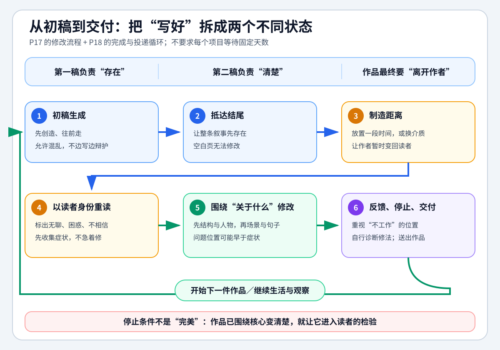

# 讲故事的艺术 - 第十七课 编辑修改

> 导航：[[知识库/学习区/课程/讲故事的艺术/00 - 课程总览|课程总览]]｜[[讲故事的艺术|统一知识总结]]

视频：[P17 编辑修改](https://www.bilibili.com/video/BV1FR4y1M73U?p=17)。本课谈完成初稿之后如何重读、判断主题、处理反馈，以及追求完美怎样妨碍交付与继续创作。

## 本课速览

先创造，再回来看什么有效。以读者身份留下的边注，以及读完后对“这个故事到底讲什么”的回答，共同帮助作者修改第二稿。别人的阅读感受值得认真接受，他们提出的修法则要另作判断；追求完美可以指引创作，却不能成为永不开始或永不交稿的理由。

## 来源可靠性

- 对应 BV1FR4y1M73U、P17、CID 498726708，约11:26。完整阅读00:07–11:25英文ASR，并核看全课范围的中英文字幕、章节卡和结尾。片头中文“写作困境”与英文 Editing 不一致；本课身份以分P目录、CID及实际编辑修改内容核对。
- 未听审原声、未连续审看。上色师经历按盖曼课堂回忆保存，不把历史轶事扩展成新的职业史结论。[本课来源复核记录](../../../../../evidence/sources/bili-BV1FR4y1M73U-p17/review.md)。原有个人文字及旧稿扩展另存于 [[讲故事的艺术 - 第十七课原有学习记录]]。
- 文末保留一幅既有整理图，与原课讲述分列；它不是本课板书，也不能替代课程中的条件与例外。

<!-- source-evidence: bili-BV1FR4y1M73U-p17 -->

## 分集脉络

00:07 创造与修复 → 01:12 放下后以读者身份重读 → 02:49 应当补写的战斗 → 03:49 用“关于什么”决定第二稿删留 → 06:17 阅读感受与修改建议 → 07:39 完美主义与未交出的色稿 → 09:33 空白无法修，继续写才保有机会。

## 时间线笔记

### 先让故事发生，再看它怎样起作用（00:07–01:12）

盖曼把艺术创作、尤其写作，简要分为两个过程：创造，然后修复或编辑。他把最初写故事比作爆炸——让故事在纸上炸开，一直写到结尾。

等它完成，才可以绕着它走一圈，看看弹片、造成的破坏、谁死了，以及整场爆炸怎样发生作用。这是他形容回看作品的比喻：此时开始思考哪些部分有效、哪些部分没有奏效，进入另一种工作状态。

### 放下作品，认真假装自己第一次读它（01:12–03:49）

写完短篇、长篇或剧本后，如果条件允许，盖曼会先放下它，去做其他事。可能过一周，也可能过十天，再打印出来重读。这是他自己的做法，原话带着“如果可以”的条件，不是所有项目都必须等待的固定天数。

回来时，他会像方法派演员一样认真进入一个假设：自己从未读过，对作品一无所知，把进入这种状态当成非常重要的事，尽力以读者的身份阅读。他觉得，这种假装随着时间推移，对自己越来越容易。

他打印出来的直接理由是便于拿笔作边注。自己既不故意恶毒，也不刻意残酷，只作为读者，把任何读起来不成立的地方记在页边。作者与读者暂时被当作两个人，最后这些阅读笔记会成为第二稿、编辑与修补的主要依据。

战斗的例子显示两种身份如何不同。写作时，作者可能想：不必把整场战斗写出来，只暗示它正在发生，读者应该不会介意。但重读时，读者会发现前文一直在把自己引向这场战斗，自己期待的正是它，作品却把它略掉了。于是边注要写“需要一场战斗”。这里需要补写的依据是前文建立的期待，并不是所有战斗都必须完整描写。

### 第二稿的关键尺度：这个故事到底讲什么（03:49–06:17）

盖曼再次提到带着新眼光读完第一稿，并增加一个关键问题：这个故事到底是关于什么的？第一稿与第二稿的差别有时很小，但走到第二稿非常重要；弄明白故事的核心，才知道该加强什么、去掉什么。

写完后，作品真正讲的东西，可能不是作者出发时以为的那个主题，或原先的设想只占其中一部分。此时，一段自己很喜欢的情节也可能明显与作品真正的核心无关。可以剪掉它，存进专门保存将来或许有用材料的文件。明确了取舍依据，放开那一段就不必等于否定它本身的一切价值。

相反，初稿有些地方当时没完全想清楚，却已经碰到了主题。现在知道作品究竟讲什么，就可以把这些地方做得更强、更稳。第二稿的过程，是让作品看起来像作者从一开始就知道自己在做什么；它既包括删去不相关的部分，也包括加固已经出现的核心。

### 接受阅读感受，独立判断原因与修法（06:17–07:39）

别人告诉你作品对他们不奏效时，盖曼认为他们是对的：它的确没有对那位读者奏效。这是很重要的信息，需要相信并接受。这里确定的是阅读体验本身，而不是读者已经准确定位了客观问题。

但当对方进一步说哪里错了、该怎么改，他的经验是这些判断几乎总会出错。他也明确留了例外：有时候对方确实给出一个好办法，让作者觉得受益、想道谢。因此不能把本课压成“读者的建议一律不听”。

通常，更重要的是先收下“这里对你不成立”的反馈，再自己找原因。问题经常出在更早的文字里：有时需要删掉某个东西，有时需要补写一段，把后来的事情预先建立起来。解决位置不一定就是读者感到问题的位置。

盖曼最后重申，要完全接受有人读着不成立这件事，却不要把它自动当作更多的结论。若照着对方指定的方向一路改，可能会写成对方的故事；作者仍需要写自己的故事。这不是否认反馈，而是保留解决问题的创作判断。

### 完美的样张没有交出，机会也就过去了（07:39–09:33）

盖曼回忆，早年做《睡魔》时，想请 Steve Whitaker 上色；课堂谈起时，他也提到 Steve 已去世。他称赞 Steve 是很好的画师和上色师，曾为《V for Vendetta》上色，同时也是完美主义者。盖曼给他几页黑白画稿，只要给其中几页上色，交给编辑看看能胜任，这个工作机会就可以落实。

Steve 曾把一些完成的页面给盖曼看，已经很漂亮。盖曼催他寄出，他却说还不到时候，还不够对、不够完美。结果这些页面始终没有交到编辑那里，DC 另找了上色师。案例中的问题不是没有能力或没有作品，而是完成到可供他人判断的东西一直没有送出。

由此，盖曼说完美在这个世界里并不存在。它可以是理想、目标，是前方的山、山上闪耀的水晶城；但自己做出的东西总会含有错误和失误。不能因此害怕，或让行动被彻底阻住。原课保留了对更好作品的追求，也承认现实作品难免有缺点。

### 写出来，才有东西可修，也才保有意外的好结果（09:33–11:25）

已经写出的东西能够改善：不成立的短篇、不够好的对白、一个有问题的开头，都能修。空白纸却没有办法修，虚无也无从修改。所以需要勇敢开始，让过程带自己向前，同时接受有时会撞到礁石、作品就是不奏效。

即使坐在讲师的位置，盖曼仍不确定自己是否比三十多年前刚起步时，更清楚究竟在做什么。他知道写出的作品会有高下，但未必总能解释为什么。因此，他需要对创作过程保有信心。

他的理由不是“写了就一定成功”，而是如果不写，那个故事根本没有机会成为好作品、被人喜爱、获奖、出名，或成为在公开朗读中受到欢迎的作品。不写，它永远不可能成为这些东西。

同样，如果只盯着某些作品的不足，反复想“原本是那么好的点子，怎么写出来没有魔法”，也会关闭另一种可能的门：写出一个自己事先没想到会如此美丽的故事。结尾把问题从修好眼前这一篇，推进到是否还允许自己继续创作、遇见无法预先保证的好结果。

## 本课方法与未讲部分

课中明确给出了放下再重读、页边注、读完问核心、按核心删留、无关好片段另存，以及区别阅读感受与修法的建议。没有另布置“删三个桥段”等定量练习，没有给出相应标准答案，也没有规定所有作品都要按“结构、人物、场景、句子”四层顺序修改。

## 既有整理图（非原课图示）

这幅旧图把 P17 的修改与 P18 的完成、送出、继续写组合成一个整理流程，原文件和链接保留。“先结构与人物，再场景与句子”“换介质”等属于整理者扩展；图中“重视位置”应结合本课理解为重视读者的真实反应，不保证根因就在那个位置。图末的交付停止条件也不是讲师在本课给出的统一验收标准。

## 主题沉淀

保留既有链接：[[知识库/学习区/综合整理/01-故事与剧本/从写作困境到编辑完成]]。本次未改写该主题。
