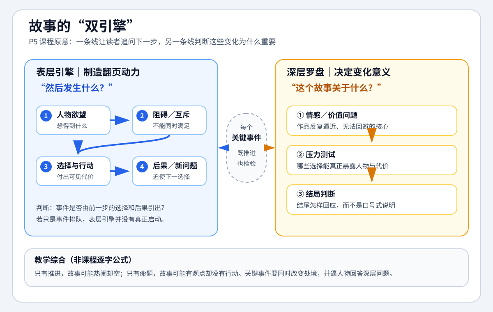

# 讲故事的艺术 - 知识总结

> 导航：[[知识库/学习区/课程/讲故事的艺术/00 - 课程总览|先看五个模块和十九节课]]。本页只整合跨课可复用知识，不重复逐集时间线和讲者案例全文。

## 材料简介

来源：[打开 Bilibili 课程](https://www.bilibili.com/video/BV1FR4y1M73U?p=1)  
讲者：尼尔·盖曼（Neil Gaiman）  
当前范围：P1-P19  
信息来源：本地 `faster-whisper base.en` 英文 ASR、十九篇中文课级笔记与 Bilibili 页面  
可靠性边界：不是官方逐字稿。概念和时间锚点已回到英文 ASR 复核；专名、标点与逐字引文仍以原视频为最终依据。  
本轮处理：保留十九课的来源顺序，重写跨课模型，新增原文证据索引和教学图；课程原意、编剧化提炼与本地知识树关联分别标示。  

## 速览

- 核心问题：写作者怎样从真实经验和灵感出发，选择合适形式，完成故事，并通过修改与持续行动把作品交给读者。
- 主要结论：故事的事实可以虚构，情感必须诚实；技艺的核心不是背规则，而是在欲望、形式、细节、节奏、完成和修改之间作出判断。
- 学习价值：把“有灵感但写不完”“作品不可信”“不知道怎样改”等模糊困难，拆成可执行的写作环节。
- 适用环节：灵感与命题、故事骨架、人物与世界深化、形式选择、初稿诊断、修改和复盘。

## 分章节／分集导览

- `P1-P5`｜从真实经验到可推进故事：写作工具、虚构真实、灵感堆肥、个人声音、欲望与情节。
- `P6-P8`｜短篇怎样压缩世界：具体欲望、关键切片、暗示和情绪落点。
- `P9-P12`｜人物声音与虚构空间：对白、价值碰撞、世界规则和感官描述。
- `P13-P15`｜类型、幽默与媒介：读者契约、预期偏差、页格与协作。
- `P16-P19`｜完成、修改与责任：卡点诊断、冷却重读、反馈、投递和持续生活。

## 课程核心命题

写作是一门由诚实和判断共同支撑的手艺。生活、阅读和观察提供素材，人物欲望让素材开始运动，形式与媒介决定信息怎样释放，完成和修改让模糊直觉变成可交付作品；所谓作家责任，是在这个过程中尽可能诚实、精彩，并公平对待人物与读者。

## 原文证据与提炼边界

下面的“讲者命题”是对原视频内容的压缩转述，“本笔记提炼”是为了影视创作调用而做的二次组织；后者不是盖曼在课程中提出的一套正式命名模型。

| 课次 | 原文锚点 | 讲者命题 | 本笔记提炼 |
|---:|---|---|---|
| P1 | `02:55-04:21` | 课程像写作者的工具棚：认识工具、用途与陷阱 | 技巧是条件化工具，不是统一公式 |
| P2 | `00:35-01:18`、`07:44-07:58`、`10:24-10:46` | 虚构用不存在的人和事传递真实；勇敢是在害怕时仍做正确的事；小说应尽可能诚实 | 事实真实与情感真实分开处理 |
| P3 | `00:07-01:06`、`12:27-12:57` | 素材像堆肥；点子常来自两个旧事物汇合 | 输入系统既要长期积累，也要跨领域碰撞 |
| P4 | `01:25-03:50`、`06:19-08:13` | 模仿和犯错是起点；完成失败作品比只写漂亮开头学得更多 | 风格是完成大量作品后显露的稳定偏差 |
| P5 | `01:19-04:44`、`09:02-13:34`、`16:16-18:14` | 故事让人追问“后来呢”且不在结尾受骗；要知道故事关于什么；欲望与需要在机械情节之下驱动故事 | 表层追问、深层命题与人物必然性共同约束情节 |
| P6 | `00:08-00:22`、`05:28-08:04` | 《坟场之书》开篇由多个人物互不相容的欲望推动 | 小欲望发生碰撞，也能同时建立威胁、规则和后续问题 |
| P7 | `00:00-00:44`、`06:15`、`10:52-11:17` | 短篇像近景魔术，像“未写小说的最后一章”，通常只需围绕一件事 | 用最小可见切片暗示更大人生与世界 |
| P8 | `03:08-08:56`、`09:03-14:51` | 《三月童话》用小场景折叠未写人生；扩成长篇时先找 aboutness，再让选择逐步关闭分岔路径 | 短篇靠切片压缩，长篇靠人物、主题和前序选择收窄后续可能性 |
| P9 | `01:22-05:09`、`18:34-21:34` | 人物与对白不可分；真实讲话要压缩；多人需要可辨认差异 | 对白是带目标的语言行动，声音差异必须落到词汇、节奏与回避方式 |
| P10 | `00:07-00:11`、`07:24-15:52` | 人物可在行动和陌生情境中显形；Hazel 不许愿却仍获得关系，精灵的身份和态度也改变 | 不想要类型预设之物不等于没有需要；关系摩擦会产生不同幅度的变化 |
| P11 | `00:06-03:43`、`08:13-09:52` | 世界构建从现实细节与规则出发；作者知道得比写出的多 | 用稳定规则和少数可信支点替代百科式倾倒 |
| P12 | `01:02-01:42`、`05:53-08:35` | 不必迷信“只展示不讲述”；描述应抓住不同之处并调用感官 | 描述是注意力分配，不是物件清单 |
| P13 | `00:33-00:59`、`05:20-10:02` | 幽默来自识别、偏转、词序和张力释放，也可在后文回收 | 把笑点分为局部节奏与结构回收两种职责 |
| P14 | `02:53-07:43`、`08:39-11:55` | 类型由读者期待定义；先知道圆圈与规则，再选择打破 | 类型是体验契约，创新必须让回看仍公平 |
| P15 | `04:07-09:18`、`12:09-17:19`、`22:34-23:47` | 漫画以页、格、静默和翻页组织信息；脚本是给合作者的信；技术最终要回答为何在乎 | 媒介改变叙事单位，情感核心决定技术取舍 |
| P16 | `01:23-03:15`、`04:08-06:22`、`12:39` | 卡点常在更早处；需要离开、重读、重算人物需要和视角；长篇像雾中驾驶 | 把“写不出”改写成可定位的因果、视角或诚实问题 |
| P17 | `00:07-06:17`、`08:10-10:40` | 第一稿创造，第二稿修复；冷却后以读者身份重读；相信读者“不奏效”的体验，但不盲从修法；完美不存在 | 修改先重识作品，再诊断症状位置与根因，最后才细修表达 |
| P18 | `00:32-03:24`、`07:47-12:16` | 写、写完、送出、继续送、写下一篇；坏日子与好日子最终混在同一成稿里 | 完成与交付是写作能力的一部分，不是创作后的行政步骤 |
| P19 | `01:31-04:16`、`04:52-07:28` | 作家要讲好且诚实的故事，把可承担的价值放进去；同时要写、完成；没东西可说时回到生活 | 影视化提炼：让价值进入人物、选择和后果，并持续观察现实 |

> [!warning] 证据边界
> 时间锚点来自本地英文 ASR。它足以支撑内容定位，不等同于官方英文逐字稿；涉及精确措辞时，只保留短引文并回到视频复核。

## 从真实经验到可推进故事

### 虚构真实

- 虚构人物和事件可以不存在，但恐惧、欲望、羞耻、勇气和代价必须让读者感到真实。
- “真实”不是照搬自传，而是从私人经验中提炼情感核心，再让虚构行动承载它。
- 越具体、越诚实的细节，越可能触及普遍经验；抽象口号反而容易隔开读者。

### 灵感堆肥

- 把阅读、音乐、新闻、神话、童年记忆、陌生人和尴尬经验都放进素材库，不急着立刻使用。
- 不要只摄入同类型作品，否则容易写出二手想象。
- 好点子经常来自两个旧元素的碰撞，或从熟悉故事里找到一个被忽略的不合理处。

### 个人声音

- 风格不是预先贴上的标签，而是大量模仿、犯错和完成之后仍无法隐藏的观看方式。
- 同一个作者的不同项目也需要不同声音；声音服务故事，而不是反过来证明作者独特。
- 完成一篇有缺陷的作品，比保存一个永远完美的片段更能训练结构判断。

### 欲望发动情节

- “然后发生什么”负责表层推进，“这个故事关于什么”负责深层判断。
- 情节来自人物的具体欲望、阻碍和互斥目标，不是事件排队。
- 人物想要的东西与故事要求他面对的需要可以不同；这个差距为变化、反讽、惩罚和结尾提供空间。

### 想要、手段与需要

P5 结尾的短引文是：“Characters always, for good or for evil, get what they need; they do not get what they want.” 这里最容易出现两个误读。

第一，不要把目标和手段混成同一个 want。人物“要救回妻子”是目标，“筹钱或找药”通常是策略；策略受阻后可以更换，目标才是持续行动线。第二，不要把 need 固定理解成温柔的自我成长。P6 中婴儿需要照料，这是客观生存条件；P16 又说明，就连糟糕人物也得到其需要，有时结果本身很可怕。因此 need 更准确地指：**由人物处境、选择和故事价值共同积累出的必要遭遇**，可能是承认、能力、关系修复，也可能是失去、惩罚、暴露或崩塌。

对影视编剧最有用的不是背这句格言，而是把它变成四个问题：

1. 人物自觉追逐的总目标是什么？
2. 他当前使用的策略是什么，受阻后怎样升级或更换？
3. 哪个未被承认的缺口、错误信念、客观条件或必然后果在深层制约他？
4. 高潮中的不可兼得选择，怎样用行动回答“他最终成为什么人或承担什么结果”？

你的“丈夫想筹钱救妻子，却最终学会理解和陪伴”这一思路方向正确，但还需两步专业校正：筹钱是手段，救妻子才是目标；妻子不能只是供丈夫成长的道具，她也应有自己的目标、意愿和选择。只有当丈夫失去钱或治疗机会与他倾听妻子、尊重其决定之间存在明确因果，并由双方行动付出代价时，结尾才是人物弧光，而不是作者在最后加的一层道理。

## 短篇的压缩方法

1. 选择一个关键时刻、发现或转折，不试图讲完整人生。
2. 让人物在当下有具体欲望，场景便能自然产生冲突。
3. 用少数细节暗示故事之外还有更大世界，不进行百科式解释。
4. 把背景藏进天气、动作、称呼、物件和双层真话，让读者主动补全。
5. 结尾可以保留秘密，但必须形成明确的情绪落点或认知变化。

《坟场之书》开篇证明，多个人物的具体欲望一碰撞，威胁、规则和全书承诺就会同时成立；《三月童话》则证明，大事件可以留在背景，只写它多年后留下的余震。

这张图是本笔记的教学隐喻，不是盖曼在课上给出的固定术语。它强调：短篇不靠删成梗概，而靠选择一个能让未写人生继续“施压”的关键切片。

### 从短篇种子到必然结局

P8 的后半不是继续分析短篇余味，而是现场推演：如果把《三月童话》扩成长篇，现有角色和设定仍不够。要先判断故事 aboutness，再引入来自过去的先兆和更大的真实威胁，把女儿置于风险中，迫使 Anne 重新调用被压下去的能力。这些仍只是“应该发生”的候选，不等于完整 plot。

课程随后提出一个明确比喻：开头有近乎无限的分岔，每个词、决定和事件都会关闭部分路径；到四分之三处，只应剩少数仍与人物、主题和类型承诺一致的结局。所谓必然结局，不是作者一开始锁死答案，而是前文选择逐步排除不诚实的答案。

## 人物、对白与价值碰撞

- 对白不是作者写给角色的漂亮句子，而是人物带着目标进行的语言行动。
- 文学对白要压缩现实中的重复和噪音，同时保留人物独有的句长、词汇、误解和回避方式。
- 多人场景可以遮住名字检查：如果仍能辨认说话者，人物声音才真正分开。
- 角色既来自作者内部，也需要通过必要研究获得职业、文化和身份可信度；共情不能替代事实，资料也不能替代想象。
- 反常相遇能迅速制造角色变化：一个依赖既定规则的人，遇到拒绝规则的人，他的身份和惯用权力就会失效。

《十月童话》中，许愿精灵遇到不想许愿的 Hazel。冲突不靠打斗，而靠两个价值系统的摩擦。Hazel 的核心价值保持稳定，但关系与生活状态改变；精灵的惯用身份、态度和满足方式发生更明显变化。课程结尾还说明，Hazel 不需要三个愿望，却仍缺少一个可以爱的人——“不想要某物”并不等于“没有任何需要”。

## 让虚构世界站住

### 世界构建

- 世界构建的目标是可信，不是展示设定数量。
- 作者应知道得比读者多，但只写当前行动需要的规则和细节。
- 规则可以奇怪，却必须稳定；规则通过人物犯错、受阻和付出代价被读者理解。
- 一个可信地点、生活习惯或材质细节，可以像肥皂泡支点一样撑起周围未写出的远景。

### 描述

- 不描述所有东西，只描述值得读者注意、能够改变感受或判断的差异。
- 一个准确细节胜过一串泛泛形容词。
- 描述要一笔多用，同时承担空间、情绪、视点、人物状态或伏笔中的至少一项。
- 直接讲述不是低级做法；真正需要判断的是它是否服务节奏和理解。

## 形式与媒介怎样参与叙事

### 幽默

幽默常来自熟悉模式的轻微偏转和紧张后的释放。角色越认真，处境越荒诞；笑点的词序、停顿和重复都参与节奏，但并非每个重复笑点都必须结构回收。课程中 `figgin` 是后来产生 payoff 的例子，`sherbet lemon` 和《Anansi Boys》的青柠则可以只为好玩、没有回收。

### 类型

类型是作者与读者之间的体验契约。作者需要知道传统承诺和节拍，再决定满足、延迟、偏转或反转。惊喜不能以欺骗为代价，打破规则前要先理解读者为何带着这条规则进入故事。P14 所说“给观众想要／需要的体验”讨论的是类型期待，不等于 P5、P16 的人物 want／need。

### 漫画

漫画的意义发生在文字、图像、格间空白、整页布局和翻页之间；脚本首先是给画师等合作者的工作信，必须同时考虑情感核心与可执行信息。盖曼在课上明确说漫画脚本写法因作者而异，24 页小册子和缩略图是他展示的个人方法，不是通用格式规范。“不是带图小说或电影分镜替代品”是本笔记对媒介差异的概括，并非原句。

## 从卡住到完成

### 诊断卡点

1. 不把“写不下去”判断成人格失败，把它视为故事发出的报警。
2. 从开头读到卡点，寻找最早失去信任、走错方向或回避情绪的位置。
3. 检查作品是否写得太浅、回避真正痛处，或当前视角无法承载这个故事。
4. 尝试改变视角、回到岔路口，或进入自己不愿触碰的情绪区域。
5. 长篇像在雾中驾驶，不要求一次看见终点，只要求下一小段路可信。

### 修改初稿

- 第一稿负责存在，第二稿负责让作品变得清楚。
- 完稿后留出冷却期，以读者状态重读，而不是边生成边辩护。
- 先判断作品“真正关于什么”，再决定结构上的保留、删减和重排，最后才细修句子。
- 反馈中最可信的是读者确实感到无聊、困惑或不相信；他标出的具体位置、推断的根因和提出的解法仍需要作者重新诊断，偶尔也可能正确。
- 完美不存在。空白页无法修改，有缺陷的完整稿可以继续工作。

### 职业循环与责任

- 写、写完、送出、面对拒绝、继续送出，并开始下一件作品。
- 好日子和坏日子最后都会进入同一个成稿，持续行动比等待稳定情绪更可靠。
- 课程原意：责任包括讲好且诚实的故事、放入作者相信的价值，同时容纳其他观点并公正对待人物。本笔记进一步把它影视化为“让价值进入行动和后果”，这一机制属于应用提炼，不是讲者原术语。
- “去生活”是盖曼给一位已经能写、能完成、但没东西可说的年轻作者的针对性建议，不是要求所有写作者必须失业、失恋或受伤；可迁移的原则是继续观察和经历现实。

## 一套可调用的写作闭环

1. **收集**：持续积累跨领域素材和真实经验。
2. **命题**：找出最不愿回避的情感、恐惧或价值问题。
3. **发动**：为人物写出具体欲望、阻碍、行动和代价。
4. **选择形式**：判断故事更适合短篇、长篇、类型变体、漫画或其他媒介。
5. **建立可信度**：区分人物声音，固定世界规则，选择能一笔多用的细节。
6. **完成初稿**：允许不完美，先让整条叙事存在。
7. **冷却与诊断**：从主题、结构、人物和读者困惑位置重读。
8. **修改与交付**：修复问题，接受作品不完美但可完成，送给读者或合作者。
9. **继续生活与写作**：把结果、拒绝和新经验重新放回素材堆肥。

## 案例索引

| 案例 | 说明的问题 | 详细来源 |
|---|---|---|
| 《卡洛琳》 | 虚构承载真实；勇敢是在恐惧中行动 | [[02 - 第二课 虚构中的真实（P2）]] |
| 《坟场之书》 | 多人物欲望碰撞；世界规则与开篇承诺 | [[06 - 第六课 案例分析之《坟场之书》（P6）]]、[[11 - 第十一课 构建世界（P11）]] |
| 《三月童话》 | 短篇压缩；大背景藏进小场景和双层真话 | [[08 - 第八课 短篇小说案例分析之《三月童话》（P8）]] |
| Delirium | 人物声音需要试错，声音错了人物就无法成立 | [[09 - 第九课 对白与角色（P9）]] |
| 《十月童话》 | 反常相遇与价值系统碰撞推动角色变化 | [[10 - 第十课 角色塑造案例分析《十月童话》（P10）]] |
| 《睡魔》与漫画工作 | 类型期待、页格节奏和跨岗位协作 | [[14 - 第十四课 题材类型（P14）]]、[[15 - 第十五课 漫画（P15）]] |

## 适用边界

- 课程来自小说家和漫画作者的职业经验，不是电影编剧结构的完整替代；进入影视剧本时仍要补足场景行动、可拍信息和制作约束。
- “相信人物”“听见角色声音”不是放弃结构，而是要求大纲接受人物真实欲望的校正。
- “做自己”“寻找声音”不等于拒绝研究和修改；个人表达、事实准确和读者理解要同时成立。
- “人物最终得到需要而非想要”应作为结局诊断镜头，而不是所有作品的强制公式。稳定人物、开放式结局、负弧光和某些荒诞叙事可能有意不提供正向整合；关键仍是结果与前文人物选择和作品承诺一致。
- 课程中的短篇、小说和漫画案例可以启发影视，但文字叙述声音、内心进入方式、页格和翻页不能未经转译直接当成镜头方法。
- P18 的“写完—送出—再送—写下一篇”来自个人作者与出版投稿语境；进入影视行业时需要换成对应的版本、制片开发和提交流程，也不保证作品会被采用。
- P19 给出的是盖曼本人选择承担的创作责任，不是关于作者如何为全部现实后果负责或免责的一套完整理论；“让价值进入人物选择和后果”属于本笔记影视化提炼。

## 本地知识树关联（非原课程内容）

- 与查理老师课程相比，本课程更强调诚实、声音、媒介与职业过程；查理老师课程更强调八要素、结构关节和事件化。两者在欲望推动、行动证明和完成后修改上形成互证。
- 本轮把课程提炼成“双引擎”“三层 want/strategy/need”和“完成与修改闭环”，目的是便于影视创作调用；这些名称属于本地综合，不是盖曼课程的原始术语。

## 可实践练习

1. 从一个真实恐惧写出一个完全虚构的 500 字故事，只保留情感真实性。
2. 为当前故事列出“人物欲望、读者契约、媒介优势、一个可信细节、最早卡点”五项。
3. 完成一篇允许失败的短稿，冷却后只用“哪里无聊、困惑、不相信”做第一次修改。
4. 把一个类型场景轻轻转动 45 度，既保留体验承诺，又制造一个来自人物的意外。

## 主题沉淀

### 已沉淀

- [[知识库/学习区/综合整理/01-故事与剧本/从灵感到完整故事]]：虚构真实、灵感堆肥、个人声音和欲望推进。
- [[知识库/学习区/综合整理/01-故事与剧本/从人物共情到人物弧光]]：want／策略／need、非自觉需要、对白声音、角色差异和价值系统碰撞。
- [[知识库/学习区/综合整理/01-故事与剧本/用描述与世界构建让虚构可信]]：世界规则、真实细节与感官描述。
- [[知识库/学习区/综合整理/01-故事与剧本/短篇、类型与媒介的叙事选择]]：压缩、类型契约、幽默和漫画媒介。
- [[知识库/学习区/综合整理/01-故事与剧本/从写作困境到编辑完成]]：卡点诊断、修改、反馈、投递与责任。

### 待沉淀

- 暂无。以后出现第二独立来源或项目验证时，优先补充现有主题，不继续拆薄。

## 复习区

### 一分钟核心摘要

故事从真实经验和长期积累中生长，由人物欲望开始运动，经由声音、世界、细节、类型和媒介获得具体形式。第一稿先完成，第二稿再以主题和读者问题诊断；作品送出后继续生活和写作，让下一轮经验重新进入素材堆肥。

### 自测问题

1. 为什么“情感必须真实”不等于作品必须是自传？
2. 短篇的压缩、类型的契约和漫画的页格分别怎样改变信息释放？
3. 怎样区分故事卡点、人物不诚实和作者暂时情绪低落？
4. 为什么读者“不奏效”的体验值得相信，但症状位置、根因和修法仍要分开诊断？

### 任务

- [ ] #复习 不看笔记，用一分钟复述“收集—完成—修改—交付—继续生活”的写作闭环。
- [ ] #复习 选择一个课程案例，说明它同时验证了哪些原则。
- [ ] #创作练习 完成一个 500 字短篇，冷却一天后按主题、欲望、细节和结尾四项修改。

## 关键问题

> [!question] 本课程当前最值得回答的问题
> 当一个故事从灵感走向完成时，我怎样判断当前最需要的是继续扩写、改变形式、删减、修改，还是停止打磨并把它交给读者？
